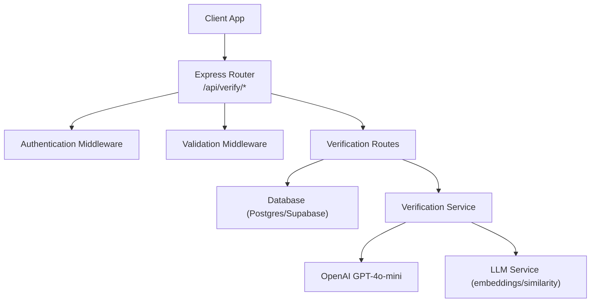
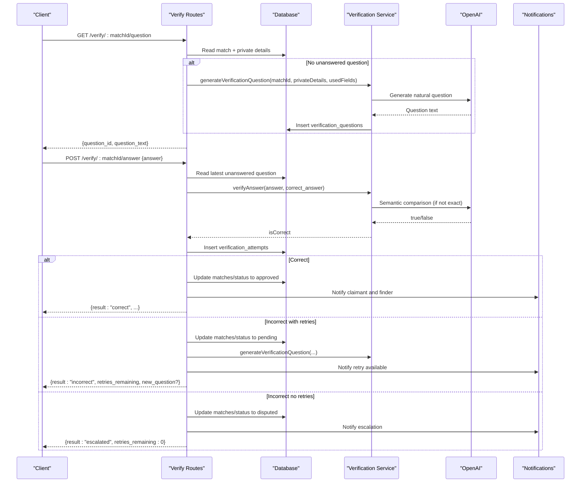
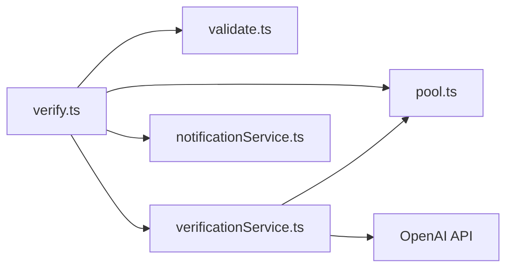

# Verification API

<cite>
**Referenced Files in This Document**
- [verify.ts](file://backend/src/routes/verify.ts)
- [verificationService.ts](file://backend/src/services/verificationService.ts)
- [llmService.ts](file://backend/src/services/llmService.ts)
- [validate.ts](file://backend/src/middleware/validate.ts)
- [config/index.ts](file://backend/src/config/index.ts)
- [API_DOCUMENTATION.md](file://backend/API_DOCUMENTATION.md)
- [001_initial_schema.sql](file://supabase/migrations/001_initial_schema.sql)
- [SCHEMA_REFERENCE.md](file://SCHEMA_REFERENCE.md)
</cite>

## Table of Contents
1. [Introduction](#introduction)
2. [Project Structure](#project-structure)
3. [Core Components](#core-components)
4. [Architecture Overview](#architecture-overview)
5. [Detailed Component Analysis](#detailed-component-analysis)
6. [Dependency Analysis](#dependency-analysis)
7. [Performance Considerations](#performance-considerations)
8. [Troubleshooting Guide](#troubleshooting-guide)
9. [Conclusion](#conclusion)
10. [Appendices](#appendices)

## Introduction
This document provides comprehensive API documentation for the LLM-powered verification system that validates ownership claims between lost and found items. It covers:
- Generating dynamic verification questions from private details
- Submitting answers with semantic evaluation
- Finder override and retry mechanisms
- Request/response schemas, error handling, and end-to-end workflow examples

The verification flow ensures only true owners can confirm matches by answering questions derived from secret attributes stored by the finder.

## Project Structure
The verification feature is implemented as a set of Express routes backed by services and database tables:
- Routes define endpoints for question retrieval, answer submission, and finder judgment
- Services implement LLM-based question generation and semantic answer evaluation
- Middleware validates request payloads
- Configuration defines retry limits and other behavior
- Database schema stores questions, attempts, and match states

**Diagram sources**
- [verify.ts:20-79](file://backend/src/routes/verify.ts#L20-L79)
- [verificationService.ts:15-79](file://backend/src/services/verificationService.ts#L15-L79)
- [llmService.ts:9-17](file://backend/src/services/llmService.ts#L9-L17)
- [validate.ts:8-23](file://backend/src/middleware/validate.ts#L8-L23)
- [config/index.ts:33-47](file://backend/src/config/index.ts#L33-L47)

**Section sources**
- [verify.ts:20-79](file://backend/src/routes/verify.ts#L20-L79)
- [verificationService.ts:15-79](file://backend/src/services/verificationService.ts#L15-L79)
- [validate.ts:8-23](file://backend/src/middleware/validate.ts#L8-L23)
- [config/index.ts:33-47](file://backend/src/config/index.ts#L33-L47)

## Core Components
- GET /api/verify/:matchId/question
  - Purpose: Retrieve or generate a verification question for a match. Only the claimant (lost-item owner) or admin can call this. If no unanswered question exists, a new one is generated using OpenAI based on private details.
  - Key behaviors:
    - Fetches match and verifies permissions
    - Looks for an existing unanswered question
    - Generates a new question if needed, excluding previously used fields to ensure variety on retries
    - Returns only the question text and ID (never the correct answer)

- POST /api/verify/:matchId/answer
  - Purpose: Submit an answer to the current verification question. The system auto-verifies using exact match first, then LLM semantic comparison. Outcomes:
    - Correct: approve match, unlock messaging, notify both parties
    - Incorrect with retries remaining: generate a new question, notify parties
    - Incorrect with no retries left: escalate to admin, mark match disputed

- POST /api/verify/:matchId/judge
  - Purpose: Finder override endpoint. The finder can mark an attempt correct or incorrect.
  - Key behaviors:
    - Validates finder/admin role
    - Updates attempt judgment
    - On correct: approve match and notify
    - On incorrect: if retries remain, generate a new question; otherwise escalate to admin

**Section sources**
- [verify.ts:20-79](file://backend/src/routes/verify.ts#L20-L79)
- [verify.ts:89-293](file://backend/src/routes/verify.ts#L89-L293)
- [verify.ts:303-443](file://backend/src/routes/verify.ts#L303-L443)

## Architecture Overview
The verification system orchestrates authentication, validation, database queries, LLM calls, and notifications to validate ownership claims.

**Diagram sources**
- [verify.ts:20-79](file://backend/src/routes/verify.ts#L20-L79)
- [verify.ts:89-293](file://backend/src/routes/verify.ts#L89-L293)
- [verificationService.ts:15-79](file://backend/src/services/verificationService.ts#L15-L79)
- [verificationService.ts:85-122](file://backend/src/services/verificationService.ts#L85-L122)

## Detailed Component Analysis

### Endpoint: GET /api/verify/:matchId/question
- Authentication: Required (JWT Bearer)
- Authorization: Claimant (lost-item owner) or admin
- Behavior:
  - Retrieves match and private details
  - Checks for existing unanswered question
  - Generates new question via LLM if none exists, excluding previously used field keys
  - Returns only question metadata and text

Request
- Path parameters:
  - matchId: string (UUID)

Response (200 OK)
- Fields:
  - question_id: string (UUID)
  - question_text: string

Errors
- 404: Match not found
- 403: Access denied
- 400: No private details available to generate a verification question

Example cURL
- See API documentation section below.

**Section sources**
- [verify.ts:20-79](file://backend/src/routes/verify.ts#L20-L79)

### Endpoint: POST /api/verify/:matchId/answer
- Authentication: Required (JWT Bearer)
- Authorization: Claimant (lost-item owner) or admin
- Behavior:
  - Validates body schema
  - Reads latest unanswered question
  - Counts attempts to enforce retry limit
  - Auto-verifies answer using exact match then LLM semantic comparison
  - Inserts attempt record
  - Handles outcomes:
    - Correct: approve match, update statuses, notify both parties
    - Incorrect with retries: generate new question, notify
    - Incorrect without retries: escalate to admin, notify

Request
- Body schema:
  - answer: string (min length 1)

Response (201 Created)
- Common fields:
  - attempt_id: string (UUID)
  - attempt_number: integer
  - result: "correct" | "incorrect" | "escalated"
  - message: string
- Conditional fields:
  - retries_remaining: integer (when incorrect or escalated)
  - new_question: object with question_id and question_text (when incorrect and retries remain)

Errors
- 404: Match not found or no pending verification question
- 403: Access denied
- 429: Maximum attempts reached (escalated)

Example cURL
- See API documentation section below.

**Section sources**
- [verify.ts:89-293](file://backend/src/routes/verify.ts#L89-L293)
- [validate.ts:53-55](file://backend/src/middleware/validate.ts#L53-L55)

### Endpoint: POST /api/verify/:matchId/judge
- Authentication: Required (JWT Bearer)
- Authorization: Finder or admin
- Behavior:
  - Validates body schema
  - Verifies requester is finder/admin
  - Updates attempt judgment
  - On correct: approve match, notify claimant
  - On incorrect: if retries remain, generate new question; otherwise escalate to admin

Request
- Body schema:
  - is_correct: boolean
  - attempt_id: string (UUID)

Response (200 OK)
- Fields:
  - result: "correct" | "incorrect" | "escalated"
  - message: string
  - retries_remaining: integer (when incorrect or escalated)
  - new_question: object with question_id and question_text (when incorrect and retries remain)

Errors
- 404: Match not found or attempt not found
- 403: Only the finder can override verification

Example cURL
- See API documentation section below.

**Section sources**
- [verify.ts:303-443](file://backend/src/routes/verify.ts#L303-L443)
- [validate.ts:57-60](file://backend/src/middleware/validate.ts#L57-L60)

### Dynamic Question Generation
- Source: Private details stored by the finder on the found item
- Process:
  - Selects a random field from available private details, preferring unused fields to diversify retries
  - Uses OpenAI to generate a natural-sounding question about that detail
  - Stores the question along with the correct answer and source field key
- Fallback: If LLM fails, uses a simple template question

Key implementation notes
- Excludes previously used field keys to avoid repetition across retries
- Persists question and correct answer for later evaluation

**Section sources**
- [verificationService.ts:15-79](file://backend/src/services/verificationService.ts#L15-L79)

### Semantic Answer Evaluation
- Process:
  - First performs case-insensitive exact match after trimming whitespace
  - If not exact, calls OpenAI to judge semantic equivalence with minimal tokens and deterministic temperature
  - Falls back to substring containment check if LLM call fails
- Output: Boolean indicating correctness

**Section sources**
- [verificationService.ts:85-122](file://backend/src/services/verificationService.ts#L85-L122)

### Retry Mechanisms and Escalation
- Limits:
  - Configurable maximum retries via configuration
- Flow:
  - Each incorrect answer increments attempt count
  - If retries remain, generates a new question and sets match status to pending
  - If no retries remain, marks match as disputed and escalates to admin

Configuration reference
- maxRetries: controls total number of attempts allowed before escalation

**Section sources**
- [config/index.ts:33-47](file://backend/src/config/index.ts#L33-L47)
- [verify.ts:132-142](file://backend/src/routes/verify.ts#L132-L142)
- [verify.ts:210-238](file://backend/src/routes/verify.ts#L210-L238)

### Data Models and Schema
- verification_questions
  - id: UUID PK
  - match_id: FK to matches
  - question_text: TEXT
  - correct_answer: TEXT
  - field_source: TEXT
  - created_at: TIMESTAMPTZ
- verification_attempts
  - id: UUID PK
  - question_id: FK to verification_questions
  - match_id: FK to matches
  - claimant_id: FK to users
  - answer_text: TEXT
  - is_correct: BOOLEAN (nullable until judged)
  - judged_by: FK to users
  - judged_at: TIMESTAMPTZ
  - attempt_number: INTEGER
  - created_at: TIMESTAMPTZ
- matches
  - status: pending | approved | rejected | disputed

Indexes
- verification_questions.match_id
- verification_attempts.match_id

**Section sources**
- [001_initial_schema.sql:172-199](file://supabase/migrations/001_initial_schema.sql#L172-L199)
- [SCHEMA_REFERENCE.md:80-137](file://SCHEMA_REFERENCE.md#L80-L137)

## Dependency Analysis
- Routes depend on:
  - Authentication middleware
  - Validation middleware
  - Database pool for queries
  - Verification service for LLM operations
  - Notification service for user alerts
- Verification service depends on:
  - OpenAI client for question generation and semantic evaluation
  - Database pool to persist questions and read private details
- Configuration drives retry limits and thresholds

**Diagram sources**
- [verify.ts:20-79](file://backend/src/routes/verify.ts#L20-L79)
- [verificationService.ts:15-79](file://backend/src/services/verificationService.ts#L15-L79)
- [validate.ts:8-23](file://backend/src/middleware/validate.ts#L8-L23)

**Section sources**
- [verify.ts:20-79](file://backend/src/routes/verify.ts#L20-L79)
- [verificationService.ts:15-79](file://backend/src/services/verificationService.ts#L15-L79)
- [validate.ts:8-23](file://backend/src/middleware/validate.ts#L8-L23)

## Performance Considerations
- LLM calls:
  - Question generation uses a small model with limited tokens; failures fall back to templates
  - Answer evaluation uses minimal tokens and deterministic settings; fallback to substring matching reduces latency when LLM is unavailable
- Database:
  - Queries are targeted and indexed on match_id for efficient retrieval
- Retries:
  - Limiting retries prevents excessive LLM usage and database writes
- Notifications:
  - Asynchronous notifications reduce response time

[No sources needed since this section provides general guidance]

## Troubleshooting Guide
Common issues and resolutions:
- No private details available
  - Cause: Missing private_details on the found item
  - Resolution: Ensure private_details include at least one attribute for question generation
- Maximum attempts reached
  - Cause: Exceeded configured maxRetries
  - Resolution: Admin review required; escalate disputes
- LLM errors during question generation or evaluation
  - Cause: Network or API issues
  - Resolution: System falls back to template questions and substring matching; retry later
- Access denied
  - Cause: Caller is neither claimant nor admin
  - Resolution: Use appropriate account or role

**Section sources**
- [verify.ts:57-61](file://backend/src/routes/verify.ts#L57-L61)
- [verify.ts:132-142](file://backend/src/routes/verify.ts#L132-L142)
- [verificationService.ts:62-64](file://backend/src/services/verificationService.ts#L62-L64)
- [verificationService.ts:117-121](file://backend/src/services/verificationService.ts#L117-L121)

## Conclusion
The verification API provides a robust, LLM-enhanced mechanism to validate ownership claims through dynamic questions and semantic answer evaluation. It enforces strict access control, supports retries with varied questions, and escalates unresolved cases to administrators. The design balances accuracy with performance and resilience through fallback strategies and configurable limits.

[No sources needed since this section summarizes without analyzing specific files]

## Appendices

### End-to-End Workflow Example
1. Claimant requests a question for a match
   - GET /api/verify/:matchId/question
   - Response includes question_id and question_text
2. Claimant submits an answer
   - POST /api/verify/:matchId/answer with { answer }
   - If correct: match approved, messaging unlocked
   - If incorrect with retries: new question provided
   - If incorrect without retries: escalated to admin
3. Finder may override judgment
   - POST /api/verify/:matchId/judge with { is_correct, attempt_id }
   - Approves or rejects based on finder’s decision

**Section sources**
- [API_DOCUMENTATION.md:516-634](file://backend/API_DOCUMENTATION.md#L516-L634)
- [verify.ts:20-79](file://backend/src/routes/verify.ts#L20-L79)
- [verify.ts:89-293](file://backend/src/routes/verify.ts#L89-L293)
- [verify.ts:303-443](file://backend/src/routes/verify.ts#L303-L443)

### Request/Response Schemas Summary
- GET /verify/:matchId/question
  - Response: { question_id: string, question_text: string }
- POST /verify/:matchId/answer
  - Request: { answer: string }
  - Response: { attempt_id, attempt_number, result, message, retries_remaining?, new_question? }
- POST /verify/:matchId/judge
  - Request: { is_correct: boolean, attempt_id: string }
  - Response: { result, message, retries_remaining?, new_question? }

**Section sources**
- [API_DOCUMENTATION.md:516-634](file://backend/API_DOCUMENTATION.md#L516-L634)
- [validate.ts:53-60](file://backend/src/middleware/validate.ts#L53-L60)

### Error Codes Reference
- 400: Validation failed or missing private details
- 401: Unauthorized (missing/invalid JWT)
- 403: Forbidden (insufficient permissions)
- 404: Resource not found
- 429: Too many requests (verification retry limit exceeded)

**Section sources**
- [API_DOCUMENTATION.md:782-800](file://backend/API_DOCUMENTATION.md#L782-L800)