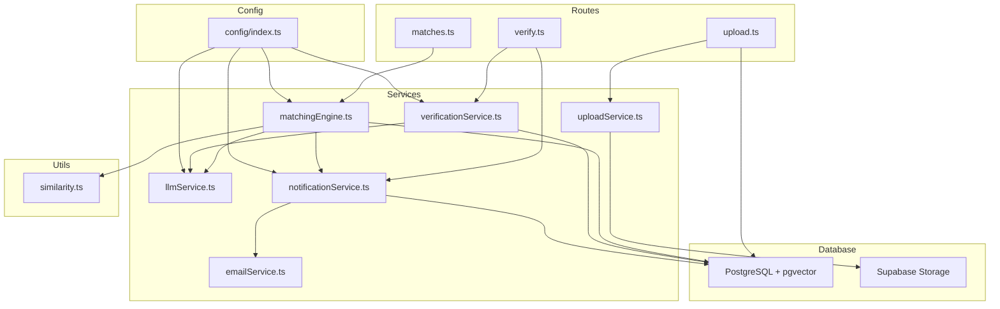
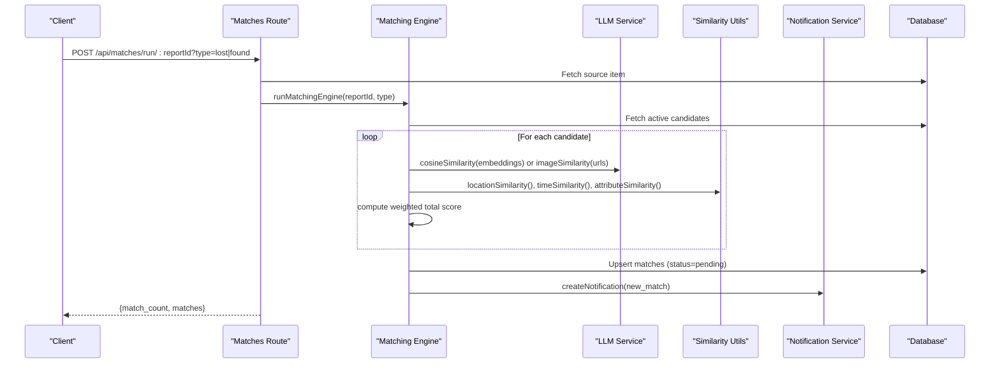
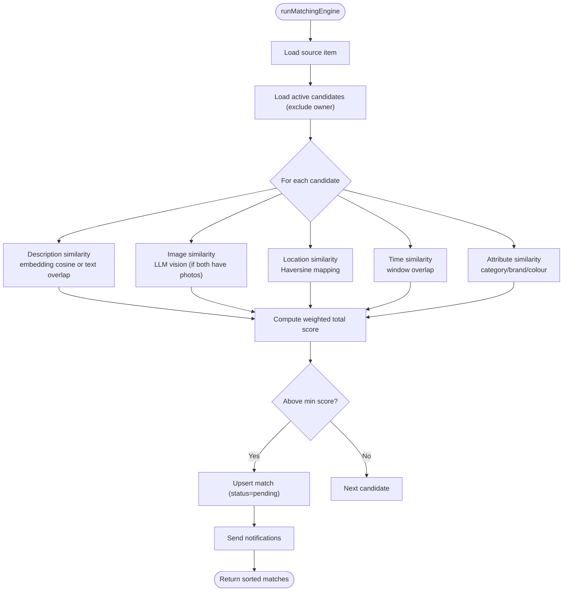
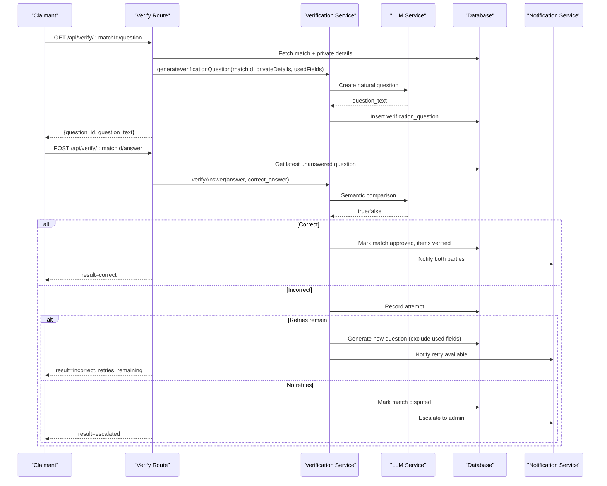
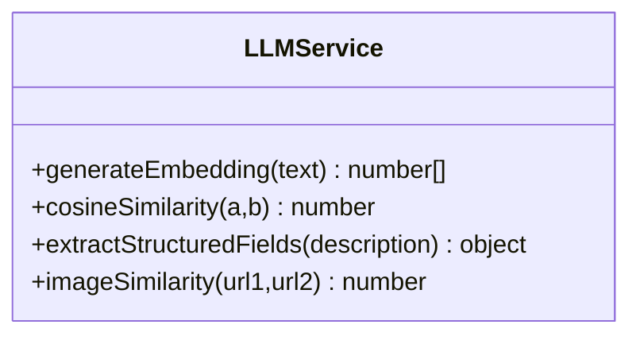
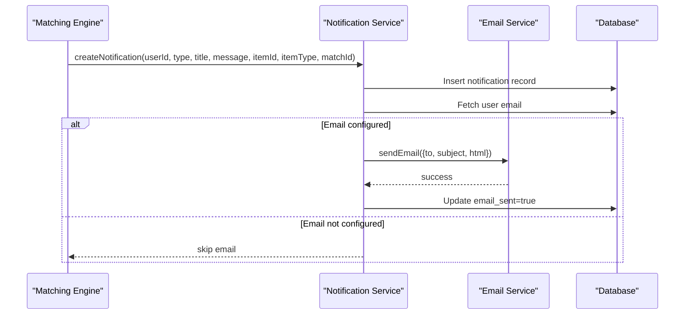
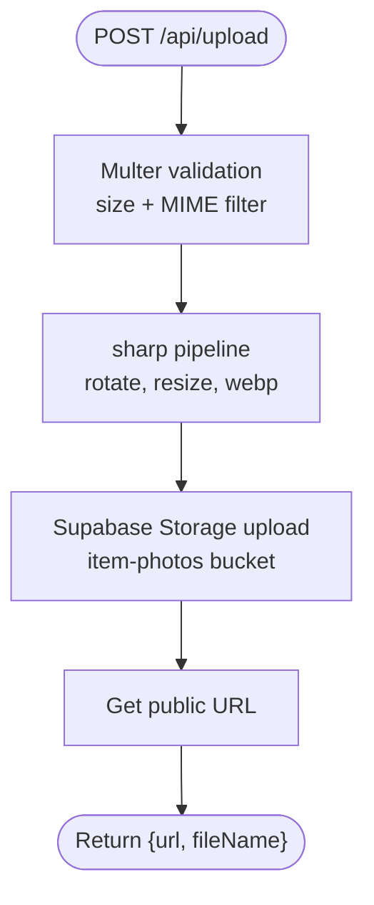
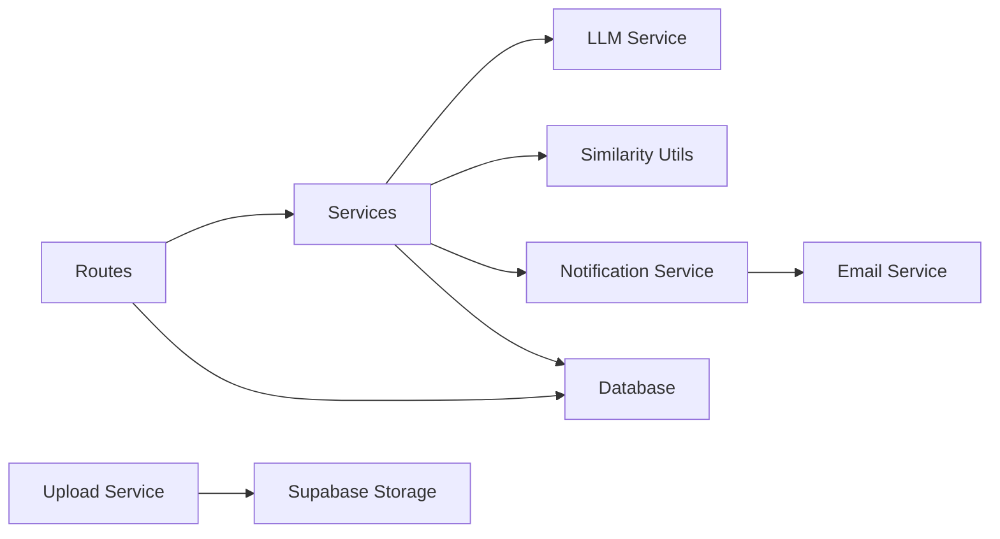

# Core Services

<cite>
**Referenced Files in This Document**
- [matchingEngine.ts](file://backend/src/services/matchingEngine.ts)
- [verificationService.ts](file://backend/src/services/verificationService.ts)
- [llmService.ts](file://backend/src/services/llmService.ts)
- [notificationService.ts](file://backend/src/services/notificationService.ts)
- [uploadService.ts](file://backend/src/services/uploadService.ts)
- [emailService.ts](file://backend/src/services/emailService.ts)
- [similarity.ts](file://backend/src/utils/similarity.ts)
- [config/index.ts](file://backend/src/config/index.ts)
- [routes/matches.ts](file://backend/src/routes/matches.ts)
- [routes/verify.ts](file://backend/src/routes/verify.ts)
- [routes/upload.ts](file://backend/src/routes/upload.ts)
- [001_initial_schema.sql](file://supabase/migrations/001_initial_schema.sql)
</cite>

## Table of Contents
1. Introduction
2. Project Structure
3. Core Components
4. Architecture Overview
5. Detailed Component Analysis
6. Dependency Analysis
7. Performance Considerations
8. Troubleshooting Guide
9. Conclusion

## Introduction
This document explains the core backend services that power the Lost & Found AI Matcher. It covers the Matching Engine with its weighted scoring algorithm, the Verification Service for LLM-generated questions and semantic answer validation, the LLM Integration Service for embeddings and vision analysis, the Notification Service for real-time updates and email delivery via Resend, and the Upload Service for image processing and storage management. For each service, you will find implementation details, configuration options, error handling strategies, and integration patterns.

## Project Structure
The backend is organized by feature into routes (Express routers), services (business logic), utilities (shared algorithms), configuration, and database access. The schema defines tables for items, matches, verification questions/attempts, notifications, and related indexes and policies.

**Diagram sources**
- [routes/matches.ts:1-115](file://backend/src/routes/matches.ts#L1-L115)
- [routes/verify.ts:1-444](file://backend/src/routes/verify.ts#L1-L444)
- [routes/upload.ts:1-69](file://backend/src/routes/upload.ts#L1-L69)
- [services/matchingEngine.ts:1-208](file://backend/src/services/matchingEngine.ts#L1-L208)
- [services/verificationService.ts:1-123](file://backend/src/services/verificationService.ts#L1-L123)
- [services/llmService.ts:1-120](file://backend/src/services/llmService.ts#L1-L120)
- [services/notificationService.ts:1-101](file://backend/src/services/notificationService.ts#L1-L101)
- [services/emailService.ts:1-32](file://backend/src/services/emailService.ts#L1-L32)
- [services/uploadService.ts:1-66](file://backend/src/services/uploadService.ts#L1-L66)
- [utils/similarity.ts:1-83](file://backend/src/utils/similarity.ts#L1-L83)
- [config/index.ts:1-49](file://backend/src/config/index.ts#L1-L49)
- [001_initial_schema.sql:1-370](file://supabase/migrations/001_initial_schema.sql#L1-L370)

**Section sources**
- [routes/matches.ts:1-115](file://backend/src/routes/matches.ts#L1-L115)
- [routes/verify.ts:1-444](file://backend/src/routes/verify.ts#L1-L444)
- [routes/upload.ts:1-69](file://backend/src/routes/upload.ts#L1-L69)
- [config/index.ts:1-49](file://backend/src/config/index.ts#L1-L49)
- [001_initial_schema.sql:1-370](file://supabase/migrations/001_initial_schema.sql#L1-L370)

## Core Components
- Matching Engine: Computes a weighted score across description similarity, image similarity, location proximity, time proximity, and attributes; persists top matches above a threshold and triggers notifications.
- Verification Service: Generates LLM-based verification questions from private item details and validates answers using semantic comparison with fallbacks.
- LLM Integration Service: Provides text embeddings, structured field extraction, cosine similarity, and image similarity via OpenAI models.
- Notification Service: Creates in-app notifications and sends emails via Resend when configured.
- Upload Service: Validates, resizes, converts images to WebP, and uploads to Supabase Storage with public URLs.

**Section sources**
- [matchingEngine.ts:33-189](file://backend/src/services/matchingEngine.ts#L33-L189)
- [verificationService.ts:7-123](file://backend/src/services/verificationService.ts#L7-L123)
- [llmService.ts:6-120](file://backend/src/services/llmService.ts#L6-L120)
- [notificationService.ts:16-62](file://backend/src/services/notificationService.ts#L16-L62)
- [uploadService.ts:11-66](file://backend/src/services/uploadService.ts#L11-L66)

## Architecture Overview
The system exposes REST endpoints that route requests to services. The Matching Engine queries the database, computes scores using LLM and utility functions, persists results, and notifies users. The Verification flow generates and evaluates questions, manages retries, and escalates disputes. The Upload pipeline processes images and stores them in Supabase. Notifications integrate with email delivery.

**Diagram sources**
- [routes/matches.ts:15-45](file://backend/src/routes/matches.ts#L15-L45)
- [matchingEngine.ts:37-189](file://backend/src/services/matchingEngine.ts#L37-L189)
- [llmService.ts:23-41](file://backend/src/services/llmService.ts#L23-L41)
- [llmService.ts:85-119](file://backend/src/services/llmService.ts#L85-L119)
- [utils/similarity.ts:26-82](file://backend/src/utils/similarity.ts#L26-L82)
- [notificationService.ts:19-62](file://backend/src/services/notificationService.ts#L19-L62)

## Detailed Component Analysis

### Matching Engine
Responsibilities:
- Load source item and active candidates from the opposing table, excluding same user.
- Compute per-candidate scores:
  - Description similarity: embedding cosine similarity with fallback to simple text overlap.
  - Image similarity: visual comparison via LLM when both items have photos.
  - Location proximity: Haversine distance mapped to a 0–100 score.
  - Time proximity: time-window overlap mapped to a 0–100 score.
  - Attributes: category, brand, colour matching with partial inclusion scoring.
- Apply weights from configuration and filter by minimum score threshold.
- Persist matches with breakdown scores and set status to pending.
- Send notifications to both parties for new matches.

Weighted scoring algorithm:
- Weights are defined in configuration and applied as a linear combination of component scores to produce a 0–100 total score.
- Default neutral scores are used when data is missing (e.g., no embeddings or no images).

Fallback mechanisms:
- If embeddings are unavailable, falls back to word-overlap similarity.
- If image comparison fails, returns a neutral score.
- If coordinates or times are missing, returns neutral similarity values.

Performance optimizations:
- Uses vector embeddings stored in PostgreSQL with an IVFFlat index for fast cosine similarity lookups where applicable.
- Filters candidates by active status and excludes same-user items early.
- Only calls expensive LLM image comparison when both items have photos.
- Sorts results by total score and only persists matches above the configured threshold.

Configuration options:
- Weights for each component must sum to 1.0.
- Minimum score threshold controls match sensitivity.
- Location radius and time window define similarity decay curves.

Error handling:
- Throws if source item not found.
- Gracefully handles missing embeddings or image URLs by falling back to defaults.
- Non-fatal errors in LLM calls do not block matching; they degrade gracefully.

Integration points:
- Database pool for reads/writes.
- LLM service for embeddings and image similarity.
- Similarity utils for location/time/attribute scoring.
- Notification service for alerting on new matches.

**Diagram sources**
- [matchingEngine.ts:37-189](file://backend/src/services/matchingEngine.ts#L37-L189)
- [utils/similarity.ts:26-82](file://backend/src/utils/similarity.ts#L26-L82)
- [llmService.ts:23-41](file://backend/src/services/llmService.ts#L23-L41)
- [llmService.ts:85-119](file://backend/src/services/llmService.ts#L85-L119)

**Section sources**
- [matchingEngine.ts:33-189](file://backend/src/services/matchingEngine.ts#L33-L189)
- [config/index.ts:33-47](file://backend/src/config/index.ts#L33-L47)
- [utils/similarity.ts:1-83](file://backend/src/utils/similarity.ts#L1-L83)
- [llmService.ts:6-120](file://backend/src/services/llmService.ts#L6-L120)

### Verification Service
Responsibilities:
- Generate a verification question from private item details using an LLM prompt, preferring fields not previously used.
- Validate submitted answers using exact match first, then LLM semantic comparison with strict output parsing and fallback to substring matching.
- Manage attempt counts and enforce retry limits; escalate to admin when exceeded.
- Update match and item statuses upon correct answers and notify both parties.

Implementation details:
- Question generation selects a random field from available private details and asks the LLM to produce a natural question.
- Answer verification uses a zero-temperature model for deterministic outputs and parses “true”/“false”.
- On incorrect answers, if retries remain, a new question is generated excluding previously used fields; otherwise, the match is marked disputed and escalated.

Configuration options:
- Maximum retries limit controls how many attempts are allowed before escalation.

Error handling:
- Throws if no private details are available for question generation.
- Catches LLM failures and falls back to simpler checks to avoid blocking the flow.
- Enforces access control so only claimants can request questions and submit answers.

Integration points:
- Database for storing questions, attempts, and updating match/item states.
- Notification service to inform users about verification outcomes and escalations.

**Diagram sources**
- [routes/verify.ts:20-79](file://backend/src/routes/verify.ts#L20-L79)
- [routes/verify.ts:89-293](file://backend/src/routes/verify.ts#L89-L293)
- [verificationService.ts:15-79](file://backend/src/services/verificationService.ts#L15-L79)
- [verificationService.ts:85-123](file://backend/src/services/verificationService.ts#L85-L123)
- [notificationService.ts:19-62](file://backend/src/services/notificationService.ts#L19-L62)

**Section sources**
- [verificationService.ts:7-123](file://backend/src/services/verificationService.ts#L7-L123)
- [routes/verify.ts:20-293](file://backend/src/routes/verify.ts#L20-L293)
- [config/index.ts:33-47](file://backend/src/config/index.ts#L33-L47)

### LLM Integration Service
Responsibilities:
- Generate 1536-dimensional text embeddings using OpenAI’s embedding model.
- Compute cosine similarity between two embedding vectors and map to a 0–100 score.
- Extract structured fields (category, brand, colour) from free-text descriptions using a JSON-constrained prompt.
- Compare two images using vision capabilities and return a similarity score with reasoning.

Implementation details:
- Embeddings are produced with fixed dimensions for consistent vector operations.
- Cosine similarity normalizes dot product by vector norms and maps [-1,1] to [0,100].
- Structured extraction enforces a constrained response format to ensure reliable parsing.
- Image similarity wraps vision prompts and safely returns a neutral score on failure.

Configuration options:
- API key is loaded from environment configuration.

Error handling:
- Image similarity catches exceptions and returns a neutral score to avoid breaking matching.
- Structured extraction handles malformed responses by defaulting to safe values.

Integration points:
- Used by Matching Engine for description and image scoring.
- Used by Verification Service for semantic answer validation.

**Diagram sources**
- [llmService.ts:6-120](file://backend/src/services/llmService.ts#L6-L120)

**Section sources**
- [llmService.ts:6-120](file://backend/src/services/llmService.ts#L6-L120)
- [config/index.ts:19-21](file://backend/src/config/index.ts#L19-L21)

### Notification Service
Responsibilities:
- Create in-app notifications linked to matches or items.
- Optionally send HTML emails via Resend when configured.
- Build templated emails with contextual links to the frontend.

Implementation details:
- Inserts notification records and fetches user email to send email if configured.
- Marks email_sent flag after successful delivery.
- Email template includes branding and action buttons linking to relevant pages.

Configuration options:
- Resend API key and sender address are required for email delivery.
- Frontend URL is used to build deep links in emails.

Error handling:
- Email sending failures are logged but do not prevent in-app notifications from being created.

Integration points:
- Called by Matching Engine for new matches.
- Called by Verification flow for verification outcomes and escalations.

**Diagram sources**
- [notificationService.ts:19-62](file://backend/src/services/notificationService.ts#L19-L62)
- [emailService.ts:15-32](file://backend/src/services/emailService.ts#L15-L32)

**Section sources**
- [notificationService.ts:16-101](file://backend/src/services/notificationService.ts#L16-L101)
- [emailService.ts:1-32](file://backend/src/services/emailService.ts#L1-L32)
- [config/index.ts:23-26](file://backend/src/config/index.ts#L23-L26)

### Upload Service
Responsibilities:
- Accept image uploads, validate file types and size.
- Optimize images using sharp (auto-orient, resize, convert to WebP).
- Upload processed images to Supabase Storage and return public URLs.

Implementation details:
- Multer memory storage with strict MIME filtering ensures only images are accepted.
- Sharp pipeline rotates based on EXIF, resizes to a maximum width without enlarging, and encodes as WebP at high quality.
- Supabase Storage upload sets immutable cache headers and prevents overwrites.

Configuration options:
- Max file size and allowed MIME types are enforced.
- Storage bucket name is configurable.

Error handling:
- Invalid file types raise application errors with clear messages.
- Storage upload failures throw errors with underlying messages.

Integration points:
- Exposed via Express routes requiring authentication.
- Returns public URLs consumed by item reports.

**Diagram sources**
- [routes/upload.ts:32-69](file://backend/src/routes/upload.ts#L32-L69)
- [uploadService.ts:11-66](file://backend/src/services/uploadService.ts#L11-L66)

**Section sources**
- [routes/upload.ts:1-69](file://backend/src/routes/upload.ts#L1-L69)
- [uploadService.ts:11-66](file://backend/src/services/uploadService.ts#L11-L66)

## Dependency Analysis
Key dependencies and relationships:
- Routes depend on services for business logic and middleware for auth/validation.
- Matching Engine depends on LLM service, similarity utils, and notification service.
- Verification Service depends on LLM service and notification service.
- Notification Service depends on email service and database.
- Upload Service depends on sharp, multer, and Supabase Storage.

**Diagram sources**
- [routes/matches.ts:1-115](file://backend/src/routes/matches.ts#L1-L115)
- [routes/verify.ts:1-444](file://backend/src/routes/verify.ts#L1-L444)
- [routes/upload.ts:1-69](file://backend/src/routes/upload.ts#L1-L69)
- [services/matchingEngine.ts:1-208](file://backend/src/services/matchingEngine.ts#L1-L208)
- [services/verificationService.ts:1-123](file://backend/src/services/verificationService.ts#L1-L123)
- [services/llmService.ts:1-120](file://backend/src/services/llmService.ts#L1-L120)
- [services/notificationService.ts:1-101](file://backend/src/services/notificationService.ts#L1-L101)
- [services/emailService.ts:1-32](file://backend/src/services/emailService.ts#L1-L32)
- [services/uploadService.ts:1-66](file://backend/src/services/uploadService.ts#L1-L66)

**Section sources**
- [routes/matches.ts:1-115](file://backend/src/routes/matches.ts#L1-L115)
- [routes/verify.ts:1-444](file://backend/src/routes/verify.ts#L1-L444)
- [routes/upload.ts:1-69](file://backend/src/routes/upload.ts#L1-L69)
- [services/matchingEngine.ts:1-208](file://backend/src/services/matchingEngine.ts#L1-L208)
- [services/verificationService.ts:1-123](file://backend/src/services/verificationService.ts#L1-L123)
- [services/llmService.ts:1-120](file://backend/src/services/llmService.ts#L1-L120)
- [services/notificationService.ts:1-101](file://backend/src/services/notificationService.ts#L1-L101)
- [services/emailService.ts:1-32](file://backend/src/services/emailService.ts#L1-L32)
- [services/uploadService.ts:1-66](file://backend/src/services/uploadService.ts#L1-L66)

## Performance Considerations
- Vector indexing: Use IVFFlat indexes on embedding columns to accelerate nearest neighbor searches if scaling beyond simple pairwise comparisons.
- Early filtering: Exclude same-user items and inactive items to reduce candidate set size.
- Conditional LLM calls: Only invoke vision-based image similarity when both items have photos; fall back to neutral scores otherwise.
- Efficient similarity computations: Precompute and reuse embeddings; use cosine similarity with normalized vectors where possible.
- Batch operations: Consider batching database writes for match upserts and notifications to reduce round-trips.
- Caching: Cache frequent LLM responses (e.g., structured field extraction) to reduce latency and cost.
- Concurrency: Ensure database connections and external API rate limits are respected; implement retries with exponential backoff for transient failures.

[No sources needed since this section provides general guidance]

## Troubleshooting Guide
Common issues and resolutions:
- Missing embeddings: Matching falls back to text overlap; ensure embeddings are generated during item creation.
- Image comparison failures: Vision API may fail due to invalid URLs; engine returns neutral score—verify image URLs and permissions.
- Email delivery failures: Resend API key not configured or network errors; check configuration and logs; in-app notifications still created.
- Verification escalation: Exceeded max retries; review private details and question quality; consider adjusting thresholds or prompting strategies.
- Upload errors: File type or size restrictions; ensure client sends valid images within limits; check Supabase bucket permissions.

Operational checks:
- Validate environment variables for OpenAI, Resend, Supabase, and database.
- Confirm database migrations and indexes are applied.
- Monitor API usage and costs for LLM calls; adjust model selection or caching as needed.

**Section sources**
- [matchingEngine.ts:83-123](file://backend/src/services/matchingEngine.ts#L83-L123)
- [llmService.ts:85-119](file://backend/src/services/llmService.ts#L85-L119)
- [emailService.ts:15-32](file://backend/src/services/emailService.ts#L15-L32)
- [routes/verify.ts:132-142](file://backend/src/routes/verify.ts#L132-L142)
- [routes/upload.ts:20-27](file://backend/src/routes/upload.ts#L20-L27)

## Conclusion
The Lost & Found AI Matcher backend integrates robust matching, verification, and notification services powered by LLMs and efficient similarity algorithms. The design emphasizes resilience through fallbacks, performance through selective computation and indexing, and usability through clear notifications and streamlined workflows. Proper configuration and monitoring ensure reliable operation across varying data conditions and external service availability.

[No sources needed since this section summarizes without analyzing specific files]