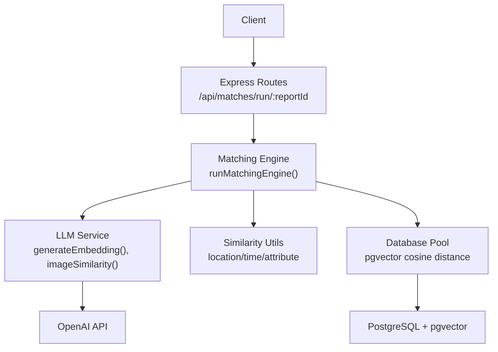
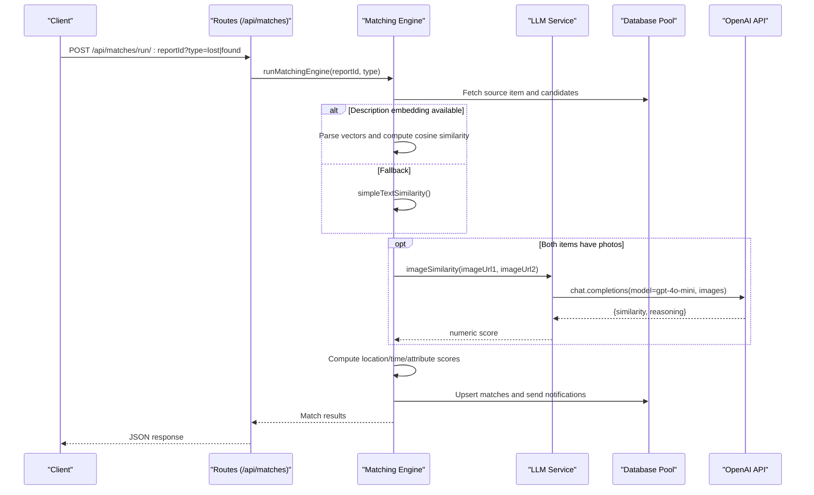
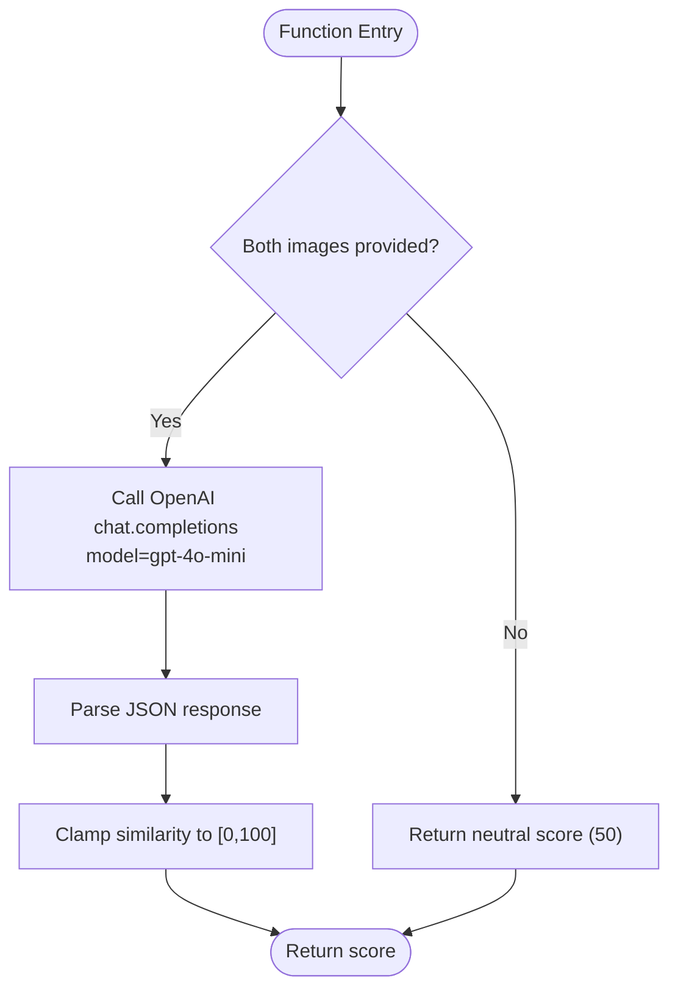
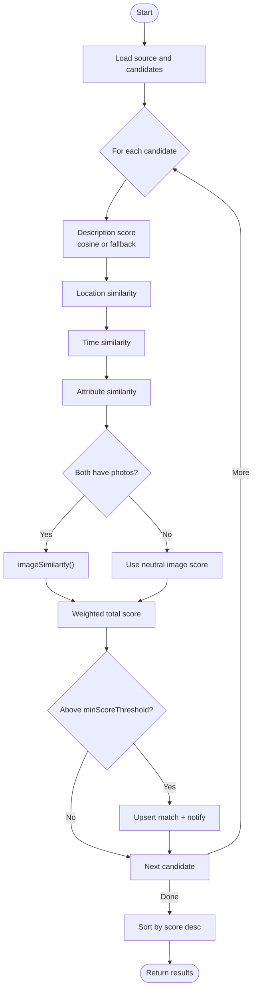
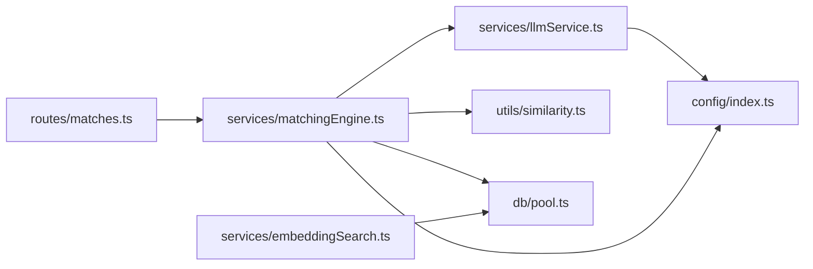

# LLM Integration Service

<cite>
**Referenced Files in This Document**
- [llmService.ts](file://backend/src/services/llmService.ts)
- [embeddingSearch.ts](file://backend/src/services/embeddingSearch.ts)
- [similarity.ts](file://backend/src/utils/similarity.ts)
- [matchingEngine.ts](file://backend/src/services/matchingEngine.ts)
- [index.ts](file://backend/src/config/index.ts)
- [pool.ts](file://backend/src/db/pool.ts)
- [matches.ts](file://backend/src/routes/matches.ts)
- [errorHandler.ts](file://backend/src/middleware/errorHandler.ts)
</cite>

## Table of Contents
1. [Introduction](#introduction)
2. [Project Structure](#project-structure)
3. [Core Components](#core-components)
4. [Architecture Overview](#architecture-overview)
5. [Detailed Component Analysis](#detailed-component-analysis)
6. [Dependency Analysis](#dependency-analysis)
7. [Performance Considerations](#performance-considerations)
8. [Troubleshooting Guide](#troubleshooting-guide)
9. [Conclusion](#conclusion)
10. [Appendices](#appendices)

## Introduction
This document explains the LLM Integration Service that powers OpenAI API interactions for text embeddings, vision-based image similarity analysis, and natural language processing within the Lost & Found AI Matcher backend. It covers:
- Embedding generation using the text-embedding-3-small model
- Image similarity comparison via GPT-4o-mini vision capabilities
- Cosine similarity calculations for vector comparisons
- Service architecture including error handling, fallbacks, and performance considerations
- Configuration for API keys, models, thresholds, and operational parameters
- Examples of embedding generation, image analysis requests, and error recovery patterns

## Project Structure
The LLM integration spans several modules:
- Services: llmService (OpenAI calls), matchingEngine (scoring pipeline), embeddingSearch (vector search)
- Utils: similarity (location/time/attribute scoring)
- Config: centralized configuration for OpenAI and matching behavior
- Database: pg pool and queries
- Routes: API endpoints that trigger matching flows
- Middleware: error handling and async wrappers

**Diagram sources**
- [matches.ts:15-45](file://backend/src/routes/matches.ts#L15-L45)
- [matchingEngine.ts:37-188](file://backend/src/services/matchingEngine.ts#L37-L188)
- [llmService.ts:9-17](file://backend/src/services/llmService.ts#L9-L17)
- [embeddingSearch.ts:30-62](file://backend/src/services/embeddingSearch.ts#L30-L62)
- [pool.ts:34-48](file://backend/src/db/pool.ts#L34-L48)

**Section sources**
- [matches.ts:15-45](file://backend/src/routes/matches.ts#L15-L45)
- [matchingEngine.ts:37-188](file://backend/src/services/matchingEngine.ts#L37-L188)
- [llmService.ts:9-17](file://backend/src/services/llmService.ts#L9-L17)
- [embeddingSearch.ts:30-62](file://backend/src/services/embeddingSearch.ts#L30-L62)
- [pool.ts:34-48](file://backend/src/db/pool.ts#L34-L48)

## Core Components
- LLM Service: Provides functions to generate text embeddings with text-embedding-3-small, compute cosine similarity, extract structured fields from descriptions, and compare images using GPT-4o-mini vision.
- Matching Engine: Orchestrates multi-factor scoring (description embedding, image similarity, location proximity, time overlap, attributes) and persists matches.
- Embedding Search: Performs efficient vector similarity searches in PostgreSQL using pgvector’s cosine distance operator.
- Similarity Utilities: Computes location similarity (Haversine), time similarity, and attribute similarity scores.
- Configuration: Centralizes OpenAI API key, matching weights, thresholds, and operational parameters.
- Database Pool: Manages PostgreSQL connections and exposes query helpers.

**Section sources**
- [llmService.ts:9-119](file://backend/src/services/llmService.ts#L9-L119)
- [matchingEngine.ts:37-188](file://backend/src/services/matchingEngine.ts#L37-L188)
- [embeddingSearch.ts:30-100](file://backend/src/services/embeddingSearch.ts#L30-L100)
- [similarity.ts:4-82](file://backend/src/utils/similarity.ts#L4-L82)
- [index.ts:19-47](file://backend/src/config/index.ts#L19-L47)
- [pool.ts:34-48](file://backend/src/db/pool.ts#L34-L48)

## Architecture Overview
The service integrates OpenAI APIs into a multi-stage matching pipeline:
- Text embeddings are generated server-side when needed; otherwise, stored embeddings are used.
- Image similarity is computed by sending two image URLs to GPT-4o-mini vision and parsing the returned JSON score.
- Vector similarity uses PostgreSQL’s native cosine distance for high-performance matching.
- The matching engine aggregates multiple signals into a weighted total score and persists results.

**Diagram sources**
- [matches.ts:15-45](file://backend/src/routes/matches.ts#L15-L45)
- [matchingEngine.ts:37-188](file://backend/src/services/matchingEngine.ts#L37-L188)
- [llmService.ts:85-119](file://backend/src/services/llmService.ts#L85-L119)
- [pool.ts:34-48](file://backend/src/db/pool.ts#L34-L48)

## Detailed Component Analysis

### LLM Service
Responsibilities:
- Generate 1536-dimensional embeddings using text-embedding-3-small
- Compute cosine similarity between two vectors
- Extract structured fields from free-text descriptions using GPT-4o-mini
- Compare two images via GPT-4o-mini vision and return a normalized similarity score

Key behaviors:
- Embeddings: Uses the OpenAI SDK to call the embeddings endpoint with specified model and dimensions.
- Cosine similarity: Implements dot product and norms, maps [-1,1] to [0,100].
- Vision comparison: Sends both image URLs in a single request; returns a bounded score with a safe default on errors.

**Diagram sources**
- [llmService.ts:85-119](file://backend/src/services/llmService.ts#L85-L119)

**Section sources**
- [llmService.ts:9-17](file://backend/src/services/llmService.ts#L9-L17)
- [llmService.ts:23-41](file://backend/src/services/llmService.ts#L23-L41)
- [llmService.ts:47-79](file://backend/src/services/llmService.ts#L47-L79)
- [llmService.ts:85-119](file://backend/src/services/llmService.ts#L85-L119)

### Matching Engine
Responsibilities:
- Load source item and candidate items
- Score each candidate across five dimensions: description (embedding or fallback), image, location, time, attributes
- Persist top matches above a configurable threshold
- Notify relevant users about new matches

Scoring details:
- Description: cosine similarity if embeddings exist; otherwise word-overlap fallback
- Image: GPT-4o-mini vision similarity when both items have photos
- Location: Haversine-based similarity with configurable radius
- Time: Linear decay based on configured time window
- Attributes: Weighted match on category, brand, color

**Diagram sources**
- [matchingEngine.ts:37-188](file://backend/src/services/matchingEngine.ts#L37-L188)
- [similarity.ts:26-82](file://backend/src/utils/similarity.ts#L26-L82)
- [llmService.ts:23-41](file://backend/src/services/llmService.ts#L23-L41)
- [llmService.ts:85-119](file://backend/src/services/llmService.ts#L85-L119)

**Section sources**
- [matchingEngine.ts:37-188](file://backend/src/services/matchingEngine.ts#L37-L188)
- [similarity.ts:26-82](file://backend/src/utils/similarity.ts#L26-L82)

### Embedding Search
Responsibilities:
- Efficiently find similar lost/found items using pgvector’s cosine distance operator
- Filter by status, ownership, and minimum similarity threshold
- Return enriched result objects with similarity scores

Performance notes:
- Vector comparisons run inside PostgreSQL, minimizing data transfer
- Parameters include limit and minimum similarity percentage

**Section sources**
- [embeddingSearch.ts:30-62](file://backend/src/services/embeddingSearch.ts#L30-L62)
- [embeddingSearch.ts:68-100](file://backend/src/services/embeddingSearch.ts#L68-L100)

### Similarity Utilities
Responsibilities:
- Location similarity: Haversine distance mapped to a 0–100 score with configurable max radius
- Time similarity: Linear decay over a configurable time window
- Attribute similarity: Weighted comparison of category, brand, and color

Complexity:
- All utilities are O(1) per pair with minimal arithmetic operations

**Section sources**
- [similarity.ts:4-82](file://backend/src/utils/similarity.ts#L4-L82)

### Configuration
Centralized settings include:
- OpenAI API key
- Matching weights for description, image, location, time, attributes
- Minimum score threshold for matches
- Location radius and time window parameters

These values drive the matching engine’s behavior and thresholds.

**Section sources**
- [index.ts:19-47](file://backend/src/config/index.ts#L19-L47)

### Database Pool
Responsibilities:
- Manage PostgreSQL connection pool with SSL handling for non-local hosts
- Provide typed query helpers for arrays and single-row queries

Operational notes:
- Connection limits and timeouts are set for robustness
- Error listener logs unexpected pool errors

**Section sources**
- [pool.ts:9-28](file://backend/src/db/pool.ts#L9-L28)
- [pool.ts:34-48](file://backend/src/db/pool.ts#L34-L48)

## Dependency Analysis
High-level dependencies:
- Routes depend on the matching engine
- Matching engine depends on LLM service, similarity utils, database pool, and notification service
- LLM service depends on OpenAI SDK and configuration
- Embedding search depends on database pool and pgvector operators

**Diagram sources**
- [matches.ts:15-45](file://backend/src/routes/matches.ts#L15-L45)
- [matchingEngine.ts:1-6](file://backend/src/services/matchingEngine.ts#L1-L6)
- [llmService.ts:1-4](file://backend/src/services/llmService.ts#L1-L4)
- [embeddingSearch.ts:1-2](file://backend/src/services/embeddingSearch.ts#L1-L2)
- [pool.ts:1-4](file://backend/src/db/pool.ts#L1-L4)
- [index.ts:1-4](file://backend/src/config/index.ts#L1-L4)

**Section sources**
- [matches.ts:15-45](file://backend/src/routes/matches.ts#L15-L45)
- [matchingEngine.ts:1-6](file://backend/src/services/matchingEngine.ts#L1-L6)
- [llmService.ts:1-4](file://backend/src/services/llmService.ts#L1-L4)
- [embeddingSearch.ts:1-2](file://backend/src/services/embeddingSearch.ts#L1-L2)
- [pool.ts:1-4](file://backend/src/db/pool.ts#L1-L4)
- [index.ts:1-4](file://backend/src/config/index.ts#L1-L4)

## Performance Considerations
- Vector similarity: Leverages PostgreSQL’s pgvector cosine distance operator to avoid loading all rows into memory and to perform fast nearest-neighbor searches.
- Embedding reuse: When embeddings exist, cosine similarity is computed locally; no extra OpenAI calls are made during matching.
- Image similarity: Only invoked when both items have photo URLs; otherwise, a neutral score is used to avoid unnecessary API costs.
- Fallback scoring: If embeddings are missing or malformed, a lightweight word-overlap similarity is used to maintain functionality.
- Connection pooling: Database pool size and timeouts are tuned to handle concurrent requests efficiently.

[No sources needed since this section provides general guidance]

## Troubleshooting Guide
Common issues and recovery patterns:
- Missing embeddings: The matching engine falls back to simple text similarity to ensure matches can still be computed.
- Invalid image URLs or vision failures: The image similarity function returns a neutral score (50) to prevent blocking the pipeline.
- API errors: Errors from OpenAI calls are caught at the function level; the system degrades gracefully rather than failing the entire request.
- Request validation and upload errors: Express routes use an async handler and AppError to return consistent error responses; multer-specific errors are handled with user-friendly messages.

Operational tips:
- Ensure OPENAI_API_KEY is set in environment variables.
- Verify that items have valid photo URLs before expecting image similarity contributions.
- Monitor database connectivity and pool errors logged by the pool error handler.

**Section sources**
- [matchingEngine.ts:83-97](file://backend/src/services/matchingEngine.ts#L83-L97)
- [llmService.ts:115-118](file://backend/src/services/llmService.ts#L115-L118)
- [errorHandler.ts:16-56](file://backend/src/middleware/errorHandler.ts#L16-L56)

## Conclusion
The LLM Integration Service combines OpenAI-powered embeddings and vision capabilities with robust local similarity computations and efficient database-backed vector search. It balances accuracy and performance through:
- Local cosine similarity for embeddings
- Vision-based image similarity only when beneficial
- Fallback mechanisms to maintain reliability under partial failures
- Configurable thresholds and weights to tune match quality

This design ensures scalable matching while minimizing external API usage and maintaining resilience.

[No sources needed since this section summarizes without analyzing specific files]

## Appendices

### Configuration Reference
- OpenAI API key: Set via environment variable and consumed by the LLM service.
- Matching weights: Control influence of description, image, location, time, and attributes.
- Thresholds: Minimum score to surface a match; location radius and time window define similarity ranges.

**Section sources**
- [index.ts:19-47](file://backend/src/config/index.ts#L19-L47)

### Example Workflows

#### Embedding Generation
- Trigger: When generating or updating embeddings for item descriptions
- Model: text-embedding-3-small
- Output: 1536-dimensional vector stored in the database for future cosine similarity queries

**Section sources**
- [llmService.ts:9-17](file://backend/src/services/llmService.ts#L9-L17)

#### Image Analysis Request
- Trigger: During matching when both items have photo URLs
- Model: GPT-4o-mini with vision input
- Output: Normalized similarity score between 0 and 100; defaults to neutral on failure

**Section sources**
- [llmService.ts:85-119](file://backend/src/services/llmService.ts#L85-L119)

#### Error Recovery Patterns
- Missing embeddings: Use simple text similarity fallback
- Vision API failure: Return neutral image score
- Upload/validation errors: Consistent error responses via middleware

**Section sources**
- [matchingEngine.ts:83-97](file://backend/src/services/matchingEngine.ts#L83-L97)
- [llmService.ts:115-118](file://backend/src/services/llmService.ts#L115-L118)
- [errorHandler.ts:16-56](file://backend/src/middleware/errorHandler.ts#L16-L56)