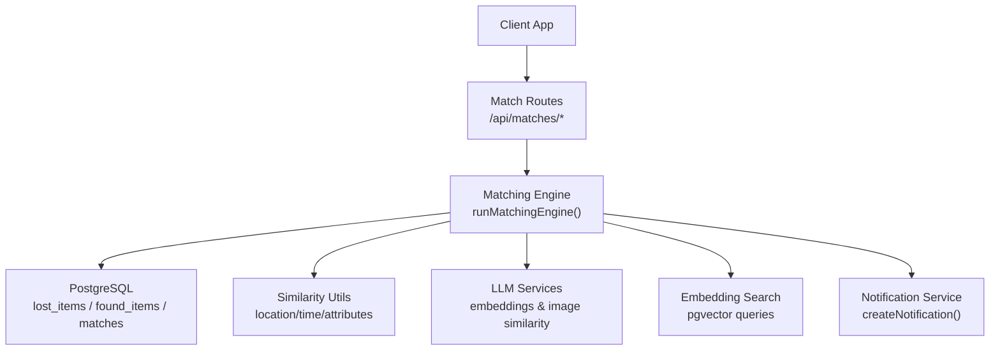
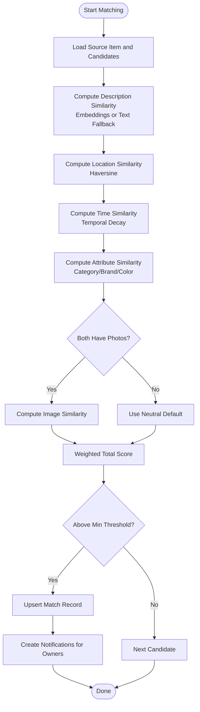
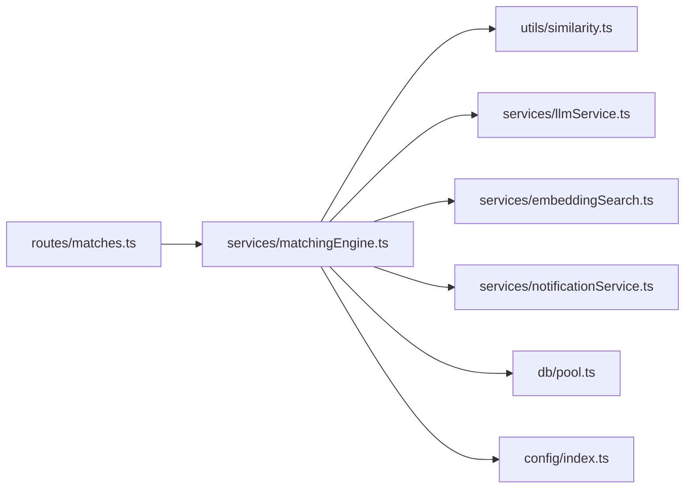

# Matching Engine Service

<cite>
**Referenced Files in This Document**
- [matchingEngine.ts](file://backend/src/services/matchingEngine.ts)
- [similarity.ts](file://backend/src/utils/similarity.ts)
- [embeddingSearch.ts](file://backend/src/services/embeddingSearch.ts)
- [llmService.ts](file://backend/src/services/llmService.ts)
- [notificationService.ts](file://backend/src/services/notificationService.ts)
- [matches.ts](file://backend/src/routes/matches.ts)
- [config/index.ts](file://backend/src/config/index.ts)
- [001_initial_schema.sql](file://supabase/migrations/001_initial_schema.sql)
- [API_DOCUMENTATION.md](file://backend/API_DOCUMENTATION.md)
- [matching.test.ts](file://backend/tests/matching.test.ts)
</cite>

## Table of Contents
1. [Introduction](#introduction)
2. [Project Structure](#project-structure)
3. [Core Components](#core-components)
4. [Architecture Overview](#architecture-overview)
5. [Detailed Component Analysis](#detailed-component-analysis)
6. [Dependency Analysis](#dependency-analysis)
7. [Performance Considerations](#performance-considerations)
8. [Troubleshooting Guide](#troubleshooting-guide)
9. [Conclusion](#conclusion)
10. [Appendices](#appendices)

## Introduction
This document explains the Matching Engine service that powers AI-driven item matching for lost and found items. It covers the weighted scoring system, multi-dimensional matching (vector similarity, location proximity, time proximity, attributes), fallback mechanisms when AI services are unavailable, performance optimizations for large datasets, integration with notifications, configuration options, example match results, error handling strategies, and troubleshooting guidance.

## Project Structure
The Matching Engine is implemented as a backend service with clear separation of concerns:
- Routes expose endpoints to trigger and retrieve matches.
- The engine orchestrates scoring across multiple dimensions.
- Utilities compute location/time/attribute similarities.
- LLM services provide embeddings and image similarity.
- Embedding search leverages pgvector for efficient vector queries.
- Notifications inform users about new matches.
- Configuration centralizes weights and thresholds.

**Diagram sources**
- [matches.ts:15-45](file://backend/src/routes/matches.ts#L15-L45)
- [matchingEngine.ts:37-188](file://backend/src/services/matchingEngine.ts#L37-L188)
- [similarity.ts:26-82](file://backend/src/utils/similarity.ts#L26-L82)
- [llmService.ts:9-41](file://backend/src/services/llmService.ts#L9-L41)
- [embeddingSearch.ts:30-62](file://backend/src/services/embeddingSearch.ts#L30-L62)
- [notificationService.ts:19-62](file://backend/src/services/notificationService.ts#L19-L62)

**Section sources**
- [matches.ts:15-115](file://backend/src/routes/matches.ts#L15-L115)
- [matchingEngine.ts:37-188](file://backend/src/services/matchingEngine.ts#L37-L188)
- [config/index.ts:33-47](file://backend/src/config/index.ts#L33-L47)

## Core Components
- Weighted Scoring System: Combines five dimensions with fixed weights to produce a 0–100 score per candidate pair.
- Multi-Dimensional Matching:
  - Description similarity via vector cosine similarity (with text fallback).
  - Image similarity via vision model comparison.
  - Location proximity using Haversine distance.
  - Time proximity using temporal decay within a configurable window.
  - Attribute similarity for category, brand, and color.
- Fallback Mechanisms: Graceful degradation when embeddings or images are missing or AI calls fail.
- Notification Integration: Creates in-app notifications and emails for new matches.
- Configuration: Centralized weights, thresholds, radius, and time windows.

Key responsibilities by file:
- matchingEngine.ts: Orchestrates scoring, persistence, and notifications.
- similarity.ts: Implements location/time/attribute similarity functions.
- llmService.ts: Provides embeddings, cosine similarity, and image similarity.
- embeddingSearch.ts: Performs pgvector-based similarity searches.
- notificationService.ts: Persists notifications and sends emails.
- matches.ts: Exposes REST endpoints to run and fetch matches.
- config/index.ts: Defines weights and tuning parameters.

**Section sources**
- [matchingEngine.ts:37-188](file://backend/src/services/matchingEngine.ts#L37-L188)
- [similarity.ts:26-82](file://backend/src/utils/similarity.ts#L26-L82)
- [llmService.ts:9-119](file://backend/src/services/llmService.ts#L9-L119)
- [embeddingSearch.ts:30-100](file://backend/src/services/embeddingSearch.ts#L30-L100)
- [notificationService.ts:19-62](file://backend/src/services/notificationService.ts#L19-L62)
- [matches.ts:15-115](file://backend/src/routes/matches.ts#L15-L115)
- [config/index.ts:33-47](file://backend/src/config/index.ts#L33-L47)

## Architecture Overview
The matching flow begins at the routes layer, which validates input and delegates to the engine. The engine loads the source item and candidates from the database, computes multi-dimensional scores, persists top matches above a threshold, and triggers notifications. Vector similarity can be accelerated via pgvector queries.

```mermaid
sequenceDiagram
participant C as "Client"
participant R as "Routes"
participant E as "Matching Engine"
participant D as "Database"
participant U as "Similarity Utils"
participant L as "LLM Services"
participant N as "Notifications"
C->>R : POST /api/matches/run/ : reportId?type=lost|found
R->>E : runMatchingEngine(reportId, type)
E->>D : SELECT source item + active candidates
loop For each candidate
E->>U : locationSimilarity(...)
E->>U : timeSimilarity(...)
E->>U : attributeSimilarity(...)
alt Both have embeddings
E->>L : cosineSimilarity(embeddings)
else Fallback
E->>E : simpleTextSimilarity(texts)
end
alt Both have photos
E->>L : imageSimilarity(photo_url_1, photo_url_2)
else No photos
E->>E : use neutral default
end
E->>E : compute totalScore = sum(weight_i * score_i)
end
E->>D : INSERT/UPDATE matches (status=pending)
E->>N : createNotification(owners, new_match)
R-->>C : { report_id, match_count, matches }
```

**Diagram sources**
- [matches.ts:15-45](file://backend/src/routes/matches.ts#L15-L45)
- [matchingEngine.ts:37-188](file://backend/src/services/matchingEngine.ts#L37-L188)
- [similarity.ts:26-82](file://backend/src/utils/similarity.ts#L26-L82)
- [llmService.ts:9-119](file://backend/src/services/llmService.ts#L9-L119)
- [notificationService.ts:19-62](file://backend/src/services/notificationService.ts#L19-L62)

## Detailed Component Analysis

### Weighted Scoring System
- Weights (must sum to 1.0):
  - Description similarity: 30%
  - Image similarity: 25%
  - Location proximity: 20%
  - Time proximity: 15%
  - Attributes: 10%
- Total score is rounded to an integer percentage and filtered by a minimum threshold before persistence.

Implementation highlights:
- Weights and thresholds are centralized in configuration.
- Scores are computed per dimension and combined into a single total.
- Only matches meeting the threshold are stored and returned.

Configuration keys:
- weights.description, weights.image, weights.location, weights.time, weights.attributes
- minScoreThreshold
- locationRadiusKm
- timeWindowHours

**Section sources**
- [config/index.ts:33-47](file://backend/src/config/index.ts#L33-L47)
- [matchingEngine.ts:125-146](file://backend/src/services/matchingEngine.ts#L125-L146)
- [API_DOCUMENTATION.md:19-39](file://backend/API_DOCUMENTATION.md#L19-L39)

### Description Similarity (Vector Cosine + Text Fallback)
- Primary method: cosine similarity between OpenAI-generated 1536-dimension embeddings stored in PostgreSQL (pgvector).
- Fallback: if embeddings are missing or parsing fails, uses a simple word overlap similarity on descriptions.

Behavior:
- If both items have valid embeddings, compute cosine similarity and map to 0–100.
- Otherwise, compute a normalized intersection-over-union of token sets.

Optimization:
- Use pgvector index (ivfflat) and native cosine distance operator for fast retrieval.

**Section sources**
- [matchingEngine.ts:84-97](file://backend/src/services/matchingEngine.ts#L84-L97)
- [llmService.ts:9-41](file://backend/src/services/llmService.ts#L9-L41)
- [embeddingSearch.ts:30-62](file://backend/src/services/embeddingSearch.ts#L30-L62)
- [001_initial_schema.sql:244-249](file://supabase/migrations/001_initial_schema.sql#L244-L249)

### Image Similarity (Vision Model)
- Compares two item photos using a vision-capable model to assess visual similarity.
- Returns a 0–100 score; defaults to a neutral value when images are missing or API calls fail.

Error handling:
- On failure (e.g., invalid URLs or service errors), returns a neutral score so matching continues.

**Section sources**
- [matchingEngine.ts:119-123](file://backend/src/services/matchingEngine.ts#L119-L123)
- [llmService.ts:85-119](file://backend/src/services/llmService.ts#L85-L119)

### Location Proximity (Haversine Formula)
- Computes Haversine distance in kilometers between two coordinates.
- Converts distance to a 0–100 similarity score:
  - 100% within configured radius (default 5 km).
  - Linear decay to 0% at three times the radius.
  - Neutral score (50%) if coordinates are missing.

Configurable radius:
- locationRadiusKm controls where full similarity is awarded.

**Section sources**
- [similarity.ts:4-38](file://backend/src/utils/similarity.ts#L4-L38)
- [config/index.ts:45-46](file://backend/src/config/index.ts#L45-L46)

### Time Proximity (Temporal Decay)
- Measures absolute difference in hours between event times.
- Score behavior:
  - 100% within configured window (default 72 hours).
  - Linear decay to 0% at four times the window.
- Uses ISO timestamps and converts to milliseconds for calculation.

**Section sources**
- [similarity.ts:43-55](file://backend/src/utils/similarity.ts#L43-L55)
- [config/index.ts:46-46](file://backend/src/config/index.ts#L46-L46)

### Attribute Similarity (Category/Brand/Color)
- Compares structured fields: category (weight 50%), brand (25%), color (25%).
- Exact matches add full weight; substring matches add partial credit.
- Normalized to 0–100.

**Section sources**
- [similarity.ts:61-82](file://backend/src/utils/similarity.ts#L61-L82)

### Multi-Dimensional Matching Flow

**Diagram sources**
- [matchingEngine.ts:80-188](file://backend/src/services/matchingEngine.ts#L80-L188)
- [similarity.ts:26-82](file://backend/src/utils/similarity.ts#L26-L82)
- [llmService.ts:9-119](file://backend/src/services/llmService.ts#L9-L119)

**Section sources**
- [matchingEngine.ts:80-188](file://backend/src/services/matchingEngine.ts#L80-L188)

### Database Schema and Indexes
- Tables: lost_items, found_items, matches, notifications, verification tables.
- Embeddings stored as vector(1536) with ivfflat indexes for cosine similarity.
- Matches table stores breakdown scores and status.
- Row-level security policies restrict access to user data.

Key schema elements:
- description_embedding vector(1536)
- ivfflat indexes on embeddings
- matches with unique constraint on (lost_item_id, found_item_id)

**Section sources**
- [001_initial_schema.sql:69-166](file://supabase/migrations/001_initial_schema.sql#L69-L166)
- [001_initial_schema.sql:241-258](file://supabase/migrations/001_initial_schema.sql#L241-L258)

### API Endpoints for Matching
- POST /api/matches/run/:reportId?type=lost|found
  - Validates ownership and runs the engine.
  - Returns match count and list of matches with scores.
- GET /api/matches/:reportId?type=lost|found
  - Retrieves existing matches sorted by total score descending.

Authentication:
- Requires JWT Bearer token.
- Ownership checks enforced.

**Section sources**
- [matches.ts:15-115](file://backend/src/routes/matches.ts#L15-L115)
- [API_DOCUMENTATION.md:419-513](file://backend/API_DOCUMENTATION.md#L419-L513)

### Notification Integration
- After persisting matches, the engine creates notifications for both lost-item owner and found-item owner.
- Notifications include title, message, and links to relevant pages.
- Emails are sent asynchronously; failures do not block matching.

**Section sources**
- [matchingEngine.ts:174-186](file://backend/src/services/matchingEngine.ts#L174-L186)
- [notificationService.ts:19-62](file://backend/src/services/notificationService.ts#L19-L62)

## Dependency Analysis

**Diagram sources**
- [matches.ts:1-115](file://backend/src/routes/matches.ts#L1-L115)
- [matchingEngine.ts:1-6](file://backend/src/services/matchingEngine.ts#L1-L6)
- [similarity.ts:1-83](file://backend/src/utils/similarity.ts#L1-L83)
- [llmService.ts:1-120](file://backend/src/services/llmService.ts#L1-L120)
- [embeddingSearch.ts:1-101](file://backend/src/services/embeddingSearch.ts#L1-L101)
- [notificationService.ts:1-101](file://backend/src/services/notificationService.ts#L1-L101)
- [config/index.ts:1-49](file://backend/src/config/index.ts#L1-L49)

**Section sources**
- [matches.ts:1-115](file://backend/src/routes/matches.ts#L1-L115)
- [matchingEngine.ts:1-6](file://backend/src/services/matchingEngine.ts#L1-L6)

## Performance Considerations
- Vector similarity acceleration:
  - Use pgvector’s native cosine distance operator and ivfflat indexes to avoid fetching all rows into memory.
  - Filtering by status and user ownership reduces candidate set size.
- Efficient queries:
  - Select only necessary fields and filter early (active status, exclude same user).
- Fallbacks reduce external dependencies:
  - Text fallback avoids blocking on embedding availability.
  - Neutral defaults for missing images keep pipeline running.
- Batch operations:
  - Upsert matches in a single statement per pair to minimize writes.
- Configurable thresholds:
  - Adjust minScoreThreshold to control output volume.
  - Tune locationRadiusKm and timeWindowHours to balance precision and recall.

[No sources needed since this section provides general guidance]

## Troubleshooting Guide
Common issues and resolutions:
- Missing embeddings:
  - Symptom: Lower description similarity scores.
  - Resolution: Ensure embeddings are generated and stored; fallback will use text similarity.
- Invalid image URLs:
  - Symptom: Image similarity defaults to neutral.
  - Resolution: Verify photo uploads and storage URLs; check network accessibility.
- No matches returned:
  - Symptom: Empty match list.
  - Resolution: Check minScoreThreshold; adjust locationRadiusKm or timeWindowHours; verify coordinates and timestamps.
- Permission errors:
  - Symptom: 403 Forbidden on match endpoints.
  - Resolution: Confirm JWT validity and ownership; ensure role permissions.
- Email delivery failures:
  - Symptom: In-app notifications exist but no email.
  - Resolution: Check email provider configuration; logs indicate non-fatal failures.

Operational tips:
- Use tests to validate scoring logic and edge cases.
- Monitor database indexes and query plans for vector searches.
- Log and track failed AI calls to identify service outages.

**Section sources**
- [matchingEngine.ts:84-97](file://backend/src/services/matchingEngine.ts#L84-L97)
- [llmService.ts:85-119](file://backend/src/services/llmService.ts#L85-L119)
- [notificationService.ts:42-62](file://backend/src/services/notificationService.ts#L42-L62)
- [matching.test.ts:68-199](file://backend/tests/matching.test.ts#L68-L199)

## Conclusion
The Matching Engine combines AI-powered vector similarity, computer vision for images, geospatial calculations, temporal decay, and attribute matching into a robust, configurable system. It includes resilient fallbacks, efficient database operations with pgvector, and seamless notification integration. With tunable weights and thresholds, it adapts to different operational needs while maintaining high accuracy and performance.

[No sources needed since this section summarizes without analyzing specific files]

## Appendices

### Configuration Options
- Weights:
  - description: 0.30
  - image: 0.25
  - location: 0.20
  - time: 0.15
  - attributes: 0.10
- Thresholds and tuning:
  - minScoreThreshold: Minimum total score (%) to surface a match.
  - locationRadiusKm: Radius for full location similarity.
  - timeWindowHours: Window for full time similarity.

**Section sources**
- [config/index.ts:33-47](file://backend/src/config/index.ts#L33-L47)

### Example Match Results
- High match: Near-identical items with close location/time and strong attributes yield high total scores.
- Medium match: Same category but distant location/time yields moderate scores.
- Low/no match: Different categories and locations result in low scores below threshold.

Validation examples:
- Unit tests demonstrate scoring behavior across scenarios including fallbacks.

**Section sources**
- [matching.test.ts:68-199](file://backend/tests/matching.test.ts#L68-L199)
- [API_DOCUMENTATION.md:185-198](file://backend/API_DOCUMENTATION.md#L185-L198)