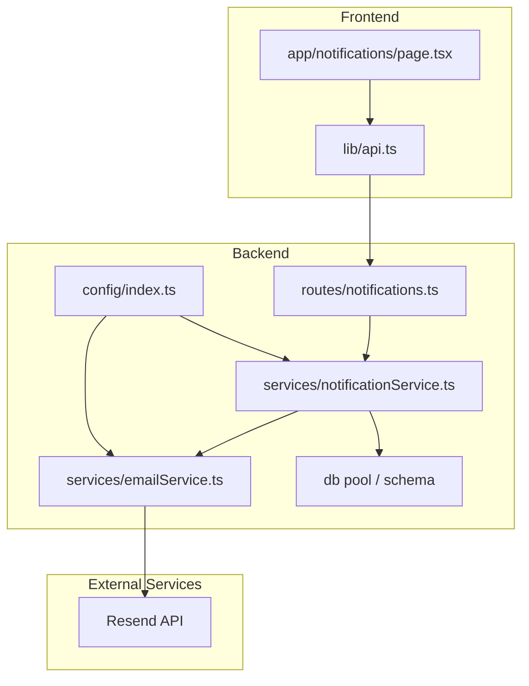
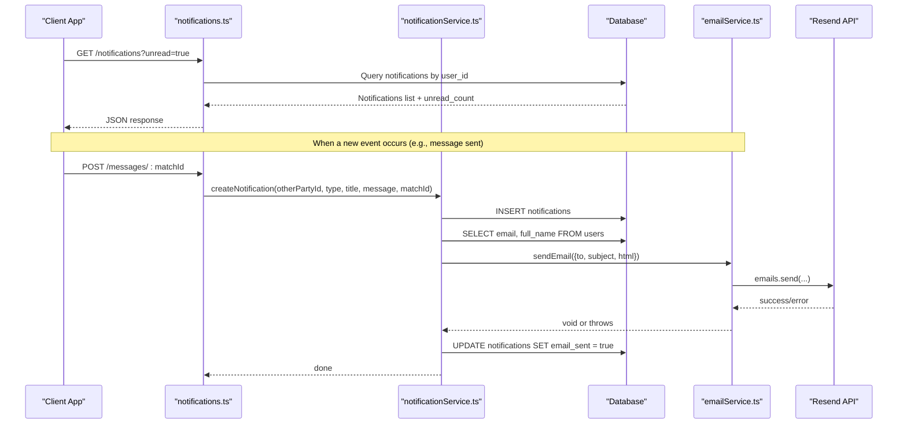
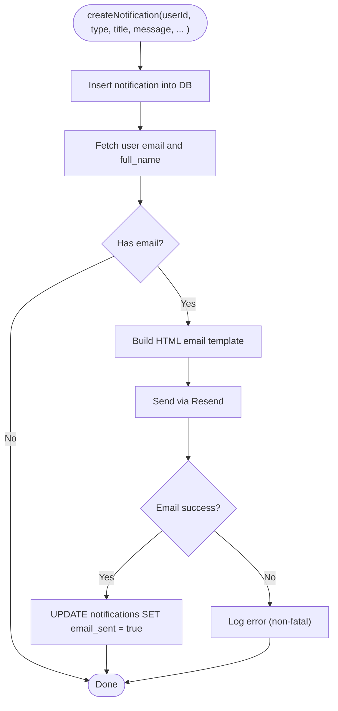
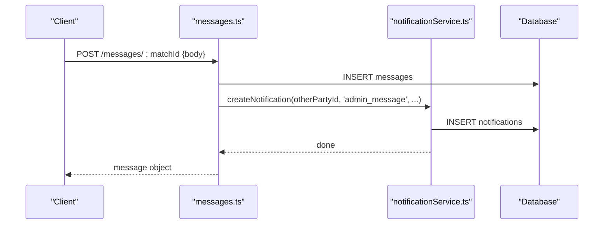
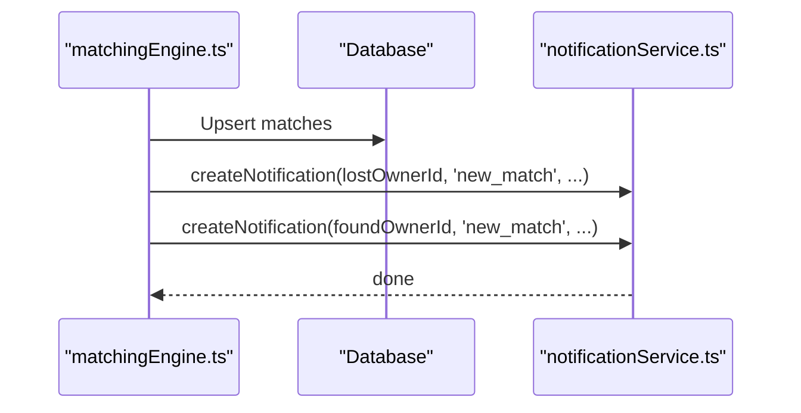
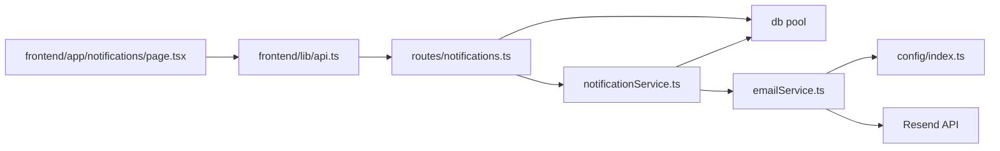

# Notification Service

<cite>
**Referenced Files in This Document**
- [notificationService.ts](file://backend/src/services/notificationService.ts)
- [emailService.ts](file://backend/src/services/emailService.ts)
- [notifications.ts](file://backend/src/routes/notifications.ts)
- [index.ts](file://backend/src/config/index.ts)
- [001_initial_schema.sql](file://supabase/migrations/001_initial_schema.sql)
- [messages.ts](file://backend/src/routes/messages.ts)
- [matchingEngine.ts](file://backend/src/services/matchingEngine.ts)
- [page.tsx](file://frontend/app/notifications/page.tsx)
- [api.ts](file://frontend/lib/api.ts)
</cite>

## Table of Contents
1. [Introduction](#introduction)
2. [Project Structure](#project-structure)
3. [Core Components](#core-components)
4. [Architecture Overview](#architecture-overview)
5. [Detailed Component Analysis](#detailed-component-analysis)
6. [Dependency Analysis](#dependency-analysis)
7. [Performance Considerations](#performance-considerations)
8. [Troubleshooting Guide](#troubleshooting-guide)
9. [Conclusion](#conclusion)
10. [Appendices](#appendices)

## Introduction
This document explains the Notification Service that powers real-time in-app notifications and email delivery via Resend for the Lost & Found AI Matcher. It covers notification types, dual delivery (in-app + email), template management, recipient resolution, delivery status tracking, integration points with Supabase and Resend, configuration options, and end-to-end workflows for creating and delivering notifications. It also includes troubleshooting guidance for common delivery issues.

## Project Structure
The notification system spans backend services, routes, database schema, and frontend UI:
- Backend service layer creates notifications and sends emails
- Routes expose endpoints to list, mark read, and count notifications
- Database schema defines notification types and storage fields
- Frontend displays notifications and provides read actions

**Diagram sources**
- [notifications.ts:1-86](file://backend/src/routes/notifications.ts#L1-L86)
- [notificationService.ts:1-101](file://backend/src/services/notificationService.ts#L1-L101)
- [emailService.ts:1-32](file://backend/src/services/emailService.ts#L1-L32)
- [index.ts:1-49](file://backend/src/config/index.ts#L1-L49)
- [page.tsx:1-190](file://frontend/app/notifications/page.tsx#L1-L190)
- [api.ts:270-291](file://frontend/lib/api.ts#L270-L291)

**Section sources**
- [notifications.ts:1-86](file://backend/src/routes/notifications.ts#L1-L86)
- [notificationService.ts:1-101](file://backend/src/services/notificationService.ts#L1-L101)
- [emailService.ts:1-32](file://backend/src/services/emailService.ts#L1-L32)
- [index.ts:1-49](file://backend/src/config/index.ts#L1-L49)
- [page.tsx:1-190](file://frontend/app/notifications/page.tsx#L1-L190)
- [api.ts:270-291](file://frontend/lib/api.ts#L270-L291)

## Core Components
- Notification creation and email dispatch: centralizes in-app persistence and optional email sending
- Email transport: wraps Resend API with environment-based configuration
- Notification APIs: authenticated endpoints to list, paginate, filter unread, mark single/all as read, and get unread counts
- Database schema: defines notification types, linking fields, and read/delivery flags
- Frontend UI: renders notifications, supports marking read actions, and shows unread badges

Key responsibilities:
- Create in-app notifications and persist them
- Resolve recipients from user records
- Build HTML email templates with contextual links
- Send emails via Resend and track delivery status
- Expose REST endpoints for clients to manage notifications

**Section sources**
- [notificationService.ts:1-101](file://backend/src/services/notificationService.ts#L1-L101)
- [emailService.ts:1-32](file://backend/src/services/emailService.ts#L1-L32)
- [notifications.ts:1-86](file://backend/src/routes/notifications.ts#L1-L86)
- [001_initial_schema.sql:41-49](file://supabase/migrations/001_initial_schema.sql#L41-L49)
- [001_initial_schema.sql:204-221](file://supabase/migrations/001_initial_schema.sql#L204-L221)
- [page.tsx:1-190](file://frontend/app/notifications/page.tsx#L1-L190)
- [api.ts:270-291](file://frontend/lib/api.ts#L270-L291)

## Architecture Overview
The notification flow combines in-app persistence and email delivery:
- A caller invokes createNotification with a user ID, type, title, message, and optional context
- The service inserts a notification row and attempts to send an email using Resend
- On successful email send, the notification is marked as email_sent
- Clients poll or fetch notifications via REST endpoints and update read state

**Diagram sources**
- [notifications.ts:40-69](file://backend/src/routes/notifications.ts#L40-L69)
- [notificationService.ts:19-62](file://backend/src/services/notificationService.ts#L19-L62)
- [emailService.ts:15-31](file://backend/src/services/emailService.ts#L15-L31)
- [messages.ts:97-135](file://backend/src/routes/messages.ts#L97-L135)

## Detailed Component Analysis

### Notification Creation and Dual Delivery
- In-app persistence: Inserts a notification record with type, title, message, and optional links to match/item
- Recipient resolution: Fetches user email and name to personalize email
- Email delivery: Builds an HTML template with contextual action URL and sends via Resend
- Delivery tracking: Marks email_sent flag upon successful send; email failures are non-fatal so in-app notifications remain available

**Diagram sources**
- [notificationService.ts:19-62](file://backend/src/services/notificationService.ts#L19-L62)
- [notificationService.ts:67-100](file://backend/src/services/notificationService.ts#L67-L100)
- [emailService.ts:15-31](file://backend/src/services/emailService.ts#L15-L31)

**Section sources**
- [notificationService.ts:19-62](file://backend/src/services/notificationService.ts#L19-L62)
- [notificationService.ts:67-100](file://backend/src/services/notificationService.ts#L67-L100)
- [emailService.ts:15-31](file://backend/src/services/emailService.ts#L15-L31)

### Notification Types and Semantics
Supported notification types include:
- new_match: A potential match was found between a lost and found item
- verification_question: A verification question has been sent to a claimant
- verification_result: Verification outcome updated
- match_approved: Match approved after verification or admin review
- match_rejected: Match rejected
- item_returned: Item returned to owner
- admin_message: New message within a match thread

These types align with the database enum and drive UI icons/colors in the frontend.

**Section sources**
- [notificationService.ts:5-12](file://backend/src/services/notificationService.ts#L5-L12)
- [001_initial_schema.sql:41-49](file://supabase/migrations/001_initial_schema.sql#L41-L49)
- [page.tsx:24-42](file://frontend/app/notifications/page.tsx#L24-L42)

### Email Template Management
- Templates are built dynamically based on notification type and context
- Accent color varies by type (e.g., green for new matches, blue otherwise)
- Action URLs link to either a specific match page or the general notifications page
- Personalization uses the recipient’s full name

Configuration influences:
- Frontend base URL determines deep links
- From address configured via environment variables

**Section sources**
- [notificationService.ts:67-100](file://backend/src/services/notificationService.ts#L67-L100)
- [index.ts:23-26](file://backend/src/config/index.ts#L23-L26)
- [index.ts:6-10](file://backend/src/config/index.ts#L6-L10)

### Recipient Resolution and Delivery Status Tracking
- Recipients are resolved by querying the users table for email and display name
- Delivery status is tracked via email_sent flag on notifications
- If email fails, the in-app notification remains intact for later retry or fallback

**Section sources**
- [notificationService.ts:36-62](file://backend/src/services/notificationService.ts#L36-L62)
- [001_initial_schema.sql:204-221](file://supabase/migrations/001_initial_schema.sql#L204-L221)

### Notification APIs
Authenticated endpoints provide:
- List notifications with pagination and optional unread-only filtering
- Get unread count
- Mark all notifications as read
- Mark a single notification as read

These endpoints support client-side polling or refresh flows.

**Section sources**
- [notifications.ts:14-21](file://backend/src/routes/notifications.ts#L14-L21)
- [notifications.ts:27-34](file://backend/src/routes/notifications.ts#L27-L34)
- [notifications.ts:40-69](file://backend/src/routes/notifications.ts#L40-L69)
- [notifications.ts:75-84](file://backend/src/routes/notifications.ts#L75-L84)

### Real-Time Integration Notes
- The current implementation persists notifications in the database and exposes REST endpoints for retrieval
- Supabase clients exist for admin and anon usage; however, explicit real-time subscriptions for notifications are not present in the analyzed code
- For instant updates, consider adding Supabase real-time channels on the notifications table and subscribing in the frontend

[No sources needed since this section provides conceptual guidance]

### Example Workflows

#### Message Thread Triggers Notification
When a participant sends a message in an approved match thread, the other party receives a notification:
- Persist message
- Create notification for the other party with type admin_message
- Optionally send email if configured

**Diagram sources**
- [messages.ts:97-135](file://backend/src/routes/messages.ts#L97-L135)
- [notificationService.ts:19-62](file://backend/src/services/notificationService.ts#L19-L62)

**Section sources**
- [messages.ts:97-135](file://backend/src/routes/messages.ts#L97-L135)
- [notificationService.ts:19-62](file://backend/src/services/notificationService.ts#L19-L62)

#### Matching Engine Creates New Match Notifications
When the matching engine identifies matches above threshold:
- Upsert match records
- Notify both owners about the new match with percentage score and contextual links

**Diagram sources**
- [matchingEngine.ts:152-188](file://backend/src/services/matchingEngine.ts#L152-L188)
- [notificationService.ts:19-62](file://backend/src/services/notificationService.ts#L19-L62)

**Section sources**
- [matchingEngine.ts:152-188](file://backend/src/services/matchingEngine.ts#L152-L188)
- [notificationService.ts:19-62](file://backend/src/services/notificationService.ts#L19-L62)

### Configuration Options
- Email provider: Resend API key and sender address
- Frontend URL: Used to build deep links in email templates
- Environment loading: .env file path and keys

Recommended environment variables:
- RESEND_API_KEY: Resend API key
- EMAIL_FROM: Sender email address
- FRONTEND_URL: Base URL for deep links

**Section sources**
- [emailService.ts:1-32](file://backend/src/services/emailService.ts#L1-L32)
- [index.ts:23-26](file://backend/src/config/index.ts#L23-L26)
- [index.ts:1-4](file://backend/src/config/index.ts#L1-L4)

### Error Handling
- Email send failures are caught and logged; they do not prevent in-app notifications
- Missing email configuration results in skipped email delivery with a warning
- Route handlers use async wrappers to standardize error responses

Best practices:
- Ensure RESEND_API_KEY is set for email delivery
- Monitor logs for email send errors
- Implement retries or dead-letter queues for critical notifications if needed

**Section sources**
- [emailService.ts:15-31](file://backend/src/services/emailService.ts#L15-L31)
- [notificationService.ts:57-60](file://backend/src/services/notificationService.ts#L57-L60)

## Dependency Analysis
- notificationService depends on database pool and emailService
- emailService depends on Resend SDK and config
- routes depend on middleware for authentication and error handling
- frontend depends on api client to call notification endpoints

**Diagram sources**
- [notificationService.ts:1-101](file://backend/src/services/notificationService.ts#L1-L101)
- [emailService.ts:1-32](file://backend/src/services/emailService.ts#L1-L32)
- [notifications.ts:1-86](file://backend/src/routes/notifications.ts#L1-L86)
- [index.ts:1-49](file://backend/src/config/index.ts#L1-L49)
- [page.tsx:1-190](file://frontend/app/notifications/page.tsx#L1-L190)
- [api.ts:270-291](file://frontend/lib/api.ts#L270-L291)

**Section sources**
- [notificationService.ts:1-101](file://backend/src/services/notificationService.ts#L1-L101)
- [emailService.ts:1-32](file://backend/src/services/emailService.ts#L1-L32)
- [notifications.ts:1-86](file://backend/src/routes/notifications.ts#L1-L86)
- [index.ts:1-49](file://backend/src/config/index.ts#L1-L49)
- [page.tsx:1-190](file://frontend/app/notifications/page.tsx#L1-L190)
- [api.ts:270-291](file://frontend/lib/api.ts#L270-L291)

## Performance Considerations
- Pagination and filtering: Use page/limit/unread query parameters to reduce payload size
- Indexing: Ensure indexes on notifications(user_id, is_read) for efficient queries
- Email throttling: Consider rate limiting around Resend calls to avoid API limits
- Batch operations: Group multiple notification creations where possible to reduce round-trips
- Template rendering: Keep templates lightweight to minimize CPU overhead

[No sources needed since this section provides general guidance]

## Troubleshooting Guide
Common issues and resolutions:
- No emails received:
  - Verify RESEND_API_KEY and EMAIL_FROM are set
  - Check logs for email send warnings/errors
  - Confirm email_sent flag is false when expected
- In-app notifications not appearing:
  - Ensure user_id is correct and rows exist in notifications
  - Check is_read flags and filters used by the client
- Deep links broken:
  - Validate FRONTEND_URL configuration
  - Ensure match IDs exist and are accessible

Operational checks:
- Call GET /notifications/count to verify unread counts
- Call PATCH /notifications/read-all to reset read states during testing
- Inspect database rows for email_sent and is_read flags

**Section sources**
- [emailService.ts:15-31](file://backend/src/services/emailService.ts#L15-L31)
- [notificationService.ts:57-60](file://backend/src/services/notificationService.ts#L57-L60)
- [notifications.ts:27-34](file://backend/src/routes/notifications.ts#L27-L34)
- [notifications.ts:14-21](file://backend/src/routes/notifications.ts#L14-L21)
- [index.ts:6-10](file://backend/src/config/index.ts#L6-L10)

## Conclusion
The Notification Service provides a robust dual-delivery system combining persistent in-app notifications with email via Resend. It supports multiple notification types aligned with the application’s lifecycle, offers clear APIs for managing notifications, and tracks delivery status. While real-time updates can be enhanced with Supabase real-time channels, the current design ensures reliable delivery through polling and consistent state management. Proper configuration and monitoring will ensure high availability and timely user engagement.

[No sources needed since this section summarizes without analyzing specific files]

## Appendices

### API Reference Summary
- GET /api/notifications?page=...&limit=...&unread=...
  - Returns paginated notifications and unread count
- PATCH /api/notifications/:id/read
  - Marks a single notification as read
- PATCH /api/notifications/read-all
  - Marks all notifications as read for the authenticated user
- GET /api/notifications/count
  - Returns unread notification count

**Section sources**
- [notifications.ts:14-21](file://backend/src/routes/notifications.ts#L14-L21)
- [notifications.ts:27-34](file://backend/src/routes/notifications.ts#L27-L34)
- [notifications.ts:40-69](file://backend/src/routes/notifications.ts#L40-L69)
- [notifications.ts:75-84](file://backend/src/routes/notifications.ts#L75-L84)
- [api.ts:277-291](file://frontend/lib/api.ts#L277-L291)