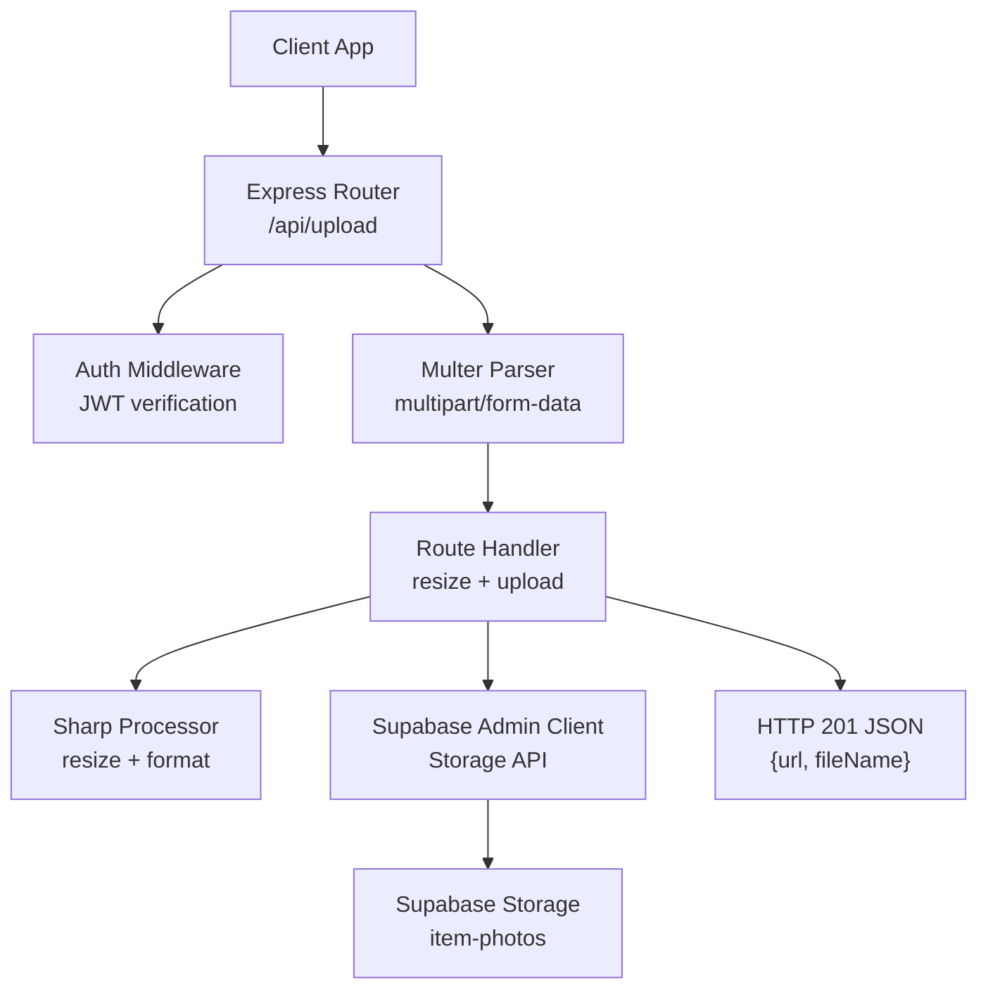
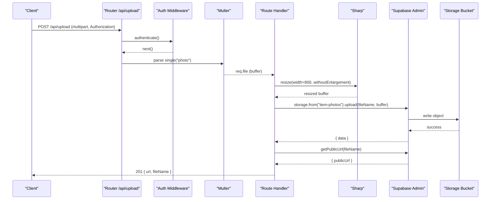
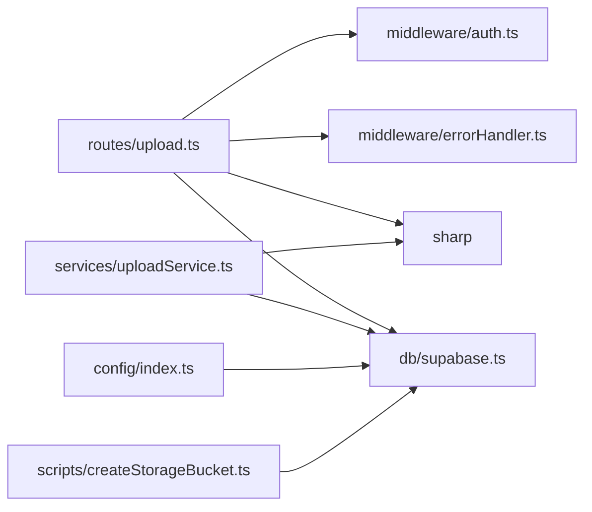

# Upload Service

<cite>
**Referenced Files in This Document**
- [uploadService.ts](file://backend/src/services/uploadService.ts)
- [upload.ts](file://backend/src/routes/upload.ts)
- [supabase.ts](file://backend/src/db/supabase.ts)
- [index.ts](file://backend/src/config/index.ts)
- [errorHandler.ts](file://backend/src/middleware/errorHandler.ts)
- [auth.ts](file://backend/src/middleware/auth.ts)
- [createStorageBucket.ts](file://backend/src/scripts/createStorageBucket.ts)
- [API_DOCUMENTATION.md](file://backend/API_DOCUMENTATION.md)
</cite>

## Table of Contents
1. [Introduction](#introduction)
2. [Project Structure](#project-structure)
3. [Core Components](#core-components)
4. [Architecture Overview](#architecture-overview)
5. [Detailed Component Analysis](#detailed-component-analysis)
6. [Dependency Analysis](#dependency-analysis)
7. [Performance Considerations](#performance-considerations)
8. [Troubleshooting Guide](#troubleshooting-guide)
9. [Conclusion](#conclusion)
10. [Appendices](#appendices)

## Introduction
This document describes the Upload Service that handles image uploads, validation, processing, and storage via Supabase Storage. It covers the end-to-end workflow from receiving a multipart image to returning a public URL, including security checks, supported formats, size limits, compression, metadata handling, and CDN-friendly caching. It also provides configuration guidance, example requests, error handling patterns, and best practices for optimizing storage and retrieval performance.

## Project Structure
The upload feature spans several modules:
- Routes define the HTTP endpoint and apply authentication and file parsing.
- Services encapsulate reusable image processing and storage logic.
- Database module initializes Supabase clients (admin and anon).
- Configuration centralizes environment-driven settings.
- Middleware enforces authentication and standardized error responses.
- Scripts provision the required Supabase Storage bucket.

**Diagram sources**
- [upload.ts:1-69](file://backend/src/routes/upload.ts#L1-L69)
- [auth.ts:22-37](file://backend/src/middleware/auth.ts#L22-L37)
- [uploadService.ts:14-27](file://backend/src/services/uploadService.ts#L14-L27)
- [uploadService.ts:34-65](file://backend/src/services/uploadService.ts#L34-L65)
- [supabase.ts:8-11](file://backend/src/db/supabase.ts#L8-L11)

**Section sources**
- [upload.ts:1-69](file://backend/src/routes/upload.ts#L1-L69)
- [uploadService.ts:1-66](file://backend/src/services/uploadService.ts#L1-L66)
- [supabase.ts:1-21](file://backend/src/db/supabase.ts#L1-L21)
- [index.ts:1-49](file://backend/src/config/index.ts#L1-L49)
- [errorHandler.ts:1-56](file://backend/src/middleware/errorHandler.ts#L1-L56)
- [auth.ts:1-59](file://backend/src/middleware/auth.ts#L1-L59)
- [createStorageBucket.ts:1-34](file://backend/src/scripts/createStorageBucket.ts#L1-L34)
- [API_DOCUMENTATION.md:381-416](file://backend/API_DOCUMENTATION.md#L381-L416)

## Core Components
- Route handler: POST /api/upload with authentication, multipart parsing, resizing, and upload to Supabase Storage.
- Reusable service: processAndUpload(buffer, originalMime) normalizes images to WebP, resizes, and uploads with immutable filenames and long cache control.
- Supabase client: admin client used server-side to bypass Row Level Security for storage operations.
- Configuration: environment variables for Supabase URLs and keys; JWT secret for auth middleware.
- Error handling: centralized AppError and multer error mapping for consistent responses.
- Bucket provisioning: script to create or ensure the item-photos bucket is public with a 5 MB limit.

Key responsibilities:
- Validate and restrict input files (type and size).
- Process images efficiently (resize, orientation, format conversion).
- Store securely using service role credentials and return stable public URLs.
- Provide clear error messages for invalid inputs and failures.

**Section sources**
- [upload.ts:15-68](file://backend/src/routes/upload.ts#L15-L68)
- [uploadService.ts:14-65](file://backend/src/services/uploadService.ts#L14-L65)
- [supabase.ts:8-11](file://backend/src/db/supabase.ts#L8-L11)
- [index.ts:6-31](file://backend/src/config/index.ts#L6-L31)
- [errorHandler.ts:4-47](file://backend/src/middleware/errorHandler.ts#L4-L47)
- [createStorageBucket.ts:3-28](file://backend/src/scripts/createStorageBucket.ts#L3-L28)

## Architecture Overview
The upload flow enforces authentication first, then parses the multipart form, validates the file, processes it with Sharp, and stores it in Supabase Storage using the service role key. The response includes the public URL and filename.

**Diagram sources**
- [upload.ts:12-68](file://backend/src/routes/upload.ts#L12-L68)
- [auth.ts:22-37](file://backend/src/middleware/auth.ts#L22-L37)
- [supabase.ts:8-11](file://backend/src/db/supabase.ts#L8-L11)

## Detailed Component Analysis

### Upload Route (POST /api/upload)
- Authentication: All upload routes require a valid JWT in the Authorization header.
- File parsing: Uses multer memory storage with a 5 MB size limit and accepts any image MIME type.
- Processing: Resizes to a maximum width of 800px while preserving aspect ratio.
- Storage: Uploads to the item-photos bucket with the original MIME type and returns the public URL.
- Response: Returns HTTP 201 with url and fileName.

Validation and constraints:
- Field name: photo (required).
- Size limit: 5 MB enforced by multer.
- Type: Any image/* accepted at route level.

Security:
- Protected by JWT authentication middleware.
- Server uses Supabase service role key for storage writes.

Errors:
- Missing file: 400 with descriptive message.
- Multer errors: mapped to user-friendly messages (e.g., too large, unexpected field).
- Storage failure: 500 with underlying error message.

Example request:
- See API documentation section for cURL and response shape.

**Section sources**
- [upload.ts:12-68](file://backend/src/routes/upload.ts#L12-L68)
- [errorHandler.ts:30-47](file://backend/src/middleware/errorHandler.ts#L30-L47)
- [API_DOCUMENTATION.md:381-416](file://backend/API_DOCUMENTATION.md#L381-L416)

### Reusable Upload Service (processAndUpload)
Purpose:
- Normalize images to WebP, auto-rotate based on EXIF, resize to max 1280px width without enlargement, and set quality to 82%.
- Generate unique filenames and store under items/ path.
- Set immutable cache headers for CDN optimization.
- Return public URL.

Processing pipeline:
- Input: Buffer and original MIME type.
- Sharp operations: rotate(), resize({ width: 1280, withoutEnlargement: true }), webp({ quality: 82 }).
- Storage: Upload with contentType image/webp and cacheControl 31536000 (1 year), upsert disabled.
- Output: Public URL via getPublicUrl.

Security and integrity:
- Unique UUID-based filenames prevent overwrites.
- Service role key used for server-side storage access.

Performance characteristics:
- In-memory processing avoids disk I/O.
- Fixed width resize reduces bandwidth and storage costs.
- WebP conversion improves compression efficiency.

**Section sources**
- [uploadService.ts:14-65](file://backend/src/services/uploadService.ts#L14-L65)

### Supabase Integration
Clients:
- supabaseAdmin: created with service role key to bypass RLS for server-side storage operations.
- supabaseClient: created with anon key for client-scoped operations where appropriate.

Bucket setup:
- Script creates or ensures the item-photos bucket is public with a 5 MB file size limit.
- If already exists, updates to ensure public visibility.

Access control notes:
- Storage policies are not defined in this repository; rely on bucket-level public setting and application-layer authentication.

CDN optimization:
- Immutable filenames combined with long cache-control headers enable efficient CDN caching.

**Section sources**
- [supabase.ts:8-11](file://backend/src/db/supabase.ts#L8-L11)
- [createStorageBucket.ts:3-28](file://backend/src/scripts/createStorageBucket.ts#L3-L28)
- [uploadService.ts:48-64](file://backend/src/services/uploadService.ts#L48-L64)

### Authentication and Error Handling
Authentication:
- JWT verification extracts userId and userRole from the token and attaches them to the request.
- Invalid or missing tokens result in 401 responses.

Error handling:
- AppError class standardizes error responses with status codes.
- Multer errors are mapped to friendly messages for common issues like oversized files or wrong field names.
- Unhandled errors return a generic 500 response.

Best practices:
- Always wrap async handlers with asyncHandler to catch promise rejections.
- Use AppError for expected operational errors to avoid leaking stack traces.

**Section sources**
- [auth.ts:22-37](file://backend/src/middleware/auth.ts#L22-L37)
- [errorHandler.ts:4-47](file://backend/src/middleware/errorHandler.ts#L4-L47)

## Dependency Analysis
High-level dependencies:
- Express router depends on authentication middleware and multer for file parsing.
- Route handlers depend on Sharp for image processing and Supabase admin client for storage.
- Configuration drives Supabase endpoints and JWT secrets.
- Error middleware centralizes error formatting and multer error mapping.

**Diagram sources**
- [upload.ts:1-69](file://backend/src/routes/upload.ts#L1-L69)
- [uploadService.ts:1-66](file://backend/src/services/uploadService.ts#L1-L66)
- [supabase.ts:1-21](file://backend/src/db/supabase.ts#L1-L21)
- [index.ts:1-49](file://backend/src/config/index.ts#L1-L49)
- [createStorageBucket.ts:1-34](file://backend/src/scripts/createStorageBucket.ts#L1-L34)

**Section sources**
- [upload.ts:1-69](file://backend/src/routes/upload.ts#L1-L69)
- [uploadService.ts:1-66](file://backend/src/services/uploadService.ts#L1-L66)
- [supabase.ts:1-21](file://backend/src/db/supabase.ts#L1-L21)
- [index.ts:1-49](file://backend/src/config/index.ts#L1-L49)
- [createStorageBucket.ts:1-34](file://backend/src/scripts/createStorageBucket.ts#L1-L34)

## Performance Considerations
- Image resizing: Limiting width reduces bandwidth and storage usage while maintaining visual quality.
- Format conversion: Converting to WebP typically yields smaller file sizes compared to JPEG/PNG with comparable quality.
- In-memory processing: Avoids disk I/O overhead during upload bursts.
- CDN caching: Using immutable filenames and long cache-control headers enables efficient caching at edge networks.
- Batch uploads: For multiple images, consider queuing uploads to avoid blocking requests.

[No sources needed since this section provides general guidance]

## Troubleshooting Guide
Common issues and resolutions:
- Missing file field: Ensure the multipart field name is photo.
- File too large: Enforce client-side size checks; server rejects >5 MB with a clear message.
- Unexpected field: Only one file field named photo is allowed.
- Invalid token: Include a valid JWT in the Authorization header.
- Storage upload failed: Check Supabase credentials and bucket existence; inspect error details.

Error response shape:
- Errors follow a consistent JSON structure with status and message fields.

Operational tips:
- Verify the item-photos bucket exists and is public before running uploads.
- Monitor server logs for unhandled errors and adjust limits if necessary.

**Section sources**
- [errorHandler.ts:30-47](file://backend/src/middleware/errorHandler.ts#L30-L47)
- [createStorageBucket.ts:3-28](file://backend/src/scripts/createStorageBucket.ts#L3-L28)
- [API_DOCUMENTATION.md:782-800](file://backend/API_DOCUMENTATION.md#L782-L800)

## Conclusion
The Upload Service provides a secure, efficient pipeline for accepting, validating, processing, and storing images in Supabase Storage. It enforces authentication, applies strict file constraints, optimizes images for performance, and leverages CDN-friendly caching. By following the configuration and best practices outlined here, teams can maintain reliable uploads with predictable performance and cost characteristics.

[No sources needed since this section summarizes without analyzing specific files]

## Appendices

### Configuration Options
- Supabase:
  - URL and keys via environment variables for both anon and service role clients.
- JWT:
  - Secret and expiration configured centrally.
- Storage bucket:
  - Name: item-photos
  - Public: true
  - File size limit: 5 MB

Environment variables referenced:
- NEXT_PUBLIC_SUPABASE_URL
- NEXT_PUBLIC_SUPABASE_ANON_KEY
- SUPABASE_SERVICE_ROLE_KEY
- JWT_SECRET

**Section sources**
- [index.ts:6-31](file://backend/src/config/index.ts#L6-L31)
- [createStorageBucket.ts:3-28](file://backend/src/scripts/createStorageBucket.ts#L3-L28)

### Supported Formats and Limits
- Route-level acceptance: Any image/* MIME type.
- Service-level normalization: Converts to WebP with quality 82% and auto-rotation.
- Max file size: 5 MB enforced by multer.
- Resize: Max width 800px (route) or 1280px (service), preserving aspect ratio.

**Section sources**
- [upload.ts:15-27](file://backend/src/routes/upload.ts#L15-L27)
- [uploadService.ts:34-43](file://backend/src/services/uploadService.ts#L34-L43)

### Example Upload Request
- Endpoint: POST /api/upload
- Headers: Authorization: Bearer <token>, Content-Type: multipart/form-data
- Body: Single file field named photo (max 5 MB)
- Response: 201 with url and fileName

For detailed examples and cURL commands, refer to the API documentation.

**Section sources**
- [API_DOCUMENTATION.md:381-416](file://backend/API_DOCUMENTATION.md#L381-L416)

### Best Practices
- Enforce client-side validation for file types and sizes to reduce server load.
- Use the reusable service function for consistent processing across features.
- Prefer immutable filenames and long cache-control for CDN efficiency.
- Keep bucket size limits aligned with application requirements.
- Centralize configuration to allow easy tuning of limits and formats.

[No sources needed since this section provides general guidance]