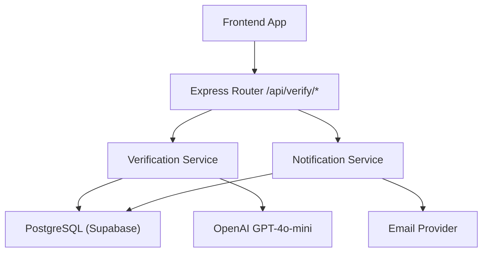
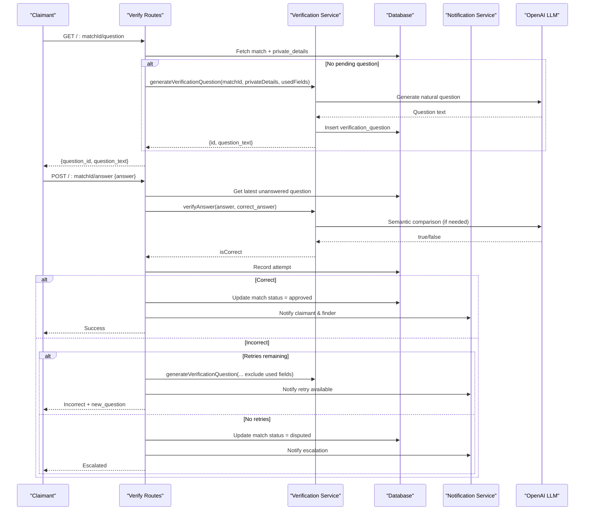
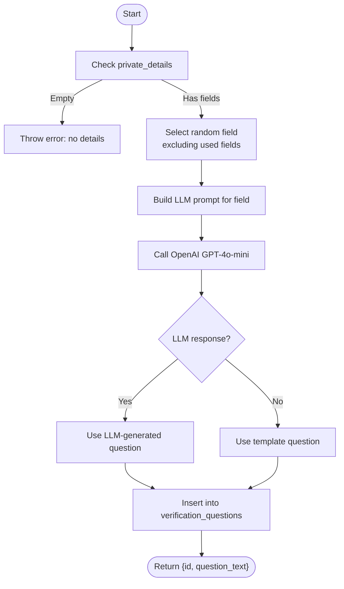
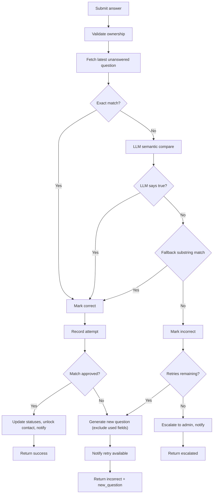
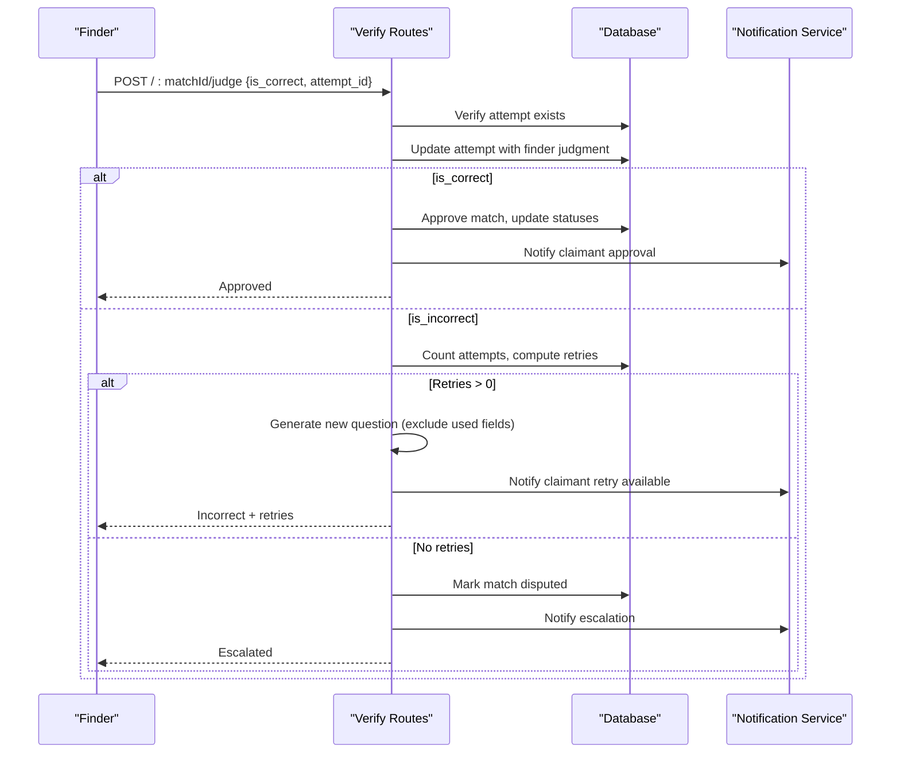
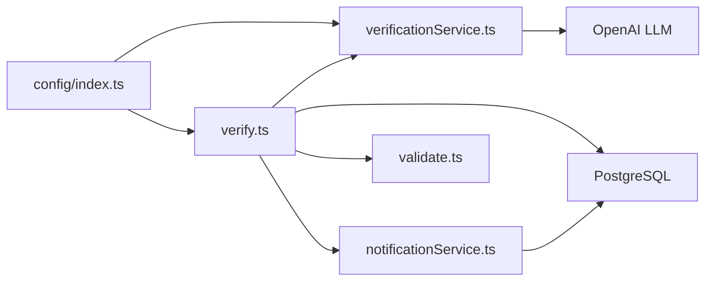

# Verification Service

<cite>
**Referenced Files in This Document**
- [verificationService.ts](file://backend/src/services/verificationService.ts)
- [verify.ts](file://backend/src/routes/verify.ts)
- [llmService.ts](file://backend/src/services/llmService.ts)
- [notificationService.ts](file://backend/src/services/notificationService.ts)
- [validate.ts](file://backend/src/middleware/validate.ts)
- [index.ts](file://backend/src/config/index.ts)
- [001_initial_schema.sql](file://supabase/migrations/001_initial_schema.sql)
- [VerificationModal.tsx](file://frontend/components/VerificationModal.tsx)
- [VERIFICATION_FIELDS.md](file://VERIFICATION_FIELDS.md)
</cite>

## Table of Contents
1. [Introduction](#introduction)
2. [Project Structure](#project-structure)
3. [Core Components](#core-components)
4. [Architecture Overview](#architecture-overview)
5. [Detailed Component Analysis](#detailed-component-analysis)
6. [Dependency Analysis](#dependency-analysis)
7. [Performance Considerations](#performance-considerations)
8. [Troubleshooting Guide](#troubleshooting-guide)
9. [Conclusion](#conclusion)
10. [Appendices](#appendices)

## Introduction
This document explains the Verification Service that secures lost-and-found matches by generating LLM-based verification questions from private item details and validating user answers with semantic matching. It covers question generation, answer submission, validation scoring, retry logic with field rotation to avoid repetition, escalation to admin review for disputes, configuration options, error handling, and integration with the notification system.

## Project Structure
The verification feature spans backend routes, services, database schema, frontend UI, and configuration:
- Routes expose endpoints to retrieve/generate questions, submit answers, and allow finder override/judgment.
- Services implement LLM-powered question generation and answer validation, plus notifications.
- Database schema defines tables for matches, verification questions, attempts, and notifications.
- Frontend provides a modal to fetch questions and submit answers.
- Configuration centralizes retry limits and thresholds.

**Diagram sources**
- [verify.ts:20-79](file://backend/src/routes/verify.ts#L20-L79)
- [verify.ts:89-293](file://backend/src/routes/verify.ts#L89-L293)
- [verify.ts:303-443](file://backend/src/routes/verify.ts#L303-L443)
- [verificationService.ts:15-79](file://backend/src/services/verificationService.ts#L15-L79)
- [verificationService.ts:85-122](file://backend/src/services/verificationService.ts#L85-L122)
- [notificationService.ts:19-62](file://backend/src/services/notificationService.ts#L19-L62)
- [001_initial_schema.sql:171-221](file://supabase/migrations/001_initial_schema.sql#L171-L221)

**Section sources**
- [verify.ts:20-79](file://backend/src/routes/verify.ts#L20-L79)
- [verify.ts:89-293](file://backend/src/routes/verify.ts#L89-L293)
- [verify.ts:303-443](file://backend/src/routes/verify.ts#L303-L443)
- [verificationService.ts:15-122](file://backend/src/services/verificationService.ts#L15-L122)
- [notificationService.ts:19-62](file://backend/src/services/notificationService.ts#L19-L62)
- [001_initial_schema.sql:171-221](file://supabase/migrations/001_initial_schema.sql#L171-L221)

## Core Components
- Question Generation: Creates natural-language questions from private_details using LLM, with fallback to simple templates. Supports field rotation to avoid repeating previously used fields.
- Answer Validation: Performs exact match first; otherwise uses LLM for semantic comparison with robust tolerance for wording differences. Falls back to substring matching if LLM fails.
- Retry Mechanism: Enforces configurable max retries per match; on incorrect answers, generates a new question excluding previously used fields until limit is reached.
- Escalation: When retries are exhausted or disputes arise, marks the match as disputed and notifies both parties.
- Finder Override: Allows the finder to judge an attempt correct or incorrect, potentially approving the match or triggering further retries/escalation.
- Notifications: In-app and email notifications inform claimants and finders about question delivery, results, approvals, rejections, and escalations.

**Section sources**
- [verificationService.ts:15-122](file://backend/src/services/verificationService.ts#L15-L122)
- [verify.ts:20-293](file://backend/src/routes/verify.ts#L20-L293)
- [verify.ts:303-443](file://backend/src/routes/verify.ts#L303-L443)
- [notificationService.ts:19-62](file://backend/src/services/notificationService.ts#L19-L62)
- [index.ts:33-47](file://backend/src/config/index.ts#L33-L47)

## Architecture Overview
End-to-end flow for verification:
- Claimant requests a question; system returns an unanswered question or generates one from private_details.
- Claimant submits an answer; system validates via exact match or LLM semantic comparison.
- On success, match is approved and contact unlocked; both parties receive notifications.
- On failure, if retries remain, a new question is generated excluding used fields; otherwise, match is escalated to admin.
- Finder can override judgment at any time to approve or reject, with corresponding state transitions and notifications.

**Diagram sources**
- [verify.ts:20-79](file://backend/src/routes/verify.ts#L20-L79)
- [verify.ts:89-293](file://backend/src/routes/verify.ts#L89-L293)
- [verificationService.ts:15-122](file://backend/src/services/verificationService.ts#L15-L122)
- [notificationService.ts:19-62](file://backend/src/services/notificationService.ts#L19-L62)
- [001_initial_schema.sql:171-221](file://supabase/migrations/001_initial_schema.sql#L171-L221)

## Detailed Component Analysis

### Question Generation
- Inputs: matchId, private_details JSONB, optional set of excluded fields.
- Field selection: Randomly picks a field not previously used; falls back to all fields if all are exhausted.
- LLM prompt: Generates a natural question tailored to the selected field; falls back to a template if LLM call fails.
- Persistence: Stores question text, correct answer, and source field in verification_questions.

**Diagram sources**
- [verificationService.ts:15-79](file://backend/src/services/verificationService.ts#L15-L79)

**Section sources**
- [verificationService.ts:15-79](file://backend/src/services/verificationService.ts#L15-L79)
- [001_initial_schema.sql:171-179](file://supabase/migrations/001_initial_schema.sql#L171-L179)

### Answer Submission and Validation
- Route enforces ownership: only the claimant (or admin) can submit answers.
- Retrieves the latest unanswered question for the match.
- Validates answer:
  - Exact match (case-insensitive, trimmed).
  - If not exact, calls LLM for semantic comparison with tolerance for minor variations.
  - Falls back to substring check if LLM fails.
- Records attempt with auto-judgment and attempt number.
- On correct: approves match, updates statuses, unlocks messaging, and sends notifications.
- On incorrect: checks retry limit; if exceeded, escalates to admin; otherwise generates a new question excluding used fields and notifies both parties.

**Diagram sources**
- [verify.ts:89-293](file://backend/src/routes/verify.ts#L89-L293)
- [verificationService.ts:85-122](file://backend/src/services/verificationService.ts#L85-L122)

**Section sources**
- [verify.ts:89-293](file://backend/src/routes/verify.ts#L89-L293)
- [verificationService.ts:85-122](file://backend/src/services/verificationService.ts#L85-L122)
- [001_initial_schema.sql:184-199](file://supabase/migrations/001_initial_schema.sql#L184-L199)

### Finder Override (Judge)
- Only the finder (or admin) can judge an attempt.
- Updates the attempt’s judgment and timestamp.
- If marked correct: approves match, updates statuses, notifies claimant.
- If marked incorrect: checks retries; if none remain, escalates to admin; otherwise generates a new question excluding used fields and notifies claimant.

**Diagram sources**
- [verify.ts:303-443](file://backend/src/routes/verify.ts#L303-L443)

**Section sources**
- [verify.ts:303-443](file://backend/src/routes/verify.ts#L303-L443)

### Notification Integration
- Creates in-app notifications for key events: verification question delivery, result outcomes, approvals, rejections, and escalations.
- Optionally sends emails with templated content and links to relevant pages.
- Marks email_sent when email delivery succeeds; failures do not block in-app notifications.

**Section sources**
- [notificationService.ts:19-62](file://backend/src/services/notificationService.ts#L19-L62)
- [verify.ts:185-198](file://backend/src/routes/verify.ts#L185-L198)
- [verify.ts:216-229](file://backend/src/routes/verify.ts#L216-L229)
- [verify.ts:268-281](file://backend/src/routes/verify.ts#L268-L281)
- [verify.ts:359-364](file://backend/src/routes/verify.ts#L359-L364)
- [verify.ts:385-390](file://backend/src/routes/verify.ts#L385-L390)
- [verify.ts:427-432](file://backend/src/routes/verify.ts#L427-L432)

### Frontend Interaction
- Modal loads the current verification question for a match.
- Displays loading, ready, submitting, success, and error states.
- Submits answer and handles responses, including new question availability after incorrect attempts.

**Section sources**
- [VerificationModal.tsx:22-68](file://frontend/components/VerificationModal.tsx#L22-L68)
- [VerificationModal.tsx:77-177](file://frontend/components/VerificationModal.tsx#L77-L177)

## Dependency Analysis
Key dependencies and relationships:
- Routes depend on middleware for authentication, validation, and error handling.
- Verification service depends on OpenAI for question generation and answer validation.
- Notification service depends on database and email provider.
- Configuration centralizes retry limits and thresholds used across flows.

**Diagram sources**
- [verify.ts:1-9](file://backend/src/routes/verify.ts#L1-L9)
- [verificationService.ts:1-5](file://backend/src/services/verificationService.ts#L1-L5)
- [notificationService.ts:1-4](file://backend/src/services/notificationService.ts#L1-L4)
- [validate.ts:1-4](file://backend/src/middleware/validate.ts#L1-L4)
- [index.ts:6-47](file://backend/src/config/index.ts#L6-L47)

**Section sources**
- [verify.ts:1-9](file://backend/src/routes/verify.ts#L1-L9)
- [verificationService.ts:1-5](file://backend/src/services/verificationService.ts#L1-L5)
- [notificationService.ts:1-4](file://backend/src/services/notificationService.ts#L1-L4)
- [validate.ts:1-4](file://backend/src/middleware/validate.ts#L1-L4)
- [index.ts:6-47](file://backend/src/config/index.ts#L6-L47)

## Performance Considerations
- LLM calls: Both question generation and answer validation invoke OpenAI; consider caching repeated prompts or batching where feasible.
- Fallbacks: Robust fallbacks prevent blocking on LLM failures; ensure monitoring for frequent fallback usage.
- Database queries: Efficient retrieval of latest unanswered questions and attempt counts; indexes exist for performance.
- Retry limits: Configurable to balance user experience and resource usage; default allows limited retries before escalation.

[No sources needed since this section provides general guidance]

## Troubleshooting Guide
Common issues and resolutions:
- No private details: Ensure found items include private_details; otherwise question generation will fail.
- Access denied: Verify user role and ownership; only claimants/admins can request questions or submit answers; only finders/admins can judge.
- Maximum attempts reached: Adjust config.matching.maxRetries to allow more retries; otherwise cases escalate to admin.
- LLM failures: System falls back to simpler comparisons; monitor logs for errors and ensure API keys are configured.
- Notification delivery: Email failures do not block in-app notifications; check email provider configuration and logs.

**Section sources**
- [verify.ts:23-35](file://backend/src/routes/verify.ts#L23-L35)
- [verify.ts:96-111](file://backend/src/routes/verify.ts#L96-L111)
- [verify.ts:132-142](file://backend/src/routes/verify.ts#L132-L142)
- [verificationService.ts:22-24](file://backend/src/services/verificationService.ts#L22-L24)
- [verificationService.ts:62-64](file://backend/src/services/verificationService.ts#L62-L64)
- [notificationService.ts:42-60](file://backend/src/services/notificationService.ts#L42-L60)

## Conclusion
The Verification Service provides a secure, LLM-enhanced mechanism to validate ownership of matched items through dynamic question generation and semantic answer validation. It includes robust retry logic with field rotation to minimize repetition, clear escalation paths to admin for disputes, and comprehensive notifications to keep both parties informed. Configuration options allow tuning of retry limits and thresholds to fit operational needs.

[No sources needed since this section summarizes without analyzing specific files]

## Appendices

### Configuration Options
- Matching thresholds and limits:
  - minScoreThreshold: Minimum score (%) to surface a match.
  - maxRetries: Maximum verification attempts before escalation.
  - locationRadiusKm, timeWindowHours: Parameters for matching heuristics.
- Environment variables:
  - OPENAI_API_KEY: Required for LLM operations.
  - DATABASE_URL: Required for PostgreSQL connectivity.
  - FRONTEND_URL: Used in notification email templates.

**Section sources**
- [index.ts:33-47](file://backend/src/config/index.ts#L33-L47)
- [index.ts:19-26](file://backend/src/config/index.ts#L19-L26)

### Data Model Overview
- Matches: Links lost and found items with scoring breakdown and status.
- Verification Questions: Stores generated questions, correct answers, and source fields.
- Verification Attempts: Records claimant answers, judgments, and attempt numbers.
- Notifications: Tracks in-app and email notifications linked to matches/items.

**Section sources**
- [001_initial_schema.sql:145-166](file://supabase/migrations/001_initial_schema.sql#L145-L166)
- [001_initial_schema.sql:171-179](file://supabase/migrations/001_initial_schema.sql#L171-L179)
- [001_initial_schema.sql:184-199](file://supabase/migrations/001_initial_schema.sql#L184-L199)
- [001_initial_schema.sql:204-221](file://supabase/migrations/001_initial_schema.sql#L204-L221)

### Private Details Guidance
- Use specific, owner-only details to craft effective verification questions.
- Avoid sensitive data; prefer factual attributes like colors, brands, unique marks, or identifiers visible to the finder but not guessable by others.

**Section sources**
- [VERIFICATION_FIELDS.md:1-123](file://VERIFICATION_FIELDS.md#L1-L123)