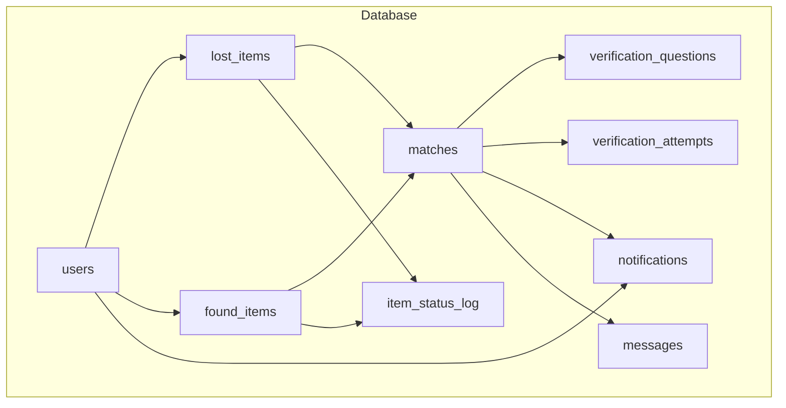
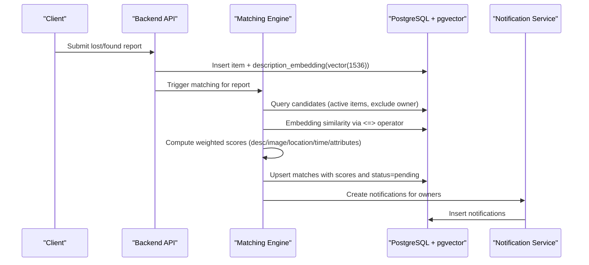
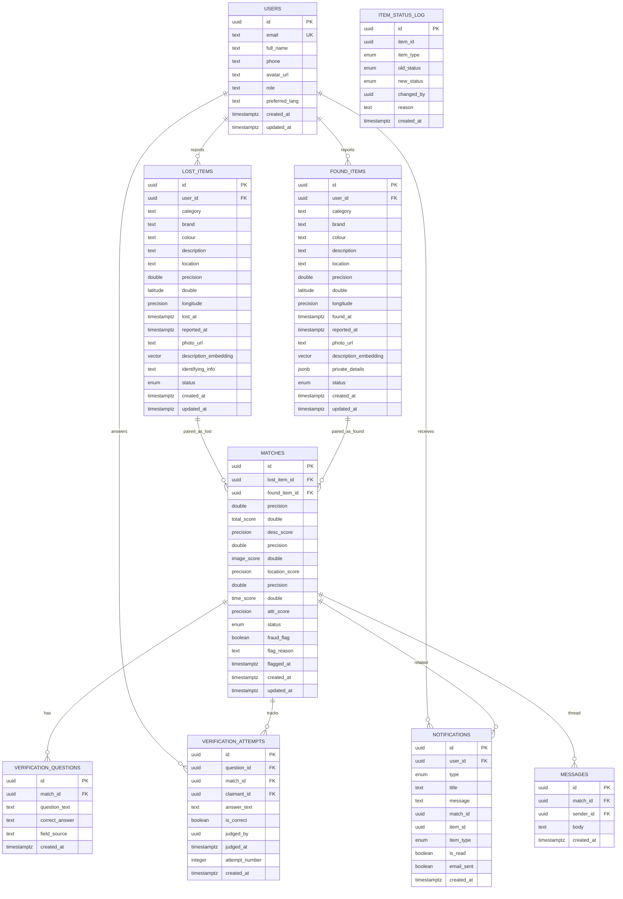
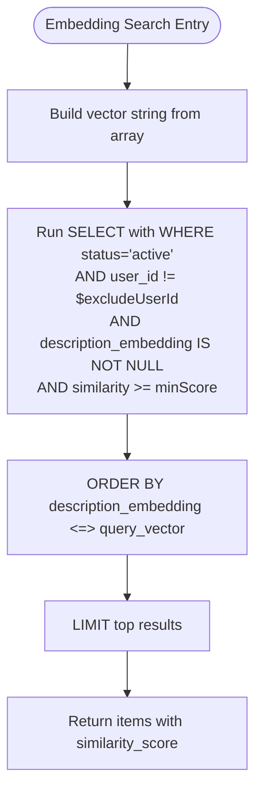
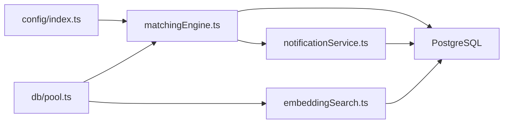

# Database Design

<cite>
**Referenced Files in This Document**
- [001_initial_schema.sql](file://supabase/migrations/001_initial_schema.sql)
- [002_messages.sql](file://supabase/migrations/002_messages.sql)
- [003_admin_fraud_flag.sql](file://supabase/migrations/003_admin_fraud_flag.sql)
- [SCHEMA_REFERENCE.md](file://SCHEMA_REFERENCE.md)
- [embeddingSearch.ts](file://backend/src/services/embeddingSearch.ts)
- [matchingEngine.ts](file://backend/src/services/matchingEngine.ts)
- [pool.ts](file://backend/src/db/pool.ts)
- [index.ts](file://backend/src/config/index.ts)
- [auth.ts](file://backend/src/middleware/auth.ts)
</cite>

## Table of Contents
1. [Introduction](#introduction)
2. [Project Structure](#project-structure)
3. [Core Components](#core-components)
4. [Architecture Overview](#architecture-overview)
5. [Detailed Component Analysis](#detailed-component-analysis)
6. [Dependency Analysis](#dependency-analysis)
7. [Performance Considerations](#performance-considerations)
8. [Troubleshooting Guide](#troubleshooting-guide)
9. [Conclusion](#conclusion)
10. [Appendices](#appendices)

## Introduction
This document describes the PostgreSQL database design for the Lost & Found AI Matcher system. It covers entity relationships, field definitions, constraints, business rules, pgvector integration for 1,536-dimension description embeddings, Row-Level Security policies, indexing strategies, query optimization techniques, data lifecycle and retention considerations, migration management practices, and security and privacy controls including sensitive field handling.

## Project Structure
The database schema is defined as SQL migrations under the supabase directory and is consumed by backend services that perform matching, embedding search, notifications, and messaging. The schema includes core entities (users, lost_items, found_items, matches, verification_questions, verification_attempts, notifications, item_status_log), plus messages added later. Vector similarity search uses pgvector with an IVFFlat index on description_embedding.

**Diagram sources**
- [001_initial_schema.sql:54-236](file://supabase/migrations/001_initial_schema.sql#L54-L236)
- [002_messages.sql:8-14](file://supabase/migrations/002_messages.sql#L8-L14)

**Section sources**
- [001_initial_schema.sql:1-370](file://supabase/migrations/001_initial_schema.sql#L1-L370)
- [002_messages.sql:1-53](file://supabase/migrations/002_messages.sql#L1-L53)
- [003_admin_fraud_flag.sql:1-13](file://supabase/migrations/003_admin_fraud_flag.sql#L1-L13)
- [SCHEMA_REFERENCE.md:1-205](file://SCHEMA_REFERENCE.md#L1-L205)

## Core Components
- users: Identity and profile table linked to Supabase auth.users; includes role and preferred language.
- lost_items: Reports of lost items with structured fields, location/time, media URL, identifying info, status, and a 1,536-dim vector embedding for semantic similarity.
- found_items: Reports of found items mirroring lost_items structure, with private_details JSONB used to generate verification questions.
- matches: Pairs a lost item with a found item, storing multi-criteria scores and match status; unique constraint prevents duplicate pairs.
- verification_questions: Questions generated from private_details to verify ownership.
- verification_attempts: Claimant answers and judgment records with retry tracking.
- notifications: Event-driven notifications for matches, verification, approvals/rejections, returns, and admin messages.
- item_status_log: Audit trail for item status transitions.
- messages: Threaded communication between parties after a match is approved.

Key constraints and enums:
- item_status: active, matched, verified, returned, closed
- report_type: lost, found
- verification_status: pending, question_sent, answered, correct, incorrect, escalated, approved
- match_status: pending, approved, rejected, disputed
- notification_type: new_match, verification_question, verification_result, match_approved, match_rejected, item_returned, admin_message

**Section sources**
- [001_initial_schema.sql:14-49](file://supabase/migrations/001_initial_schema.sql#L14-L49)
- [001_initial_schema.sql:54-236](file://supabase/migrations/001_initial_schema.sql#L54-L236)
- [SCHEMA_REFERENCE.md:7-16](file://SCHEMA_REFERENCE.md#L7-L16)

## Architecture Overview
The system integrates PostgreSQL with pgvector to enable semantic similarity search over item descriptions. Backend services compute or receive embeddings, store them in the vector column, and run cosine similarity queries using the native operator. A weighted matching engine combines description similarity, image similarity, location proximity, time proximity, and attribute overlap to produce candidate matches, which are persisted with detailed score breakdowns. Notifications and message threads support user workflows.

**Diagram sources**
- [embeddingSearch.ts:30-62](file://backend/src/services/embeddingSearch.ts#L30-L62)
- [matchingEngine.ts:37-188](file://backend/src/services/matchingEngine.ts#L37-L188)
- [001_initial_schema.sql:239-259](file://supabase/migrations/001_initial_schema.sql#L239-L259)

## Detailed Component Analysis

### Entity Relationship Model

**Diagram sources**
- [001_initial_schema.sql:54-236](file://supabase/migrations/001_initial_schema.sql#L54-L236)
- [002_messages.sql:8-14](file://supabase/migrations/002_messages.sql#L8-L14)
- [003_admin_fraud_flag.sql:6-12](file://supabase/migrations/003_admin_fraud_flag.sql#L6-L12)

### Field Definitions, Data Types, Constraints, and Business Rules

- users
  - Primary key: id (UUID) referencing auth.users(id) with cascade delete.
  - Unique email; role restricted to user/admin; preferred_lang restricted to en/ta/si.
  - Auto-updated timestamps via trigger.

- lost_items
  - Required: category, description, location, lost_at, status defaults to active.
  - Optional: brand, colour, lat/long, photo_url, identifying_info.
  - Internal: description_embedding vector(1536).
  - Status lifecycle managed by application logic; RLS restricts visibility to active for non-owners.

- found_items
  - Required: category, description, location, found_at, status defaults to active.
  - Optional: brand, colour, lat/long, photo_url.
  - Private details stored in JSONB for generating verification questions; not exposed publicly.
  - Internal: description_embedding vector(1536).

- matches
  - Unique constraint on (lost_item_id, found_item_id) prevents duplicates.
  - Scores: total_score (0–100), desc_score, image_score, location_score, time_score, attr_score.
  - Status: pending/approved/rejected/disputed.
  - Fraud flags: fraud_flag (boolean), flag_reason (text), flagged_at (timestamp) added for admin oversight.

- verification_questions
  - Tied to a match; stores question_text and correct_answer derived from private_details.

- verification_attempts
  - Tracks claimant answers, correctness judgment, judge identity, and attempt_number.

- notifications
  - Per-user notifications with type, title, message, optional links to match/item, read/email flags.

- item_status_log
  - Audit trail for status changes across items with actor and reason.

- messages
  - Threaded per match; sender_id references users; body length constrained; RLS ensures only approved match participants can read/write.

Business rules:
- Only active items are visible to the public; owners can manage their own items.
- Matches require both parties’ owners to be able to view; messages only allowed when match is approved.
- Verification flow uses private_details to create targeted questions; sensitive information is never used as verification content.

**Section sources**
- [001_initial_schema.sql:54-236](file://supabase/migrations/001_initial_schema.sql#L54-L236)
- [002_messages.sql:8-53](file://supabase/migrations/002_messages.sql#L8-L53)
- [003_admin_fraud_flag.sql:6-12](file://supabase/migrations/003_admin_fraud_flag.sql#L6-L12)
- [SCHEMA_REFERENCE.md:21-152](file://SCHEMA_REFERENCE.md#L21-L152)

### pgvector Integration and Similarity Search
- Extension: vector enabled for pgvector support.
- Columns: lost_items.description_embedding and found_items.description_embedding are vector(1536) for OpenAI embeddings.
- Indexing: ivfflat indexes on description_embedding using cosine operations with lists=100 for approximate nearest neighbor search.
- Queries: Cosine similarity computed via <=> operator; similarity percentage calculated as (1 - distance) * 100.
- Filtering: Active items only; exclude owner; minimum similarity threshold applied server-side.

**Diagram sources**
- [embeddingSearch.ts:30-62](file://backend/src/services/embeddingSearch.ts#L30-L62)
- [001_initial_schema.sql:239-249](file://supabase/migrations/001_initial_schema.sql#L239-L249)

**Section sources**
- [001_initial_schema.sql:6-9](file://supabase/migrations/001_initial_schema.sql#L6-L9)
- [001_initial_schema.sql:239-249](file://supabase/migrations/001_initial_schema.sql#L239-L249)
- [embeddingSearch.ts:30-100](file://backend/src/services/embeddingSearch.ts#L30-L100)

### Row-Level Security Policies
- Enabled on users, lost_items, found_items, matches, notifications, verification_questions, verification_attempts, and messages.
- Users can view/update their own profile.
- Public visibility limited to active items; owners can manage their own items fully.
- Notifications scoped to recipient user.
- Matches visible to owners of either related item.
- Messages restricted to participants of approved matches; insert checks enforce sender identity and match approval.

**Section sources**
- [001_initial_schema.sql:319-365](file://supabase/migrations/001_initial_schema.sql#L319-L365)
- [002_messages.sql:25-53](file://supabase/migrations/002_messages.sql#L25-L53)

### Indexing Strategies and Query Optimization
- B-tree indexes on frequently filtered columns:
  - lost_items: user_id, status, category
  - found_items: user_id, status, category
  - matches: lost_item_id, found_item_id, status, total_score DESC
  - notifications: user_id, is_read
  - verification_questions: match_id
  - verification_attempts: match_id
  - messages: match_id+created_at composite, sender_id
- Vector indexes:
  - ivfflat on description_embedding using cosine_ops with lists=100 for fast approximate similarity searches.
- Haversine function provided for location-based scoring; consider spatial indexes if switching to PostGIS for large datasets.
- Matching engine thresholds and weights configured centrally to control performance vs recall trade-offs.

**Section sources**
- [001_initial_schema.sql:239-259](file://supabase/migrations/001_initial_schema.sql#L239-L259)
- [002_messages.sql:17-21](file://supabase/migrations/002_messages.sql#L17-L21)
- [001_initial_schema.sql:297-316](file://supabase/migrations/001_initial_schema.sql#L297-L316)
- [index.ts:33-47](file://backend/src/config/index.ts#L33-L47)

### Data Lifecycle, Retention, and Archival
- Item lifecycle states: active → matched → verified → returned → closed.
- Status changes are audited via item_status_log.
- No explicit automated archival or retention policy is implemented in the schema; current approach relies on status transitions and manual/admin processes.
- Recommended practices:
  - Implement scheduled jobs to archive inactive/closed items older than a defined period into an archive schema or partitioned tables.
  - Add retention policies for messages and notifications (e.g., purge after X days unless referenced by active matches).
  - Use soft deletes where appropriate to preserve auditability while reducing live dataset size.

[No sources needed since this section provides general guidance based on observed schema behavior]

### Migration Management and Version Control
- Migrations are versioned SQL files under supabase/migrations:
  - 001_initial_schema.sql: Base schema, enums, indexes, triggers, functions, RLS.
  - 002_messages.sql: Adds messages table and RLS for secure messaging.
  - 003_admin_fraud_flag.sql: Adds fraud_flag, flag_reason, flagged_at and an index for flagged matches.
- Apply migrations through Supabase CLI or CI pipeline; ensure each migration is idempotent and backward-compatible.
- Maintain change logs and review process before merging migrations to production.

**Section sources**
- [001_initial_schema.sql:1-370](file://supabase/migrations/001_initial_schema.sql#L1-L370)
- [002_messages.sql:1-53](file://supabase/migrations/002_messages.sql#L1-L53)
- [003_admin_fraud_flag.sql:1-13](file://supabase/migrations/003_admin_fraud_flag.sql#L1-L13)

### Security, Privacy, and Access Control
- Authentication: JWT middleware validates tokens and attaches userId/userRole; admin checks validate role against the database.
- Authorization: RLS policies enforce row-level access; messages only accessible for approved matches; notifications scoped to recipients.
- Sensitive fields:
  - identifying_info (lost_items) and private_details (found_items) are marked private/internal and not exposed publicly; verification flow gates access until success.
  - Verification questions avoid sensitive data such as NIC numbers, passwords, or bank details.
- Storage: Photo URLs reference external storage buckets; ensure bucket policies restrict access appropriately.
- Connection security: Pool config enables SSL for non-local connections.

**Section sources**
- [auth.ts:22-58](file://backend/src/middleware/auth.ts#L22-L58)
- [001_initial_schema.sql:319-365](file://supabase/migrations/001_initial_schema.sql#L319-L365)
- [002_messages.sql:25-53](file://supabase/migrations/002_messages.sql#L25-L53)
- [pool.ts:9-25](file://backend/src/db/pool.ts#L9-L25)
- [README.md:100-115](file://README.md#L100-L115)

## Dependency Analysis
- Backend services depend on PostgreSQL via a connection pool; queries use parameterized statements to prevent injection.
- Matching engine orchestrates multiple similarity computations and persists results; it reads configuration for weights and thresholds.
- Notification service creates events tied to matches and items; RLS ensures users see only relevant notifications.
- Vector search leverages pgvector operators and indexes to perform efficient similarity calculations within the database.

**Diagram sources**
- [index.ts:33-47](file://backend/src/config/index.ts#L33-L47)
- [pool.ts:28-48](file://backend/src/db/pool.ts#L28-L48)
- [matchingEngine.ts:37-188](file://backend/src/services/matchingEngine.ts#L37-L188)
- [embeddingSearch.ts:30-100](file://backend/src/services/embeddingSearch.ts#L30-L100)

**Section sources**
- [matchingEngine.ts:37-188](file://backend/src/services/matchingEngine.ts#L37-L188)
- [embeddingSearch.ts:30-100](file://backend/src/services/embeddingSearch.ts#L30-L100)
- [pool.ts:28-48](file://backend/src/db/pool.ts#L28-L48)
- [index.ts:33-47](file://backend/src/config/index.ts#L33-L47)

## Performance Considerations
- Use ivfflat vector indexes tuned for workload size; adjust lists parameter based on cardinality and query patterns.
- Filter early in queries (status=user-specific exclusions) to reduce result sets before similarity computation.
- Configure matching thresholds and weights to balance recall and latency; higher thresholds reduce candidate processing.
- Consider batching embedding updates and re-indexing during off-peak hours.
- Monitor slow queries and add composite indexes where necessary (e.g., match_id+created_at for message threads).

[No sources needed since this section provides general guidance]

## Troubleshooting Guide
- Authentication failures: Check JWT validity and secret configuration; ensure middleware runs before protected routes.
- RLS denials: Verify policies allow intended actions; confirm user context (auth.uid()) resolves correctly in client-side calls.
- Vector search returns no results: Ensure embeddings exist and are not null; check minimum similarity threshold; validate ivfflat index usage.
- Duplicate matches: Confirm unique constraint on (lost_item_id, found_item_id); handle conflicts via upsert logic.
- Message access denied: Ensure match status is approved and both parties are recognized by RLS conditions.

**Section sources**
- [auth.ts:22-58](file://backend/src/middleware/auth.ts#L22-L58)
- [001_initial_schema.sql:319-365](file://supabase/migrations/001_initial_schema.sql#L319-L365)
- [002_messages.sql:25-53](file://supabase/migrations/002_messages.sql#L25-L53)
- [embeddingSearch.ts:30-100](file://backend/src/services/embeddingSearch.ts#L30-L100)

## Conclusion
The database design provides a robust foundation for a Lost & Found system with AI-powered matching. Entities are well-normalized with clear relationships, strong constraints, and comprehensive RLS policies. pgvector integration enables scalable semantic similarity search, while indexed fields and query filters optimize performance. Migrations are versioned and incremental, supporting safe evolution. Security and privacy are enforced at multiple layers, protecting sensitive fields and ensuring appropriate access control.

[No sources needed since this section summarizes without analyzing specific files]

## Appendices

### Configuration and Weights
- Matching weights and thresholds are centralized in configuration; they influence how candidates are scored and surfaced.
- Location radius and time window parameters tune similarity contributions.

**Section sources**
- [index.ts:33-47](file://backend/src/config/index.ts#L33-L47)