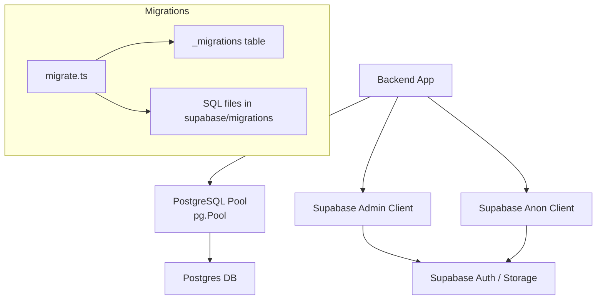
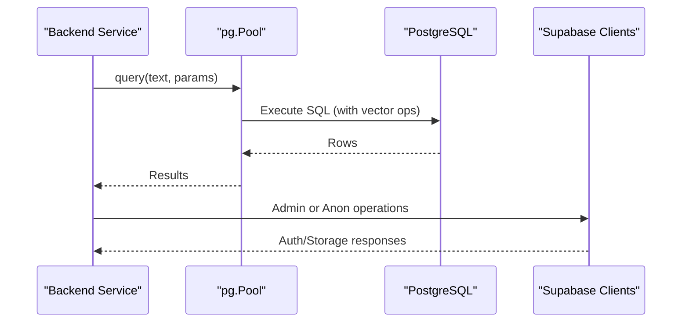
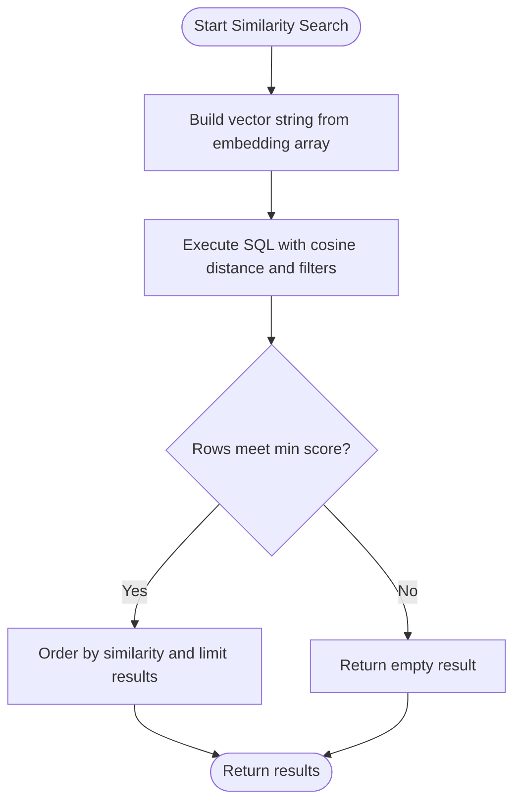
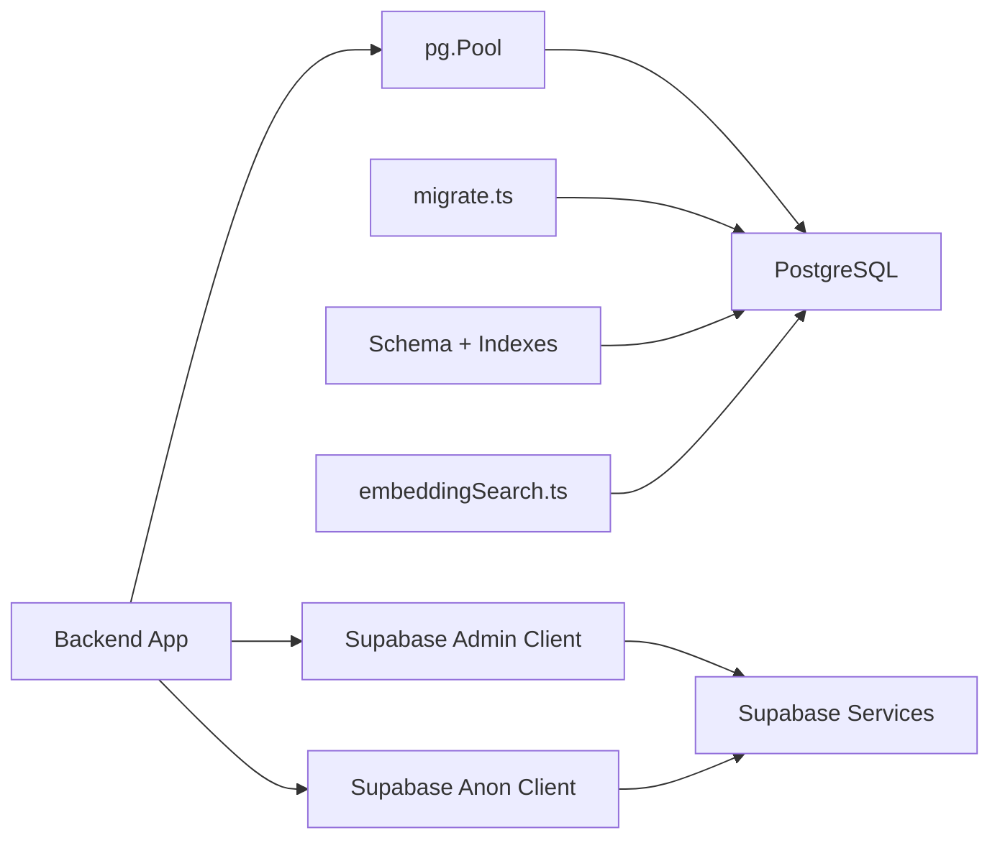

# Database Operations & Maintenance

<cite>
**Referenced Files in This Document**
- [pool.ts](file://backend/src/db/pool.ts)
- [supabase.ts](file://backend/src/db/supabase.ts)
- [migrate.ts](file://backend/src/db/migrate.ts)
- [001_initial_schema.sql](file://supabase/migrations/001_initial_schema.sql)
- [002_messages.sql](file://supabase/migrations/002_messages.sql)
- [003_admin_fraud_flag.sql](file://supabase/migrations/003_admin_fraud_flag.sql)
- [embeddingSearch.ts](file://backend/src/services/embeddingSearch.ts)
- [index.ts](file://backend/src/config/index.ts)
- [seed.ts](file://backend/src/db/seed.ts)
- [DEPLOYMENT.md](file://DEPLOYMENT.md)
- [render.yaml](file://render.yaml)
- [PERSON_B_HANDOFF.md](file://PERSON_B_HANDOFF.md)
- [errorHandler.ts](file://backend/src/middleware/errorHandler.ts)
</cite>

## Table of Contents
1. Introduction
2. Project Structure
3. Core Components
4. Architecture Overview
5. Detailed Component Analysis
6. Dependency Analysis
7. Performance Considerations
8. Troubleshooting Guide
9. Conclusion
10. Appendices

## Introduction
This document provides operational guidance for database management and maintenance in the Lost & Found AI Matcher system. It covers connection pooling with PostgreSQL, Supabase client configuration, migration management, version control practices, deployment procedures, indexing strategies (including ivfflat vector indexes), performance optimization, backup and recovery considerations, monitoring approaches, troubleshooting common issues, scaling considerations, query optimization, and production health maintenance.

## Project Structure
The database layer is implemented in the backend under src/db, with migrations stored under supabase/migrations. Configuration is centralized in src/config. The application uses a Node.js PostgreSQL pool for direct queries and Supabase clients for higher-level operations. Migrations are applied via a custom script that tracks applied files in a local tracking table.

**Diagram sources**
- [pool.ts:9-28](file://backend/src/db/pool.ts#L9-L28)
- [supabase.ts:8-20](file://backend/src/db/supabase.ts#L8-L20)
- [migrate.ts:5-46](file://backend/src/db/migrate.ts#L5-L46)
- [001_initial_schema.sql:6-9](file://supabase/migrations/001_initial_schema.sql#L6-L9)

**Section sources**
- [pool.ts:1-48](file://backend/src/db/pool.ts#L1-L48)
- [supabase.ts:1-21](file://backend/src/db/supabase.ts#L1-L21)
- [migrate.ts:1-53](file://backend/src/db/migrate.ts#L1-L53)
- [index.ts:6-18](file://backend/src/config/index.ts#L6-L18)

## Core Components
- PostgreSQL connection pool: Configured from DATABASE_URL with SSL handling for non-local hosts, max pool size, idle/connection timeouts, and error logging.
- Supabase clients: Admin client (service role key) bypasses Row Level Security; anon client respects RLS for user-scoped operations.
- Migration runner: Reads SQL files from supabase/migrations, applies them in order, and records applied migrations in a _migrations table to ensure idempotency.
- Vector similarity search: Uses pgvector cosine distance operator with ivfflat indexes on embedding columns for fast approximate nearest neighbor searches.
- Seeding utilities: Create an admin user and sample items to bootstrap environments.

**Section sources**
- [pool.ts:9-48](file://backend/src/db/pool.ts#L9-L48)
- [supabase.ts:1-21](file://backend/src/db/supabase.ts#L1-L21)
- [migrate.ts:5-46](file://backend/src/db/migrate.ts#L5-L46)
- [embeddingSearch.ts:20-62](file://backend/src/services/embeddingSearch.ts#L20-L62)
- [seed.ts:4-70](file://backend/src/db/seed.ts#L4-L70)

## Architecture Overview
The backend connects to PostgreSQL via a pooled client and interacts with Supabase services. Migrations evolve schema and enable extensions like pgvector. Vector similarity queries run inside Postgres using ivfflat indexes.

**Diagram sources**
- [pool.ts:34-48](file://backend/src/db/pool.ts#L34-L48)
- [supabase.ts:8-20](file://backend/src/db/supabase.ts#L8-L20)
- [embeddingSearch.ts:30-62](file://backend/src/services/embeddingSearch.ts#L30-L62)

## Detailed Component Analysis

### Connection Pooling and SSL Handling
- Parses DATABASE_URL into host, port, user, password, database, and ssl options.
- Enables SSL for non-local hosts with servername set to hostname.
- Pool limits: max connections, idle timeout, connection timeout.
- Error listener logs unexpected pool errors.

Operational notes:
- Ensure DATABASE_URL points to the correct Supabase session pooler endpoint and includes proper credentials.
- Validate network reachability and DNS resolution for pooler hosts.
- Monitor pool utilization and adjust max if needed based on workload.

**Section sources**
- [pool.ts:9-32](file://backend/src/db/pool.ts#L9-L32)

### Supabase Client Setup
- Admin client created with service role key for server-side operations that bypass RLS.
- Anon client created with anon key for user-scoped operations respecting RLS.

Operational notes:
- Keep SUPABASE_SERVICE_ROLE_KEY secret and only use it server-side.
- Use anon client for any operation that should respect user permissions.

**Section sources**
- [supabase.ts:1-21](file://backend/src/db/supabase.ts#L1-L21)
- [index.ts:11-15](file://backend/src/config/index.ts#L11-L15)

### Migration Management and Version Control
- Migration runner reads all .sql files from supabase/migrations, sorts them, and applies each once.
- Tracks applied migrations in a _migrations table with filename and timestamp.
- Idempotent execution: already-applied migrations are skipped.

Version control practices:
- Name migrations with numeric prefixes to enforce ordering.
- Keep each migration focused and reversible where possible.
- After applying migrations, verify _migrations table reflects expected state.

Deployment procedure:
- Run migrations before starting the service or as part of CI/CD pipeline.
- Confirm all migrations are recorded and no failures occurred.

**Section sources**
- [migrate.ts:5-46](file://backend/src/db/migrate.ts#L5-L46)
- [DEPLOYMENT.md:35-57](file://DEPLOYMENT.md#L35-L57)

### Schema, Extensions, and Indexing Strategy
- Extensions enabled: uuid-ossp, vector (pgvector), pg_trgm.
- Core tables include users, lost_items, found_items, matches, verification_questions, verification_attempts, notifications, item_status_log, messages.
- Indexes:
  - Standard B-tree indexes on frequently filtered columns (user_id, status, category).
  - ivfflat indexes on description_embedding using vector_cosine_ops with lists = 100 for approximate nearest neighbor search.
  - Additional indexes for matches, notifications, verification entities, and messages.

Index tuning guidance:
- Adjust ivfflat lists parameter based on dataset size and latency requirements.
- Monitor index usage and consider re-indexing after large data loads.
- Combine filters (status, user_id) with vector queries to reduce scan scope.

**Section sources**
- [001_initial_schema.sql:6-9](file://supabase/migrations/001_initial_schema.sql#L6-L9)
- [001_initial_schema.sql:239-259](file://supabase/migrations/001_initial_schema.sql#L239-L259)
- [002_messages.sql:18-20](file://supabase/migrations/002_messages.sql#L18-L20)
- [003_admin_fraud_flag.sql:11-12](file://supabase/migrations/003_admin_fraud_flag.sql#L11-L12)

### Vector Similarity Search Workflow
- Embeddings are stored in vector(1536) columns.
- Queries compute cosine similarity using pgvector’s <=> operator and filter by minimum threshold.
- Results are ordered by similarity and limited to top N.

Performance characteristics:
- Runs entirely within PostgreSQL, minimizing data transfer.
- ivfflat index accelerates approximate nearest neighbor search.

**Diagram sources**
- [embeddingSearch.ts:30-62](file://backend/src/services/embeddingSearch.ts#L30-L62)
- [embeddingSearch.ts:68-100](file://backend/src/services/embeddingSearch.ts#L68-L100)

**Section sources**
- [embeddingSearch.ts:1-101](file://backend/src/services/embeddingSearch.ts#L1-L101)

### Seeding and Test Data
- Creates or reuses an admin user in Supabase Auth and ensures a corresponding row in public.users with role 'admin'.
- Inserts sample lost and found items to exercise matching and messaging flows.

Operational notes:
- Use seeding scripts in development or staging to validate features.
- Avoid committing secrets; rely on environment variables for credentials.

**Section sources**
- [seed.ts:4-70](file://backend/src/db/seed.ts#L4-L70)

### Deployment and Environment Configuration
- Backend deployed to Render using render.yaml blueprint.
- Frontend deployed to Vercel with framework auto-detection.
- Environment variables include Supabase URL and keys, DATABASE_URL, OpenAI API key, Resend API key, JWT secret, and frontend URLs for CORS.

Post-deploy checks:
- Health endpoint returns ok.
- Verify sign-up flow and email delivery.

**Section sources**
- [render.yaml:1-54](file://render.yaml#L1-L54)
- [DEPLOYMENT.md:59-98](file://DEPLOYMENT.md#L59-L98)

## Dependency Analysis
Key dependencies and relationships:
- Backend depends on pg for connection pooling and querying PostgreSQL.
- Supabase clients depend on configured URL and keys for authentication and access control.
- Migrations depend on the presence of required extensions and define indexes used by application queries.
- Vector search depends on pgvector extension and ivfflat indexes.

**Diagram sources**
- [pool.ts:1-28](file://backend/src/db/pool.ts#L1-L28)
- [supabase.ts:1-21](file://backend/src/db/supabase.ts#L1-L21)
- [migrate.ts:1-46](file://backend/src/db/migrate.ts#L1-L46)
- [embeddingSearch.ts:1-62](file://backend/src/services/embeddingSearch.ts#L1-L62)
- [001_initial_schema.sql:6-9](file://supabase/migrations/001_initial_schema.sql#L6-L9)

**Section sources**
- [pool.ts:1-48](file://backend/src/db/pool.ts#L1-L48)
- [supabase.ts:1-21](file://backend/src/db/supabase.ts#L1-L21)
- [migrate.ts:1-53](file://backend/src/db/migrate.ts#L1-L53)
- [embeddingSearch.ts:1-101](file://backend/src/services/embeddingSearch.ts#L1-L101)
- [001_initial_schema.sql:6-9](file://supabase/migrations/001_initial_schema.sql#L6-L9)

## Performance Considerations
- Use ivfflat indexes for vector similarity search; tune lists parameter based on dataset size and latency targets.
- Filter early with status and user_id to reduce candidate sets before vector comparison.
- Limit result sets with LIMIT to minimize payload and processing overhead.
- Monitor query plans for vector queries to ensure index usage.
- Tune pool.max based on concurrent request volume and database capacity.
- Avoid unnecessary joins in hot paths; precompute scores when feasible.

[No sources needed since this section provides general guidance]

## Troubleshooting Guide
Common issues and resolutions:
- Connection timeouts to Supabase pooler:
  - Verify DATABASE_URL points to the correct region/host and port.
  - Check network/DNS resolution and firewall rules.
  - Review tested endpoints and parameters documented in handoff notes.
- Migrations fail or skip unexpectedly:
  - Inspect _migrations table to confirm which files were applied.
  - Re-run migration script and review console output for errors.
- Unexpected errors in requests:
  - Centralized error handler logs unhandled errors and returns standardized error responses.
  - File upload errors are mapped to user-friendly messages.

Operational checks:
- Confirm health endpoint responds successfully post-deploy.
- Validate environment variables are set correctly in Render/Vercel dashboards.

**Section sources**
- [PERSON_B_HANDOFF.md:80-106](file://PERSON_B_HANDOFF.md#L80-L106)
- [migrate.ts:49-52](file://backend/src/db/migrate.ts#L49-L52)
- [errorHandler.ts:16-47](file://backend/src/middleware/errorHandler.ts#L16-L47)

## Conclusion
The system implements robust database operations using a PostgreSQL connection pool, Supabase clients, and a migration-driven schema evolution process. Vector similarity search leverages pgvector and ivfflat indexes for efficient approximate nearest neighbor queries. Operational best practices include careful environment configuration, disciplined migration versioning, performance tuning of indexes and pools, and proactive monitoring and troubleshooting. Following these guidelines will help maintain database health and reliability in production.

[No sources needed since this section summarizes without analyzing specific files]

## Appendices

### Backup and Recovery Procedures
- Use Supabase-provided backups and point-in-time recovery capabilities for the managed Postgres instance.
- Schedule regular automated backups and retain according to compliance needs.
- Test restore procedures periodically to ensure data integrity and recovery time objectives.
- For critical data, export snapshots of key tables (e.g., users, lost_items, found_items, matches) to external storage as an additional safeguard.

[No sources needed since this section provides general guidance]

### Monitoring Approaches
- Enable database-level metrics and slow query logs to identify performance bottlenecks.
- Monitor connection pool utilization and error rates from the application logs.
- Track vector index usage and cardinality estimates to ensure optimal performance.
- Set up alerts for migration failures, connection timeouts, and unexpected errors.

[No sources needed since this section provides general guidance]

### Scaling Considerations
- Scale horizontally by increasing application replicas behind a load balancer while keeping database resources appropriately sized.
- Adjust pool.max to match concurrency and database capacity; avoid over-provisioning.
- Consider read replicas for read-heavy workloads if supported by your hosting provider.
- Periodically review and update ivfflat index parameters as data grows.

[No sources needed since this section provides general guidance]

### Query Optimization Tips
- Prefer filtering by status and user_id before vector comparisons to reduce candidate sets.
- Use LIMIT to constrain result sizes.
- Ensure appropriate indexes exist for frequent filters and joins.
- Analyze query plans for complex queries involving vector operators and joins.

[No sources needed since this section provides general guidance]