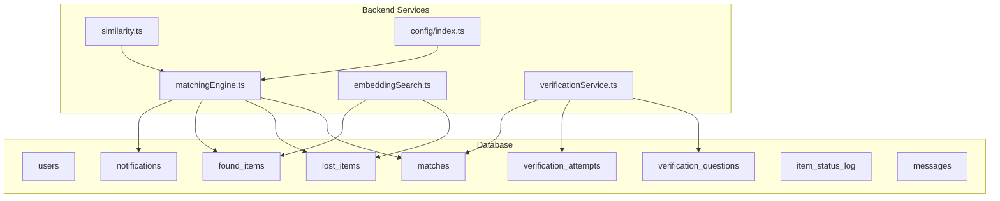
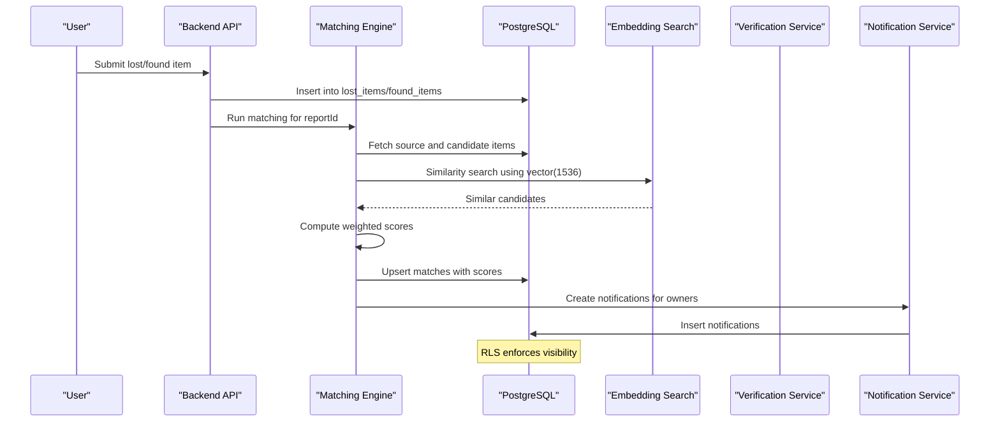
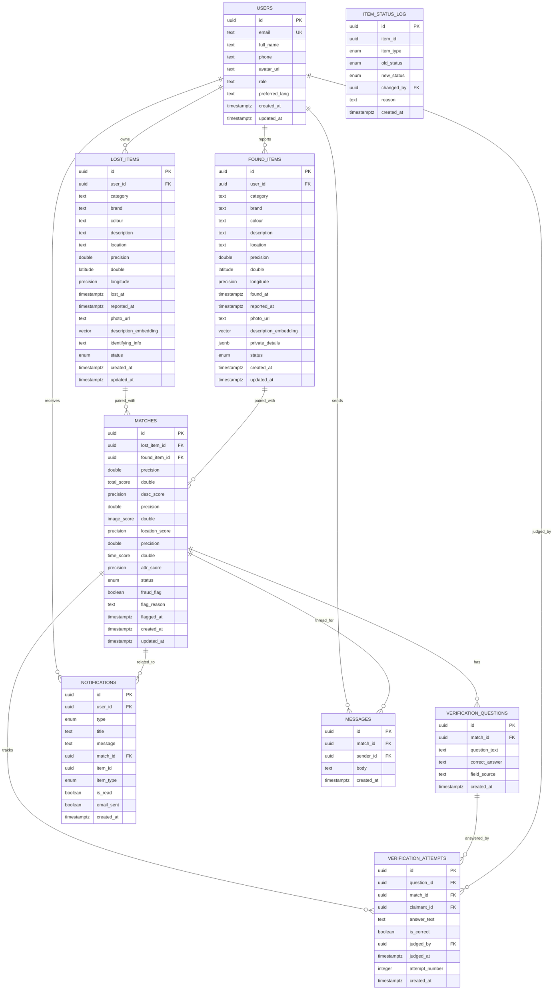
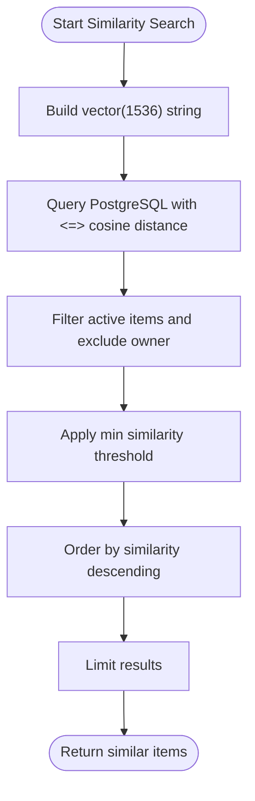
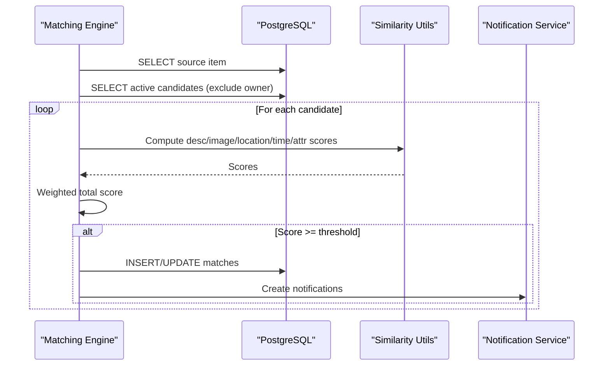
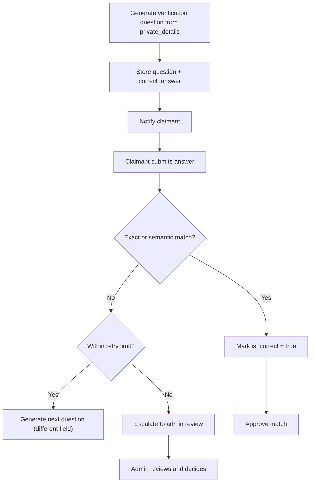
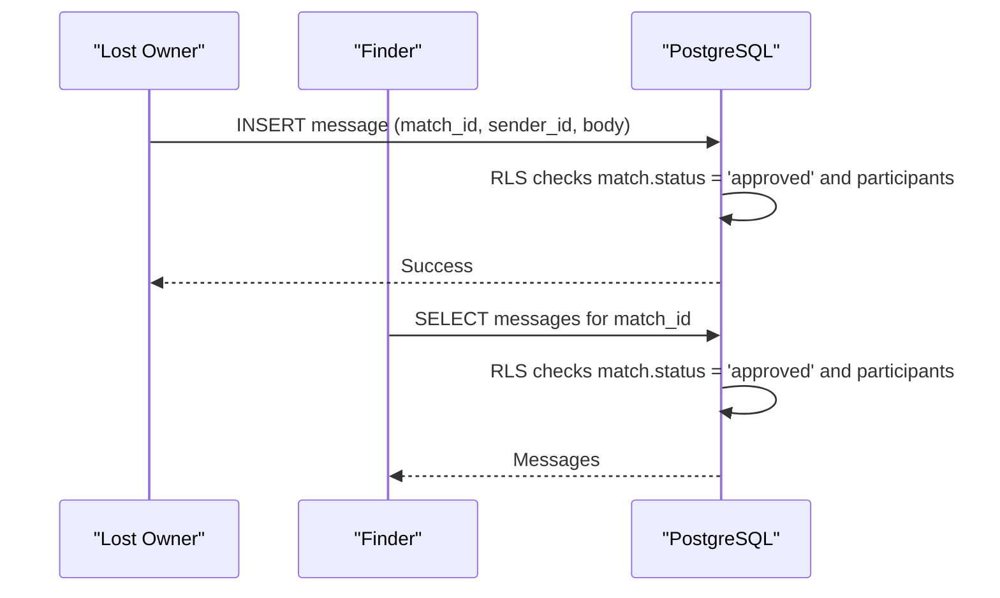
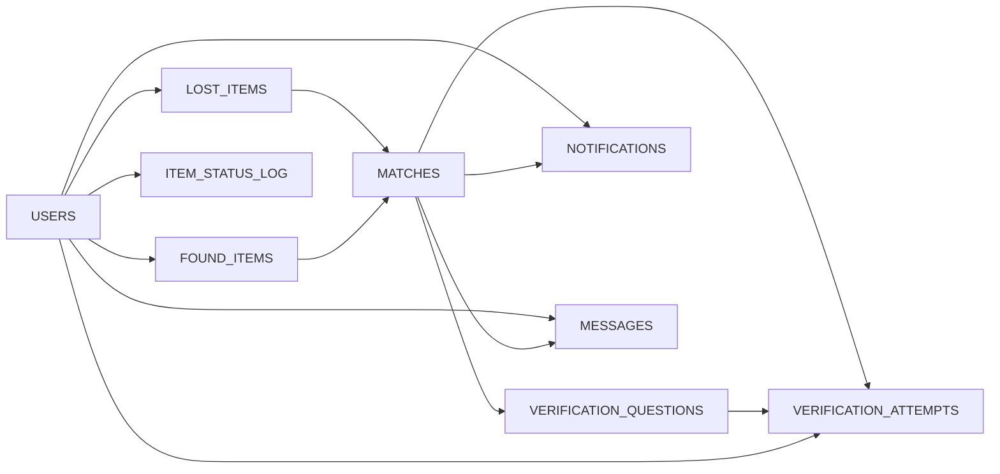

# Database Schema

<cite>
**Referenced Files in This Document**
- [001_initial_schema.sql](file://supabase/migrations/001_initial_schema.sql)
- [002_messages.sql](file://supabase/migrations/002_messages.sql)
- [003_admin_fraud_flag.sql](file://supabase/migrations/003_admin_fraud_flag.sql)
- [SCHEMA_REFERENCE.md](file://SCHEMA_REFERENCE.md)
- [matchingEngine.ts](file://backend/src/services/matchingEngine.ts)
- [embeddingSearch.ts](file://backend/src/services/embeddingSearch.ts)
- [verificationService.ts](file://backend/src/services/verificationService.ts)
- [similarity.ts](file://backend/src/utils/similarity.ts)
- [config/index.ts](file://backend/src/config/index.ts)
</cite>

## Table of Contents
1. Introduction
2. Project Structure
3. Core Components
4. Architecture Overview
5. Detailed Component Analysis
6. Dependency Analysis
7. Performance Considerations
8. Troubleshooting Guide
9. Conclusion
10. Appendices

## Introduction
This document provides comprehensive data model documentation for the PostgreSQL database schema that powers the Lost & Found AI Matcher. It details all core entities, field definitions, data types, constraints, business rules, and relationships. It also documents enum types, pgvector integration for 1,536-dimension description embeddings used in AI-powered similarity search, and how the schema supports the end-to-end lost-and-found matching workflow.

## Project Structure
The database schema is defined through Supabase migrations and extended by application services that read/write to these tables. The primary schema is created in the initial migration, with subsequent migrations adding messaging and admin fraud-flagging capabilities. Application code uses the schema for matching, verification, notifications, and embedding-based similarity search.

**Diagram sources**
- [001_initial_schema.sql:54-236](file://supabase/migrations/001_initial_schema.sql#L54-L236)
- [002_messages.sql:8-14](file://supabase/migrations/002_messages.sql#L8-L14)
- [matchingEngine.ts:37-188](file://backend/src/services/matchingEngine.ts#L37-L188)
- [embeddingSearch.ts:30-100](file://backend/src/services/embeddingSearch.ts#L30-L100)
- [verificationService.ts:15-123](file://backend/src/services/verificationService.ts#L15-L123)
- [similarity.ts:4-82](file://backend/src/utils/similarity.ts#L4-L82)
- [config/index.ts:33-47](file://backend/src/config/index.ts#L33-L47)

**Section sources**
- [001_initial_schema.sql:1-370](file://supabase/migrations/001_initial_schema.sql#L1-L370)
- [002_messages.sql:1-53](file://supabase/migrations/002_messages.sql#L1-L53)
- [003_admin_fraud_flag.sql:1-13](file://supabase/migrations/003_admin_fraud_flag.sql#L1-L13)

## Core Components
This section summarizes each table’s purpose, key fields, constraints, and business rules.

- users
  - Purpose: User profiles extending Supabase auth.users.
  - Key fields: id (PK), email (unique), full_name, phone, avatar_url, role (user/admin), preferred_lang (en/ta/si), timestamps.
  - Constraints: Role and language restricted via CHECK; unique email.
  - Business rules: Auto-created on auth signup; RLS policies restrict access to own profile.

- lost_items
  - Purpose: Reports of lost items.
  - Key fields: id (PK), user_id (FK → users), category, brand, colour, description, location, latitude, longitude, lost_at, reported_at, photo_url, description_embedding (vector(1536)), identifying_info (private), status (enum), timestamps.
  - Constraints: Status defaults to active; indexes for performance and vector similarity.
  - Business rules: Only active items visible publicly; private identifying info shown only after verification.

- found_items
  - Purpose: Reports of found items.
  - Key fields: id (PK), user_id (FK → users), category, brand, colour, description, location, latitude, longitude, found_at, reported_at, photo_url, description_embedding (vector(1536)), private_details (JSONB), status (enum), timestamps.
  - Constraints: Status defaults to active; indexes for performance and vector similarity.
  - Business rules: Private details hidden from public view; used to generate verification questions.

- matches
  - Purpose: Pairs a lost item with a found item and stores scoring breakdown.
  - Key fields: id (PK), lost_item_id (FK → lost_items), found_item_id (FK → found_items), total_score, desc_score, image_score, location_score, time_score, attr_score, status (enum), timestamps, fraud_flag, flag_reason, flagged_at.
  - Constraints: Unique pair constraint (lost_item_id, found_item_id); status defaults to pending.
  - Business rules: Scores computed by matching engine; admin can flag matches.

- verification_questions
  - Purpose: Questions generated from private details to verify ownership.
  - Key fields: id (PK), match_id (FK → matches), question_text, correct_answer, field_source, created_at.
  - Constraints: Linked to a specific match.
  - Business rules: Correct answer stored privately; question text exposed to claimant.

- verification_attempts
  - Purpose: Records of claimant answers and judgments.
  - Key fields: id (PK), question_id (FK → verification_questions), match_id (FK → matches), claimant_id (FK → users), answer_text, is_correct (nullable until judged), judged_by (FK → users), judged_at, attempt_number, created_at.
  - Constraints: Tracks attempts per question; nullable correctness until judgment.
  - Business rules: Supports retries and escalation to admin when max attempts exceeded.

- notifications
  - Purpose: In-app notifications for events like new matches, verification results, approvals/rejections, returns, and admin messages.
  - Key fields: id (PK), user_id (FK → users), type (enum), title, message, match_id (FK → matches), item_id (UUID), item_type (enum), is_read, email_sent, created_at.
  - Constraints: Read state and email dispatch flags.
  - Business rules: Users see only their own notifications via RLS.

- item_status_log
  - Purpose: Audit trail for status changes on items.
  - Key fields: id (PK), item_id (UUID), item_type (enum), old_status (enum), new_status (enum), changed_by (FK → users), reason, created_at.
  - Constraints: Polymorphic reference to either lost or found item via item_type.
  - Business rules: Captures who changed status and why.

- messages
  - Purpose: Secure messaging between parties of an approved match.
  - Key fields: id (PK), match_id (FK → matches), sender_id (FK → users), body (TEXT with length check), created_at.
  - Constraints: Body length constrained; indexed by match and sender.
  - Business rules: Only participants of an approved match can read/send messages via RLS.

**Section sources**
- [001_initial_schema.sql:54-236](file://supabase/migrations/001_initial_schema.sql#L54-L236)
- [002_messages.sql:8-14](file://supabase/migrations/002_messages.sql#L8-L14)
- [003_admin_fraud_flag.sql:5-12](file://supabase/migrations/003_admin_fraud_flag.sql#L5-L12)
- [SCHEMA_REFERENCE.md:21-151](file://SCHEMA_REFERENCE.md#L21-L151)

## Architecture Overview
The schema supports a complete lost-and-found workflow:
- Users report lost or found items with structured attributes and optional media.
- AI-generated embeddings enable semantic similarity search across descriptions.
- Matching engine computes weighted scores across description, image, location, time, and attributes.
- Matches are created and scored; verification questions ensure secure contact exchange.
- Notifications inform users of progress; messages allow communication post-approval.
- Status logs provide auditability for item lifecycle.

**Diagram sources**
- [matchingEngine.ts:37-188](file://backend/src/services/matchingEngine.ts#L37-L188)
- [embeddingSearch.ts:30-100](file://backend/src/services/embeddingSearch.ts#L30-L100)
- [001_initial_schema.sql:238-259](file://supabase/migrations/001_initial_schema.sql#L238-L259)
- [001_initial_schema.sql:318-365](file://supabase/migrations/001_initial_schema.sql#L318-L365)

## Detailed Component Analysis

### Enum Types
- item_status: active, matched, verified, returned, closed
- report_type: lost, found
- verification_status: pending, question_sent, answered, correct, incorrect, escalated, approved
- match_status: pending, approved, rejected, disputed
- notification_type: new_match, verification_question, verification_result, match_approved, match_rejected, item_returned, admin_message

These enums constrain values for columns across multiple tables to enforce consistent state transitions and categorization.

**Section sources**
- [001_initial_schema.sql:14-49](file://supabase/migrations/001_initial_schema.sql#L14-L49)
- [SCHEMA_REFERENCE.md:7-15](file://SCHEMA_REFERENCE.md#L7-L15)

### Entity Relationships and Foreign Keys
- users
  - PK: id
  - Referenced by: lost_items.user_id, found_items.user_id, verification_attempts.claimant_id, verification_attempts.judged_by, notifications.user_id, item_status_log.changed_by, messages.sender_id
- lost_items
  - PK: id
  - Referenced by: matches.lost_item_id
- found_items
  - PK: id
  - Referenced by: matches.found_item_id
- matches
  - PK: id
  - Referenced by: verification_questions.match_id, verification_attempts.match_id, notifications.match_id, messages.match_id
- verification_questions
  - PK: id
  - Referenced by: verification_attempts.question_id
- notifications
  - PK: id
  - Optional references: item_id (polymorphic via item_type)
- item_status_log
  - PK: id
  - Optional references: item_id (polymorphic via item_type)

**Diagram sources**
- [001_initial_schema.sql:54-236](file://supabase/migrations/001_initial_schema.sql#L54-L236)
- [002_messages.sql:8-14](file://supabase/migrations/002_messages.sql#L8-L14)
- [003_admin_fraud_flag.sql:5-12](file://supabase/migrations/003_admin_fraud_flag.sql#L5-L12)

**Section sources**
- [001_initial_schema.sql:54-236](file://supabase/migrations/001_initial_schema.sql#L54-L236)
- [002_messages.sql:8-14](file://supabase/migrations/002_messages.sql#L8-L14)
- [003_admin_fraud_flag.sql:5-12](file://supabase/migrations/003_admin_fraud_flag.sql#L5-L12)

### pgvector Integration for 1,536-Dimension Embeddings
- Both lost_items and found_items store description_embedding as vector(1536).
- Indexes use ivfflat with cosine operations for efficient similarity search.
- Backend queries compute cosine similarity directly in PostgreSQL using the <=> operator and filter by minimum similarity thresholds.
- Matching engine falls back to simple text overlap if embeddings are missing.

**Diagram sources**
- [embeddingSearch.ts:30-100](file://backend/src/services/embeddingSearch.ts#L30-L100)
- [001_initial_schema.sql:241-249](file://supabase/migrations/001_initial_schema.sql#L241-L249)

**Section sources**
- [embeddingSearch.ts:30-100](file://backend/src/services/embeddingSearch.ts#L30-L100)
- [001_initial_schema.sql:241-249](file://supabase/migrations/001_initial_schema.sql#L241-L249)

### Matching Workflow and Scoring
- The matching engine fetches a source item and all active candidates from the opposing table, excluding same-owner items.
- Scores are computed for:
  - Description similarity via embeddings (cosine) or fallback text overlap.
  - Image similarity when both items have photos.
  - Location proximity using Haversine distance converted to a similarity score.
  - Time proximity within configured windows.
  - Attribute similarity across category, brand, and colour.
- Total score is a weighted sum based on configuration weights.
- Matches above the threshold are upserted with status set to pending.
- Notifications are created for both owners.

**Diagram sources**
- [matchingEngine.ts:37-188](file://backend/src/services/matchingEngine.ts#L37-L188)
- [similarity.ts:4-82](file://backend/src/utils/similarity.ts#L4-L82)
- [config/index.ts:33-47](file://backend/src/config/index.ts#L33-L47)

**Section sources**
- [matchingEngine.ts:37-188](file://backend/src/services/matchingEngine.ts#L37-L188)
- [similarity.ts:4-82](file://backend/src/utils/similarity.ts#L4-L82)
- [config/index.ts:33-47](file://backend/src/config/index.ts#L33-L47)

### Verification Workflow
- Verification questions are generated from private_details using an LLM to produce natural-sounding questions tied to a specific attribute.
- Correct answers are stored securely in verification_questions.
- Claimants submit answers recorded in verification_attempts; correctness is determined via exact match or LLM semantic comparison.
- Attempts are tracked with attempt_number; escalation occurs when max retries are exceeded.

**Diagram sources**
- [verificationService.ts:15-123](file://backend/src/services/verificationService.ts#L15-L123)
- [001_initial_schema.sql:168-199](file://supabase/migrations/001_initial_schema.sql#L168-L199)

**Section sources**
- [verificationService.ts:15-123](file://backend/src/services/verificationService.ts#L15-L123)
- [001_initial_schema.sql:168-199](file://supabase/migrations/001_initial_schema.sql#L168-L199)

### Messaging for Approved Matches
- Messages are scoped to matches with status approved.
- RLS ensures only participants of the approved match can read or send messages.
- Body length is constrained to prevent abuse.

**Diagram sources**
- [002_messages.sql:8-53](file://supabase/migrations/002_messages.sql#L8-L53)

**Section sources**
- [002_messages.sql:8-53](file://supabase/migrations/002_messages.sql#L8-L53)

### Security and Access Control
- Row Level Security (RLS) policies control visibility:
  - Users can view/update their own profile.
  - Active items are publicly visible; owners manage their own items.
  - Notifications are user-scoped.
  - Matches are visible to item owners.
  - Messages are restricted to participants of approved matches.
- Triggers auto-update updated_at timestamps on relevant tables.
- Helper functions include haversine_km for distance calculations.

**Section sources**
- [001_initial_schema.sql:261-365](file://supabase/migrations/001_initial_schema.sql#L261-L365)

## Dependency Analysis
- Tables depend on users for identity and permissions.
- Matches depend on both lost_items and found_items to establish pairs.
- Verification flow depends on matches and users for claimants and judges.
- Notifications depend on users and optionally matches/items for context.
- Messages depend on matches and users for secure communication.
- Item status log depends on users and polymorphically on items for audit trails.

**Diagram sources**
- [001_initial_schema.sql:54-236](file://supabase/migrations/001_initial_schema.sql#L54-L236)
- [002_messages.sql:8-14](file://supabase/migrations/002_messages.sql#L8-L14)
- [003_admin_fraud_flag.sql:5-12](file://supabase/migrations/003_admin_fraud_flag.sql#L5-L12)

**Section sources**
- [001_initial_schema.sql:54-236](file://supabase/migrations/001_initial_schema.sql#L54-L236)
- [002_messages.sql:8-14](file://supabase/migrations/002_messages.sql#L8-L14)
- [003_admin_fraud_flag.sql:5-12](file://supabase/migrations/003_admin_fraud_flag.sql#L5-L12)

## Performance Considerations
- Vector indexes (ivfflat) optimize cosine similarity searches on description_embedding.
- Composite and single-column indexes accelerate lookups by user, status, category, and match relations.
- Matching engine filters candidates early (active status, different owner) to reduce computation.
- Configurable thresholds (minScoreThreshold, locationRadiusKm, timeWindowHours) tune performance vs. recall trade-offs.
- RLS policies minimize data exposure and reduce payload sizes for clients.

[No sources needed since this section provides general guidance]

## Troubleshooting Guide
- Missing embeddings: Matching engine falls back to text overlap; ensure embeddings are populated for optimal results.
- No matches found: Check active status, user exclusion, and similarity thresholds; adjust config weights and thresholds as needed.
- Verification failures: Ensure private_details contain sufficient fields; verify LLM availability for question generation and answer evaluation.
- Message access denied: Confirm match status is approved and both parties are participants; review RLS policies.
- Fraud flags: Use admin tools to review flagged matches; leverage flag_reason and flagged_at for auditing.

**Section sources**
- [matchingEngine.ts:83-146](file://backend/src/services/matchingEngine.ts#L83-L146)
- [verificationService.ts:15-123](file://backend/src/services/verificationService.ts#L15-L123)
- [002_messages.sql:27-53](file://supabase/migrations/002_messages.sql#L27-L53)
- [003_admin_fraud_flag.sql:5-12](file://supabase/migrations/003_admin_fraud_flag.sql#L5-L12)

## Conclusion
The PostgreSQL schema provides a robust foundation for the Lost & Found AI Matcher, supporting AI-driven similarity search, secure verification, and transparent workflows. Enums enforce consistent states, foreign keys maintain referential integrity, and RLS policies ensure data security. The integration of pgvector enables scalable semantic matching, while the matching engine’s configurable scoring balances multiple factors to surface high-quality matches.

[No sources needed since this section summarizes without analyzing specific files]

## Appendices

### Configuration Parameters Influencing Schema Usage
- Matching weights: description (0.30), image (0.25), location (0.20), time (0.15), attributes (0.10)
- Thresholds: minScoreThreshold (40%), locationRadiusKm (5), timeWindowHours (72)
- Max retries for verification: 2

**Section sources**
- [config/index.ts:33-47](file://backend/src/config/index.ts#L33-L47)