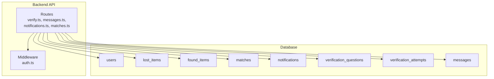
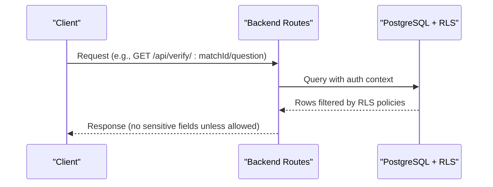
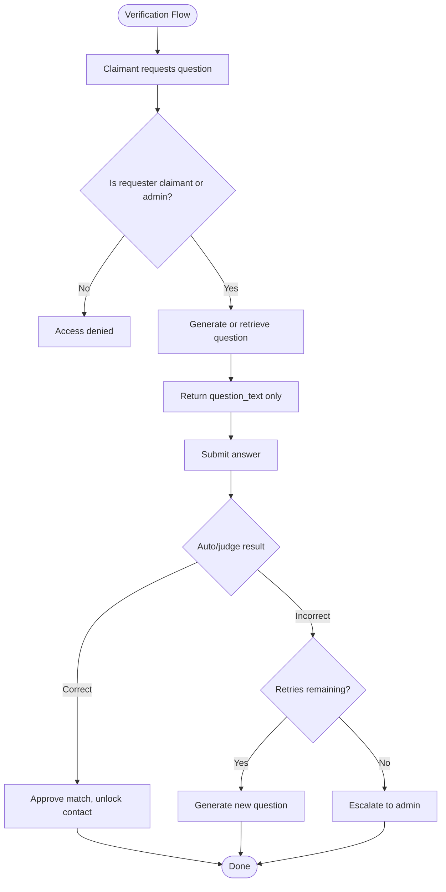
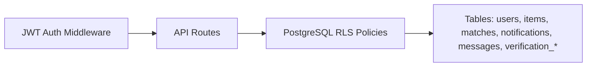

# Row-Level Security Policies

<cite>
**Referenced Files in This Document**
- [001_initial_schema.sql](file://supabase/migrations/001_initial_schema.sql)
- [002_messages.sql](file://supabase/migrations/002_messages.sql)
- [003_admin_fraud_flag.sql](file://supabase/migrations/003_admin_fraud_flag.sql)
- [verificationService.ts](file://backend/src/services/verificationService.ts)
- [verify.ts](file://backend/src/routes/verify.ts)
- [messages.ts](file://backend/src/routes/messages.ts)
- [notifications.ts](file://backend/src/routes/notifications.ts)
- [matches.ts](file://backend/src/routes/matches.ts)
- [auth.ts](file://backend/src/middleware/auth.ts)
- [SCHEMA_REFERENCE.md](file://SCHEMA_REFERENCE.md)
</cite>

## Table of Contents
1. [Introduction](#introduction)
2. [Project Structure](#project-structure)
3. [Core Components](#core-components)
4. [Architecture Overview](#architecture-overview)
5. [Detailed Component Analysis](#detailed-component-analysis)
6. [Dependency Analysis](#dependency-analysis)
7. [Performance Considerations](#performance-considerations)
8. [Troubleshooting Guide](#troubleshooting-guide)
9. [Conclusion](#conclusion)

## Introduction
This document explains the Row-Level Security (RLS) policies that protect sensitive data across all database tables in the Lost & Found AI Matcher system. It focuses on how RLS safeguards identifying_info fields and private_details JSONB columns, enforces user isolation, and controls access to notifications, matches, messages, and verification workflows. You will also find examples of policy enforcement and guidance for troubleshooting common access issues.

## Project Structure
The security model is implemented primarily in SQL migrations that enable RLS and define policies per table. The backend routes enforce additional application-level checks and coordinate with RLS to ensure correct behavior end-to-end.

**Diagram sources**
- [001_initial_schema.sql:322-365](file://supabase/migrations/001_initial_schema.sql#L322-L365)
- [002_messages.sql:25-52](file://supabase/migrations/002_messages.sql#L25-L52)
- [auth.ts:22-58](file://backend/src/middleware/auth.ts#L22-L58)
- [verify.ts:20-79](file://backend/src/routes/verify.ts#L20-L79)
- [messages.ts:71-90](file://backend/src/routes/messages.ts#L71-L90)
- [notifications.ts:40-69](file://backend/src/routes/notifications.ts#L40-L69)
- [matches.ts:52-113](file://backend/src/routes/matches.ts#L52-L113)

**Section sources**
- [001_initial_schema.sql:322-365](file://supabase/migrations/001_initial_schema.sql#L322-L365)
- [002_messages.sql:25-52](file://supabase/migrations/002_messages.sql#L25-L52)

## Core Components
- Tables protected by RLS: users, lost_items, found_items, matches, notifications, verification_questions, verification_attempts, messages.
- Sensitive data:
  - identifying_info (TEXT) in lost_items — visible only after verification or to owners/admins.
  - private_details (JSONB) in found_items — used to generate verification questions; hidden from public views.
- Policy categories:
  - Profile access: users can read/update their own profile.
  - Item visibility: active items are publicly viewable without sensitive fields; owners can manage their own items.
  - Matches: visible to item owners.
  - Notifications: users see only their own.
  - Messages: only participants of an approved match can read/send.
  - Verification: strict isolation of questions and attempts; answers never exposed to claimants.

**Section sources**
- [001_initial_schema.sql:54-236](file://supabase/migrations/001_initial_schema.sql#L54-L236)
- [001_initial_schema.sql:322-365](file://supabase/migrations/001_initial_schema.sql#L322-L365)
- [SCHEMA_REFERENCE.md:36-78](file://SCHEMA_REFERENCE.md#L36-L78)

## Architecture Overview
RLS acts as a final gate at the database layer. Backend routes perform authorization checks and then issue queries that RLS further filters based on the current session’s user identity. This two-layer approach ensures both business logic and data access control align.

**Diagram sources**
- [verify.ts:20-79](file://backend/src/routes/verify.ts#L20-L79)
- [001_initial_schema.sql:322-365](file://supabase/migrations/001_initial_schema.sql#L322-L365)
- [002_messages.sql:25-52](file://supabase/migrations/002_messages.sql#L25-L52)

## Detailed Component Analysis

### Users and Profiles
- RLS enables row-level security on the users table.
- Policies allow each user to select and update only their own profile row.
- Admins may have broader access via application-level middleware when needed.

Security impact:
- Prevents cross-user profile reads or updates.
- Ensures personal details remain isolated per user.

**Section sources**
- [001_initial_schema.sql:322-336](file://supabase/migrations/001_initial_schema.sql#L322-L336)
- [auth.ts:22-58](file://backend/src/middleware/auth.ts#L22-L58)

### Lost Items and Found Items
- Public visibility: Active items are selectable by anyone, but sensitive fields are not exposed through these policies.
- Owner management: Owners can perform full operations on their own items.
- Sensitive fields:
  - identifying_info in lost_items is not included in public selection paths; it becomes accessible only after verification or to owners/admins.
  - private_details in found_items is used internally to generate verification questions and is not returned in public item listings.

Security impact:
- Data isolation between users while allowing community browsing of active reports.
- Protection of verification secrets until appropriate conditions are met.

**Section sources**
- [001_initial_schema.sql:69-140](file://supabase/migrations/001_initial_schema.sql#L69-L140)
- [001_initial_schema.sql:338-350](file://supabase/migrations/001_initial_schema.sql#L338-L350)
- [SCHEMA_REFERENCE.md:36-78](file://SCHEMA_REFERENCE.md#L36-L78)

### Matches
- RLS allows matching records to be selected only by users who own either the lost or found item involved in the match.
- Application routes additionally verify ownership before exposing match details.

Security impact:
- Prevents unauthorized discovery of match relationships.
- Ensures only relevant parties can inspect match scores and status.

**Section sources**
- [001_initial_schema.sql:145-166](file://supabase/migrations/001_initial_schema.sql#L145-L166)
- [001_initial_schema.sql:359-365](file://supabase/migrations/001_initial_schema.sql#L359-L365)
- [matches.ts:52-113](file://backend/src/routes/matches.ts#L52-L113)

### Notifications
- RLS restricts notification rows to the owning user.
- Users can mark their own notifications as read.

Security impact:
- Guarantees privacy of in-app alerts and prevents cross-user notification enumeration.

**Section sources**
- [001_initial_schema.sql:204-221](file://supabase/migrations/001_initial_schema.sql#L204-L221)
- [001_initial_schema.sql:352-357](file://supabase/migrations/001_initial_schema.sql#L352-L357)
- [notifications.ts:40-69](file://backend/src/routes/notifications.ts#L40-L69)

### Messages
- RLS permits reading and sending messages only for participants of an approved match.
- The policy checks that the match status is approved and that the requester is either the lost-item owner or the finder.

Security impact:
- Prevents messaging before verification completion.
- Isolates conversation threads to the two parties involved.

**Section sources**
- [002_messages.sql:8-52](file://supabase/migrations/002_messages.sql#L8-L52)
- [messages.ts:71-90](file://backend/src/routes/messages.ts#L71-L90)

### Verification Questions and Attempts
- RLS is enabled on verification_questions and verification_attempts.
- Backend routes strictly enforce that:
  - Only the claimant (lost-item owner) or admin can request or answer verification questions.
  - Correct answers are never returned to clients; only question text is exposed.
  - Attempts are recorded with auto-judgment or finder override, and escalation occurs after max retries.

Security impact:
- Protects correct_answer values stored in verification_questions.
- Ensures only authorized parties interact with verification flows.
- Enforces retry limits and escalation to admin when necessary.

**Diagram sources**
- [verify.ts:20-79](file://backend/src/routes/verify.ts#L20-L79)
- [verify.ts:89-293](file://backend/src/routes/verify.ts#L89-L293)
- [verificationService.ts:15-79](file://backend/src/services/verificationService.ts#L15-L79)
- [verificationService.ts:85-123](file://backend/src/services/verificationService.ts#L85-L123)

**Section sources**
- [001_initial_schema.sql:171-199](file://supabase/migrations/001_initial_schema.sql#L171-L199)
- [001_initial_schema.sql:327-328](file://supabase/migrations/001_initial_schema.sql#L327-L328)
- [verify.ts:20-79](file://backend/src/routes/verify.ts#L20-L79)
- [verify.ts:89-293](file://backend/src/routes/verify.ts#L89-L293)
- [verificationService.ts:15-79](file://backend/src/services/verificationService.ts#L15-L79)
- [verificationService.ts:85-123](file://backend/src/services/verificationService.ts#L85-L123)

### Admin Fraud Flagging
- Additional columns for fraud flagging on matches support admin oversight and auditing.
- Indexing improves retrieval performance for flagged matches.

Security impact:
- Enables targeted review and intervention without altering core RLS policies.

**Section sources**
- [003_admin_fraud_flag.sql:5-12](file://supabase/migrations/003_admin_fraud_flag.sql#L5-L12)

## Dependency Analysis
- RLS policies depend on the authenticated user identity provided by Supabase auth context.
- Backend routes rely on JWT-based authentication middleware to establish user identity and role before issuing queries.
- Cross-table joins in policies ensure access decisions consider relationships (e.g., message access depends on match status and item ownership).

**Diagram sources**
- [auth.ts:22-58](file://backend/src/middleware/auth.ts#L22-L58)
- [001_initial_schema.sql:322-365](file://supabase/migrations/001_initial_schema.sql#L322-L365)
- [002_messages.sql:25-52](file://supabase/migrations/002_messages.sql#L25-L52)

**Section sources**
- [auth.ts:22-58](file://backend/src/middleware/auth.ts#L22-L58)
- [001_initial_schema.sql:322-365](file://supabase/migrations/001_initial_schema.sql#L322-L365)
- [002_messages.sql:25-52](file://supabase/migrations/002_messages.sql#L25-L52)

## Performance Considerations
- RLS policies use simple equality checks and EXISTS clauses that leverage indexes on user_id and match status where applicable.
- Message and notification queries include ORDER BY and LIMIT patterns suitable for indexed columns.
- Avoid selecting sensitive columns in public-facing queries to reduce exposure risk and payload size.

[No sources needed since this section provides general guidance]

## Troubleshooting Guide
Common issues and resolutions:
- Access denied on verification endpoints:
  - Ensure the requester is the claimant (lost-item owner) or has admin privileges.
  - Verify the match exists and has a pending question.
  - Confirm that the backend validates ownership before querying verification data.
- Cannot send messages:
  - Match must be approved; otherwise, RLS blocks insert/select.
  - Sender must be one of the two parties involved in the match.
- Notifications not visible:
  - RLS restricts notifications to the recipient user_id; ensure the query targets the authenticated user.
- Unexpected missing fields:
  - Public item views do not include identifying_info or private_details; these are only accessible post-verification or to owners/admins.

Action checklist:
- Validate JWT token and user identity.
- Confirm RLS is enabled on the relevant tables.
- Check policy conditions (status = 'active', user_id matches, match status = 'approved').
- Review backend route authorizations and error responses.

**Section sources**
- [verify.ts:20-79](file://backend/src/routes/verify.ts#L20-L79)
- [verify.ts:89-293](file://backend/src/routes/verify.ts#L89-L293)
- [002_messages.sql:25-52](file://supabase/migrations/002_messages.sql#L25-L52)
- [001_initial_schema.sql:352-357](file://supabase/migrations/001_initial_schema.sql#L352-L357)

## Conclusion
Row-Level Security in this system provides robust protection for sensitive data such as identifying_info and private_details, ensuring that users can only access what they are explicitly permitted to see. Combined with application-level authorization, RLS enforces clear boundaries around profiles, items, matches, notifications, messages, and verification workflows. By following the policy definitions and troubleshooting steps outlined here, you can maintain secure data isolation while enabling appropriate sharing of public information and controlled collaboration between verified parties.