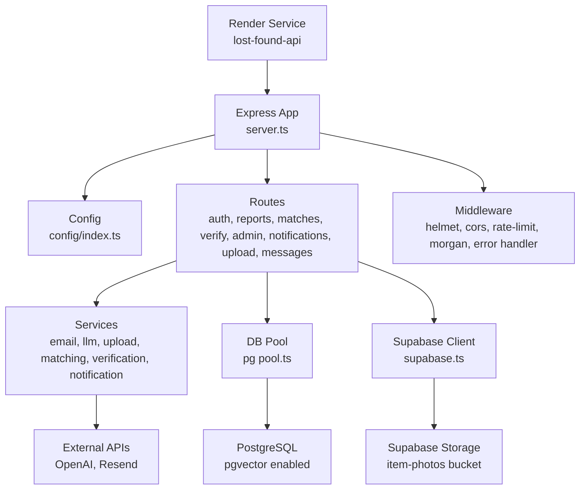
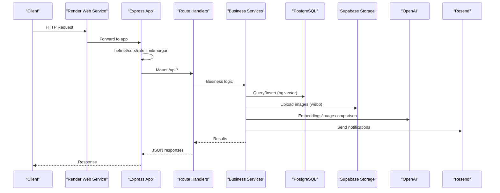
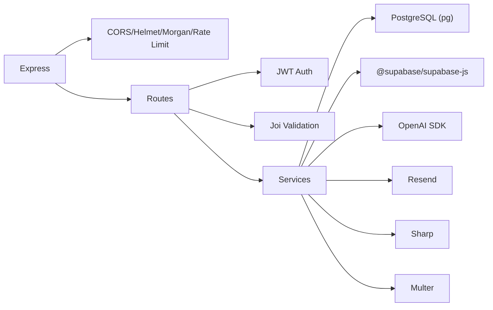

# Backend Deployment (Render)

<cite>
**Referenced Files in This Document**
- [render.yaml](file://render.yaml)
- [package.json](file://backend/package.json)
- [server.ts](file://backend/src/server.ts)
- [config/index.ts](file://backend/src/config/index.ts)
- [db/pool.ts](file://backend/src/db/pool.ts)
- [db/supabase.ts](file://backend/src/db/supabase.ts)
- [middleware/auth.ts](file://backend/src/middleware/auth.ts)
- [middleware/errorHandler.ts](file://backend/src/middleware/errorHandler.ts)
- [middleware/validate.ts](file://backend/src/middleware/validate.ts)
- [services/emailService.ts](file://backend/src/services/emailService.ts)
- [services/llmService.ts](file://backend/src/services/llmService.ts)
- [services/uploadService.ts](file://backend/src/services/uploadService.ts)
- [001_initial_schema.sql](file://supabase/migrations/001_initial_schema.sql)
</cite>

## Table of Contents
1. [Introduction](#introduction)
2. [Project Structure](#project-structure)
3. [Core Components](#core-components)
4. [Architecture Overview](#architecture-overview)
5. [Detailed Component Analysis](#detailed-component-analysis)
6. [Dependency Analysis](#dependency-analysis)
7. [Performance Considerations](#performance-considerations)
8. [Troubleshooting Guide](#troubleshooting-guide)
9. [Conclusion](#conclusion)
10. [Appendices](#appendices)

## Introduction
This document provides comprehensive backend deployment guidance for the Express.js API on Render. It covers the Render service configuration, environment variables, database connection setup, external integrations (OpenAI, Supabase, Resend), file storage, build process, health checks, scaling and resources, monitoring and logging, security hardening, troubleshooting, and performance optimization.

## Project Structure
The backend is a TypeScript-based Express application with modular routes, middleware, services, and database utilities. The Render blueprint defines a Node web service that builds and runs the compiled output.

**Diagram sources**
- [server.ts:1-52](file://backend/src/server.ts#L1-L52)
- [config/index.ts:1-49](file://backend/src/config/index.ts#L1-L49)
- [db/pool.ts:1-48](file://backend/src/db/pool.ts#L1-L48)
- [db/supabase.ts:1-21](file://backend/src/db/supabase.ts#L1-L21)
- [services/emailService.ts:1-32](file://backend/src/services/emailService.ts#L1-L32)
- [services/llmService.ts:1-120](file://backend/src/services/llmService.ts#L1-L120)
- [services/uploadService.ts:1-66](file://backend/src/services/uploadService.ts#L1-L66)

**Section sources**
- [render.yaml:1-54](file://render.yaml#L1-L54)
- [package.json:1-50](file://backend/package.json#L1-L50)
- [server.ts:1-52](file://backend/src/server.ts#L1-L52)

## Core Components
- Render service definition: Web service using Node, build/start commands, health check path, and environment variables.
- Application bootstrap: Express app with security headers, CORS, JSON parsing, request logging, rate limiting, health endpoint, route mounting, and error handling.
- Configuration: Centralized config loaded from environment variables for ports, URLs, Supabase, OpenAI, email, JWT, and matching parameters.
- Database: PostgreSQL connection pooling with SSL for remote hosts and typed query helpers.
- External integrations: Supabase client (anon and service role), OpenAI embeddings and vision, Resend email delivery.
- File storage: In-memory image processing with sharp and upload to Supabase Storage bucket item-photos.

**Section sources**
- [render.yaml:4-54](file://render.yaml#L4-L54)
- [server.ts:18-52](file://backend/src/server.ts#L18-L52)
- [config/index.ts:6-49](file://backend/src/config/index.ts#L6-L49)
- [db/pool.ts:9-28](file://backend/src/db/pool.ts#L9-L28)
- [db/supabase.ts:1-21](file://backend/src/db/supabase.ts#L1-L21)
- [services/emailService.ts:1-32](file://backend/src/services/emailService.ts#L1-L32)
- [services/llmService.ts:1-120](file://backend/src/services/llmService.ts#L1-L120)
- [services/uploadService.ts:1-66](file://backend/src/services/uploadService.ts#L1-L66)

## Architecture Overview
The API exposes REST endpoints under /api/*, secured by Helmet, CORS, and rate limiting. Routes use authentication and validation middleware, call services for business logic, and persist data via PostgreSQL (with pgvector) and Supabase Storage. Health checks are provided at /api/health.

**Diagram sources**
- [server.ts:18-52](file://backend/src/server.ts#L18-L52)
- [db/pool.ts:28-48](file://backend/src/db/pool.ts#L28-L48)
- [services/uploadService.ts:34-66](file://backend/src/services/uploadService.ts#L34-L66)
- [services/llmService.ts:9-120](file://backend/src/services/llmService.ts#L9-L120)
- [services/emailService.ts:15-32](file://backend/src/services/emailService.ts#L15-L32)

## Detailed Component Analysis

### Render Service Configuration
- Service type: web
- Environment: node
- Root directory: backend
- Build command: npm install && npm run build
- Start command: node dist/server.js
- Health check path: /api/health
- Region: ohio
- Plan: free
- Environment variables include NODE_ENV, PORT, FRONTEND_URL, CORS_ORIGINS, NEXT_PUBLIC_SUPABASE_URL, NEXT_PUBLIC_SUPABASE_ANON_KEY, SUPABASE_SERVICE_ROLE_KEY, DATABASE_URL, OPENAI_API_KEY, RESEND_API_KEY, EMAIL_FROM, JWT_SECRET, NEXT_PUBLIC_API_URL, API_URL.

Notes:
- Secrets should be set in the Render dashboard; do not commit secrets to version control.
- Ensure CORS_ORIGINS matches your deployed frontend URL.
- Set NEXT_PUBLIC_* only if consumed by shared code; otherwise prefer server-only env vars.

**Section sources**
- [render.yaml:4-54](file://render.yaml#L4-L54)

### Build Process and Runtime
- Build: TypeScript compilation via tsc produces dist/.
- Start: Runs compiled server.js.
- Logging: Morgan logs requests; production uses combined format.
- Health endpoint: GET /api/health returns status ok with timestamp.

**Section sources**
- [package.json:5-14](file://backend/package.json#L5-L14)
- [server.ts:23-34](file://backend/src/server.ts#L23-L34)

### Environment Variables and Configuration
- Config module reads environment variables and exposes typed settings for port, environment, frontend URL, Supabase credentials, database URL, OpenAI key, email provider settings, JWT secret, and matching algorithm parameters.
- Matching weights and thresholds are defined centrally for consistency across services.

**Section sources**
- [config/index.ts:1-49](file://backend/src/config/index.ts#L1-L49)

### Database Connection Setup (PostgreSQL with pgvector)
- Connection pool parses DATABASE_URL, sets SSL for non-local hosts, and configures timeouts and pool size.
- Typed query helpers simplify database access.
- Schema enables pgvector extension and creates tables for users, lost/found items, matches, verification questions/attempts, notifications, and audit logs. Vector columns store 1536-dim embeddings with IVFFlat indexes for cosine similarity search.

Operational notes:
- Ensure pgvector extension is enabled in your PostgreSQL instance before running migrations.
- Create the Supabase Storage bucket named item-photos and configure appropriate policies.

**Section sources**
- [db/pool.ts:9-28](file://backend/src/db/pool.ts#L9-L28)
- [001_initial_schema.sql:6-10](file://supabase/migrations/001_initial_schema.sql#L6-L10)
- [001_initial_schema.sql:69-140](file://supabase/migrations/001_initial_schema.sql#L69-L140)
- [001_initial_schema.sql:244-249](file://supabase/migrations/001_initial_schema.sql#L244-L249)

### External Service Integrations
- Supabase: Two clients are created—one with service role key for server-side operations bypassing RLS, and one with anon key respecting RLS.
- OpenAI: Embedding generation, structured field extraction, and image similarity via vision model.
- Resend: Email sending with configurable sender address and API key.

Security considerations:
- Keep service role keys and API keys secret.
- Use minimum required permissions for each integration.

**Section sources**
- [db/supabase.ts:1-21](file://backend/src/db/supabase.ts#L1-L21)
- [services/llmService.ts:1-120](file://backend/src/services/llmService.ts#L1-L120)
- [services/emailService.ts:1-32](file://backend/src/services/emailService.ts#L1-L32)

### File Storage Configuration
- Multer stores uploads in memory and validates MIME types and size limits.
- Sharp processes images to webp with resizing and EXIF orientation correction.
- Files are uploaded to Supabase Storage bucket item-photos and public URLs are returned.

Best practices:
- Enforce strict MIME allowlists and size limits.
- Cache immutable assets with long cache headers.

**Section sources**
- [services/uploadService.ts:1-66](file://backend/src/services/uploadService.ts#L1-L66)

### Authentication and Authorization
- JWT-based authentication extracts token from Authorization header, verifies signature, and attaches user identity and role to requests.
- Admin authorization checks user role against the database for protected endpoints.

Error handling:
- Invalid or missing tokens result in 401 errors.
- Unauthorized admin access results in 403 errors.

**Section sources**
- [middleware/auth.ts:1-59](file://backend/src/middleware/auth.ts#L1-L59)

### Input Validation
- Joi schemas validate request bodies for reports and verification flows.
- Validation middleware strips unknown fields and aborts early on errors, returning descriptive messages.

**Section sources**
- [middleware/validate.ts:1-61](file://backend/src/middleware/validate.ts#L1-L61)

### Error Handling
- Centralized error handler normalizes AppError instances and handles multer-specific errors.
- Unhandled errors return generic 500 responses while logging details.

**Section sources**
- [middleware/errorHandler.ts:1-56](file://backend/src/middleware/errorHandler.ts#L1-L56)

## Dependency Analysis
Runtime dependencies include Express, CORS, Helmet, Morgan, rate limiting, JWT, OpenAI, Resend, Supabase JS, pg, multer, sharp, and validation libraries. Dev dependencies support TypeScript, linting, and testing.

**Diagram sources**
- [package.json:16-32](file://backend/package.json#L16-L32)
- [server.ts:1-16](file://backend/src/server.ts#L1-L16)
- [db/pool.ts:1-4](file://backend/src/db/pool.ts#L1-L4)
- [db/supabase.ts:1-2](file://backend/src/db/supabase.ts#L1-L2)
- [services/llmService.ts:1-2](file://backend/src/services/llmService.ts#L1-L2)
- [services/emailService.ts:1-2](file://backend/src/services/emailService.ts#L1-L2)
- [services/uploadService.ts:1-5](file://backend/src/services/uploadService.ts#L1-L5)

**Section sources**
- [package.json:1-50](file://backend/package.json#L1-L50)

## Performance Considerations
- Database pooling: Pool size and timeouts are configured; tune based on workload and Render plan constraints.
- Vector search: IVFFlat indexes optimize cosine similarity queries; ensure lists parameter suits dataset size.
- Image processing: Sharp reduces bandwidth and storage costs; consider caching strategies for repeated transformations.
- Rate limiting: Global limiter protects endpoints; adjust window and max values per traffic patterns.
- External API calls: Implement retries/backoff for OpenAI and Resend to handle transient failures.

[No sources needed since this section provides general guidance]

## Troubleshooting Guide
Common issues and resolutions:
- Health check failing: Verify /api/health route exists and responds with JSON status ok.
- CORS errors: Ensure FRONTEND_URL and CORS_ORIGINS match the browser origin exactly.
- Database connection errors: Confirm DATABASE_URL is correct, pgvector extension is enabled, and SSL settings are compatible with your host.
- Supabase storage upload failures: Check bucket existence (item-photos), permissions, and network access.
- OpenAI/Resend errors: Validate API keys and quotas; implement retry logic and log detailed errors.
- Rate limit exceeded: Increase window/max or segment endpoints with different limits.

Operational tips:
- Monitor logs via Render’s dashboard; enable morgan combined logs in production.
- Add structured logging for critical paths (embeddings, uploads, emails).
- Use health checks to auto-restart unhealthy instances.

**Section sources**
- [server.ts:23-34](file://backend/src/server.ts#L23-L34)
- [db/pool.ts:30-32](file://backend/src/db/pool.ts#L30-L32)
- [services/uploadService.ts:48-64](file://backend/src/services/uploadService.ts#L48-L64)
- [services/emailService.ts:21-32](file://backend/src/services/emailService.ts#L21-L32)
- [services/llmService.ts:89-119](file://backend/src/services/llmService.ts#L89-L119)

## Conclusion
The backend deploys cleanly on Render as a Node web service with robust security, validation, and external integrations. Properly configuring environment variables, enabling pgvector, and setting up Supabase Storage ensures full functionality. Follow the scaling, monitoring, and security recommendations to maintain reliability and performance in production.

[No sources needed since this section summarizes without analyzing specific files]

## Appendices

### Environment Variables Reference
- NODE_ENV: Set to production on Render.
- PORT: Listening port (default 4000).
- FRONTEND_URL: Frontend origin for CORS.
- CORS_ORIGINS: Allowed origins list.
- NEXT_PUBLIC_SUPABASE_URL: Public Supabase project URL.
- NEXT_PUBLIC_SUPABASE_ANON_KEY: Anon key for client-scoped operations.
- SUPABASE_SERVICE_ROLE_KEY: Service role key for server-side operations.
- DATABASE_URL: PostgreSQL connection string (includes password; keep secret).
- OPENAI_API_KEY: OpenAI API key for embeddings and vision.
- RESEND_API_KEY: Resend API key for email delivery.
- EMAIL_FROM: Sender email address for Resend.
- JWT_SECRET: Secret used to sign and verify JWTs.
- NEXT_PUBLIC_API_URL: Public backend API URL (if consumed by shared code).
- API_URL: Internal/backend API URL.

**Section sources**
- [render.yaml:14-54](file://render.yaml#L14-L54)
- [config/index.ts:6-49](file://backend/src/config/index.ts#L6-L49)

### Security Hardening Checklist
- Enable Helmet for secure headers.
- Configure CORS strictly to trusted origins.
- Apply rate limiting to API routes.
- Validate all inputs with Joi schemas.
- Use JWT authentication and enforce admin checks against the database.
- Store secrets in Render dashboard; never commit them.
- Restrict Supabase service role usage to server-side only.
- Enforce file type and size limits for uploads.

**Section sources**
- [server.ts:18-30](file://backend/src/server.ts#L18-L30)
- [middleware/auth.ts:22-58](file://backend/src/middleware/auth.ts#L22-L58)
- [middleware/validate.ts:8-23](file://backend/src/middleware/validate.ts#L8-L23)
- [services/uploadService.ts:14-27](file://backend/src/services/uploadService.ts#L14-L27)

### Scaling and Resources
- Render plan: Free plan suitable for development; upgrade for higher concurrency and memory.
- Auto-scaling: Render scales web services automatically based on load; monitor CPU/memory and adjust plan if needed.
- Resource allocation: Tune database pool size and timeouts according to expected load and Render instance limits.
- Concurrency: Consider horizontal scaling by adding multiple instances behind a load balancer if necessary.

[No sources needed since this section provides general guidance]

### Monitoring, Logs, and Alerts
- Logs: Morgan combined logs in production; review via Render dashboard.
- Metrics: Track request latency, error rates, and external API response times.
- Alerts: Configure alerts for high error rates, slow responses, and external service failures.
- Health checks: Use /api/health for liveness probes; ensure it remains lightweight.

**Section sources**
- [server.ts:23-34](file://backend/src/server.ts#L23-L34)

### Database Migration Notes
- Extensions: uuid-ossp, vector (pgvector), pg_trgm must be enabled.
- Tables: Users, lost_items, found_items, matches, verification_questions, verification_attempts, notifications, item_status_log.
- Indexes: IVFFlat indexes on embedding vectors for fast similarity search.
- Policies: Row-level security policies restrict access appropriately.

**Section sources**
- [001_initial_schema.sql:6-10](file://supabase/migrations/001_initial_schema.sql#L6-L10)
- [001_initial_schema.sql:54-236](file://supabase/migrations/001_initial_schema.sql#L54-L236)
- [001_initial_schema.sql:241-258](file://supabase/migrations/001_initial_schema.sql#L241-L258)
- [001_initial_schema.sql:322-369](file://supabase/migrations/001_initial_schema.sql#L322-L369)