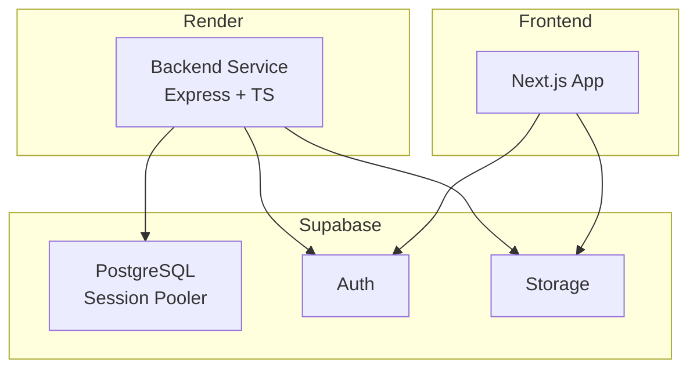
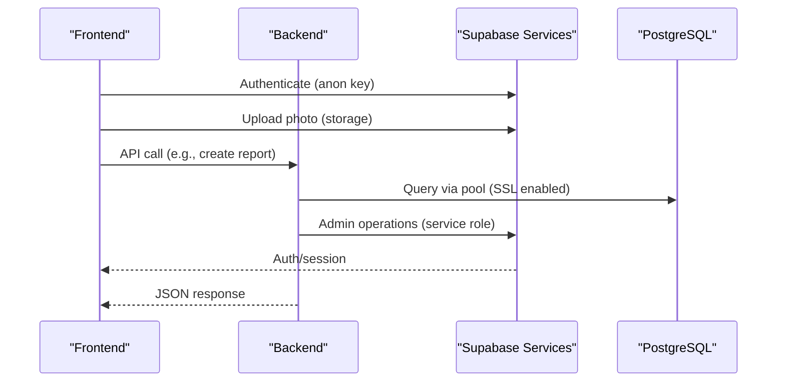
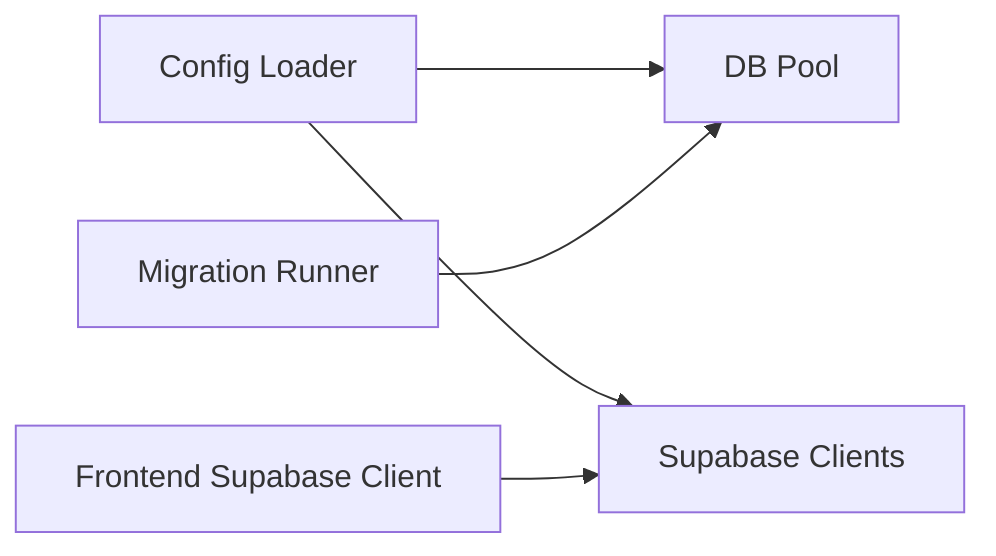
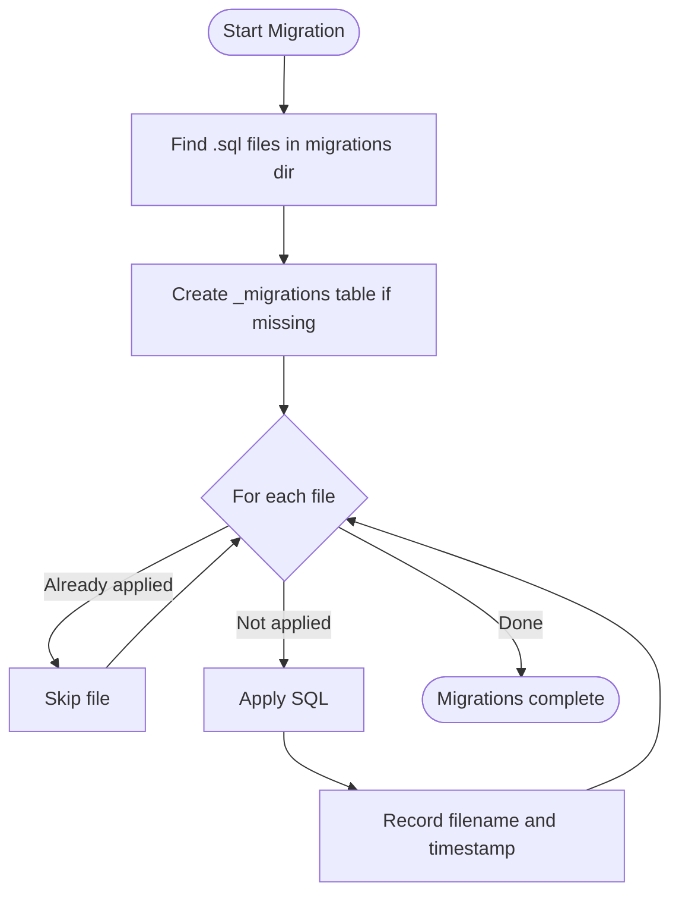

# Database Provisioning & Connection

<cite>
**Referenced Files in This Document**
- [render.yaml](file://render.yaml)
- [DEPLOYMENT.md](file://DEPLOYMENT.md)
- [PERSON_B_HANDOFF.md](file://PERSON_B_HANDOFF.md)
- [backend/src/config/index.ts](file://backend/src/config/index.ts)
- [backend/src/db/pool.ts](file://backend/src/db/pool.ts)
- [backend/src/db/supabase.ts](file://backend/src/db/supabase.ts)
- [backend/src/db/migrate.ts](file://backend/src/db/migrate.ts)
- [supabase/migrations/001_initial_schema.sql](file://supabase/migrations/001_initial_schema.sql)
- [supabase/migrations/002_messages.sql](file://supabase/migrations/002_messages.sql)
- [supabase/migrations/003_admin_fraud_flag.sql](file://supabase/migrations/003_admin_fraud_flag.sql)
- [frontend/lib/supabase.ts](file://frontend/lib/supabase.ts)
</cite>

## Table of Contents
1. Introduction
2. Project Structure
3. Core Components
4. Architecture Overview
5. Detailed Component Analysis
6. Dependency Analysis
7. Performance Considerations
8. Troubleshooting Guide
9. Conclusion
10. Appendices

## Introduction
This document explains how the application provisions and connects to PostgreSQL via Supabase on Render, including database instance setup, pgvector extension installation, connection string configuration, schema migrations, Row-Level Security policies, user permissions, backup strategies, connection pooling, performance tuning, monitoring, scaling options, read replicas, disaster recovery, and troubleshooting for common issues.

## Project Structure
The repository separates backend and frontend concerns:
- Backend (Node/Express + TypeScript) manages direct PostgreSQL connections using a pool and also interacts with Supabase services via SDKs.
- Frontend (Next.js) uses the Supabase client for authenticated operations and storage uploads.
- Migrations live under supabase/migrations and are applied by a Node script against the PostgreSQL instance.
- Deployment is orchestrated via a Render blueprint that injects environment variables for secrets and service URLs.

**Diagram sources**
- [render.yaml:4-54](file://render.yaml#L4-L54)
- [backend/src/db/pool.ts:9-28](file://backend/src/db/pool.ts#L9-L28)
- [backend/src/db/supabase.ts:1-21](file://backend/src/db/supabase.ts#L1-L21)
- [frontend/lib/supabase.ts:1-25](file://frontend/lib/supabase.ts#L1-L25)

**Section sources**
- [render.yaml:4-54](file://render.yaml#L4-L54)
- [DEPLOYMENT.md:35-79](file://DEPLOYMENT.md#L35-L79)

## Core Components
- Configuration loader reads environment variables for Supabase URLs/keys and the PostgreSQL DATABASE_URL.
- PostgreSQL connection pool parses the connection URL, enables SSL for non-local hosts, and exposes typed query helpers.
- Migration runner applies SQL files from supabase/migrations and tracks them in a local _migrations table.
- Supabase clients include both an admin client (service role) and an anon client (RLS-aware).
- Frontend initializes a Supabase client and provides a helper to upload photos to Supabase Storage.

**Section sources**
- [backend/src/config/index.ts:6-18](file://backend/src/config/index.ts#L6-L18)
- [backend/src/db/pool.ts:9-28](file://backend/src/db/pool.ts#L9-L28)
- [backend/src/db/migrate.ts:5-46](file://backend/src/db/migrate.ts#L5-L46)
- [backend/src/db/supabase.ts:4-20](file://backend/src/db/supabase.ts#L4-L20)
- [frontend/lib/supabase.ts:1-25](file://frontend/lib/supabase.ts#L1-L25)

## Architecture Overview
The backend connects directly to Supabase PostgreSQL through a session pooler using a secure connection string. It also uses Supabase Auth and Storage via SDKs. The frontend communicates with Supabase Auth and Storage and calls the backend API for server-side logic.

**Diagram sources**
- [backend/src/db/pool.ts:9-28](file://backend/src/db/pool.ts#L9-L28)
- [backend/src/db/supabase.ts:4-20](file://backend/src/db/supabase.ts#L4-L20)
- [frontend/lib/supabase.ts:1-25](file://frontend/lib/supabase.ts#L1-L25)

## Detailed Component Analysis

### PostgreSQL Instance Creation and Extensions
- The initial migration enables required extensions: uuid-ossp, vector (pgvector), and pg_trgm.
- These extensions support UUID generation, vector similarity search, and fuzzy text matching.

Key points:
- pgvector is installed via CREATE EXTENSION IF NOT EXISTS "vector".
- Vector columns store embeddings used for semantic similarity searches.
- Trigram index supports fuzzy text queries.

**Section sources**
- [supabase/migrations/001_initial_schema.sql:6-9](file://supabase/migrations/001_initial_schema.sql#L6-L9)

### Connection String Configuration
- The backend reads DATABASE_URL from environment variables and constructs a pg.Pool with SSL enabled for non-local hosts.
- The pool sets maximum connections, idle timeout, and connection timeout values.
- Render blueprint defines environment variables including DATABASE_URL and Supabase keys; these must be set as secrets in the Render dashboard.

Operational notes:
- Use the Supabase Session pooler URI for production connections.
- Ensure the password is correctly URL-encoded if it contains special characters.
- For local development, ensure the host pattern detection allows localhost or private ranges without forcing SSL.

**Section sources**
- [backend/src/config/index.ts:17-17](file://backend/src/config/index.ts#L17-L17)
- [backend/src/db/pool.ts:9-28](file://backend/src/db/pool.ts#L9-L28)
- [render.yaml:14-54](file://render.yaml#L14-L54)
- [DEPLOYMENT.md:35-44](file://DEPLOYMENT.md#L35-L44)

### Schema Migrations
- A Node-based migration runner executes all .sql files in supabase/migrations in sorted order.
- It creates a _migrations table to track applied files and skips already-applied migrations.
- All three migrations are present: initial schema, messages, and admin fraud flag.

Execution flow:
- Discover migration files
- Create tracking table if missing
- Apply each migration once
- Record filename and timestamp

**Section sources**
- [backend/src/db/migrate.ts:5-46](file://backend/src/db/migrate.ts#L5-L46)
- [supabase/migrations/001_initial_schema.sql:1-370](file://supabase/migrations/001_initial_schema.sql#L1-L370)
- [supabase/migrations/002_messages.sql:1-53](file://supabase/migrations/002_messages.sql#L1-L53)
- [supabase/migrations/003_admin_fraud_flag.sql:1-13](file://supabase/migrations/003_admin_fraud_flag.sql#L1-L13)

### Row-Level Security Policies and User Permissions
- RLS is enabled on core tables: users, lost_items, found_items, matches, notifications, verification_questions, verification_attempts.
- Policies restrict access:
  - Users can view/update their own profile.
  - Active items are publicly visible; owners can manage their own items.
  - Notifications are scoped per user.
  - Matches are visible to item owners.
  - Messages are only readable/writable by participants of approved matches.

Security implications:
- Server-side admin operations use the Supabase service role client to bypass RLS when necessary.
- Client-side operations use the anon client and rely on RLS policies for data scoping.

**Section sources**
- [supabase/migrations/001_initial_schema.sql:322-365](file://supabase/migrations/001_initial_schema.sql#L322-L365)
- [supabase/migrations/002_messages.sql:25-52](file://supabase/migrations/002_messages.sql#L25-L52)
- [backend/src/db/supabase.ts:4-20](file://backend/src/db/supabase.ts#L4-L20)

### Database Backup Strategies
- Backups are managed by Supabase; configure retention and point-in-time recovery in the Supabase Dashboard.
- Export critical datasets periodically for audit and compliance.
- Validate restore procedures regularly to ensure recoverability.

[No sources needed since this section provides general guidance]

### Connection Pooling Configuration
- The pool configures:
  - Maximum connections: 20
  - Idle timeout: 30 seconds
  - Connection timeout: 10 seconds
  - SSL: enabled for non-local hosts with hostname verification disabled at TLS level but servername set
- Error handling logs unexpected pool errors.

Tuning guidance:
- Adjust max based on expected concurrency and database limits.
- Tune idleTimeoutMillis to balance resource usage and reconnection overhead.
- Monitor connection timeouts and adjust connectionTimeoutMillis accordingly.

**Section sources**
- [backend/src/db/pool.ts:9-32](file://backend/src/db/pool.ts#L9-L32)

### Performance Optimization Settings
- Vector indexes:
  - ivfflat indexes on description_embedding columns for cosine similarity search.
- Text search:
  - pg_trgm extension supports fuzzy matching.
- Haversine function:
  - PL/pgSQL function for distance calculations between coordinates.
- Indexes:
  - Multiple B-tree indexes on frequently queried columns (user_id, status, category, match fields).
  - Fraud flag partial index for fast retrieval of flagged matches.

Optimization tips:
- Ensure vector indexes are rebuilt after large data loads.
- Use appropriate thresholds for embedding similarity to reduce scan costs.
- Monitor query plans for vector and geospatial queries.

**Section sources**
- [supabase/migrations/001_initial_schema.sql:244-259](file://supabase/migrations/001_initial_schema.sql#L244-L259)
- [supabase/migrations/001_initial_schema.sql:299-316](file://supabase/migrations/001_initial_schema.sql#L299-L316)
- [supabase/migrations/003_admin_fraud_flag.sql:11-12](file://supabase/migrations/003_admin_fraud_flag.sql#L11-L12)

### Monitoring Setup
- Application-level logging:
  - Pool error events are logged to console.
  - Migration runner prints progress and errors.
- Supabase Dashboard:
  - Monitor database metrics, slow queries, and connection counts.
- Health endpoint:
  - Backend exposes /api/health for readiness checks.

Recommendations:
- Integrate structured logging and metrics collection (e.g., Prometheus) for deeper observability.
- Set up alerts for connection failures and high latency.

**Section sources**
- [backend/src/db/pool.ts:30-32](file://backend/src/db/pool.ts#L30-L32)
- [backend/src/db/migrate.ts:11-42](file://backend/src/db/migrate.ts#L11-L42)
- [DEPLOYMENT.md:77-79](file://DEPLOYMENT.md#L77-L79)

### Scaling Options, Read Replicas, and Disaster Recovery
- Scaling:
  - Scale compute resources on Render for the backend service.
  - Use Supabase’s built-in scaling features for the database and pooler.
- Read replicas:
  - Configure read replicas in Supabase Dashboard for read-heavy workloads.
  - Route read-only queries to replica endpoints where applicable.
- Disaster recovery:
  - Use Supabase backups and point-in-time recovery.
  - Test restore procedures regularly.
  - Maintain runbooks for incident response and failover.

[No sources needed since this section provides general guidance]

## Dependency Analysis
The backend depends on:
- Environment configuration for database and Supabase credentials.
- pg library for PostgreSQL connectivity and pooling.
- Supabase JS SDK for Auth and Storage interactions.
- Migration scripts depend on the pool to apply SQL changes.

**Diagram sources**
- [backend/src/config/index.ts:6-18](file://backend/src/config/index.ts#L6-L18)
- [backend/src/db/pool.ts:9-28](file://backend/src/db/pool.ts#L9-L28)
- [backend/src/db/migrate.ts:5-46](file://backend/src/db/migrate.ts#L5-L46)
- [backend/src/db/supabase.ts:4-20](file://backend/src/db/supabase.ts#L4-L20)
- [frontend/lib/supabase.ts:1-25](file://frontend/lib/supabase.ts#L1-L25)

**Section sources**
- [backend/src/config/index.ts:6-18](file://backend/src/config/index.ts#L6-L18)
- [backend/src/db/pool.ts:9-28](file://backend/src/db/pool.ts#L9-L28)
- [backend/src/db/migrate.ts:5-46](file://backend/src/db/migrate.ts#L5-L46)
- [backend/src/db/supabase.ts:4-20](file://backend/src/db/supabase.ts#L4-L20)
- [frontend/lib/supabase.ts:1-25](file://frontend/lib/supabase.ts#L1-L25)

## Performance Considerations
- Vector similarity search:
  - Leverage ivfflat indexes on embedding vectors.
  - Tune lists parameter for accuracy vs. speed trade-offs.
- Geospatial queries:
  - Use the haversine_km function for distance calculations.
- Text search:
  - Utilize pg_trgm for fuzzy matching.
- Connection pooling:
  - Monitor pool utilization and adjust max connections.
  - Reduce idleTimeoutMillis if many short-lived requests occur.
- Query optimization:
  - Add targeted indexes for frequent filters (status, user_id, category).
  - Avoid full table scans on large tables by using selective predicates.

[No sources needed since this section provides general guidance]

## Troubleshooting Guide
Common issues and resolutions:
- Connection timeouts to Supabase pooler:
  - Verify DATABASE_URL and password correctness.
  - Ensure Render outbound traffic is allowed to Supabase pooler endpoints.
  - Check IP allow-list settings in Supabase Dashboard if applicable.
- SSL handshake problems:
  - Confirm SSL mode and servername configuration in the pool.
  - For local development, ensure localhost/private ranges bypass strict SSL checks.
- Migration failures:
  - If duplicate key errors occur on _migrations, confirm which migrations have been applied.
  - Re-run migrations only after verifying state.
- RLS policy violations:
  - Ensure client uses correct token (anon vs service role).
  - Review policies for target tables and roles.

Diagnostic steps:
- Use the health endpoint to verify backend readiness.
- Inspect pool error logs for connection issues.
- Validate _migrations table contents to confirm applied migrations.

**Section sources**
- [PERSON_B_HANDOFF.md:9-106](file://PERSON_B_HANDOFF.md#L9-L106)
- [DEPLOYMENT.md:45-57](file://DEPLOYMENT.md#L45-L57)
- [backend/src/db/pool.ts:30-32](file://backend/src/db/pool.ts#L30-L32)
- [backend/src/db/migrate.ts:15-42](file://backend/src/db/migrate.ts#L15-L42)

## Conclusion
The application integrates tightly with Supabase for authentication, storage, and PostgreSQL hosting. Migrations enable vector search and robust relational structures with strong security via RLS. Connection pooling and performance-oriented indexes support scalable operations. Proper configuration of environment variables and careful attention to SSL and pooler endpoints are essential for reliable deployments on Render.

## Appendices

### Environment Variables Summary
- NEXT_PUBLIC_SUPABASE_URL: Supabase project URL (public)
- NEXT_PUBLIC_SUPABASE_ANON_KEY: Anon key for client-side operations
- SUPABASE_SERVICE_ROLE_KEY: Secret key for server-side admin operations
- DATABASE_URL: PostgreSQL connection string via Supabase pooler
- OPENAI_API_KEY: Embedding generation
- RESEND_API_KEY: Email delivery
- EMAIL_FROM: Sender address
- JWT_SECRET: Token signing secret
- FRONTEND_URL and CORS_ORIGINS: Allowed origins for CORS

**Section sources**
- [render.yaml:14-54](file://render.yaml#L14-L54)
- [backend/src/config/index.ts:6-18](file://backend/src/config/index.ts#L6-L18)

### Migration Execution Flow

**Diagram sources**
- [backend/src/db/migrate.ts:5-46](file://backend/src/db/migrate.ts#L5-L46)