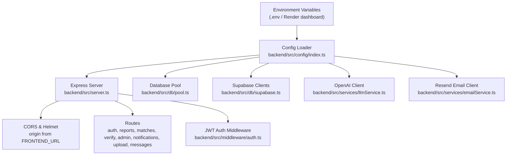
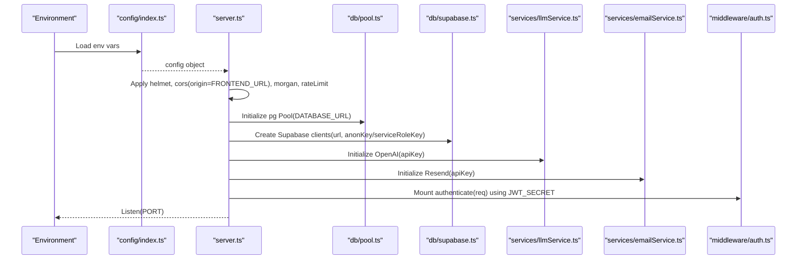
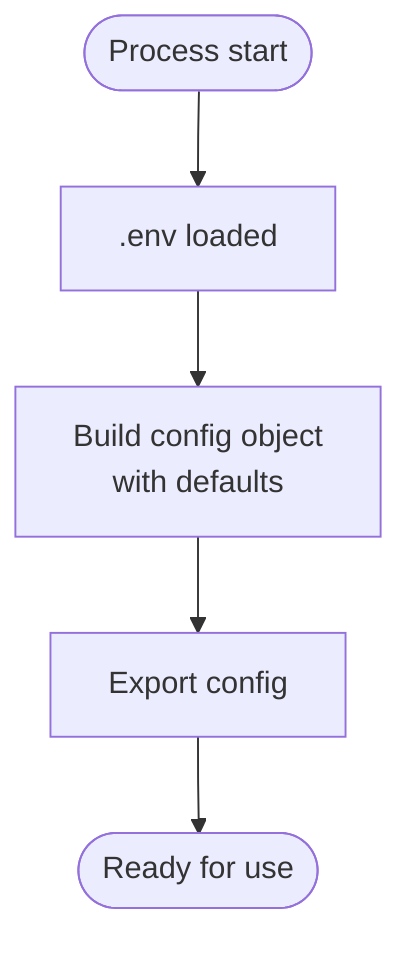
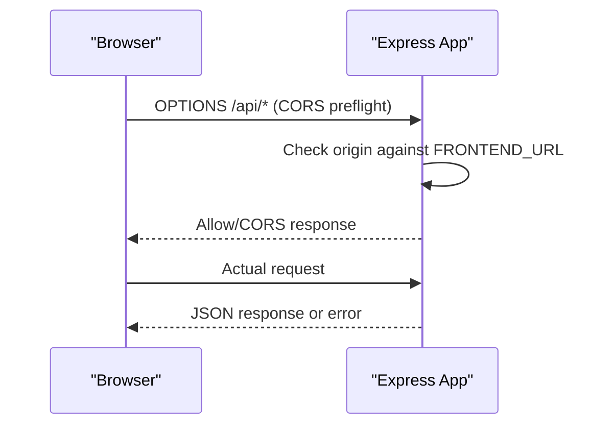
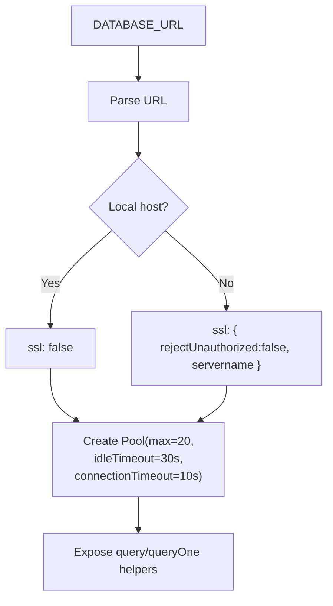
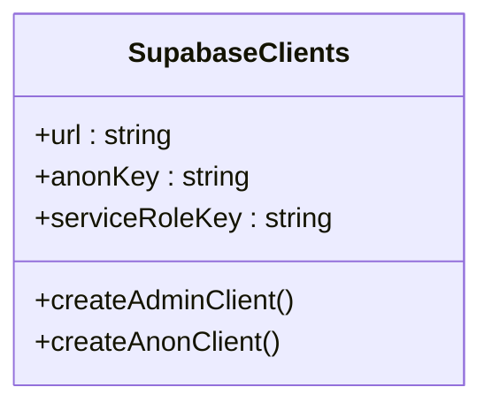
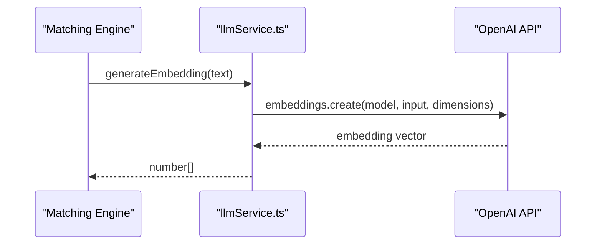
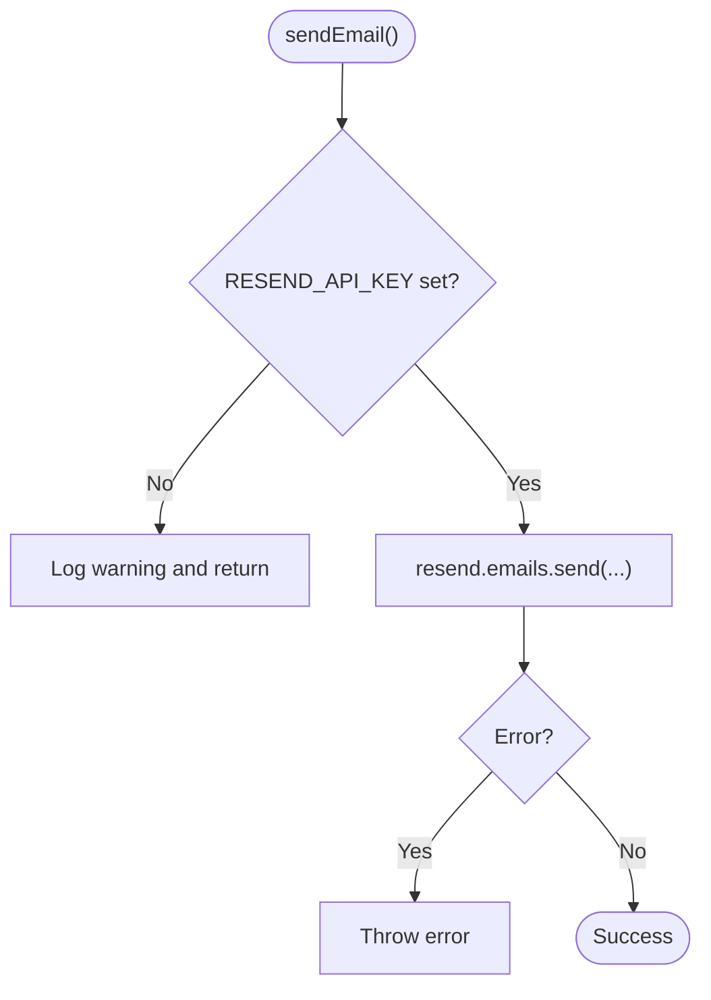
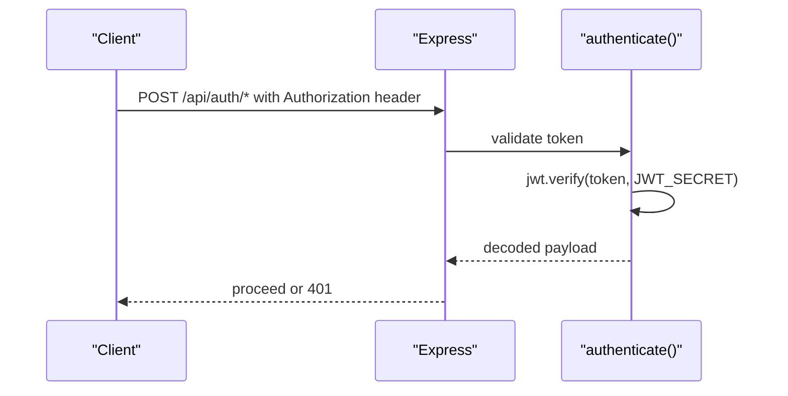
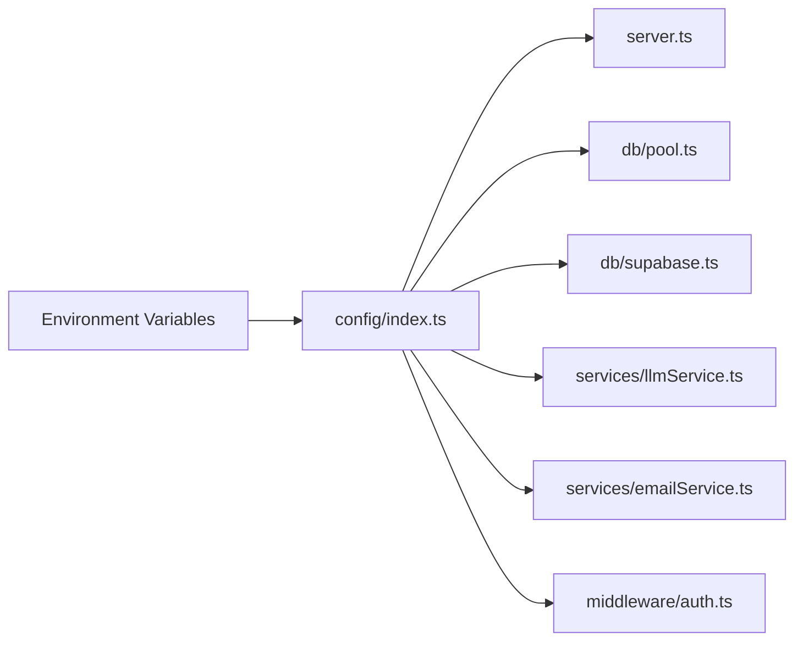

# Environment Variables Setup

<cite>
**Referenced Files in This Document**
- [backend/src/config/index.ts](file://backend/src/config/index.ts)
- [backend/src/server.ts](file://backend/src/server.ts)
- [backend/src/db/pool.ts](file://backend/src/db/pool.ts)
- [backend/src/db/supabase.ts](file://backend/src/db/supabase.ts)
- [backend/src/services/emailService.ts](file://backend/src/services/emailService.ts)
- [backend/src/services/llmService.ts](file://backend/src/services/llmService.ts)
- [backend/src/middleware/auth.ts](file://backend/src/middleware/auth.ts)
- [render.yaml](file://render.yaml)
- [DEPLOYMENT.md](file://DEPLOYMENT.md)
- [frontend/lib/api.ts](file://frontend/lib/api.ts)
</cite>

## Table of Contents
1. Introduction
2. Project Structure
3. Core Components
4. Architecture Overview
5. Detailed Component Analysis
6. Dependency Analysis
7. Performance Considerations
8. Troubleshooting Guide
9. Conclusion

## Introduction
This document explains how to configure environment variables for the backend deployment, including required values, defaults, validation behavior, and error handling. It also clarifies which variables are public versus secret, how they are used across services (database, Supabase, OpenAI, Resend, JWT), and how to manage environment-specific settings safely during development and production.

## Project Structure
The backend loads configuration at startup from environment variables and exposes a centralized config object consumed by routes, middleware, database, and external service clients. The server sets up CORS using the frontend URL, applies security headers, logging, and rate limiting, then mounts API routes.

**Diagram sources**
- [backend/src/config/index.ts:6-48](file://backend/src/config/index.ts#L6-L48)
- [backend/src/server.ts:18-47](file://backend/src/server.ts#L18-L47)
- [backend/src/db/pool.ts:9-28](file://backend/src/db/pool.ts#L9-L28)
- [backend/src/db/supabase.ts:8-20](file://backend/src/db/supabase.ts#L8-L20)
- [backend/src/services/llmService.ts:4-4](file://backend/src/services/llmService.ts#L4-L4)
- [backend/src/services/emailService.ts:4-4](file://backend/src/services/emailService.ts#L4-L4)
- [backend/src/middleware/auth.ts:22-36](file://backend/src/middleware/auth.ts#L22-L36)

**Section sources**
- [backend/src/config/index.ts:6-48](file://backend/src/config/index.ts#L6-L48)
- [backend/src/server.ts:18-47](file://backend/src/server.ts#L18-L47)

## Core Components
This section lists all environment variables used by the backend, their purpose, default values, and whether they are public or secret.

- NODE_ENV
  - Purpose: Runtime mode (development vs production). Controls logging verbosity.
  - Default: development
  - Public/Secret: Secret (environment only)
  - Used by: Server startup logging

- PORT
  - Purpose: TCP port the Express server listens on.
  - Default: 4000
  - Public/Secret: Secret (environment only)
  - Used by: Server listen

- FRONTEND_URL
  - Purpose: Allowed origin for CORS; must match the deployed frontend domain.
  - Default: http://localhost:3000
  - Public/Secret: Secret (server-side only)
  - Used by: CORS configuration

- NEXT_PUBLIC_SUPABASE_URL
  - Purpose: Supabase project URL. Required for both client and server clients.
  - Default: none (required)
  - Public/Secret: Public (exposed to browser via Next.js)
  - Used by: Supabase clients

- NEXT_PUBLIC_SUPABASE_ANON_KEY
  - Purpose: Anonymized Supabase key with Row Level Security enforced.
  - Default: none (required)
  - Public/Secret: Public (exposed to browser via Next.js)
  - Used by: Supabase client

- SUPABASE_SERVICE_ROLE_KEY
  - Purpose: Service role key that bypasses RLS; use only server-side.
  - Default: none (required)
  - Public/Secret: Secret
  - Used by: Admin Supabase client

- DATABASE_URL
  - Purpose: PostgreSQL connection string (preferably via Supabase pooler).
  - Default: none (required)
  - Public/Secret: Secret
  - Used by: Database pool

- OPENAI_API_KEY
  - Purpose: API key for embeddings, text extraction, and image comparison.
  - Default: none (required)
  - Public/Secret: Secret
  - Used by: OpenAI client

- RESEND_API_KEY
  - Purpose: API key for sending emails via Resend.
  - Default: none (required)
  - Public/Secret: Secret
  - Used by: Resend client

- EMAIL_FROM
  - Purpose: Sender address for outgoing emails.
  - Default: noreply@lostfound.ai
  - Public/Secret: Secret (server-side only)
  - Used by: Email service

- JWT_SECRET
  - Purpose: Secret used to sign and verify JSON Web Tokens.
  - Default: dev-secret-change-me (must be changed in production)
  - Public/Secret: Secret
  - Used by: JWT authentication middleware

- CORS_ORIGINS
  - Purpose: Additional allowed origins for CORS (comma-separated).
  - Default: not read by backend code in this repository
  - Public/Secret: Secret (server-side only)
  - Note: Deployment guide mentions it; current server uses FRONTEND_URL only

- NEXT_PUBLIC_API_URL
  - Purpose: Backend API base URL for the frontend.
  - Default: http://localhost:4000/api (frontend fallback)
  - Public/Secret: Public (frontend)
  - Used by: Frontend API client

- API_URL
  - Purpose: Internal/backend API URL variable defined in deployment blueprint.
  - Default: none
  - Public/Secret: Secret (server-side only)
  - Usage: Not directly referenced in analyzed backend files

Validation, defaults, and error handling summary:
- Config loader provides safe defaults for PORT, NODE_ENV, FRONTEND_URL, EMAIL_FROM, JWT_EXPIRES_IN, and matching weights.
- Missing secrets result in empty strings or default tokens; downstream components may fail or skip functionality:
  - Database: pool creation expects a valid DATABASE_URL; missing value will cause connection errors.
  - Supabase: requires url and keys; missing keys will cause client initialization issues.
  - OpenAI: missing API key will cause API calls to fail.
  - Resend: if key is missing, email sending is skipped with a warning.
  - JWT: default dev secret is used unless overridden; must be replaced in production.

**Section sources**
- [backend/src/config/index.ts:6-48](file://backend/src/config/index.ts#L6-L48)
- [backend/src/server.ts:18-23](file://backend/src/server.ts#L18-L23)
- [backend/src/db/pool.ts:9-28](file://backend/src/db/pool.ts#L9-L28)
- [backend/src/db/supabase.ts:8-20](file://backend/src/db/supabase.ts#L8-L20)
- [backend/src/services/emailService.ts:15-19](file://backend/src/services/emailService.ts#L15-L19)
- [backend/src/services/llmService.ts:4-4](file://backend/src/services/llmService.ts#L4-L4)
- [backend/src/middleware/auth.ts:22-36](file://backend/src/middleware/auth.ts#L22-L36)
- [render.yaml:14-53](file://render.yaml#L14-L53)
- [DEPLOYMENT.md:59-91](file://DEPLOYMENT.md#L59-L91)
- [frontend/lib/api.ts:1-1](file://frontend/lib/api.ts#L1-L1)

## Architecture Overview
The backend reads environment variables once at startup into a shared config object. Services and middleware consume this config to initialize clients and enforce runtime policies.

**Diagram sources**
- [backend/src/config/index.ts:6-48](file://backend/src/config/index.ts#L6-L48)
- [backend/src/server.ts:18-47](file://backend/src/server.ts#L18-L47)
- [backend/src/db/pool.ts:9-28](file://backend/src/db/pool.ts#L9-L28)
- [backend/src/db/supabase.ts:8-20](file://backend/src/db/supabase.ts#L8-L20)
- [backend/src/services/llmService.ts:4-4](file://backend/src/services/llmService.ts#L4-L4)
- [backend/src/services/emailService.ts:4-4](file://backend/src/services/emailService.ts#L4-L4)
- [backend/src/middleware/auth.ts:22-36](file://backend/src/middleware/auth.ts#L22-L36)

## Detailed Component Analysis

### Configuration Loader
- Loads .env from the repository root and exports a typed config object.
- Provides sensible defaults for non-secret values and leaves secrets empty when missing.
- Centralizes all environment-driven settings for consistency.

**Diagram sources**
- [backend/src/config/index.ts:1-48](file://backend/src/config/index.ts#L1-L48)

**Section sources**
- [backend/src/config/index.ts:1-48](file://backend/src/config/index.ts#L1-L48)

### Server and CORS
- Applies security headers, JSON parsing, logging, and rate limiting.
- Uses FRONTEND_URL for CORS origin; credentials enabled.
- Exposes health endpoint for platform health checks.

**Diagram sources**
- [backend/src/server.ts:18-30](file://backend/src/server.ts#L18-L30)
- [backend/src/config/index.ts:6-10](file://backend/src/config/index.ts#L6-L10)

**Section sources**
- [backend/src/server.ts:18-47](file://backend/src/server.ts#L18-L47)

### Database Connection
- Parses DATABASE_URL into a Postgres pool configuration.
- Enables SSL for non-local hosts and sets timeouts and pool size.
- Emits pool-level errors for observability.

**Diagram sources**
- [backend/src/db/pool.ts:9-28](file://backend/src/db/pool.ts#L9-L28)

**Section sources**
- [backend/src/db/pool.ts:9-28](file://backend/src/db/pool.ts#L9-L28)

### Supabase Clients
- Initializes two clients:
  - Admin client using service-role key (bypasses RLS).
  - Anon client using anon key (respects RLS).
- Both require NEXT_PUBLIC_SUPABASE_URL.

**Diagram sources**
- [backend/src/db/supabase.ts:8-20](file://backend/src/db/supabase.ts#L8-L20)
- [backend/src/config/index.ts:11-15](file://backend/src/config/index.ts#L11-L15)

**Section sources**
- [backend/src/db/supabase.ts:8-20](file://backend/src/db/supabase.ts#L8-L20)
- [backend/src/config/index.ts:11-15](file://backend/src/config/index.ts#L11-L15)

### OpenAI Integration
- Initializes OpenAI client with OPENAI_API_KEY.
- Used for embeddings, structured extraction, and image similarity comparisons.

**Diagram sources**
- [backend/src/services/llmService.ts:4-17](file://backend/src/services/llmService.ts#L4-L17)

**Section sources**
- [backend/src/services/llmService.ts:4-17](file://backend/src/services/llmService.ts#L4-L17)

### Email Service (Resend)
- Initializes Resend with RESEND_API_KEY.
- If key is missing, sends are skipped with a warning; otherwise throws on send errors.

**Diagram sources**
- [backend/src/services/emailService.ts:15-30](file://backend/src/services/emailService.ts#L15-L30)

**Section sources**
- [backend/src/services/emailService.ts:15-30](file://backend/src/services/emailService.ts#L15-L30)

### JWT Authentication
- Verifies tokens using JWT_SECRET from config.
- Attaches userId and userRole to requests; rejects invalid/expired tokens.

**Diagram sources**
- [backend/src/middleware/auth.ts:22-36](file://backend/src/middleware/auth.ts#L22-L36)

**Section sources**
- [backend/src/middleware/auth.ts:22-36](file://backend/src/middleware/auth.ts#L22-L36)

## Dependency Analysis
Environment variables flow from the environment into the config module and then into specific subsystems.

**Diagram sources**
- [backend/src/config/index.ts:6-48](file://backend/src/config/index.ts#L6-L48)
- [backend/src/server.ts:18-47](file://backend/src/server.ts#L18-L47)
- [backend/src/db/pool.ts:9-28](file://backend/src/db/pool.ts#L9-L28)
- [backend/src/db/supabase.ts:8-20](file://backend/src/db/supabase.ts#L8-L20)
- [backend/src/services/llmService.ts:4-4](file://backend/src/services/llmService.ts#L4-L4)
- [backend/src/services/emailService.ts:4-4](file://backend/src/services/emailService.ts#L4-L4)
- [backend/src/middleware/auth.ts:22-36](file://backend/src/middleware/auth.ts#L22-L36)

**Section sources**
- [backend/src/config/index.ts:6-48](file://backend/src/config/index.ts#L6-L48)

## Performance Considerations
- Database pool sizing and timeouts are configured to balance throughput and resource usage.
- Rate limiting protects API endpoints from abuse.
- Logging switches between verbose and combined formats based on NODE_ENV.
- Ensure CORS_ORIGIN is precise to avoid unnecessary preflight overhead.

[No sources needed since this section provides general guidance]

## Troubleshooting Guide
Common issues and resolutions tied to environment variables:

- Health check fails after deploy
  - Verify PORT and that the process starts listening.
  - Confirm health path is reachable.

- CORS errors from frontend
  - Ensure FRONTEND_URL matches the deployed frontend domain exactly.
  - Credentials are enabled; ensure cookies/session setup aligns.

- Database connection failures
  - Validate DATABASE_URL format and credentials.
  - For remote databases, SSL is auto-enabled; confirm network access.

- Supabase client errors
  - Set NEXT_PUBLIC_SUPABASE_URL and appropriate keys.
  - Use service-role key only server-side.

- OpenAI call failures
  - Ensure OPENAI_API_KEY is set and has quota/access.

- Emails not sent
  - If RESEND_API_KEY is missing, emails are skipped intentionally.
  - Otherwise, check sender domain verification and error logs.

- JWT authentication errors
  - Ensure JWT_SECRET is set consistently across auth issuance and verification.
  - Replace default dev secret in production.

**Section sources**
- [backend/src/server.ts:18-47](file://backend/src/server.ts#L18-L47)
- [backend/src/db/pool.ts:9-28](file://backend/src/db/pool.ts#L9-L28)
- [backend/src/db/supabase.ts:8-20](file://backend/src/db/supabase.ts#L8-L20)
- [backend/src/services/emailService.ts:15-30](file://backend/src/services/emailService.ts#L15-L30)
- [backend/src/services/llmService.ts:4-4](file://backend/src/services/llmService.ts#L4-L4)
- [backend/src/middleware/auth.ts:22-36](file://backend/src/middleware/auth.ts#L22-L36)

## Conclusion
Configure environment variables centrally through the config loader and supply them via your deployment platform’s secret management. Keep secrets out of source control, use distinct values per environment, and validate critical variables before deploying. Follow the provided defaults and error-handling behaviors to diagnose issues quickly and maintain secure, reliable operations.

[No sources needed since this section summarizes without analyzing specific files]