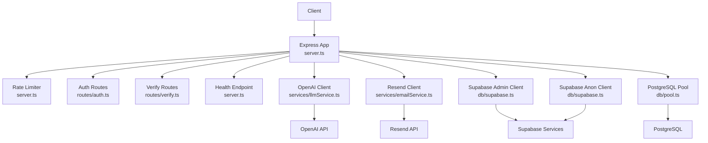
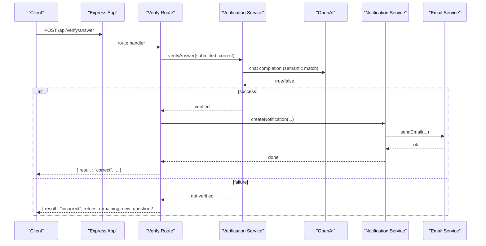
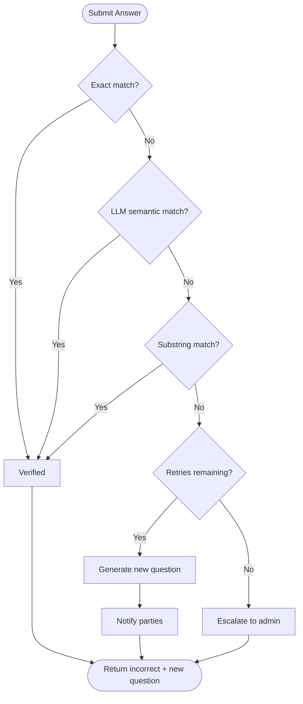
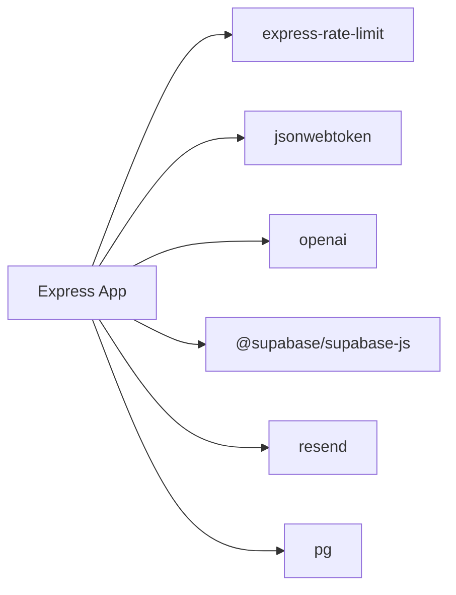

# External Service Integration

<cite>
**Referenced Files in This Document**
- [server.ts](file://backend/src/server.ts)
- [config/index.ts](file://backend/src/config/index.ts)
- [db/supabase.ts](file://backend/src/db/supabase.ts)
- [services/llmService.ts](file://backend/src/services/llmService.ts)
- [services/emailService.ts](file://backend/src/services/emailService.ts)
- [services/notificationService.ts](file://backend/src/services/notificationService.ts)
- [services/verificationService.ts](file://backend/src/services/verificationService.ts)
- [middleware/errorHandler.ts](file://backend/src/middleware/errorHandler.ts)
- [routes/verify.ts](file://backend/src/routes/verify.ts)
- [package.json](file://backend/package.json)
</cite>

## Table of Contents
1. Introduction
2. Project Structure
3. Core Components
4. Architecture Overview
5. Detailed Component Analysis
6. Dependency Analysis
7. Performance Considerations
8. Troubleshooting Guide
9. Conclusion

## Introduction
This document explains how the backend integrates with external services: OpenAI API, Supabase, and Resend email service. It covers configuration, authentication flows, request/response patterns, error handling, retries, fallbacks, rate limiting, health monitoring, cost optimization, usage limits, and troubleshooting for outages or integration failures.

## Project Structure
The backend is an Express application that wires together:
- Configuration via environment variables
- Supabase clients for database and auth
- OpenAI client for embeddings, structured extraction, image comparison, and verification question generation
- Resend client for sending emails
- Centralized error handling and global rate limiting
- A health endpoint for service monitoring

**Diagram sources**
- [server.ts:1-52](file://backend/src/server.ts#L1-L52)
- [config/index.ts:1-49](file://backend/src/config/index.ts#L1-L49)
- [db/supabase.ts:1-21](file://backend/src/db/supabase.ts#L1-L21)
- [services/llmService.ts:1-120](file://backend/src/services/llmService.ts#L1-L120)
- [services/emailService.ts:1-32](file://backend/src/services/emailService.ts#L1-L32)

**Section sources**
- [server.ts:1-52](file://backend/src/server.ts#L1-L52)
- [config/index.ts:1-49](file://backend/src/config/index.ts#L1-L49)

## Core Components
- OpenAI integration: embeddings, structured field extraction, image similarity, and verification question generation.
- Supabase integration: admin and anon clients for auth and data operations.
- Resend email integration: sending transactional emails with graceful skip when keys are missing.
- Global rate limiting and health endpoint for operational visibility.
- Centralized error handling with typed errors and consistent JSON responses.

Key configuration fields (environment-driven):
- OpenAI: apiKey
- Supabase: url, anonKey, serviceRoleKey
- Email: resendApiKey, from
- JWT: secret, expiresIn
- Matching: weights, thresholds, retries, location/time windows

**Section sources**
- [config/index.ts:11-47](file://backend/src/config/index.ts#L11-L47)
- [services/llmService.ts:1-120](file://backend/src/services/llmService.ts#L1-L120)
- [db/supabase.ts:1-21](file://backend/src/db/supabase.ts#L1-L21)
- [services/emailService.ts:1-32](file://backend/src/services/emailService.ts#L1-L32)

## Architecture Overview
The system routes requests through a central Express app that applies security headers, CORS, body parsing, logging, and rate limiting. Protected routes use JWT-based authentication. Business logic calls external services as needed and persists state to PostgreSQL via Supabase or direct pool queries.

**Diagram sources**
- [routes/verify.ts:194-296](file://backend/src/routes/verify.ts#L194-L296)
- [services/verificationService.ts:85-123](file://backend/src/services/verificationService.ts#L85-L123)
- [services/notificationService.ts:19-62](file://backend/src/services/notificationService.ts#L19-L62)
- [services/emailService.ts:15-31](file://backend/src/services/emailService.ts#L15-L31)

## Detailed Component Analysis

### OpenAI API Integration
Responsibilities:
- Generate text embeddings for similarity search
- Extract structured item attributes from free text
- Compare images for visual similarity
- Generate verification questions and evaluate answers semantically

Configuration:
- API key loaded from environment and passed to the OpenAI client at startup.

Request/response patterns:
- Embeddings: returns a vector used by PostgreSQL pgvector for cosine similarity.
- Structured extraction: returns a JSON object with category, brand, colour.
- Image similarity: returns a numeric score clamped to 0–100.
- Verification: returns natural-language question text; answer evaluation returns boolean.

Error handling and fallbacks:
- Image similarity catches exceptions and returns a neutral score to keep matching pipelines resilient.
- Question generation wraps LLM calls in try/catch and falls back to a deterministic question if the LLM call fails.
- Answer verification first tries exact match, then LLM semantic match, then a simple substring fallback.

Rate limiting and retries:
- No per-call retry logic is implemented in these functions; rely on upstream route-level retries where applicable.
- Rate limiting is enforced globally at the API layer.

Cost optimization strategies:
- Use smaller models for embeddings and lightweight tasks.
- Cache or deduplicate repeated embedding computations where possible.
- Limit max tokens and temperature for deterministic outputs to reduce token usage.

Usage limits and billing considerations:
- Monitor token consumption via OpenAI dashboard.
- Set budget alerts and consider quotas to prevent unexpected costs.

Operational notes:
- Ensure OPENAI_API_KEY is set; otherwise, LLM-dependent features will fail.

**Section sources**
- [services/llmService.ts:1-120](file://backend/src/services/llmService.ts#L1-L120)
- [services/verificationService.ts:15-79](file://backend/src/services/verificationService.ts#L15-L79)
- [services/verificationService.ts:85-123](file://backend/src/services/verificationService.ts#L85-L123)
- [config/index.ts:19-21](file://backend/src/config/index.ts#L19-L21)

### Supabase Services Integration
Responsibilities:
- Admin client for server-side operations (e.g., creating users, bypassing RLS).
- Anon client for user-scoped operations respecting Row Level Security.

Authentication flow:
- User signup creates a Supabase Auth user and issues a backend JWT for subsequent API calls.
- Subsequent requests validate the JWT using middleware and attach user identity to the request.

Data access:
- Database connections use a configured connection pool with SSL for non-local hosts.
- Queries are executed via helper functions returning rows or single results.

Error handling:
- Errors from Supabase are surfaced via a custom AppError with appropriate status codes.
- Authentication failures return 401; authorization failures return 403.

Operational notes:
- Ensure NEXT_PUBLIC_SUPABASE_URL, NEXT_PUBLIC_SUPABASE_ANON_KEY, and SUPABASE_SERVICE_ROLE_KEY are configured.

**Section sources**
- [db/supabase.ts:1-21](file://backend/src/db/supabase.ts#L1-L21)
- [routes/auth.ts:16-41](file://backend/src/routes/auth.ts#L16-L41)
- [middleware/auth.ts:22-58](file://backend/src/middleware/auth.ts#L22-L58)
- [db/pool.ts:9-28](file://backend/src/db/pool.ts#L9-L28)

### Resend Email Service Integration
Responsibilities:
- Send transactional emails for notifications (e.g., matches, verification updates).

Configuration:
- Uses a Resend API key from environment; sender address from configuration.

Behavior:
- If the API key is missing, emails are skipped with a warning log.
- On send failure, throws an error to allow callers to handle it.

Integration points:
- Notification service composes HTML templates and delegates sending to the email service.
- Successful sends mark notifications as emailed.

Error handling:
- Non-fatal email failures do not block in-app notifications; they are logged.

Operational notes:
- Ensure RESEND_API_KEY and EMAIL_FROM are configured for production.

**Section sources**
- [services/emailService.ts:1-32](file://backend/src/services/emailService.ts#L1-L32)
- [services/notificationService.ts:19-62](file://backend/src/services/notificationService.ts#L19-L62)
- [config/index.ts:23-26](file://backend/src/config/index.ts#L23-L26)

### Verification Flow and Retry Logic
End-to-end flow:
- Claimant submits an answer to a verification question.
- The system evaluates correctness:
  - Exact match check
  - LLM semantic match
  - Fallback substring match
- On incorrect answers:
  - If retries remain, generate a new question and notify both parties.
  - If no retries remain, escalate to admin and update match status.

Retry policy:
- Controlled by configuration (max retries).
- New questions avoid previously used fields to improve chances of success.

Notifications:
- In-app notifications are always created; email delivery is best-effort.

**Diagram sources**
- [routes/verify.ts:194-296](file://backend/src/routes/verify.ts#L194-L296)
- [services/verificationService.ts:85-123](file://backend/src/services/verificationService.ts#L85-L123)
- [config/index.ts:33-47](file://backend/src/config/index.ts#L33-L47)

**Section sources**
- [routes/verify.ts:194-296](file://backend/src/routes/verify.ts#L194-L296)
- [services/verificationService.ts:15-79](file://backend/src/services/verificationService.ts#L15-L79)
- [services/verificationService.ts:85-123](file://backend/src/services/verificationService.ts#L85-L123)
- [config/index.ts:33-47](file://backend/src/config/index.ts#L33-L47)

### Global Rate Limiting and Health Monitoring
- Rate limiter: applied to all /api endpoints with a 15-minute window and a maximum number of requests.
- Health endpoint: returns a simple JSON status with timestamp for uptime checks.

Operational guidance:
- Tune windowMs and max based on expected traffic and external service quotas.
- Integrate the health endpoint into your monitoring stack for alerting.

**Section sources**
- [server.ts:25-34](file://backend/src/server.ts#L25-L34)

## Dependency Analysis
External dependencies relevant to integrations:
- openai: SDK for OpenAI API
- @supabase/supabase-js: SDK for Supabase
- resend: SDK for Resend email
- express-rate-limit: API rate limiting
- jsonwebtoken: JWT issuance and verification
- pg: PostgreSQL client

**Diagram sources**
- [package.json:16-31](file://backend/package.json#L16-L31)
- [server.ts:1-17](file://backend/src/server.ts#L1-L17)

**Section sources**
- [package.json:16-31](file://backend/package.json#L16-L31)

## Performance Considerations
- Embedding computation:
  - Use efficient models and limit input length to reduce latency and cost.
  - Reuse embeddings where possible; store vectors in PostgreSQL for fast similarity search.
- LLM calls:
  - Minimize tokens by constraining prompts and response formats.
  - Prefer deterministic settings (low temperature) for scoring tasks.
- Database:
  - Use parameterized queries and leverage pgvector operators for in-database similarity calculations.
  - Keep connection pool tuned for workload characteristics.
- Email:
  - Defer heavy template rendering; keep payloads small.
  - Mark emails as sent only after successful delivery to avoid duplicates.

[No sources needed since this section provides general guidance]

## Troubleshooting Guide
Common issues and resolutions:
- Missing API keys:
  - OpenAI: ensure OPENAI_API_KEY is set; otherwise, LLM features will fail.
  - Resend: if RESEND_API_KEY is missing, emails are skipped with a warning; configure the key to enable delivery.
  - Supabase: ensure URL and keys are set; admin vs anon usage must match intended permissions.
- Authentication failures:
  - Invalid or expired JWT returns 401; re-authenticate to obtain a fresh token.
  - Insufficient role returns 403; verify user role in the database.
- Rate limiting:
  - Exceeding the global rate limit returns a standard error message; implement exponential backoff on the client.
- Service outages:
  - OpenAI: verification falls back to simpler matching; consider retrying later.
  - Resend: email failures are logged; in-app notifications still persist.
  - Supabase: check network connectivity and credentials; review error messages from Supabase SDK.
- Error responses:
  - All errors follow a consistent JSON structure with status and message; inspect logs for detailed stack traces.

Operational checks:
- Use GET /api/health to confirm the API is up.
- Review logs for warnings about skipped emails or failed LLM calls.
- Validate environment variables in deployment environments.

**Section sources**
- [middleware/errorHandler.ts:4-56](file://backend/src/middleware/errorHandler.ts#L4-L56)
- [services/emailService.ts:15-31](file://backend/src/services/emailService.ts#L15-L31)
- [services/verificationService.ts:62-64](file://backend/src/services/verificationService.ts#L62-L64)
- [services/verificationService.ts:117-121](file://backend/src/services/verificationService.ts#L117-L121)
- [server.ts:32-34](file://backend/src/server.ts#L32-L34)

## Conclusion
The backend integrates OpenAI, Supabase, and Resend with clear separation of concerns, robust error handling, and practical fallbacks. Configuration is centralized and environment-driven. Rate limiting and health checks support operational reliability. For cost control, prefer efficient models, constrain token usage, and monitor quotas. For resilience, rely on built-in fallbacks and notifications while ensuring proper configuration of all required secrets.