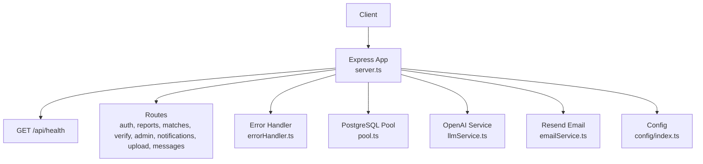
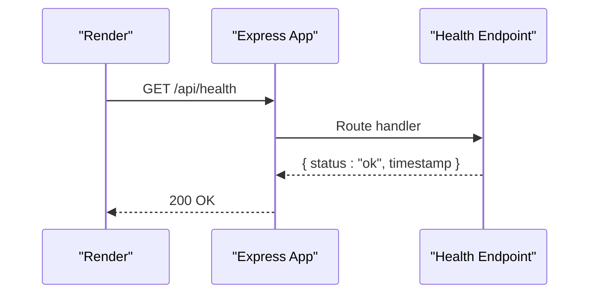
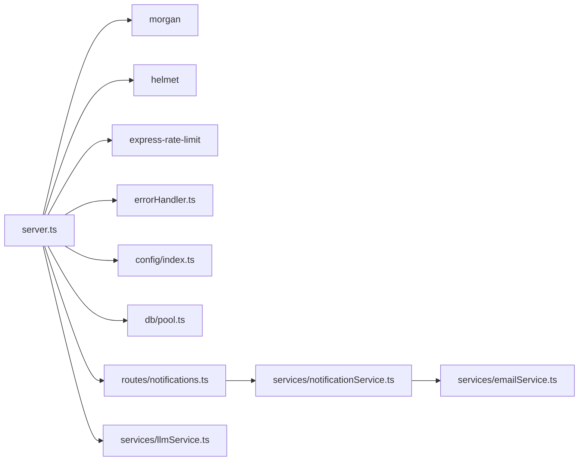

# Monitoring & Logging Setup

<cite>
**Referenced Files in This Document**
- [render.yaml](file://render.yaml)
- [server.ts](file://backend/src/server.ts)
- [config/index.ts](file://backend/src/config/index.ts)
- [errorHandler.ts](file://backend/src/middleware/errorHandler.ts)
- [pool.ts](file://backend/src/db/pool.ts)
- [emailService.ts](file://backend/src/services/emailService.ts)
- [llmService.ts](file://backend/src/services/llmService.ts)
- [notifications.ts](file://backend/src/routes/notifications.ts)
- [notificationService.ts](file://backend/src/services/notificationService.ts)
- [package.json](file://backend/package.json)
</cite>

## Table of Contents
1. [Introduction](#introduction)
2. [Project Structure](#project-structure)
3. [Core Components](#core-components)
4. [Architecture Overview](#architecture-overview)
5. [Detailed Component Analysis](#detailed-component-analysis)
6. [Dependency Analysis](#dependency-analysis)
7. [Performance Considerations](#performance-considerations)
8. [Troubleshooting Guide](#troubleshooting-guide)
9. [Conclusion](#conclusion)
10. [Appendices](#appendices)

## Introduction
This document describes the monitoring and logging setup for the Render deployment of the Lost & Found AI Matcher backend. It covers structured logging, log levels, health checks, performance metrics collection, error tracking, alerting considerations, dashboard setup guidance, integration points with external services, log rotation and retention policies, privacy considerations, troubleshooting workflows using logs and monitoring data, and performance profiling techniques.

## Project Structure
The backend is an Express application that uses:
- Morgan for HTTP request/response logging
- Helmet for security headers
- Rate limiting to protect endpoints
- A centralized error handler for consistent error responses
- A database pool with error handling
- External integrations (OpenAI, Resend) with graceful fallbacks
- A health endpoint used by Render for liveness probes

**Diagram sources**
- [server.ts:1-52](file://backend/src/server.ts#L1-L52)
- [pool.ts:1-48](file://backend/src/db/pool.ts#L1-L48)
- [llmService.ts:1-120](file://backend/src/services/llmService.ts#L1-L120)
- [emailService.ts:1-32](file://backend/src/services/emailService.ts#L1-L32)
- [config/index.ts:1-49](file://backend/src/config/index.ts#L1-L49)

**Section sources**
- [render.yaml:1-54](file://render.yaml#L1-L54)
- [server.ts:1-52](file://backend/src/server.ts#L1-L52)
- [config/index.ts:1-49](file://backend/src/config/index.ts#L1-L49)

## Core Components
- HTTP logging via Morgan with environment-aware format selection
- Centralized error handling with typed errors and user-safe messages
- Health check endpoint for Render liveness probe
- Database pool with connection settings and error logging
- External service wrappers with safe fallbacks (email, LLM)
- Configuration management for environment-specific behavior

Key responsibilities:
- server.ts wires middleware, routes, rate limiting, and health endpoint
- errorHandler.ts defines AppError, asyncHandler, and global error response formatting
- pool.ts configures PostgreSQL pool and logs unexpected pool errors
- emailService.ts and llmService.ts encapsulate external calls and handle failures gracefully
- config/index.ts centralizes environment variables and runtime constants

**Section sources**
- [server.ts:18-45](file://backend/src/server.ts#L18-L45)
- [errorHandler.ts:4-56](file://backend/src/middleware/errorHandler.ts#L4-L56)
- [pool.ts:9-32](file://backend/src/db/pool.ts#L9-L32)
- [emailService.ts:15-31](file://backend/src/services/emailService.ts#L15-L31)
- [llmService.ts:9-17](file://backend/src/services/llmService.ts#L9-L17)
- [config/index.ts:6-48](file://backend/src/config/index.ts#L6-L48)

## Architecture Overview
The application exposes a REST API with a dedicated health endpoint. Requests flow through security and logging middleware before reaching route handlers. Errors are caught and normalized. The app integrates with PostgreSQL, OpenAI, and Resend. Render performs periodic health checks against the configured path.

**Diagram sources**
- [render.yaml:13-13](file://render.yaml#L13-L13)
- [server.ts:32-34](file://backend/src/server.ts#L32-L34)

**Section sources**
- [render.yaml:1-54](file://render.yaml#L1-L54)
- [server.ts:18-45](file://backend/src/server.ts#L18-L45)

## Detailed Component Analysis

### HTTP Request Logging and Log Levels
- Morgan is enabled with a production format when NODE_ENV is production; otherwise, a development-friendly format is used.
- Logs include standard HTTP fields such as method, URL, status, and response time.
- Log level control is driven by environment configuration; no custom logger library is present.

Operational notes:
- In production, use combined format for richer context suitable for aggregation systems.
- For structured logs, consider adding a JSON formatter or integrating a structured logger later.

**Section sources**
- [server.ts:23-23](file://backend/src/server.ts#L23-L23)
- [config/index.ts:8-8](file://backend/src/config/index.ts#L8-L8)
- [package.json:25-25](file://backend/package.json#L25-L25)

### Application Health Checks
- A simple GET /api/health returns a JSON object with status and timestamp.
- Render’s blueprint sets this path as the healthCheckPath, enabling automatic restarts on failure.

Operational notes:
- Extend health checks to include dependency readiness (e.g., database connectivity, external API reachability).
- Return appropriate HTTP codes and enrich payload with component statuses for deeper insights.

**Section sources**
- [render.yaml:13-13](file://render.yaml#L13-L13)
- [server.ts:32-34](file://backend/src/server.ts#L32-L34)

### Error Tracking and Handling
- Centralized error handler normalizes responses and distinguishes operational vs unexpected errors.
- Multer upload errors are handled with user-friendly messages.
- Unhandled errors are logged and return a generic 500 response.
- Async route handlers are wrapped to propagate errors consistently.

Operational notes:
- Integrate an error reporting service (e.g., Sentry) to capture stack traces and contextual metadata.
- Add correlation IDs per request for tracing across services.

**Section sources**
- [errorHandler.ts:4-56](file://backend/src/middleware/errorHandler.ts#L4-L56)

### Database Monitoring and Error Handling
- PostgreSQL pool is configured with SSL for non-local connections, timeouts, and max connections.
- Pool-level errors are logged to stderr.

Operational notes:
- Expose pool metrics (active/idle connections, queue length) if supported by your driver or adapter.
- Monitor query latency and slow queries at the database layer.

**Section sources**
- [pool.ts:9-32](file://backend/src/db/pool.ts#L9-L32)

### External Service Observability
- Email service logs warnings when configuration is missing and throws on send failures.
- LLM service wraps calls with try/catch and returns safe defaults on failure.

Operational notes:
- Add metrics around call success/failure rates and latencies for external APIs.
- Implement retries with backoff and circuit breakers where appropriate.

**Section sources**
- [emailService.ts:15-31](file://backend/src/services/emailService.ts#L15-L31)
- [llmService.ts:85-119](file://backend/src/services/llmService.ts#L85-L119)

### Notifications and Alerting Hooks
- Notification routes provide read counts and listing for users.
- Notification service creates in-app notifications and optionally emails users; failures to send email are logged but do not block in-app notifications.

Operational notes:
- Use these hooks to trigger alerts (e.g., high error rates, failed deliveries) by emitting events to an alerting pipeline.
- Consider adding webhook-based notifications for critical system events.

**Section sources**
- [notifications.ts:14-84](file://backend/src/routes/notifications.ts#L14-L84)
- [notificationService.ts:19-62](file://backend/src/services/notificationService.ts#L19-L62)

## Dependency Analysis
The following diagram shows key runtime dependencies and their roles in monitoring and logging.

**Diagram sources**
- [server.ts:1-16](file://backend/src/server.ts#L1-L16)
- [errorHandler.ts:16-56](file://backend/src/middleware/errorHandler.ts#L16-L56)
- [pool.ts:1-48](file://backend/src/db/pool.ts#L1-L48)
- [notifications.ts:1-85](file://backend/src/routes/notifications.ts#L1-L85)
- [notificationService.ts:1-88](file://backend/src/services/notificationService.ts#L1-L88)
- [emailService.ts:1-32](file://backend/src/services/emailService.ts#L1-L32)
- [llmService.ts:1-120](file://backend/src/services/llmService.ts#L1-L120)
- [config/index.ts:1-49](file://backend/src/config/index.ts#L1-L49)

**Section sources**
- [server.ts:1-52](file://backend/src/server.ts#L1-L52)
- [package.json:16-31](file://backend/package.json#L16-L31)

## Performance Considerations
- Rate limiting is applied to all /api/* routes to mitigate abuse and protect resources.
- JSON body size is limited to reduce memory pressure.
- Database pool parameters are tuned for concurrency and timeouts.
- External service calls (LLM, email) should be monitored for latency and failure rates.

Recommendations:
- Add request duration metrics and expose them via a metrics endpoint or telemetry SDK.
- Profile CPU and memory usage during load tests; adjust pool sizes and limits accordingly.
- Cache expensive computations where possible (e.g., embeddings reuse).

[No sources needed since this section provides general guidance]

## Troubleshooting Guide
Common issues and how to investigate using logs and monitoring data:

- Health check failures:
  - Inspect Render’s health check logs and ensure /api/health responds with 200.
  - Verify environment variables and service startup logs.

- High error rates:
  - Review centralized error logs from the error handler.
  - Correlate with HTTP status codes from Morgan logs.

- Database connectivity problems:
  - Check pool error logs for unexpected errors.
  - Validate DATABASE_URL and network access to Supabase.

- External service failures:
  - Email send failures are logged; confirm API keys and sender address.
  - LLM call failures return safe defaults; monitor for degraded matching quality.

- Upload issues:
  - Multer errors are handled and returned with clear messages; validate file size and field names.

Workflows:
- Reproduce the issue and capture request IDs or timestamps.
- Filter logs by time range and relevant endpoints.
- If using an error tracking tool, search by exception type and stack trace.

**Section sources**
- [errorHandler.ts:30-46](file://backend/src/middleware/errorHandler.ts#L30-L46)
- [pool.ts:30-32](file://backend/src/db/pool.ts#L30-L32)
- [emailService.ts:15-31](file://backend/src/services/emailService.ts#L15-L31)
- [llmService.ts:85-119](file://backend/src/services/llmService.ts#L85-L119)

## Conclusion
The current setup provides essential observability foundations: HTTP logging via Morgan, a health endpoint for Render, centralized error handling, and robust database pool configuration. External service integrations include safe fallbacks and basic logging. To enhance production readiness, consider adding structured logging, metrics collection, error tracking integration, and advanced alerting based on the existing notification hooks.

[No sources needed since this section summarizes without analyzing specific files]

## Appendices

### Structured Logging Implementation Plan
- Replace plain console logs with a structured logger (e.g., pino) to emit JSON lines.
- Include consistent fields: timestamp, level, message, requestId, userId (when available), endpoint, statusCode, latencyMs.
- Configure Morgan to output JSON in production for easy ingestion by log aggregators.

[No sources needed since this section provides general guidance]

### Log Aggregation Strategy
- Aggregate stdout/stderr logs from Render into a log management platform.
- Parse JSON logs to enable filtering by level, endpoint, and user context.
- Set up dashboards for request volume, error rates, and latency percentiles.

[No sources needed since this section provides general guidance]

### Performance Metrics Collection
- Instrument request durations and expose a /metrics endpoint or integrate a telemetry SDK.
- Track database query latency and pool utilization.
- Monitor external API call success rates and latencies.

[No sources needed since this section provides general guidance]

### Error Tracking Integration
- Integrate an error reporting service to capture exceptions, stack traces, and contextual metadata.
- Map AppError instances to actionable categories and tags.

[No sources needed since this section provides general guidance]

### Alerting Configuration
- Define thresholds for error rates, latency spikes, and health check failures.
- Use notification hooks to trigger alerts for critical events (e.g., repeated email send failures).

[No sources needed since this section provides general guidance]

### Dashboard Setup
- Create dashboards for:
  - Request throughput and error rates
  - Latency distributions (p50, p95, p99)
  - Database pool metrics
  - External service call outcomes

[No sources needed since this section provides general guidance]

### Monitoring Tool Integration
- Integrate with APM tools to trace requests across routes and services.
- Correlate logs with traces using requestId.

[No sources needed since this section provides general guidance]

### Log Rotation and Retention Policies
- Configure log rotation at the platform level to manage disk usage.
- Define retention periods aligned with compliance and storage costs.

[No sources needed since this section provides general guidance]

### Privacy Considerations
- Avoid logging sensitive data (passwords, tokens, personal identifiers).
- Redact or mask fields in logs; sanitize request bodies where necessary.
- Ensure logs comply with data protection requirements.

[No sources needed since this section provides general guidance]

### Performance Profiling Techniques
- Use Node.js profiler or APM tools to identify hotspots.
- Conduct load testing to validate scaling and resource limits.
- Analyze database query plans for slow queries.

[No sources needed since this section provides general guidance]