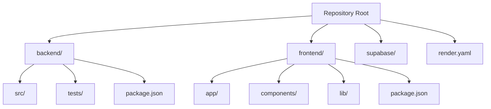
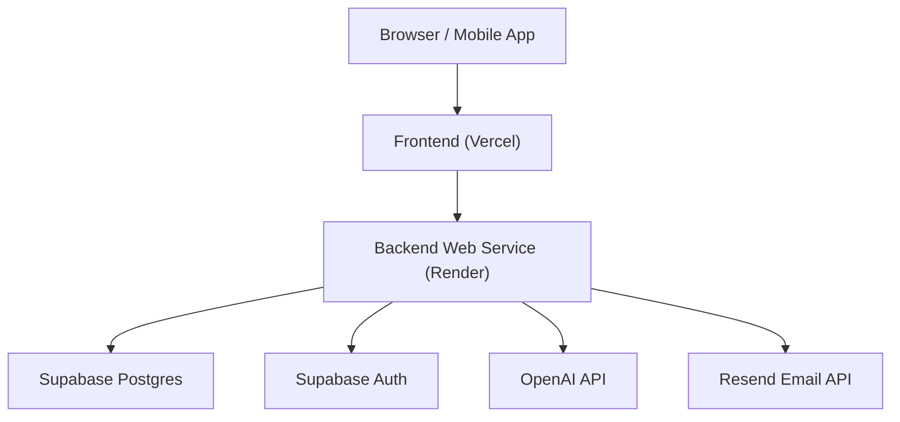
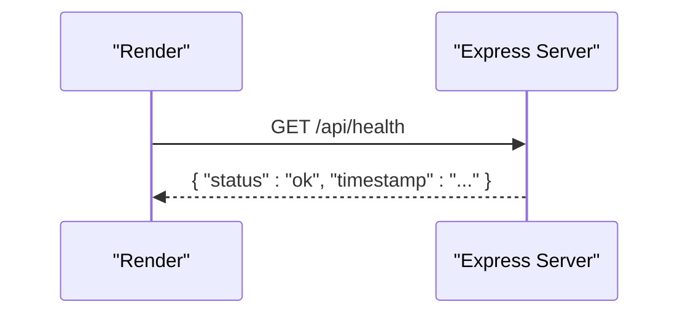
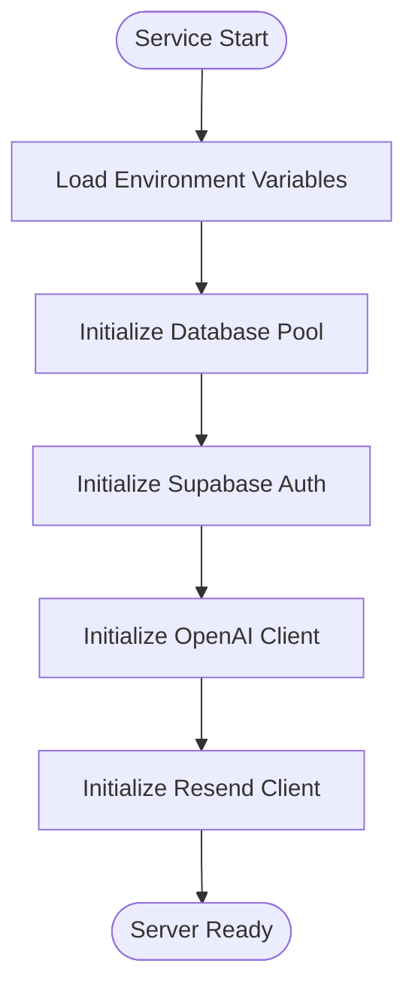
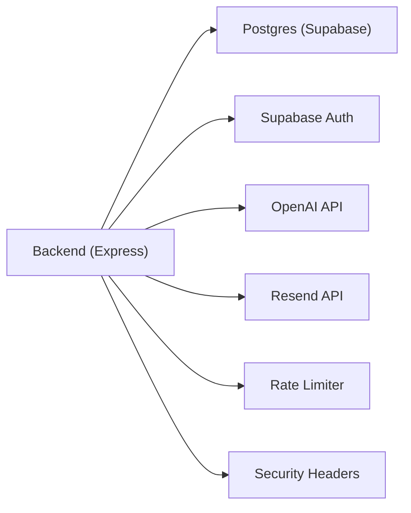

# Render Service Configuration

<cite>
**Referenced Files in This Document**
- [render.yaml](file://render.yaml)
- [backend/package.json](file://backend/package.json)
- [frontend/package.json](file://frontend/package.json)
- [package.json](file://package.json)
- [DEPLOYMENT.md](file://DEPLOYMENT.md)
- [backend/src/server.ts](file://backend/src/server.ts)
- [backend/src/config/index.ts](file://backend/src/config/index.ts)
</cite>

## Table of Contents
1. [Introduction](#introduction)
2. [Project Structure](#project-structure)
3. [Core Components](#core-components)
4. [Architecture Overview](#architecture-overview)
5. [Detailed Component Analysis](#detailed-component-analysis)
6. [Dependency Analysis](#dependency-analysis)
7. [Performance Considerations](#performance-considerations)
8. [Troubleshooting Guide](#troubleshooting-guide)
9. [Conclusion](#conclusion)
10. [Appendices](#appendices)

## Introduction
This document explains how the Lost & Found AI Matcher backend is configured for deployment on Render using a blueprint file. It covers the web service definition, Node.js environment setup, build and start commands, health check configuration, service plan and region selection, root directory structure, environment variables and secrets, and service dependencies. It also includes guidance for scaling, custom build processes, and troubleshooting common Render configuration issues.

## Project Structure
The repository contains both frontend and backend code. The Render blueprint targets only the backend service and specifies the root directory where Render will run its build and start commands.

**Diagram sources**
- [render.yaml:4-13](file://render.yaml#L4-L13)
- [backend/package.json:1-15](file://backend/package.json#L1-L15)
- [frontend/package.json:1-10](file://frontend/package.json#L1-L10)

Key points:
- Blueprint root directory: backend
- Build command runs inside backend to compile TypeScript and install dependencies
- Start command launches the compiled Express server

**Section sources**
- [render.yaml:4-13](file://render.yaml#L4-L13)
- [backend/package.json:1-15](file://backend/package.json#L1-L15)
- [frontend/package.json:1-10](file://frontend/package.json#L1-L10)

## Core Components
- Web service type: web
- Environment runtime: node
- Plan: free
- Region: ohio
- Root directory: backend
- Build command: npm install && npm run build
- Start command: node dist/server.js
- Health check path: /api/health

Environment variables include both public and secret values. Public values can be set directly in the blueprint; secrets should be set via the Render dashboard as encrypted secrets.

**Section sources**
- [render.yaml:4-54](file://render.yaml#L4-L54)
- [DEPLOYMENT.md:59-79](file://DEPLOYMENT.md#L59-L79)

## Architecture Overview
The Render blueprint provisions a single web service that builds and runs the Express backend. The frontend is deployed separately (e.g., Vercel) and communicates with the backend over HTTPS. The backend integrates with Supabase (Auth + Postgres), OpenAI, and Resend for email.

**Diagram sources**
- [backend/src/server.ts:18-47](file://backend/src/server.ts#L18-L47)
- [backend/src/config/index.ts:6-48](file://backend/src/config/index.ts#L6-L48)
- [DEPLOYMENT.md:59-91](file://DEPLOYMENT.md#L59-L91)

## Detailed Component Analysis

### Web Service Definition
- Type: web
- Name: lost-found-api
- Environment: node
- Plan: free
- Region: ohio
- Root directory: backend
- Build command: npm install && npm run build
- Start command: node dist/server.js
- Health check path: /api/health

Notes:
- The blueprint sets NODE_ENV=production and PORT=4000 by default.
- CORS and frontend URL are configured via environment variables.

**Section sources**
- [render.yaml:4-13](file://render.yaml#L4-L13)
- [backend/package.json:5-15](file://backend/package.json#L5-L15)

### Environment Setup (Node.js)
- Runtime: node
- Build process compiles TypeScript to JavaScript under backend/dist
- Start command executes the compiled server entry point

Runtime behavior:
- The server reads configuration from environment variables and initializes middleware such as CORS, rate limiting, security headers, and logging.

**Section sources**
- [render.yaml:7-12](file://render.yaml#L7-L12)
- [backend/src/server.ts:18-30](file://backend/src/server.ts#L18-L30)
- [backend/src/config/index.ts:6-10](file://backend/src/config/index.ts#L6-L10)

### Build and Start Commands
- Build: installs dependencies and runs the TypeScript compiler
- Start: runs the compiled Express server

These commands are defined in the blueprint and align with scripts in the backend package configuration.

**Section sources**
- [render.yaml:11-12](file://render.yaml#L11-L12)
- [backend/package.json:5-15](file://backend/package.json#L5-L15)

### Health Check Configuration
- Health endpoint: GET /api/health
- Returns a JSON status object indicating the service is healthy
- Render uses this path to verify service readiness

**Diagram sources**
- [render.yaml:13](file://render.yaml#L13)
- [backend/src/server.ts:32-34](file://backend/src/server.ts#L32-L34)

**Section sources**
- [render.yaml:13](file://render.yaml#L13)
- [backend/src/server.ts:32-34](file://backend/src/server.ts#L32-L34)

### Service Plan Options
- Current plan: free
- The free plan is suitable for development or low-traffic services
- For higher traffic or performance needs, consider upgrading to a paid plan in the Render dashboard

**Section sources**
- [render.yaml:8](file://render.yaml#L8)
- [DEPLOYMENT.md:59-79](file://DEPLOYMENT.md#L59-L79)

### Root Directory Structure
- Blueprint rootDir: backend
- Build and start commands execute within this directory
- Frontend remains separate and is not built by Render

**Section sources**
- [render.yaml:10](file://render.yaml#L10)
- [backend/package.json:1-15](file://backend/package.json#L1-L15)

### Region Selection (Ohio)
- Region: ohio
- Selecting a region close to your users can reduce latency
- Changing regions requires updating the blueprint and redeploying

**Section sources**
- [render.yaml:9](file://render.yaml#L9)

### Deployment Blueprint Syntax
- Services array defines one or more services
- Each service has type, name, env, plan, region, rootDir, buildCommand, startCommand, healthCheckPath, and envVars
- Secrets are marked with sync: false and must be set in the Render dashboard

**Section sources**
- [render.yaml:4-54](file://render.yaml#L4-L54)

### Examples of Different Service Types
- Web service: current backend (type: web)
- Background worker: type: worker for jobs like image processing or batch matching
- Static site: type: static for hosting assets or documentation sites

Note: These examples illustrate how to extend the blueprint beyond a single web service.

[No sources needed since this section provides conceptual examples]

### Scaling Configurations
- Free plan does not support horizontal autoscaling
- Vertical scaling can be achieved by upgrading the plan
- For high concurrency, consider connection pooling and caching strategies in the application layer

[No sources needed since this section provides general guidance]

### Custom Build Processes
- The current build installs dependencies and compiles TypeScript
- You can customize the buildCommand to add steps like linting, tests, or asset optimization before compilation
- Ensure the final output matches what the startCommand expects

**Section sources**
- [render.yaml:11](file://render.yaml#L11)
- [backend/package.json:5-15](file://backend/package.json#L5-L15)

### Environment Variable Management and Secrets
- Public variables: NODE_ENV, PORT, FRONTEND_URL, CORS_ORIGINS, NEXT_PUBLIC_SUPABASE_URL, NEXT_PUBLIC_SUPABASE_ANON_KEY, EMAIL_FROM, NEXT_PUBLIC_API_URL, API_URL
- Secret variables: SUPABASE_SERVICE_ROLE_KEY, DATABASE_URL, OPENAI_API_KEY, RESEND_API_KEY, JWT_SECRET
- Secrets must be set in the Render dashboard and marked as encrypted
- Avoid committing real secrets to version control

**Section sources**
- [render.yaml:14-54](file://render.yaml#L14-L54)
- [DEPLOYMENT.md:63-79](file://DEPLOYMENT.md#L63-L79)

### Service Dependencies
- Supabase: Auth and Postgres
- OpenAI: embeddings and AI features
- Resend: transactional emails
- Rate limiting and security middleware protect the API

**Diagram sources**
- [backend/src/config/index.ts:6-48](file://backend/src/config/index.ts#L6-L48)
- [backend/src/server.ts:18-47](file://backend/src/server.ts#L18-L47)

**Section sources**
- [backend/src/config/index.ts:6-48](file://backend/src/config/index.ts#L6-L48)
- [backend/src/server.ts:18-47](file://backend/src/server.ts#L18-L47)

## Dependency Analysis
The backend depends on several external services and libraries. The blueprint ensures these dependencies are available at runtime through environment variables.

**Diagram sources**
- [backend/src/server.ts:18-47](file://backend/src/server.ts#L18-L47)
- [backend/src/config/index.ts:6-48](file://backend/src/config/index.ts#L6-L48)

**Section sources**
- [backend/src/server.ts:18-47](file://backend/src/server.ts#L18-L47)
- [backend/src/config/index.ts:6-48](file://backend/src/config/index.ts#L6-L48)

## Performance Considerations
- Use production logging mode in production
- Apply rate limiting to protect endpoints
- Configure CORS strictly to allowed origins
- Tune request size limits if necessary
- Consider connection pooling for database access
- Monitor memory usage and CPU on the chosen plan

[No sources needed since this section provides general guidance]

## Troubleshooting Guide
Common issues and resolutions:
- Health check fails: ensure /api/health is reachable and returns a success response
- CORS errors: set FRONTEND_URL and CORS_ORIGINS to match your deployed frontend domain
- Database connectivity: verify DATABASE_URL and credentials; use session pooler settings when applicable
- Authentication failures: confirm JWT_SECRET is set and consistent between signup/login flows
- External API keys: ensure OPENAI_API_KEY and RESEND_API_KEY are correctly set in the Render dashboard
- Build failures: confirm buildCommand installs dependencies and compiles successfully; check TypeScript errors

Verification steps:
- After deployment, call GET /api/health to validate service health
- Test user signup and login flows end-to-end
- Confirm emails are sent via Resend logs

**Section sources**
- [render.yaml:13-54](file://render.yaml#L13-L54)
- [DEPLOYMENT.md:59-104](file://DEPLOYMENT.md#L59-L104)
- [backend/src/server.ts:32-34](file://backend/src/server.ts#L32-L34)

## Conclusion
The Render blueprint configures a Node.js web service that builds and runs the Express backend in the Ohio region. It defines clear build and start commands, a health check endpoint, and environment variables for both public configuration and secrets. By following the documented steps and best practices, you can deploy, scale, and maintain the service reliably while integrating with Supabase, OpenAI, and Resend.

[No sources needed since this section summarizes without analyzing specific files]

## Appendices

### Appendix A: Blueprint Reference
- Services array: list of services to provision
- Web service fields: type, name, env, plan, region, rootDir, buildCommand, startCommand, healthCheckPath, envVars
- Secrets: set via Render dashboard and marked as encrypted

**Section sources**
- [render.yaml:4-54](file://render.yaml#L4-L54)

### Appendix B: Backend Scripts and Entrypoint
- Build script compiles TypeScript
- Start script runs the compiled server
- Health endpoint returns service status

**Section sources**
- [backend/package.json:5-15](file://backend/package.json#L5-L15)
- [backend/src/server.ts:32-34](file://backend/src/server.ts#L32-L34)