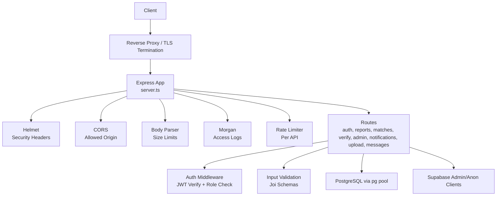
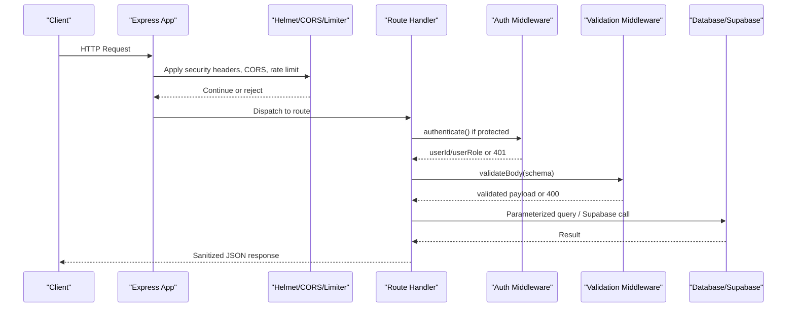
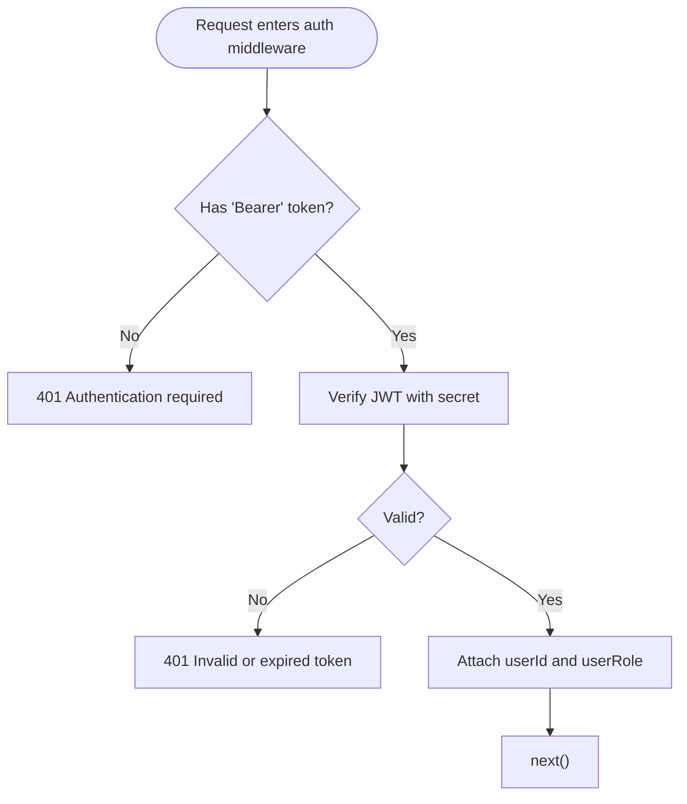
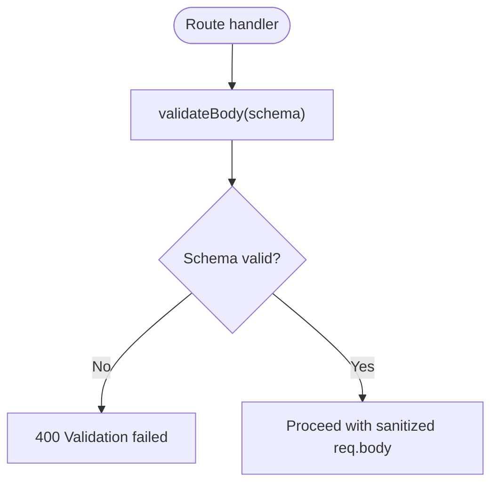
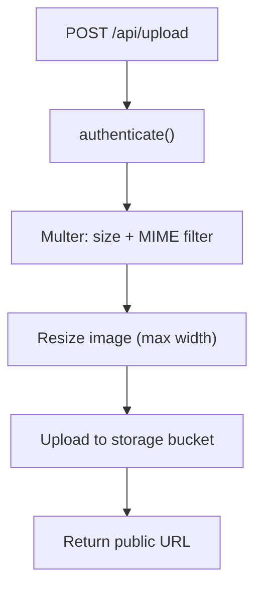
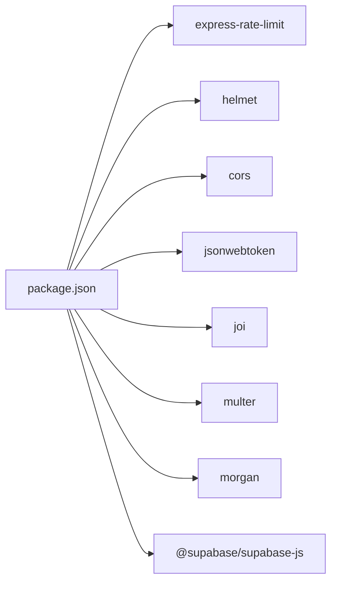

# Security Hardening & Best Practices

<cite>
**Referenced Files in This Document**
- [server.ts](file://backend/src/server.ts)
- [config/index.ts](file://backend/src/config/index.ts)
- [middleware/auth.ts](file://backend/src/middleware/auth.ts)
- [middleware/validate.ts](file://backend/src/middleware/validate.ts)
- [middleware/errorHandler.ts](file://backend/src/middleware/errorHandler.ts)
- [routes/auth.ts](file://backend/src/routes/auth.ts)
- [routes/admin.ts](file://backend/src/routes/admin.ts)
- [routes/upload.ts](file://backend/src/routes/upload.ts)
- [db/supabase.ts](file://backend/src/db/supabase.ts)
- [package.json](file://backend/package.json)
- [001_initial_schema.sql](file://supabase/migrations/001_initial_schema.sql)
</cite>

## Table of Contents
1. [Introduction](#introduction)
2. [Project Structure](#project-structure)
3. [Core Components](#core-components)
4. [Architecture Overview](#architecture-overview)
5. [Detailed Component Analysis](#detailed-component-analysis)
6. [Dependency Analysis](#dependency-analysis)
7. [Performance Considerations](#performance-considerations)
8. [Troubleshooting Guide](#troubleshooting-guide)
9. [Conclusion](#conclusion)
10. [Appendices](#appendices)

## Introduction
This document provides a comprehensive security hardening guide for the backend deployment. It covers authentication middleware, input validation, CORS configuration, rate limiting, JWT token management, session handling, CSRF protection, HTTPS enforcement, security headers, vulnerability scanning, logging and audit trails, error sanitization, security monitoring, secure coding practices, dependency updates, and incident response procedures. The guidance is grounded in the actual implementation present in the codebase.

## Project Structure
The backend is an Express application with modular middleware, routes, services, and database integration. Security controls are applied at multiple layers:
- Global middleware (security headers, CORS, body parsing, request logging, rate limiting)
- Route-level guards (authentication and authorization)
- Input validation schemas per endpoint
- Secure file upload handling
- Database Row Level Security policies

**Diagram sources**
- [server.ts:1-52](file://backend/src/server.ts#L1-L52)
- [middleware/auth.ts:1-59](file://backend/src/middleware/auth.ts#L1-L59)
- [middleware/validate.ts:1-61](file://backend/src/middleware/validate.ts#L1-L61)
- [db/supabase.ts:1-21](file://backend/src/db/supabase.ts#L1-L21)

**Section sources**
- [server.ts:1-52](file://backend/src/server.ts#L1-L52)
- [package.json:16-31](file://backend/package.json#L16-L31)

## Core Components
- Authentication and Authorization:
  - JWT-based authentication middleware validates tokens and attaches user identity and role to requests.
  - Admin-only endpoints enforce server-side role checks against the database.
- Input Validation:
  - Centralized Joi schemas validate request bodies and strip unknown fields.
- CORS:
  - Configured to allow only the configured frontend origin with credentials enabled.
- Rate Limiting:
  - Global rate limiter protects all API routes from abuse.
- Security Headers:
  - Helmet sets standard security headers across responses.
- File Upload Security:
  - Multer enforces file size limits and MIME type filtering; images are resized before storage.
- Error Handling:
  - Centralized error handler sanitizes error responses and handles multer errors safely.
- Logging:
  - Morgan logs HTTP requests with environment-aware formatting.
- Database Security:
  - Supabase clients separate service role (admin) and anon (RLS-enforced) access.
  - PostgreSQL Row Level Security policies restrict data access by user context.

**Section sources**
- [middleware/auth.ts:1-59](file://backend/src/middleware/auth.ts#L1-L59)
- [middleware/validate.ts:1-61](file://backend/src/middleware/validate.ts#L1-L61)
- [server.ts:18-30](file://backend/src/server.ts#L18-L30)
- [routes/upload.ts:15-27](file://backend/src/routes/upload.ts#L15-L27)
- [middleware/errorHandler.ts:16-47](file://backend/src/middleware/errorHandler.ts#L16-L47)
- [db/supabase.ts:1-21](file://backend/src/db/supabase.ts#L1-L21)
- [001_initial_schema.sql:322-363](file://supabase/migrations/001_initial_schema.sql#L322-L363)

## Architecture Overview
The request lifecycle applies layered security:
- Incoming requests pass through helmet, cors, body parser, morgan, and rate limiter.
- Routes apply authentication and authorization where required.
- Request payloads are validated using Joi schemas.
- Responses are sanitized via centralized error handling.
- Data access uses parameterized queries and RLS policies.

**Diagram sources**
- [server.ts:18-45](file://backend/src/server.ts#L18-L45)
- [middleware/auth.ts:22-37](file://backend/src/middleware/auth.ts#L22-L37)
- [middleware/validate.ts:8-23](file://backend/src/middleware/validate.ts#L8-L23)
- [routes/admin.ts:11-12](file://backend/src/routes/admin.ts#L11-L12)

## Detailed Component Analysis

### Authentication Middleware and JWT Management
- Token verification:
  - Extracts Bearer token from Authorization header.
  - Verifies signature and expiration using a secret from configuration.
  - Attaches userId and userRole to the request for downstream use.
- Admin authorization:
  - Requires prior authentication.
  - Queries the users table to confirm role equals admin before allowing access.
- Token issuance:
  - Sign-in and signup issue JWTs containing sub, role, and email with a configurable expiry.

**Diagram sources**
- [middleware/auth.ts:22-37](file://backend/src/middleware/auth.ts#L22-L37)
- [routes/auth.ts:30-35](file://backend/src/routes/auth.ts#L30-L35)
- [routes/auth.ts:62-66](file://backend/src/routes/auth.ts#L62-L66)

**Section sources**
- [middleware/auth.ts:1-59](file://backend/src/middleware/auth.ts#L1-L59)
- [routes/auth.ts:16-72](file://backend/src/routes/auth.ts#L16-L72)
- [config/index.ts:28-31](file://backend/src/config/index.ts#L28-L31)

### Input Validation Strategy
- Centralized validation middleware validates request bodies against Joi schemas.
- Known schemas cover lost/found report submissions and verification inputs.
- Unknown fields are stripped to prevent accidental data leakage.
- Validation errors return structured 400 responses with aggregated messages.

**Diagram sources**
- [middleware/validate.ts:8-23](file://backend/src/middleware/validate.ts#L8-L23)
- [middleware/validate.ts:27-61](file://backend/src/middleware/validate.ts#L27-L61)

**Section sources**
- [middleware/validate.ts:1-61](file://backend/src/middleware/validate.ts#L1-L61)

### CORS Configuration
- CORS is enabled with a specific allowed origin from configuration and credentials support.
- This ensures cross-origin requests are permitted only from the trusted frontend URL.

**Section sources**
- [server.ts:19-20](file://backend/src/server.ts#L19-L20)
- [config/index.ts:6-10](file://backend/src/config/index.ts#L6-L10)

### Rate Limiting Setup
- A global rate limiter is applied to all API routes under /api/.
- Limits are defined per window and include a friendly error message on exceedance.

**Section sources**
- [server.ts:25-30](file://backend/src/server.ts#L25-L30)

### HTTPS Enforcement and Security Headers
- Helmet is used to set common security headers.
- HTTPS termination should be handled by the reverse proxy or platform load balancer; the app itself does not configure TLS.

**Section sources**
- [server.ts:18-23](file://backend/src/server.ts#L18-L23)

### Session Handling and CSRF Protection
- The application uses stateless JWTs rather than server-side sessions.
- No explicit CSRF protection middleware is implemented; CSRF risk is mitigated by:
  - Using Authorization headers instead of cookies for API calls.
  - Restricting CORS to a single trusted origin.
  - Avoiding cookie-based authentication flows.

**Section sources**
- [routes/auth.ts:30-35](file://backend/src/routes/auth.ts#L30-L35)
- [routes/auth.ts:62-66](file://backend/src/routes/auth.ts#L62-L66)
- [server.ts:19-20](file://backend/src/server.ts#L19-L20)

### Secure File Uploads
- Multer enforces:
  - Memory storage with a maximum file size limit.
  - MIME type filtering to accept only image files.
- Uploaded images are resized to reduce payload size and processing overhead.
- Files are uploaded to a storage bucket via the Supabase admin client.

**Diagram sources**
- [routes/upload.ts:12-27](file://backend/src/routes/upload.ts#L12-L27)
- [routes/upload.ts:32-67](file://backend/src/routes/upload.ts#L32-L67)

**Section sources**
- [routes/upload.ts:1-69](file://backend/src/routes/upload.ts#L1-L69)

### Database Access and Row Level Security
- Two Supabase clients:
  - Service role client for server-side operations that bypass RLS.
  - Anon client for user-scoped operations respecting RLS.
- PostgreSQL Row Level Security policies restrict visibility and mutations based on user context.

**Section sources**
- [db/supabase.ts:1-21](file://backend/src/db/supabase.ts#L1-L21)
- [001_initial_schema.sql:322-363](file://supabase/migrations/001_initial_schema.sql#L322-L363)

### Audit Trails and Logging
- Item status changes are recorded in an audit log table with actor and reason.
- Morgan logs HTTP requests with environment-specific formats.

**Section sources**
- [routes/admin.ts:208-227](file://backend/src/routes/admin.ts#L208-L227)
- [server.ts:23](file://backend/src/server.ts#L23)
- [001_initial_schema.sql:224-236](file://supabase/migrations/001_initial_schema.sql#L224-L236)

### Error Sanitization
- Centralized error handler:
  - Returns structured error responses without leaking stack traces.
  - Handles multer-specific errors with safe messages.
  - Wraps async handlers to catch promise rejections uniformly.

**Section sources**
- [middleware/errorHandler.ts:1-56](file://backend/src/middleware/errorHandler.ts#L1-L56)

## Dependency Analysis
Key security-related dependencies and their roles:
- express-rate-limit: Rate limiting for API endpoints.
- helmet: Security headers.
- cors: Cross-origin policy control.
- jsonwebtoken: JWT signing and verification.
- joi: Input validation schemas.
- multer: File upload handling with size and type constraints.
- morgan: HTTP request logging.
- @supabase/supabase-js: Database and storage access with distinct client modes.

**Diagram sources**
- [package.json:16-31](file://backend/package.json#L16-L31)

**Section sources**
- [package.json:16-31](file://backend/package.json#L16-L31)

## Performance Considerations
- Rate limiting prevents resource exhaustion and reduces brute-force risk.
- Image resizing reduces bandwidth and storage costs while maintaining quality.
- Parameterized queries and RLS minimize overhead and improve safety.
- Environment-aware logging balances detail and performance.

[No sources needed since this section provides general guidance]

## Troubleshooting Guide
Common issues and resolutions:
- Authentication failures:
  - Ensure Authorization header includes a valid Bearer token.
  - Verify JWT secret configuration and token expiry settings.
- Validation errors:
  - Check request body against expected Joi schema; ensure required fields and types match.
- Upload errors:
  - Confirm file size within limits and MIME type is an image.
  - Inspect storage bucket permissions and upload flow.
- Rate limit exceeded:
  - Reduce request frequency or adjust limits if appropriate for your deployment.
- Unexpected errors:
  - Review centralized error handler output; avoid exposing internal details to clients.

**Section sources**
- [middleware/auth.ts:22-37](file://backend/src/middleware/auth.ts#L22-L37)
- [middleware/validate.ts:8-23](file://backend/src/middleware/validate.ts#L8-L23)
- [routes/upload.ts:15-27](file://backend/src/routes/upload.ts#L15-L27)
- [server.ts:25-30](file://backend/src/server.ts#L25-L30)
- [middleware/errorHandler.ts:16-47](file://backend/src/middleware/errorHandler.ts#L16-L47)

## Conclusion
The backend implements a robust set of security controls: JWT-based authentication with server-side role checks, strict input validation, CORS restricted to a trusted origin, global rate limiting, security headers via Helmet, secure file uploads, centralized error handling, and database-level Row Level Security. For production hardening, ensure HTTPS termination at the reverse proxy, rotate secrets regularly, monitor logs and metrics, and maintain dependency updates and vulnerability scans.

[No sources needed since this section summarizes without analyzing specific files]

## Appendices

### Security Checklist and Recommendations
- HTTPS Enforcement:
  - Terminate TLS at the reverse proxy or platform edge; ensure HSTS is configured upstream.
- Secret Management:
  - Use environment variables for JWT_SECRET, database credentials, and service keys; never commit secrets.
- CORS Policy:
  - Keep origin strictly scoped to the frontend domain; disable wildcard origins.
- Rate Limiting:
  - Tune windows and thresholds based on traffic patterns; consider IP-based or user-based strategies.
- Input Validation:
  - Define schemas for every endpoint; prefer strict validation and strip unknown fields.
- File Uploads:
  - Enforce size and type limits; sanitize filenames; resize images; store securely with least privilege.
- Logging and Monitoring:
  - Enable structured logging; forward to a central system; alert on anomalies and repeated failures.
- Vulnerability Scanning:
  - Integrate dependency scanning into CI/CD; patch critical vulnerabilities promptly.
- Incident Response:
  - Define runbooks for authentication failures, abuse spikes, and data exposure; practice drills.

[No sources needed since this section provides general guidance]