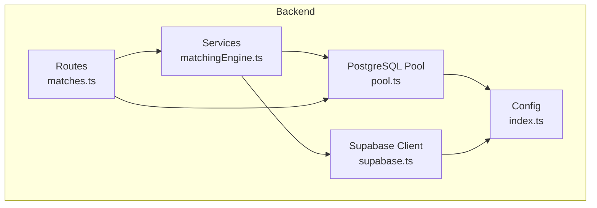
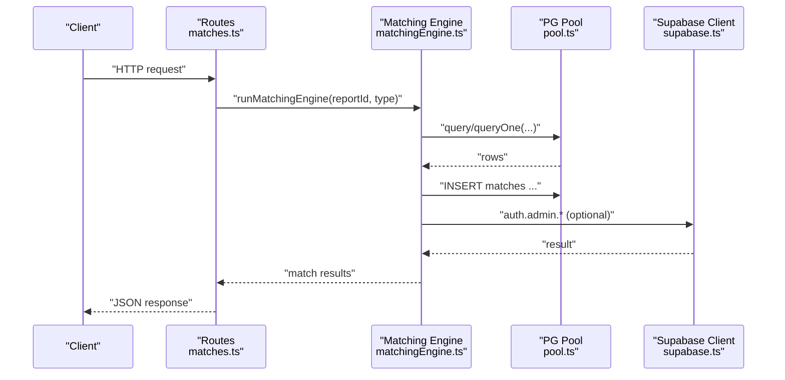
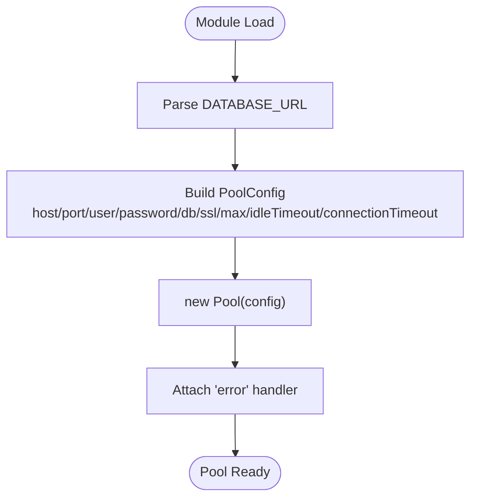
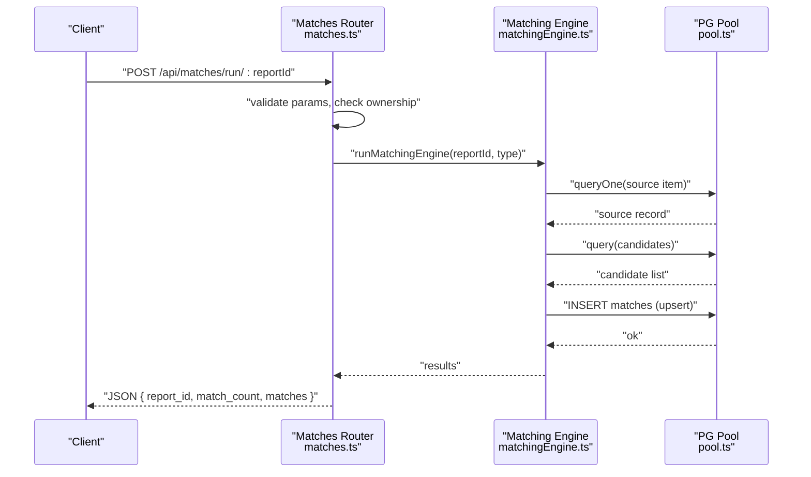
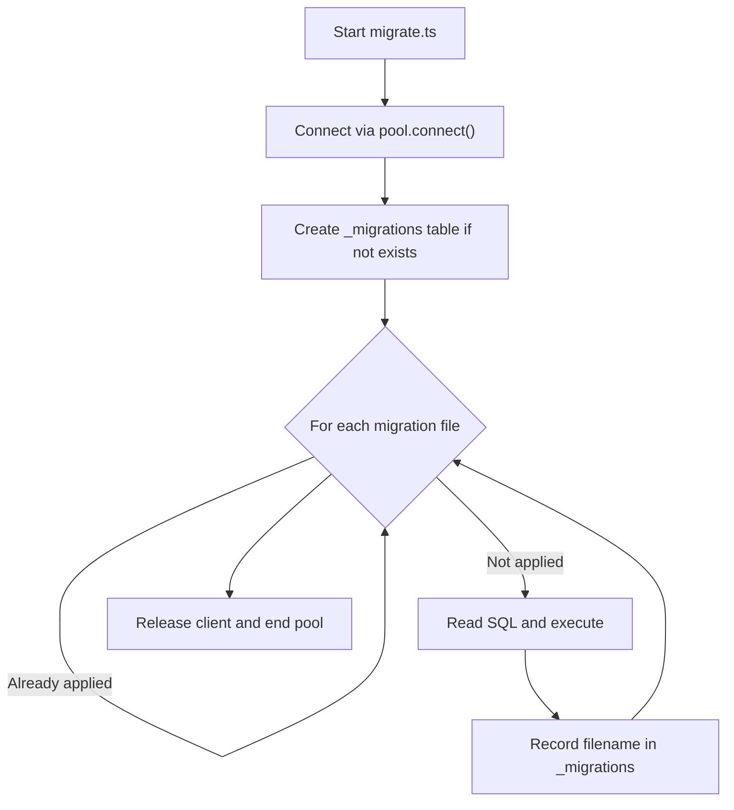
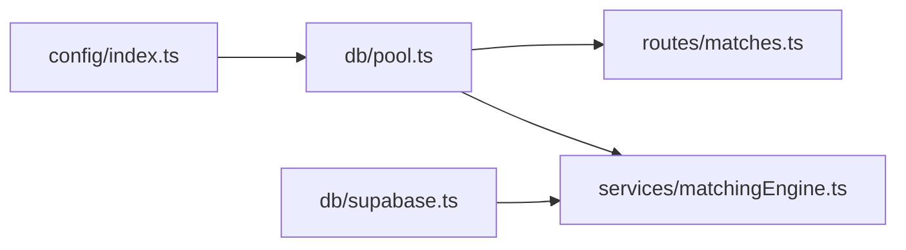

# Connection Pooling & Performance

<cite>
**Referenced Files in This Document**
- [pool.ts](file://backend/src/db/pool.ts)
- [supabase.ts](file://backend/src/db/supabase.ts)
- [index.ts](file://backend/src/config/index.ts)
- [matches.ts](file://backend/src/routes/matches.ts)
- [matchingEngine.ts](file://backend/src/services/matchingEngine.ts)
- [migrate.ts](file://backend/src/db/migrate.ts)
- [seed.ts](file://backend/src/db/seed.ts)
- [errorHandler.ts](file://backend/src/middleware/errorHandler.ts)
- [package.json](file://backend/package.json)
</cite>

## Table of Contents
1. [Introduction](#introduction)
2. [Project Structure](#project-structure)
3. [Core Components](#core-components)
4. [Architecture Overview](#architecture-overview)
5. [Detailed Component Analysis](#detailed-component-analysis)
6. [Dependency Analysis](#dependency-analysis)
7. [Performance Considerations](#performance-considerations)
8. [Troubleshooting Guide](#troubleshooting-guide)
9. [Conclusion](#conclusion)
10. [Appendices](#appendices)

## Introduction
This document explains how PostgreSQL connections are managed and optimized in the backend, focusing on connection pooling configuration, lifecycle management, performance tuning, monitoring strategies, error handling, and scaling considerations. It also clarifies the differences between using a direct Supabase client versus a custom pg-based connection pool for database operations.

## Project Structure
The backend uses two primary mechanisms to interact with data:
- A custom PostgreSQL connection pool built on the pg library for direct SQL execution.
- A Supabase client for higher-level operations (e.g., authentication admin APIs), which abstracts HTTP calls to Supabase services.

**Diagram sources**
- [matches.ts:1-115](file://backend/src/routes/matches.ts#L1-L115)
- [matchingEngine.ts:1-208](file://backend/src/services/matchingEngine.ts#L1-L208)
- [pool.ts:1-48](file://backend/src/db/pool.ts#L1-L48)
- [supabase.ts:1-21](file://backend/src/db/supabase.ts#L1-L21)
- [index.ts:1-49](file://backend/src/config/index.ts#L1-L49)

**Section sources**
- [pool.ts:1-48](file://backend/src/db/pool.ts#L1-L48)
- [supabase.ts:1-21](file://backend/src/db/supabase.ts#L1-L21)
- [index.ts:1-49](file://backend/src/config/index.ts#L1-L49)

## Core Components
- PostgreSQL connection pool:
  - Built with pg.Pool and configured via a URL parser that sets host, port, user, password, database, SSL behavior, max connections, idle timeout, and connection timeout.
  - Exposes query helpers for returning arrays or single rows.
- Supabase clients:
  - Admin client (service role key) for server-side operations bypassing row-level security.
  - Anon client (anon key) for operations respecting row-level security.
- Configuration:
  - Centralized environment-driven settings including database URL and Supabase credentials.

Key responsibilities:
- pool.ts: Create and manage the pg connection pool; provide typed query wrappers; handle pool errors.
- supabase.ts: Initialize Supabase clients with appropriate keys.
- index.ts: Provide runtime configuration values from environment variables.

**Section sources**
- [pool.ts:9-28](file://backend/src/db/pool.ts#L9-L28)
- [pool.ts:30-48](file://backend/src/db/pool.ts#L30-L48)
- [supabase.ts:4-20](file://backend/src/db/supabase.ts#L4-L20)
- [index.ts:6-18](file://backend/src/config/index.ts#L6-L18)

## Architecture Overview
The application routes receive requests, validate inputs, and call services. Services perform business logic and issue queries through the shared PostgreSQL pool. Some workflows also call Supabase admin APIs for user management or other platform features.

**Diagram sources**
- [matches.ts:15-45](file://backend/src/routes/matches.ts#L15-L45)
- [matchingEngine.ts:37-189](file://backend/src/services/matchingEngine.ts#L37-L189)
- [pool.ts:34-48](file://backend/src/db/pool.ts#L34-L48)
- [supabase.ts:8-20](file://backend/src/db/supabase.ts#L8-L20)

## Detailed Component Analysis

### PostgreSQL Connection Pool (pg.Pool)
- Purpose: Manage a reusable set of PostgreSQL connections to reduce overhead and improve throughput.
- Configuration highlights:
  - Max connections: fixed at 20.
  - Idle timeout: 30 seconds.
  - Connection timeout: 10 seconds.
  - SSL: enabled for non-local hosts with hostname verification disabled for convenience in development-like environments.
- Lifecycle:
  - Pool is created once at module load time.
  - Query helpers acquire and release connections automatically per request.
  - Global error listener logs unexpected pool errors.
- Usage patterns:
  - Direct queries via pool.query in scripts (migration, seeding).
  - Typed wrappers query and queryOne used by routes and services.

**Diagram sources**
- [pool.ts:9-28](file://backend/src/db/pool.ts#L9-L28)
- [pool.ts:30-32](file://backend/src/db/pool.ts#L30-L32)

**Section sources**
- [pool.ts:9-28](file://backend/src/db/pool.ts#L9-L28)
- [pool.ts:30-48](file://backend/src/db/pool.ts#L30-L48)

### Supabase Clients
- Admin client: Uses service role key to bypass Row Level Security; suitable for server-side administrative tasks.
- Anon client: Uses anon key; respects RLS; suitable for user-scoped operations when needed from the backend.

Operational notes:
- Both clients are initialized from centralized config values.
- They are primarily used for auth/admin flows rather than direct SQL.

**Section sources**
- [supabase.ts:4-20](file://backend/src/db/supabase.ts#L4-L20)
- [index.ts:11-15](file://backend/src/config/index.ts#L11-L15)

### Route Integration and Data Access
- Routes authenticate requests and enforce ownership checks before querying.
- Database access is performed via pool query helpers to fetch reports and match records.
- Matching engine orchestrates scoring and persists match results.

**Diagram sources**
- [matches.ts:15-45](file://backend/src/routes/matches.ts#L15-L45)
- [matchingEngine.ts:37-189](file://backend/src/services/matchingEngine.ts#L37-L189)
- [pool.ts:34-48](file://backend/src/db/pool.ts#L34-L48)

**Section sources**
- [matches.ts:15-45](file://backend/src/routes/matches.ts#L15-L45)
- [matchingEngine.ts:37-189](file://backend/src/services/matchingEngine.ts#L37-L189)

### Migration and Seeding Scripts
- Migration script:
  - Connects to the pool, creates a migrations tracking table, applies SQL files idempotently, and ensures proper release and shutdown.
- Seed script:
  - Uses Supabase admin API to ensure an admin user exists, then inserts sample records via the pool.

**Diagram sources**
- [migrate.ts:5-46](file://backend/src/db/migrate.ts#L5-L46)

**Section sources**
- [migrate.ts:5-46](file://backend/src/db/migrate.ts#L5-L46)
- [seed.ts:4-70](file://backend/src/db/seed.ts#L4-L70)

## Dependency Analysis
- The pool depends on configuration for the database URL and environment-specific SSL behavior.
- Routes depend on both the pool and the matching engine service.
- The matching engine depends on the pool for data retrieval and persistence, and optionally on Supabase for user-related operations.

**Diagram sources**
- [index.ts:6-18](file://backend/src/config/index.ts#L6-L18)
- [pool.ts:1-48](file://backend/src/db/pool.ts#L1-L48)
- [matches.ts:1-115](file://backend/src/routes/matches.ts#L1-L115)
- [matchingEngine.ts:1-208](file://backend/src/services/matchingEngine.ts#L1-L208)
- [supabase.ts:1-21](file://backend/src/db/supabase.ts#L1-L21)

**Section sources**
- [pool.ts:1-48](file://backend/src/db/pool.ts#L1-L48)
- [matches.ts:1-115](file://backend/src/routes/matches.ts#L1-L115)
- [matchingEngine.ts:1-208](file://backend/src/services/matchingEngine.ts#L1-L208)
- [supabase.ts:1-21](file://backend/src/db/supabase.ts#L1-L21)
- [index.ts:1-49](file://backend/src/config/index.ts#L1-L49)

## Performance Considerations
- Connection pool sizing:
  - Current max connections is fixed at 20. For high concurrency, consider increasing this value based on CPU cores and database capacity.
  - Ensure idleTimeoutMillis is tuned to reclaim unused connections promptly without causing churn.
  - Set connectionTimeoutMillis to fail fast under load and avoid long waits.
- Query performance:
  - Use parameterized queries (already used) to prevent injection and enable plan caching.
  - Add indexes on frequently filtered/joined columns (e.g., status, user_id, timestamps) to speed up candidate selection and joins.
  - Limit result sets and avoid selecting unnecessary columns.
- Statement cache and memory:
  - The pg driver caches prepared statements by default; keep statement complexity reasonable.
  - Avoid large object payloads in queries; stream when necessary.
- Timeouts:
  - Apply query-level timeouts where supported by your deployment to prevent runaway queries.
  - Consider setting statement_timeout at the session or database level for safety.
- Monitoring:
  - Track pool metrics: active, idle, waiting counts, and acquisition latency.
  - Log slow queries and aggregate them for analysis.
  - Monitor database server metrics (CPU, I/O, locks) alongside application metrics.
- Error handling:
  - Use global pool error listener to detect connection issues early.
  - Wrap route handlers with async error handling to return consistent error responses.

[No sources needed since this section provides general guidance]

## Troubleshooting Guide
Common issues and mitigations:
- Connection exhaustion:
  - Symptom: Requests queue or fail with connection timeouts.
  - Actions: Increase pool.max, verify all queries release connections, add timeouts, and monitor pool utilization.
- Slow queries:
  - Symptom: High latency endpoints.
  - Actions: Analyze query plans, add indexes, reduce result sets, and consider pagination.
- SSL or connectivity errors:
  - Symptom: Connection failures to remote databases.
  - Actions: Verify DATABASE_URL, SSL options, and network/firewall rules.
- Unexpected pool errors:
  - Action: Inspect the global error handler logs for stack traces and context.

Operational references:
- Pool error logging is implemented to surface unexpected errors.
- Route-level errors are handled centrally to standardize responses.

**Section sources**
- [pool.ts:30-32](file://backend/src/db/pool.ts#L30-L32)
- [errorHandler.ts:16-47](file://backend/src/middleware/errorHandler.ts#L16-L47)

## Conclusion
The backend employs a straightforward yet effective PostgreSQL connection pool with sensible defaults for local development and remote usage. For production-scale workloads, tune pool size and timeouts, optimize queries with indexing and efficient selects, and implement robust monitoring and error handling. Use Supabase clients for platform-specific operations while keeping direct SQL paths lean and well-indexed for performance.

[No sources needed since this section summarizes without analyzing specific files]

## Appendices

### Differences Between Direct Supabase Client and Custom Connection Pool
- Direct Supabase client:
  - Higher-level HTTP-based API over Supabase services.
  - Ideal for auth/admin operations and when you want to leverage Supabase’s ecosystem.
  - Does not directly control PostgreSQL connection pools.
- Custom pg connection pool:
  - Direct SQL execution with fine-grained control over connection lifecycle and performance parameters.
  - Suitable for complex queries, bulk operations, and precise performance tuning.

**Section sources**
- [supabase.ts:4-20](file://backend/src/db/supabase.ts#L4-L20)
- [pool.ts:9-28](file://backend/src/db/pool.ts#L9-L28)

### Scaling and Load Balancing Guidelines
- Horizontal scaling:
  - Run multiple backend instances behind a load balancer; each instance maintains its own pool sized appropriately for its resources.
- Database scaling:
  - Use read replicas for read-heavy workloads; direct write traffic to the primary.
  - Consider connection pooling proxies (e.g., PgBouncer) in front of the database to manage many small connections efficiently.
- Capacity planning:
  - Right-size pool.max based on measured peak concurrency and database capacity.
  - Continuously monitor and adjust timeouts and pool sizes under realistic load.

[No sources needed since this section provides general guidance]