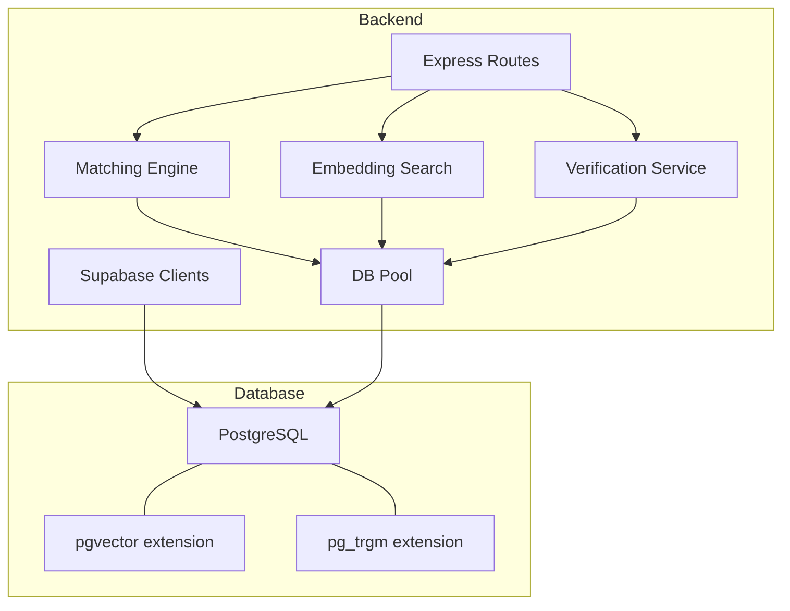
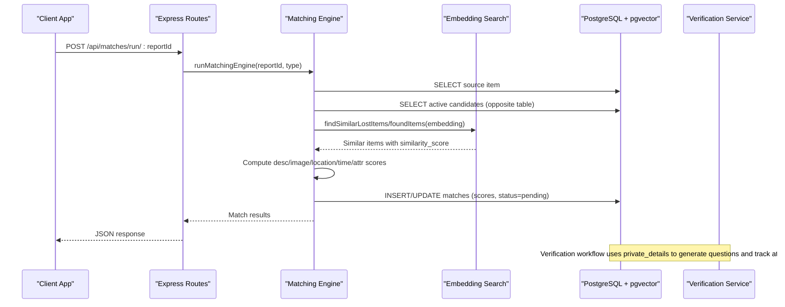
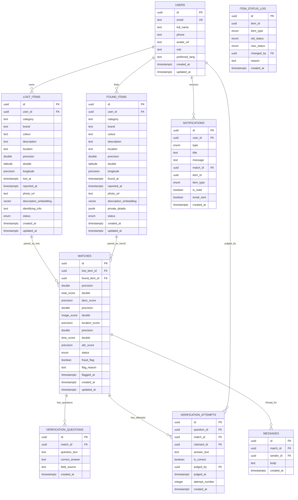
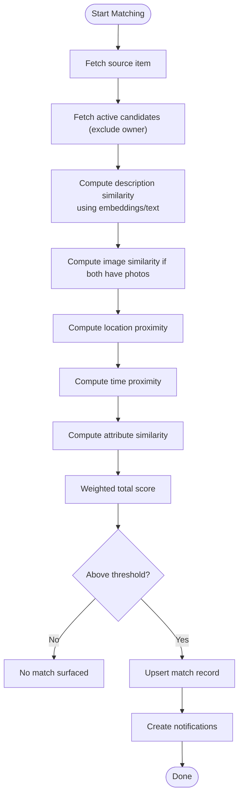
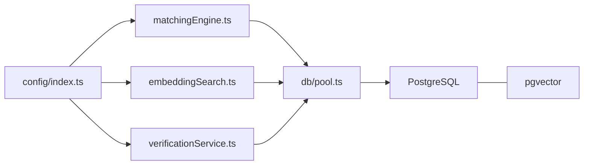

# Database Schema & Structure

<cite>
**Referenced Files in This Document**
- [001_initial_schema.sql](file://supabase/migrations/001_initial_schema.sql)
- [002_messages.sql](file://supabase/migrations/002_messages.sql)
- [003_admin_fraud_flag.sql](file://supabase/migrations/003_admin_fraud_flag.sql)
- [SCHEMA_REFERENCE.md](file://SCHEMA_REFERENCE.md)
- [embeddingSearch.ts](file://backend/src/services/embeddingSearch.ts)
- [matchingEngine.ts](file://backend/src/services/matchingEngine.ts)
- [verificationService.ts](file://backend/src/services/verificationService.ts)
- [messages.ts](file://backend/src/routes/messages.ts)
- [matches.ts](file://backend/src/routes/matches.ts)
- [pool.ts](file://backend/src/db/pool.ts)
- [supabase.ts](file://backend/src/db/supabase.ts)
- [index.ts](file://backend/src/config/index.ts)
</cite>

## Table of Contents
1. Introduction
2. Project Structure
3. Core Components
4. Architecture Overview
5. Detailed Component Analysis
6. Dependency Analysis
7. Performance Considerations
8. Troubleshooting Guide
9. Conclusion
10. Appendices

## Introduction
This document provides comprehensive database schema documentation for the PostgreSQL database with the pgvector extension used by the Lost & Found AI Matcher. It details all tables, relationships, constraints, vector embeddings, indexing strategies, Row-Level Security (RLS), and how the schema supports AI matching and verification workflows. It also includes entity relationship diagrams and performance guidance.

## Project Structure
The database schema is defined in Supabase migrations and extended via application code that performs vector similarity searches, scoring, and verification. The backend uses a direct PostgreSQL connection pool for queries and Supabase clients for RLS-aware or service-role operations.

**Diagram sources**
- [001_initial_schema.sql:6-9](file://supabase/migrations/001_initial_schema.sql#L6-L9)
- [pool.ts:1-28](file://backend/src/db/pool.ts#L1-L28)
- [supabase.ts:1-21](file://backend/src/db/supabase.ts#L1-L21)

**Section sources**
- [001_initial_schema.sql:1-370](file://supabase/migrations/001_initial_schema.sql#L1-L370)
- [002_messages.sql:1-53](file://supabase/migrations/002_messages.sql#L1-L53)
- [003_admin_fraud_flag.sql:1-13](file://supabase/migrations/003_admin_fraud_flag.sql#L1-L13)
- [pool.ts:1-48](file://backend/src/db/pool.ts#L1-L48)
- [supabase.ts:1-21](file://backend/src/db/supabase.ts#L1-L21)

## Core Components
- Users: Identity and profile data linked to Supabase auth.users.
- Items: Two parallel entities for lost and found items, each storing structured fields, location/time, media, and a text embedding vector for semantic similarity.
- Matches: Weighted pairing of a lost item with a found item, including per-component scores and status.
- Verification: Question generation from private details and attempt tracking for claimant verification.
- Notifications: Event-driven notifications for matches, verification, and admin messages.
- Messages: Private chat between verified match participants.
- Admin features: Fraud flagging on matches and audit logging for status changes.

Key behaviors:
- Vector embeddings are stored as vector(1536) and indexed with IVFFlat using cosine distance for fast similarity search.
- RLS policies restrict access to sensitive fields and ensure users can only see their own data unless explicitly allowed.
- Matching engine computes weighted scores across description (embeddings), image, location, time, and attributes.

**Section sources**
- [001_initial_schema.sql:54-236](file://supabase/migrations/001_initial_schema.sql#L54-L236)
- [002_messages.sql:8-20](file://supabase/migrations/002_messages.sql#L8-L20)
- [003_admin_fraud_flag.sql:5-12](file://supabase/migrations/003_admin_fraud_flag.sql#L5-L12)
- [SCHEMA_REFERENCE.md:19-152](file://SCHEMA_REFERENCE.md#L19-L152)

## Architecture Overview
The system integrates AI-driven matching and verification with a secure, scalable database layer.

**Diagram sources**
- [matches.ts:15-45](file://backend/src/routes/matches.ts#L15-L45)
- [matchingEngine.ts:37-188](file://backend/src/services/matchingEngine.ts#L37-L188)
- [embeddingSearch.ts:30-62](file://backend/src/services/embeddingSearch.ts#L30-L62)
- [001_initial_schema.sql:145-166](file://supabase/migrations/001_initial_schema.sql#L145-L166)

## Detailed Component Analysis

### Entity Relationship Diagram

**Diagram sources**
- [001_initial_schema.sql:54-236](file://supabase/migrations/001_initial_schema.sql#L54-L236)
- [002_messages.sql:8-20](file://supabase/migrations/002_messages.sql#L8-L20)
- [003_admin_fraud_flag.sql:5-12](file://supabase/migrations/003_admin_fraud_flag.sql#L5-L12)

### Tables and Field Definitions
- users: Extends Supabase auth.users; stores profile, role, and language preference.
- lost_items: Reports of lost items with structured fields, location/time, media, identifying info (private until verification), and a vector embedding for semantic search.
- found_items: Reports of found items with similar structure plus private_details JSONB used to generate verification questions.
- matches: Pairs a lost item with a found item; stores component scores and overall score; supports fraud flagging and timestamps.
- verification_questions: Questions generated from private_details to verify ownership.
- verification_attempts: Records of claimant answers and judgments.
- notifications: User-facing events for matches, verification, and admin messages.
- messages: Chat threads for approved matches between parties.
- item_status_log: Audit trail for status transitions.

Constraints and validation:
- Foreign keys enforce referential integrity across related entities.
- Enums constrain statuses and types to known values.
- Unique constraint on matches prevents duplicate pairs.
- Message body length constrained at the database level.

**Section sources**
- [001_initial_schema.sql:54-236](file://supabase/migrations/001_initial_schema.sql#L54-L236)
- [002_messages.sql:8-20](file://supabase/migrations/002_messages.sql#L8-L20)
- [003_admin_fraud_flag.sql:5-12](file://supabase/migrations/003_admin_fraud_flag.sql#L5-L12)
- [SCHEMA_REFERENCE.md:19-152](file://SCHEMA_REFERENCE.md#L19-L152)

### Vector Column Structure and Indexing Strategy
- Embeddings: Both lost_items and found_items store description_embedding as vector(1536), compatible with OpenAI embeddings.
- Indexes: IVFFlat indexes on description_embedding using cosine_ops with lists=100 optimize nearest neighbor searches.
- Query usage: Backend uses the native cosine distance operator to compute similarity within PostgreSQL, returning top-k results efficiently.

Performance notes:
- IVFFlat index tuning depends on dataset size; lists=100 balances recall and speed for moderate datasets.
- Filtering by status='active' and excluding owner reduces candidate set before vector search.
- Cosine similarity conversion to percentage is computed in SQL for consistent scoring.

**Section sources**
- [001_initial_schema.sql:241-249](file://supabase/migrations/001_initial_schema.sql#L241-L249)
- [embeddingSearch.ts:30-62](file://backend/src/services/embeddingSearch.ts#L30-L62)
- [embeddingSearch.ts:68-100](file://backend/src/services/embeddingSearch.ts#L68-L100)

### Data Flows Between Entities
- Matching flow: Source item fetched; candidates retrieved; similarity scored; matches upserted; notifications created.
- Verification flow: Private details used to generate questions; attempts recorded; judgment updates correctness; escalation triggers admin review.
- Messaging flow: Only after match approval do participants exchange messages; RLS enforces access control.

**Diagram sources**
- [matchingEngine.ts:37-188](file://backend/src/services/matchingEngine.ts#L37-L188)
- [index.ts:33-47](file://backend/src/config/index.ts#L33-L47)

### Row-Level Security Policies and Access Control
- Users: Can read/update own profile.
- Items: Active items visible to everyone; owners can manage their items; private fields restricted by policy logic and app behavior.
- Matches: Visible to item owners via joins checking ownership.
- Notifications: Users see only their own notifications.
- Messages: Only participants of an approved match can read/send messages; enforced by RLS policies and server-side checks.

Security boundaries:
- Sensitive fields (identifying_info, private_details, correct_answer) are not exposed through public views and are protected by RLS and application logic.
- Service role client bypasses RLS for server-side tasks; anon client respects RLS for user-scoped operations.

**Section sources**
- [001_initial_schema.sql:322-365](file://supabase/migrations/001_initial_schema.sql#L322-L365)
- [002_messages.sql:25-52](file://supabase/migrations/002_messages.sql#L25-L52)
- [supabase.ts:1-21](file://backend/src/db/supabase.ts#L1-L21)

### Business Constraints and Validation Rules
- Status enums govern lifecycle states for items, matches, and notifications.
- Unique constraint on matches ensures no duplicate pairings.
- Message body length validated at DB level and via middleware.
- Fraud flag fields added for admin oversight on suspicious matches.

**Section sources**
- [001_initial_schema.sql:14-49](file://supabase/migrations/001_initial_schema.sql#L14-L49)
- [001_initial_schema.sql:145-166](file://supabase/migrations/001_initial_schema.sql#L145-L166)
- [002_messages.sql:8-14](file://supabase/migrations/002_messages.sql#L8-L14)
- [003_admin_fraud_flag.sql:5-12](file://supabase/migrations/003_admin_fraud_flag.sql#L5-L12)

### Supporting Functions and Triggers
- update_updated_at: Automatically refreshes updated_at on row changes for key tables.
- handle_new_user: Creates a users row when a Supabase auth user signs up.
- haversine_km: Computes geographic distance for location scoring.

**Section sources**
- [001_initial_schema.sql:264-316](file://supabase/migrations/001_initial_schema.sql#L264-L316)

## Dependency Analysis
The backend modules depend on the database schema and configuration to perform matching, verification, and messaging.

**Diagram sources**
- [index.ts:6-47](file://backend/src/config/index.ts#L6-L47)
- [matchingEngine.ts:1-6](file://backend/src/services/matchingEngine.ts#L1-L6)
- [embeddingSearch.ts:1-2](file://backend/src/services/embeddingSearch.ts#L1-L2)
- [verificationService.ts:1-5](file://backend/src/services/verificationService.ts#L1-L5)
- [pool.ts:1-28](file://backend/src/db/pool.ts#L1-L28)

**Section sources**
- [index.ts:6-47](file://backend/src/config/index.ts#L6-L47)
- [matchingEngine.ts:1-208](file://backend/src/services/matchingEngine.ts#L1-L208)
- [embeddingSearch.ts:1-101](file://backend/src/services/embeddingSearch.ts#L1-L101)
- [verificationService.ts:1-123](file://backend/src/services/verificationService.ts#L1-L123)
- [pool.ts:1-48](file://backend/src/db/pool.ts#L1-L48)

## Performance Considerations
- Use IVFFlat indexes on vector columns for efficient cosine similarity searches; tune lists parameter based on dataset size and query patterns.
- Filter early by status and owner to reduce candidate sets before vector operations.
- Keep embedding dimensionality consistent (1536) to leverage optimized operators.
- Leverage database functions like haversine_km for spatial calculations to avoid transferring large datasets to application memory.
- Batch operations where possible (e.g., upserting multiple matches) to reduce round trips.
- Monitor query plans for vector searches to ensure index usage; consider re-indexing after significant data changes.

[No sources needed since this section provides general guidance]

## Troubleshooting Guide
Common issues and resolutions:
- Vector search returns no results: Ensure description_embedding is populated and status is 'active'; verify IVFFlat index exists and is being used.
- Duplicate matches: Check unique constraint on (lost_item_id, found_item_id); confirm upsert logic runs correctly.
- Messaging access denied: Confirm match status is 'approved' and RLS policies allow participant access; validate server-side checks.
- Verification failures: Validate private_details content; ensure correct_answer aligns with field_source; check LLM fallback behavior.

Operational tips:
- Use service role client for server-side tasks that must bypass RLS; use anon client for user-scoped operations.
- Inspect logs for LLM errors and fallback paths in verification and matching.
- Review item_status_log for audit trails during disputes or admin interventions.

**Section sources**
- [002_messages.sql:25-52](file://supabase/migrations/002_messages.sql#L25-L52)
- [messages.ts:23-64](file://backend/src/routes/messages.ts#L23-L64)
- [supabase.ts:1-21](file://backend/src/db/supabase.ts#L1-L21)
- [001_initial_schema.sql:224-236](file://supabase/migrations/001_initial_schema.sql#L224-L236)

## Conclusion
The schema provides a robust foundation for AI-powered lost-and-found matching and verification. With pgvector-enabled semantic search, weighted scoring, and strong security via RLS, the system supports scalable and safe operations. Proper indexing, careful filtering, and clear business constraints ensure reliable performance and data integrity.

[No sources needed since this section summarizes without analyzing specific files]

## Appendices

### Configuration Highlights
- Matching weights sum to 1.00; thresholds and windows control sensitivity.
- Supabase URLs and keys configured for both anon and service roles.
- Database connection pooling parameters tuned for concurrency and timeouts.

**Section sources**
- [index.ts:6-47](file://backend/src/config/index.ts#L6-L47)
- [pool.ts:9-28](file://backend/src/db/pool.ts#L9-L28)