# Database Setup & Configuration

<cite>
**Referenced Files in This Document**
- [001_initial_schema.sql](file://supabase/migrations/001_initial_schema.sql)
- [002_messages.sql](file://supabase/migrations/002_messages.sql)
- [003_admin_fraud_flag.sql](file://supabase/migrations/003_admin_fraud_flag.sql)
- [pool.ts](file://backend/src/db/pool.ts)
- [supabase.ts](file://backend/src/db/supabase.ts)
- [index.ts](file://backend/src/config/index.ts)
- [migrate.ts](file://backend/src/db/migrate.ts)
- [seed.ts](file://backend/src/db/seed.ts)
- [e2eTest.ts](file://backend/src/db/e2eTest.ts)
- [embeddingSearch.ts](file://backend/src/services/embeddingSearch.ts)
- [SCHEMA_REFERENCE.md](file://SCHEMA_REFERENCE.md)
</cite>

## Table of Contents
1. Introduction
2. Project Structure
3. Core Components
4. Architecture Overview
5. Detailed Component Analysis
6. Dependency Analysis
7. Performance Considerations
8. Troubleshooting Guide
9. Conclusion
10. Appendices

## Introduction
This document provides a comprehensive guide to setting up and configuring the PostgreSQL database with the pgvector extension for the Lost & Found AI Matcher. It covers schema structure, relationships, indexes, constraints, Row-Level Security (RLS), authentication integration, access control, migration management, connection pooling, performance tuning, backup strategies, seed data, test databases, development configuration, monitoring, query optimization, maintenance procedures, and troubleshooting common issues.

## Project Structure
The database is defined using SQL migrations under the supabase directory and consumed by backend services via a Node.js PostgreSQL client pool and Supabase clients. The schema includes core entities for users, lost/found items, matches, verification workflows, notifications, and message threads, along with RLS policies and vector search support through pgvector.

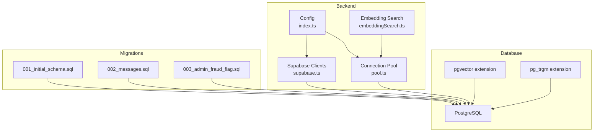

**Diagram sources**
- [pool.ts:1-48](file://backend/src/db/pool.ts#L1-L48)
- [supabase.ts:1-21](file://backend/src/db/supabase.ts#L1-L21)
- [index.ts:1-49](file://backend/src/config/index.ts#L1-L49)
- [embeddingSearch.ts:1-101](file://backend/src/services/embeddingSearch.ts#L1-L101)
- [001_initial_schema.sql:1-370](file://supabase/migrations/001_initial_schema.sql#L1-L370)
- [002_messages.sql:1-53](file://supabase/migrations/002_messages.sql#L1-L53)
- [003_admin_fraud_flag.sql:1-13](file://supabase/migrations/003_admin_fraud_flag.sql#L1-L13)

**Section sources**
- [001_initial_schema.sql:1-370](file://supabase/migrations/001_initial_schema.sql#L1-L370)
- [002_messages.sql:1-53](file://supabase/migrations/002_messages.sql#L1-L53)
- [003_admin_fraud_flag.sql:1-13](file://supabase/migrations/003_admin_fraud_flag.sql#L1-L13)
- [pool.ts:1-48](file://backend/src/db/pool.ts#L1-L48)
- [supabase.ts:1-21](file://backend/src/db/supabase.ts#L1-L21)
- [index.ts:1-49](file://backend/src/config/index.ts#L1-L49)
- [embeddingSearch.ts:1-101](file://backend/src/services/embeddingSearch.ts#L1-L101)

## Core Components
- Schema and extensions:
  - Enables uuid-ossp, pgvector, and pg_trgm.
  - Defines enums for item status, report type, verification status, match status, and notification types.
- Core tables:
  - users: extends Supabase auth.users; stores profile and role.
  - lost_items and found_items: reports with structured fields, location, media, embeddings, and private details.
  - matches: pairs lost and found items with scoring breakdowns and status.
  - verification_questions and verification_attempts: verification workflow records.
  - notifications: user notifications linked to matches or items.
  - item_status_log: audit trail for status changes.
  - messages: secure messaging between parties of approved matches.
- Indexes:
  - Standard B-tree indexes on foreign keys, status, category, and scores.
  - IVFFlat vector indexes for cosine similarity searches on description_embedding.
- Triggers and functions:
  - Auto-update updated_at timestamps.
  - Auto-create public.users row when auth.users is created.
  - Haversine distance function for location proximity calculations.
- Row-Level Security (RLS):
  - Policies restrict access to users’ own profiles, active items visibility, owner-only management, notifications, matches, and messages.

**Section sources**
- [001_initial_schema.sql:6-370](file://supabase/migrations/001_initial_schema.sql#L6-L370)
- [002_messages.sql:1-53](file://supabase/migrations/002_messages.sql#L1-L53)
- [003_admin_fraud_flag.sql:1-13](file://supabase/migrations/003_admin_fraud_flag.sql#L1-L13)
- [SCHEMA_REFERENCE.md:1-205](file://SCHEMA_REFERENCE.md#L1-L205)

## Architecture Overview
The application uses two database access patterns:
- Service-role Supabase client: bypasses RLS for server-side operations requiring elevated privileges.
- Anon Supabase client: respects RLS for user-scoped operations.
- Direct PostgreSQL pool: used for raw queries, migrations, seeding, and embedding search.

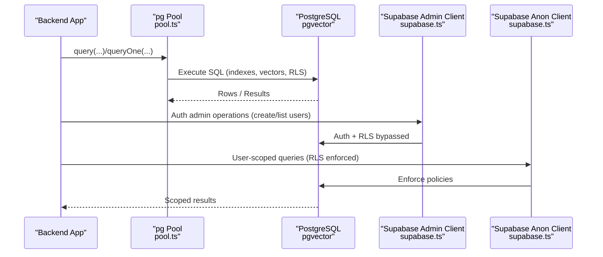

**Diagram sources**
- [pool.ts:1-48](file://backend/src/db/pool.ts#L1-L48)
- [supabase.ts:1-21](file://backend/src/db/supabase.ts#L1-L21)
- [001_initial_schema.sql:319-370](file://supabase/migrations/001_initial_schema.sql#L319-L370)

**Section sources**
- [pool.ts:1-48](file://backend/src/db/pool.ts#L1-L48)
- [supabase.ts:1-21](file://backend/src/db/supabase.ts#L1-L21)
- [001_initial_schema.sql:319-370](file://supabase/migrations/001_initial_schema.sql#L319-L370)

## Detailed Component Analysis

### Schema and Data Model
- Enums define controlled states across the system:
  - item_status: active, matched, verified, returned, closed
  - report_type: lost, found
  - verification_status: pending, question_sent, answered, correct, incorrect, escalated, approved
  - match_status: pending, approved, rejected, disputed
  - notification_type: new_match, verification_question, verification_result, match_approved, match_rejected, item_returned, admin_message
- Tables and relationships:
  - users references auth.users; lost_items and found_items reference users.
  - matches references lost_items and found_items with a unique constraint on pair.
  - verification_questions and verification_attempts reference matches and users.
  - notifications reference users and optionally matches/items.
  - item_status_log tracks polymorphic status changes.
  - messages reference matches and users with RLS restricting access to approved matches.
- Vector columns:
  - description_embedding vector(1536) in lost_items and found_items for semantic similarity.
- Private and internal fields:
  - identifying_info in lost_items and private_details JSONB in found_items are restricted by RLS and UI logic.

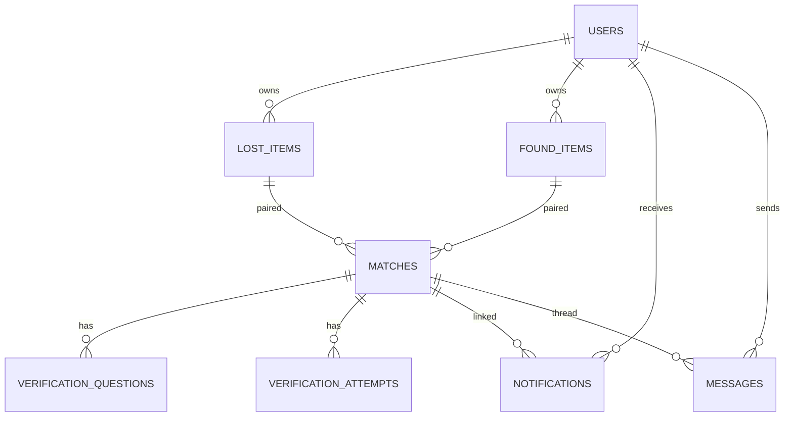

**Diagram sources**
- [001_initial_schema.sql:54-236](file://supabase/migrations/001_initial_schema.sql#L54-L236)
- [002_messages.sql:8-14](file://supabase/migrations/002_messages.sql#L8-L14)

**Section sources**
- [001_initial_schema.sql:14-236](file://supabase/migrations/001_initial_schema.sql#L14-L236)
- [002_messages.sql:1-53](file://supabase/migrations/002_messages.sql#L1-L53)
- [SCHEMA_REFERENCE.md:19-151](file://SCHEMA_REFERENCE.md#L19-L151)

### Indexes and Constraints
- Primary keys and foreign keys enforce referential integrity.
- Unique constraint on matches prevents duplicate pairs.
- B-tree indexes optimize lookups by user_id, status, category, and match scores.
- IVFFlat vector indexes accelerate cosine similarity searches on description_embedding.
- Partial index on matches flags fraud efficiently.

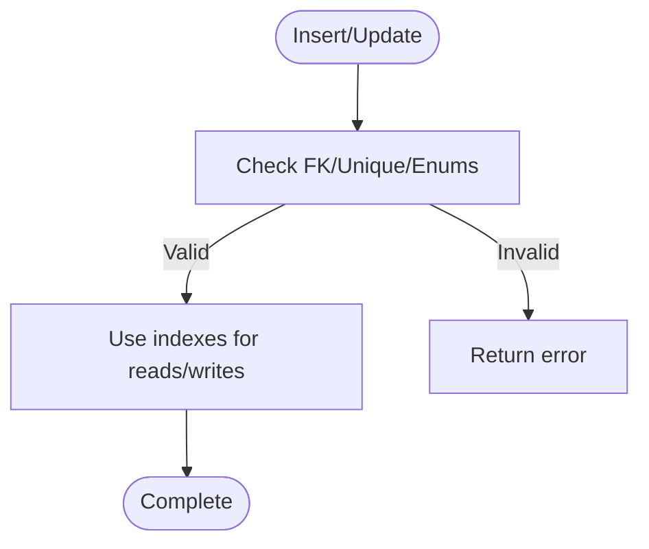

**Diagram sources**
- [001_initial_schema.sql:145-166](file://supabase/migrations/001_initial_schema.sql#L145-L166)
- [001_initial_schema.sql:239-259](file://supabase/migrations/001_initial_schema.sql#L239-L259)
- [003_admin_fraud_flag.sql:5-12](file://supabase/migrations/003_admin_fraud_flag.sql#L5-L12)

**Section sources**
- [001_initial_schema.sql:239-259](file://supabase/migrations/001_initial_schema.sql#L239-L259)
- [003_admin_fraud_flag.sql:5-12](file://supabase/migrations/003_admin_fraud_flag.sql#L5-L12)

### Row-Level Security Policies and Access Control
- Users:
  - Select/update own profile only.
- Items:
  - Active items visible to all; owners can manage their own items.
- Notifications:
  - Users see and update their own notifications.
- Matches:
  - Visible to owners of either related item.
- Messages:
  - Only participants of an approved match can read/send messages.

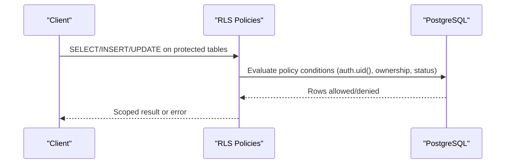

**Diagram sources**
- [001_initial_schema.sql:319-370](file://supabase/migrations/001_initial_schema.sql#L319-L370)
- [002_messages.sql:25-52](file://supabase/migrations/002_messages.sql#L25-L52)

**Section sources**
- [001_initial_schema.sql:319-370](file://supabase/migrations/001_initial_schema.sql#L319-L370)
- [002_messages.sql:25-52](file://supabase/migrations/002_messages.sql#L25-L52)

### Authentication Integration and Triggers
- On auth.users insert, a trigger creates a corresponding public.users row with default values.
- Seed scripts ensure admin roles and sample data exist idempotently.

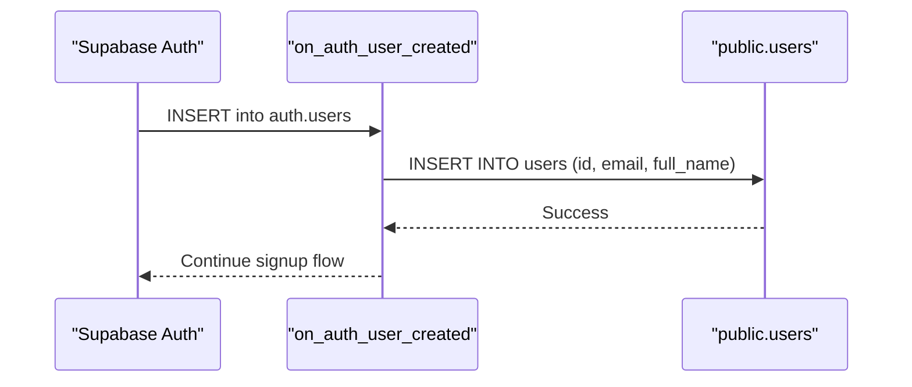

**Diagram sources**
- [001_initial_schema.sql:278-294](file://supabase/migrations/001_initial_schema.sql#L278-L294)
- [seed.ts:39-51](file://backend/src/db/seed.ts#L39-L51)

**Section sources**
- [001_initial_schema.sql:278-294](file://supabase/migrations/001_initial_schema.sql#L278-L294)
- [seed.ts:1-77](file://backend/src/db/seed.ts#L1-L77)

### Migration Process and Version Management
- Migration runner:
  - Scans SQL files in order and applies them if not recorded in _migrations.
  - Tracks applied migrations with filename and timestamp.
- Rollback procedure:
  - No automatic rollback; implement reverse scripts and apply them manually.
  - Maintain versioned rollback SQL alongside forward migrations.

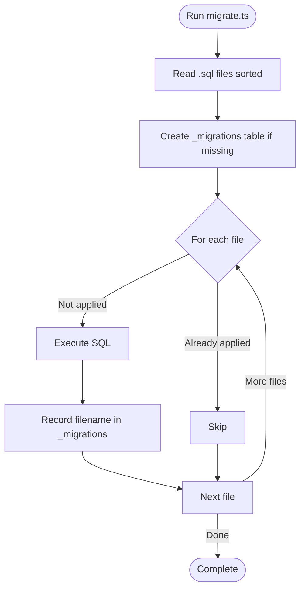

**Diagram sources**
- [migrate.ts:1-53](file://backend/src/db/migrate.ts#L1-L53)

**Section sources**
- [migrate.ts:1-53](file://backend/src/db/migrate.ts#L1-L53)

### Connection Pooling and Configuration
- Pool configuration:
  - Parses DATABASE_URL to set host, port, credentials, database, SSL mode based on hostname pattern.
  - Defaults: max connections 20, idle timeout 30s, connection timeout 10s.
- Environment variables:
  - DATABASE_URL, SUPABASE_* keys, OPENAI_API_KEY, JWT_SECRET, EMAIL settings.
- Clients:
  - supabaseAdmin uses service role key (bypasses RLS).
  - supabaseClient uses anon key (respects RLS).

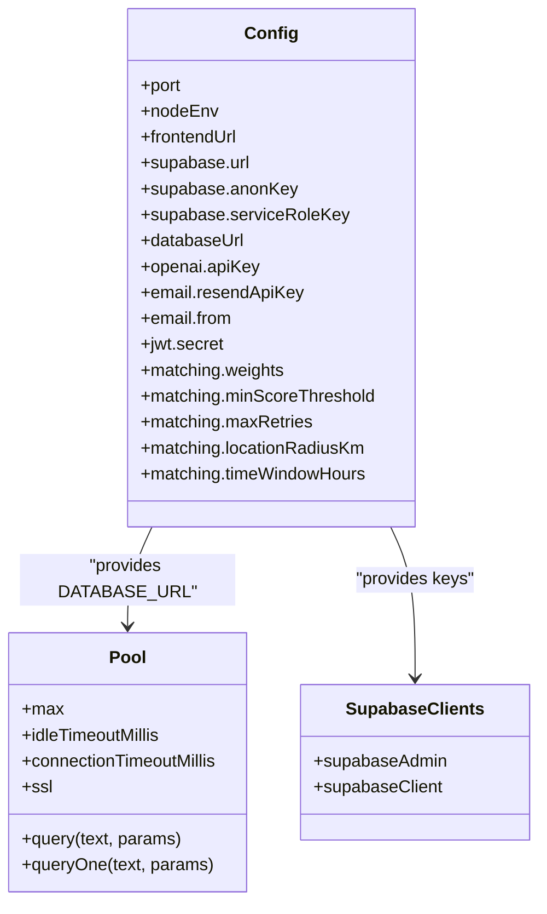

**Diagram sources**
- [index.ts:1-49](file://backend/src/config/index.ts#L1-L49)
- [pool.ts:1-48](file://backend/src/db/pool.ts#L1-L48)
- [supabase.ts:1-21](file://backend/src/db/supabase.ts#L1-L21)

**Section sources**
- [pool.ts:1-48](file://backend/src/db/pool.ts#L1-L48)
- [index.ts:1-49](file://backend/src/config/index.ts#L1-L49)
- [supabase.ts:1-21](file://backend/src/db/supabase.ts#L1-L21)

### Embedding Search and Vector Queries
- Uses pgvector’s cosine distance operator within PostgreSQL to compute similarity scores.
- Filters active items, excludes submitter, enforces minimum score threshold, and limits results.
- Leverages IVFFlat indexes for efficient nearest neighbor search.

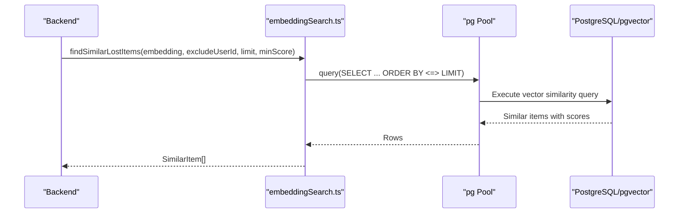

**Diagram sources**
- [embeddingSearch.ts:20-62](file://backend/src/services/embeddingSearch.ts#L20-L62)
- [001_initial_schema.sql:239-249](file://supabase/migrations/001_initial_schema.sql#L239-L249)

**Section sources**
- [embeddingSearch.ts:1-101](file://backend/src/services/embeddingSearch.ts#L1-L101)
- [001_initial_schema.sql:239-249](file://supabase/migrations/001_initial_schema.sql#L239-L249)

### Seed Data, Test Database, and Development Configuration
- Seed script:
  - Creates or reuses an admin user via Supabase Auth admin API.
  - Ensures public.users row exists with admin role.
  - Inserts sample lost and found items idempotently.
- E2E test script:
  - Mirrors cloud auth users locally to satisfy FK triggers.
  - Creates users, items, runs matching engine, generates verification questions, simulates judgment, and cleans up.
- Development environment:
  - Configure DATABASE_URL, Supabase keys, OpenAI key, JWT secret, and email settings in environment variables.

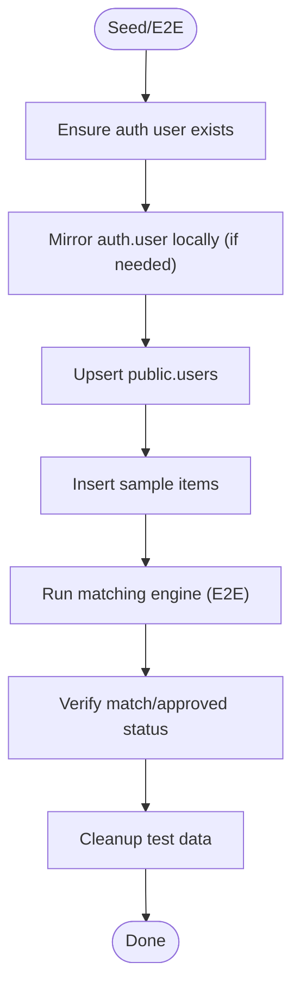

**Diagram sources**
- [seed.ts:1-77](file://backend/src/db/seed.ts#L1-L77)
- [e2eTest.ts:25-82](file://backend/src/db/e2eTest.ts#L25-L82)
- [e2eTest.ts:128-185](file://backend/src/db/e2eTest.ts#L128-L185)
- [e2eTest.ts:240-349](file://backend/src/db/e2eTest.ts#L240-L349)

**Section sources**
- [seed.ts:1-77](file://backend/src/db/seed.ts#L1-L77)
- [e2eTest.ts:1-355](file://backend/src/db/e2eTest.ts#L1-L355)
- [index.ts:1-49](file://backend/src/config/index.ts#L1-L49)

## Dependency Analysis
- Backend depends on:
  - PostgreSQL via pg pool for direct queries and migrations.
  - Supabase clients for auth and RLS-aware operations.
  - pgvector for vector similarity queries.
- Migrations depend on:
  - Extensions: uuid-ossp, pgvector, pg_trgm.
  - Triggers and functions for automation and helper computations.

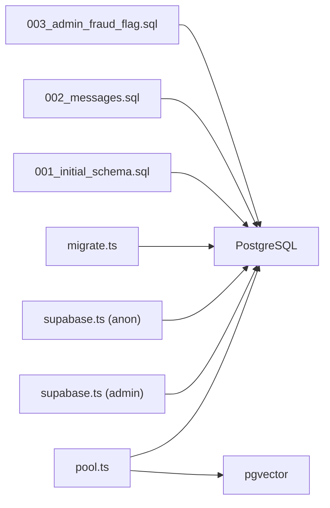

**Diagram sources**
- [pool.ts:1-48](file://backend/src/db/pool.ts#L1-L48)
- [supabase.ts:1-21](file://backend/src/db/supabase.ts#L1-L21)
- [migrate.ts:1-53](file://backend/src/db/migrate.ts#L1-L53)
- [001_initial_schema.sql:6-9](file://supabase/migrations/001_initial_schema.sql#L6-L9)

**Section sources**
- [pool.ts:1-48](file://backend/src/db/pool.ts#L1-L48)
- [supabase.ts:1-21](file://backend/src/db/supabase.ts#L1-L21)
- [migrate.ts:1-53](file://backend/src/db/migrate.ts#L1-L53)
- [001_initial_schema.sql:6-9](file://supabase/migrations/001_initial_schema.sql#L6-L9)

## Performance Considerations
- Vector search:
  - Use IVFFlat indexes with appropriate lists parameter for cosine similarity.
  - Filter by status and exclude submitter to reduce scan size.
  - Set minimum similarity thresholds to limit result sets.
- Query optimization:
  - Prefer indexed columns in WHERE clauses (user_id, status, category).
  - Use partial indexes for flagged matches to speed up admin queries.
- Connection pooling:
  - Tune max connections, idle/connection timeouts based on workload.
  - Monitor pool errors and adjust sizing accordingly.
- Storage and indexing:
  - Keep embeddings consistent in dimensionality and normalization.
  - Periodically analyze and vacuum tables to maintain planner accuracy.

[No sources needed since this section provides general guidance]

## Troubleshooting Guide
- Common connection issues:
  - Timeouts when connecting to Supabase pooler may indicate network restrictions, incorrect credentials, or endpoint changes.
  - Validate DATABASE_URL format and ensure SSL settings match remote requirements.
- Migration failures:
  - Confirm _migrations table reflects applied files; re-run migrations only if necessary.
  - Implement rollback scripts for safe downgrades.
- RLS denials:
  - Verify policies allow intended operations; check auth context and ownership conditions.
- Vector search anomalies:
  - Ensure embeddings exist and indexes are built; validate similarity thresholds and filters.
- Seed/E2E issues:
  - Mirror auth users locally to satisfy FK triggers when running against local Postgres.
  - Clean up test data after runs to avoid state pollution.

**Section sources**
- [pool.ts:30-32](file://backend/src/db/pool.ts#L30-L32)
- [migrate.ts:15-40](file://backend/src/db/migrate.ts#L15-L40)
- [001_initial_schema.sql:319-370](file://supabase/migrations/001_initial_schema.sql#L319-L370)
- [e2eTest.ts:25-82](file://backend/src/db/e2eTest.ts#L25-L82)

## Conclusion
The database setup leverages PostgreSQL with pgvector to enable semantic similarity matching for lost and found items. The schema defines robust relationships, constraints, and indexes, while RLS ensures secure access control. Migrations are tracked and applied safely, and connection pooling is configured for reliability. Seed and E2E scripts facilitate development and testing. Following the outlined performance tuning, monitoring, and maintenance practices will help sustain optimal database health and application responsiveness.

[No sources needed since this section summarizes without analyzing specific files]

## Appendices

### Backup Strategy Recommendations
- Schedule regular logical backups (e.g., pg_dump) of the database.
- Retain multiple versions and store backups securely offsite.
- Test restore procedures periodically to ensure recoverability.

[No sources needed since this section provides general guidance]

### Monitoring and Maintenance Procedures
- Monitor connection pool metrics and errors.
- Track slow queries and vector search latency.
- Analyze and vacuum tables regularly to keep statistics current.
- Review RLS policies and indexes periodically for correctness and performance.

[No sources needed since this section provides general guidance]