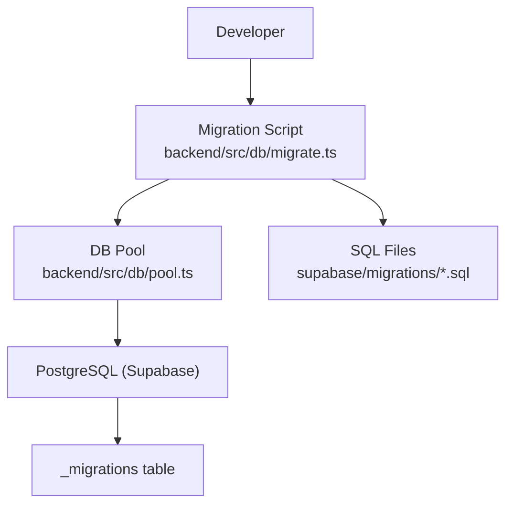
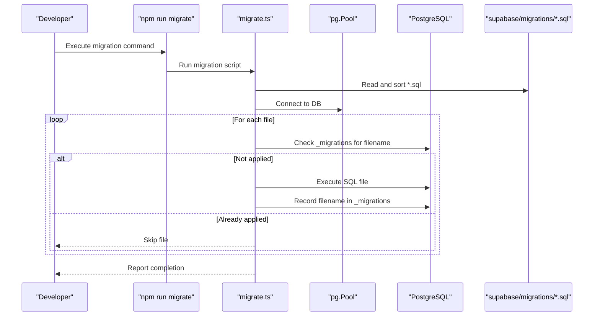
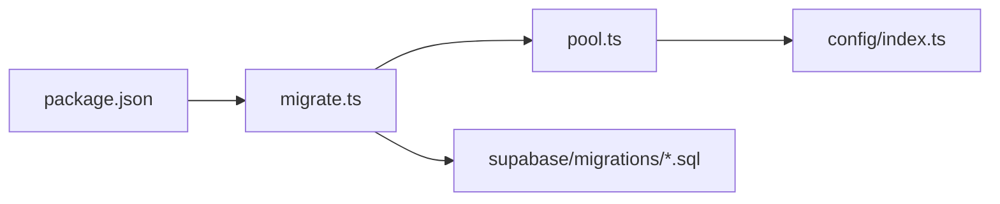

# Migrations & Version Control

<cite>
**Referenced Files in This Document**
- [001_initial_schema.sql](file://supabase/migrations/001_initial_schema.sql)
- [002_messages.sql](file://supabase/migrations/002_messages.sql)
- [003_admin_fraud_flag.sql](file://supabase/migrations/003_admin_fraud_flag.sql)
- [migrate.ts](file://backend/src/db/migrate.ts)
- [pool.ts](file://backend/src/db/pool.ts)
- [index.ts](file://backend/src/config/index.ts)
- [package.json](file://backend/package.json)
- [DEPLOYMENT.md](file://DEPLOYMENT.md)
</cite>

## Table of Contents
1. Introduction
2. Project Structure
3. Core Components
4. Architecture Overview
5. Detailed Component Analysis
6. Dependency Analysis
7. Performance Considerations
8. Troubleshooting Guide
9. Conclusion
10. Appendices

## Introduction
This document explains how database migrations are managed in the project using Supabase PostgreSQL. It covers migration file naming conventions, versioning strategy, execution order, deployment to development and production, rollback strategies, best practices for safe schema changes, data transformations, dependency management, conflict resolution, testing before production, and common migration patterns with references to existing files.

## Project Structure
Migrations live under supabase/migrations as SQL files. A Node.js script reads these files in sorted order, applies them to the configured Postgres database via a connection pool, and tracks applied migrations in a local tracking table.

**Diagram sources**
- [migrate.ts:5-47](file://backend/src/db/migrate.ts#L5-L47)
- [pool.ts:9-28](file://backend/src/db/pool.ts#L9-L28)
- [001_initial_schema.sql:1-370](file://supabase/migrations/001_initial_schema.sql#L1-L370)
- [002_messages.sql:1-53](file://supabase/migrations/002_messages.sql#L1-L53)
- [003_admin_fraud_flag.sql:1-13](file://supabase/migrations/003_admin_fraud_flag.sql#L1-L13)

**Section sources**
- [migrate.ts:5-47](file://backend/src/db/migrate.ts#L5-L47)
- [pool.ts:9-28](file://backend/src/db/pool.ts#L9-L28)
- [index.ts:6-17](file://backend/src/config/index.ts#L6-L17)
- [package.json:5-15](file://backend/package.json#L5-L15)

## Core Components
- Migration runner: Reads all .sql files from supabase/migrations, sorts them lexicographically, executes each once, and records the filename in _migrations to prevent reapplication.
- Database pool: Configures connection parameters and SSL behavior based on DATABASE_URL.
- Configuration: Loads environment variables including DATABASE_URL and Supabase keys.
- Scripts: npm scripts expose db:migrate and migrate commands for running migrations locally or during deployments.

Key responsibilities:
- Idempotent execution per file
- Ordered application by filename
- Tracking applied migrations
- Safe connection handling and error reporting

**Section sources**
- [migrate.ts:5-47](file://backend/src/db/migrate.ts#L5-L47)
- [pool.ts:9-28](file://backend/src/db/pool.ts#L9-L28)
- [index.ts:6-17](file://backend/src/config/index.ts#L6-L17)
- [package.json:5-15](file://backend/package.json#L5-L15)

## Architecture Overview
The migration system is intentionally simple and robust:
- Files are named with numeric prefixes to enforce deterministic ordering.
- The runner ensures each file runs exactly once per database instance.
- All schema objects (tables, indexes, functions, triggers, RLS policies) are defined in migrations.

**Diagram sources**
- [migrate.ts:5-47](file://backend/src/db/migrate.ts#L5-L47)
- [pool.ts:9-28](file://backend/src/db/pool.ts#L9-L28)

## Detailed Component Analysis

### Migration Runner (migrate.ts)
- Discovers migration files in supabase/migrations and filters only .sql files.
- Sorts filenames to guarantee execution order.
- Creates _migrations table if missing and records each applied file.
- Executes each SQL file exactly once; skips previously applied files.
- Logs progress and errors; exits with non-zero status on failure.

Best practices reflected:
- Deterministic ordering via zero-padded prefixes.
- Idempotency via tracking table.
- Defensive connection lifecycle with try/finally.

**Section sources**
- [migrate.ts:5-47](file://backend/src/db/migrate.ts#L5-L47)

### Database Pool (pool.ts)
- Parses DATABASE_URL to configure host, port, user, password, database, and SSL settings.
- Uses secure defaults for remote connections and reasonable timeouts.
- Exposes query helpers for other modules.

Operational notes:
- Ensure DATABASE_URL points to the correct environment (dev/staging/prod).
- Validate network access and credentials when running migrations remotely.

**Section sources**
- [pool.ts:9-28](file://backend/src/db/pool.ts#L9-L28)

### Configuration (index.ts)
- Loads environment variables for database URL and Supabase keys.
- Centralizes configuration for consistent usage across services.

Environment considerations:
- Use separate .env files per environment.
- Never commit secrets; supply them via platform dashboards or CI/CD secret stores.

**Section sources**
- [index.ts:6-17](file://backend/src/config/index.ts#L6-L17)

### Migration Files
- 001_initial_schema.sql: Defines core schema, extensions, enums, tables, indexes, functions, triggers, and RLS policies.
- 002_messages.sql: Adds messages table, indexes, and RLS policies for approved matches.
- 003_admin_fraud_flag.sql: Extends matches with fraud flag fields and an index for flagged items.

These files demonstrate:
- Safe DDL with IF NOT EXISTS where applicable.
- Indexes for performance-critical queries.
- RLS policies for row-level security.
- Clear separation of concerns by feature area.

**Section sources**
- [001_initial_schema.sql:1-370](file://supabase/migrations/001_initial_schema.sql#L1-L370)
- [002_messages.sql:1-53](file://supabase/migrations/002_messages.sql#L1-L53)
- [003_admin_fraud_flag.sql:1-13](file://supabase/migrations/003_admin_fraud_flag.sql#L1-L13)

## Dependency Analysis
- migrate.ts depends on pool.ts for DB connectivity and on filesystem access to read SQL files.
- pool.ts depends on config/index.ts for DATABASE_URL.
- package.json exposes npm scripts that invoke the migration runner.
- DEPLOYMENT.md documents how to apply migrations against Supabase and set environment variables.

**Diagram sources**
- [package.json:5-15](file://backend/package.json#L5-L15)
- [migrate.ts:5-47](file://backend/src/db/migrate.ts#L5-L47)
- [pool.ts:9-28](file://backend/src/db/pool.ts#L9-L28)
- [index.ts:6-17](file://backend/src/config/index.ts#L6-L17)

**Section sources**
- [package.json:5-15](file://backend/package.json#L5-L15)
- [DEPLOYMENT.md:35-57](file://DEPLOYMENT.md#L35-L57)

## Performance Considerations
- Indexes: Existing migrations include targeted indexes for frequent queries (e.g., user, status, category, embedding vector indexes, match lookups). Add indexes judiciously to support new queries without over-indexing.
- Vector search: Embedding indexes use ivfflat with cosine operations; ensure list count aligns with dataset size and query latency requirements.
- Large DDL: Prefer additive changes (add columns, add indexes) over destructive ones to minimize downtime.
- Connection pooling: Tune pool size and timeouts if migration workloads increase.

[No sources needed since this section provides general guidance]

## Troubleshooting Guide
Common issues and resolutions:
- Connection timeout or authentication failures:
  - Verify DATABASE_URL is correct and reachable from the environment running migrations.
  - Ensure credentials have sufficient privileges to create tables and indexes.
- Migration already applied:
  - The runner skips files recorded in _migrations. If you need to reapply, remove the corresponding row from _migrations after ensuring it is safe.
- Unexpected state after partial failure:
  - Each SQL file runs as a single transactional unit in most cases; verify your statements are wrapped appropriately if you need explicit transactions.
- Local vs remote differences:
  - Confirm extensions (uuid-ossp, vector, pg_trgm) exist in target environments.
  - Ensure RLS policies and roles match expectations.

Operational checks:
- Inspect applied migrations: SELECT filename, applied_at FROM _migrations ORDER BY applied_at;
- Validate schema health: Check for expected tables, indexes, and policies.

**Section sources**
- [DEPLOYMENT.md:35-57](file://DEPLOYMENT.md#L35-L57)
- [migrate.ts:15-40](file://backend/src/db/migrate.ts#L15-L40)

## Conclusion
The project uses a straightforward, reliable migration approach:
- Numeric prefixes ensure deterministic execution order.
- A tracking table prevents duplicate applications.
- Schema changes are encapsulated in clear, focused SQL files.
- Deployment integrates with environment-specific configuration and documented steps.

Adhering to the best practices outlined here will help maintain a stable, auditable database evolution across environments.

[No sources needed since this section summarizes without analyzing specific files]

## Appendices

### Migration File Naming Convention and Versioning Strategy
- Use zero-padded numeric prefixes to enforce strict ordering (e.g., 001_, 002_, 003_).
- Keep filenames descriptive of the change (e.g., initial_schema, messages, admin_fraud_flag).
- One logical change per migration file to simplify review and rollback planning.

Examples in repository:
- 001_initial_schema.sql
- 002_messages.sql
- 003_admin_fraud_flag.sql

**Section sources**
- [001_initial_schema.sql:1-370](file://supabase/migrations/001_initial_schema.sql#L1-L370)
- [002_messages.sql:1-53](file://supabase/migrations/002_messages.sql#L1-L53)
- [003_admin_fraud_flag.sql:1-13](file://supabase/migrations/003_admin_fraud_flag.sql#L1-L13)

### Execution Order and Dependency Management
- Files are executed in lexicographic order based on filename.
- Place dependent changes in later-numbered files to respect ordering.
- Avoid circular dependencies between migrations; keep each file self-contained.

**Section sources**
- [migrate.ts:5-47](file://backend/src/db/migrate.ts#L5-L47)

### Applying Migrations in Development and Production
- Development:
  - Set DATABASE_URL to point to your local or dev database.
  - Run: npm run migrate from backend/, or npm run db:migrate from repo root.
- Production:
  - Supply DATABASE_URL and other secrets via Render/Vercel dashboards.
  - Apply migrations during deploy or as a pre-start step per DEPLOYMENT.md.

Commands:
- From backend/: npm run migrate
- From repo root: npm run db:migrate

**Section sources**
- [package.json:5-15](file://backend/package.json#L5-L15)
- [DEPLOYMENT.md:35-57](file://DEPLOYMENT.md#L35-L57)

### Rollback Procedures
- There is no automated rollback tool in this setup. Recommended approaches:
  - Write a reverse migration file (e.g., 004_revert_column.sql) that undoes the previous change safely.
  - For destructive changes, back up data first and test the revert in staging.
  - If necessary, remove the offending entry from _migrations only after confirming safety and idempotency.

Caution:
- Do not delete rows from _migrations lightly; always pair rollbacks with tested revert migrations.

**Section sources**
- [migrate.ts:15-40](file://backend/src/db/migrate.ts#L15-L40)

### Best Practices for Safe Migrations
- Make migrations idempotent:
  - Use IF NOT EXISTS for extensions, types, tables, and indexes where supported.
  - Guard column additions with conditional logic or careful sequencing.
- Minimize downtime:
  - Prefer additive changes (add columns, add indexes) before removing old structures.
  - Backfill data in small batches if needed.
- Protect data:
  - Wrap risky operations in explicit transactions when possible.
  - Test on staging with realistic data volumes.
- Security:
  - Define RLS policies alongside schema changes.
  - Avoid granting excessive privileges.

**Section sources**
- [001_initial_schema.sql:1-370](file://supabase/migrations/001_initial_schema.sql#L1-L370)
- [002_messages.sql:1-53](file://supabase/migrations/002_messages.sql#L1-L53)
- [003_admin_fraud_flag.sql:1-13](file://supabase/migrations/003_admin_fraud_flag.sql#L1-L13)

### Data Transformations and Schema Changes
- Adding columns:
  - Add nullable columns first, backfill data, then enforce constraints.
- Creating indexes:
  - Create indexes concurrently or off-peak to avoid locking large tables.
- Modifying constraints:
  - Plan carefully; consider temporary relaxed constraints and revalidation.
- Functions and triggers:
  - Update or replace functions carefully; test side effects thoroughly.

**Section sources**
- [001_initial_schema.sql:238-277](file://supabase/migrations/001_initial_schema.sql#L238-L277)
- [002_messages.sql:16-21](file://supabase/migrations/002_messages.sql#L16-L21)
- [003_admin_fraud_flag.sql:5-12](file://supabase/migrations/003_admin_fraud_flag.sql#L5-L12)

### Testing Migrations Before Production
- Test in development:
  - Run migrations against a fresh local database to validate syntax and side effects.
- Test in staging:
  - Mirror production-like data and schema to catch performance and compatibility issues.
- Pre-deploy checklist:
  - Verify _migrations contains expected entries.
  - Confirm application endpoints function correctly post-migration.

**Section sources**
- [DEPLOYMENT.md:35-57](file://DEPLOYMENT.md#L35-L57)

### Common Migration Patterns with References
- Adding a column to an existing table:
  - See pattern in extending matches with fraud-related fields.
  - Reference: [003_admin_fraud_flag.sql:5-12](file://supabase/migrations/003_admin_fraud_flag.sql#L5-L12)
- Creating a new table with relationships and RLS:
  - See messages table creation and policies.
  - Reference: [002_messages.sql:8-53](file://supabase/migrations/002_messages.sql#L8-L53)
- Creating indexes for performance:
  - See multiple indexes for users, items, matches, notifications.
  - Reference: [001_initial_schema.sql:238-259](file://supabase/migrations/001_initial_schema.sql#L238-L259)
- Defining functions and triggers:
  - See updated_at auto-update and auth user handler.
  - Reference: [001_initial_schema.sql:264-294](file://supabase/migrations/001_initial_schema.sql#L264-L294)
- Enabling Row Level Security and policies:
  - See RLS enablement and policies for multiple tables.
  - Reference: [001_initial_schema.sql:319-365](file://supabase/migrations/001_initial_schema.sql#L319-L365)