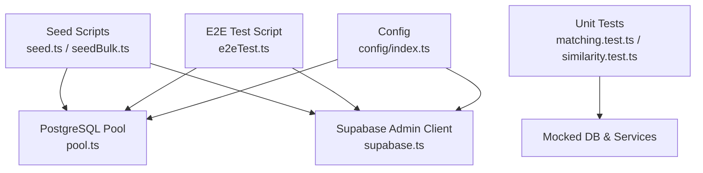
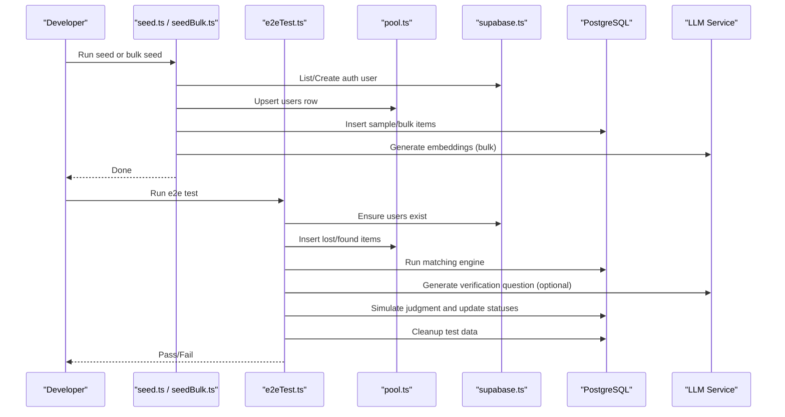
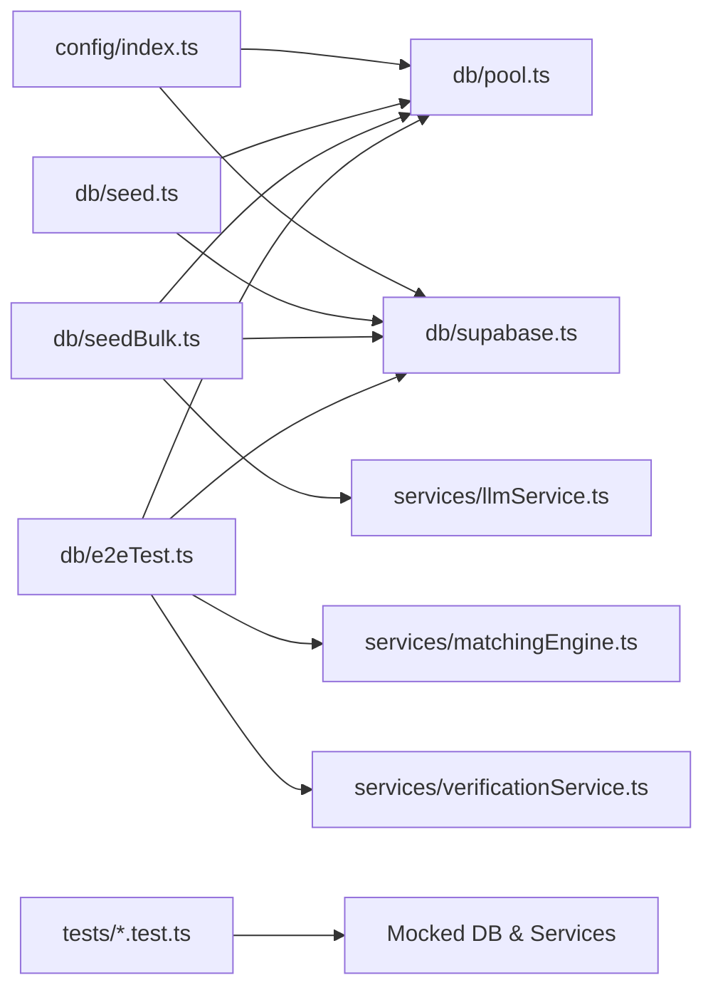

# Seed Data & Test Database Setup

<cite>
**Referenced Files in This Document**
- [seed.ts](file://backend/src/db/seed.ts)
- [seedBulk.ts](file://backend/src/db/seedBulk.ts)
- [lost_items_seed.json](file://backend/src/db/lost_items_seed.json)
- [found_items_seed.json](file://backend/src/db/found_items_seed.json)
- [e2eTest.ts](file://backend/src/db/e2eTest.ts)
- [pool.ts](file://backend/src/db/pool.ts)
- [supabase.ts](file://backend/src/db/supabase.ts)
- [config/index.ts](file://backend/src/config/index.ts)
- [001_initial_schema.sql](file://supabase/migrations/001_initial_schema.sql)
- [matching.test.ts](file://backend/tests/matching.test.ts)
- [similarity.test.ts](file://backend/tests/similarity.test.ts)
- [vitest.config.ts](file://backend/vitest.config.ts)
</cite>

## Table of Contents
1. [Introduction](#introduction)
2. [Project Structure](#project-structure)
3. [Core Components](#core-components)
4. [Architecture Overview](#architecture-overview)
5. [Detailed Component Analysis](#detailed-component-analysis)
6. [Dependency Analysis](#dependency-analysis)
7. [Performance Considerations](#performance-considerations)
8. [Troubleshooting Guide](#troubleshooting-guide)
9. [Conclusion](#conclusion)
10. [Appendices](#appendices)

## Introduction
This document explains how to set up and use seed data for development and testing, including sample lost items, found items, and user accounts. It covers the seeding scripts, bulk seeding operations, data randomization techniques, end-to-end test database setup, isolation and cleanup procedures, environment configuration, mocking external services, and guidelines for writing effective, reproducible database tests with fixtures while addressing data privacy considerations.

## Project Structure
The seed and test infrastructure lives primarily under backend/src/db and backend/tests:
- Seed scripts create users and insert sample or bulk data into PostgreSQL via a connection pool.
- JSON files provide structured sample datasets for lost and found items.
- An end-to-end script orchestrates a realistic flow from item creation through matching and verification.
- Unit tests mock external dependencies (database queries, LLM similarity functions) to validate logic deterministically.
- Configuration centralizes environment variables for database, Supabase, OpenAI, and matching behavior.

**Diagram sources**
- [seed.ts:1-77](file://backend/src/db/seed.ts#L1-L77)
- [seedBulk.ts:1-212](file://backend/src/db/seedBulk.ts#L1-L212)
- [e2eTest.ts:1-355](file://backend/src/db/e2eTest.ts#L1-L355)
- [pool.ts:1-48](file://backend/src/db/pool.ts#L1-L48)
- [supabase.ts:1-21](file://backend/src/db/supabase.ts#L1-L21)
- [config/index.ts:1-49](file://backend/src/config/index.ts#L1-L49)

**Section sources**
- [seed.ts:1-77](file://backend/src/db/seed.ts#L1-L77)
- [seedBulk.ts:1-212](file://backend/src/db/seedBulk.ts#L1-L212)
- [e2eTest.ts:1-355](file://backend/src/db/e2eTest.ts#L1-L355)
- [pool.ts:1-48](file://backend/src/db/pool.ts#L1-L48)
- [supabase.ts:1-21](file://backend/src/db/supabase.ts#L1-L21)
- [config/index.ts:1-49](file://backend/src/config/index.ts#L1-L49)

## Core Components
- Seed script (single admin user + sample rows): Creates an admin user in Supabase Auth, ensures a corresponding row in public.users, and inserts one sample lost item and one sample found item.
- Bulk seed script (JSON-driven): Loads large datasets from JSON files, generates embeddings, inserts items, and runs the matching engine to generate matches.
- End-to-end test script: Orchestrates a full flow—users, items, matching, verification question generation, simulated judgment, status transitions, and cleanup.
- Database pool and Supabase clients: Provide secure connections and service-role access for server-side seeding and tests.
- Unit tests: Validate matching and similarity logic using mocks to ensure deterministic outcomes without real DB calls.

**Section sources**
- [seed.ts:1-77](file://backend/src/db/seed.ts#L1-L77)
- [seedBulk.ts:1-212](file://backend/src/db/seedBulk.ts#L1-L212)
- [e2eTest.ts:1-355](file://backend/src/db/e2eTest.ts#L1-L355)
- [pool.ts:1-48](file://backend/src/db/pool.ts#L1-L48)
- [supabase.ts:1-21](file://backend/src/db/supabase.ts#L1-L21)
- [matching.test.ts:1-199](file://backend/tests/matching.test.ts#L1-L199)
- [similarity.test.ts:1-162](file://backend/tests/similarity.test.ts#L1-L162)

## Architecture Overview
The seeding and testing architecture integrates with Supabase Auth, PostgreSQL with pgvector, and optional LLM services for embeddings and verification questions. The flow is designed to be idempotent where possible and fully isolated during tests.

**Diagram sources**
- [seed.ts:1-77](file://backend/src/db/seed.ts#L1-L77)
- [seedBulk.ts:1-212](file://backend/src/db/seedBulk.ts#L1-L212)
- [e2eTest.ts:1-355](file://backend/src/db/e2eTest.ts#L1-L355)
- [pool.ts:1-48](file://backend/src/db/pool.ts#L1-L48)
- [supabase.ts:1-21](file://backend/src/db/supabase.ts#L1-L21)

## Detailed Component Analysis

### Seed Data Structure
- Lost items: Include category, brand, colour, description, location, coordinates, timestamp, and optional embedding vector.
- Found items: Same fields plus private_details (JSONB) used for verification questions and withheld from public view.
- Users: Created via Supabase Auth; mirrored into public.users with role and metadata.

Key characteristics:
- Idempotent inserts where applicable (e.g., “ON CONFLICT DO NOTHING” for sample rows).
- Embeddings are generated for semantic search and matching.
- Private details enable robust verification workflows.

**Section sources**
- [lost_items_seed.json:1-513](file://backend/src/db/lost_items_seed.json#L1-L513)
- [found_items_seed.json:1-564](file://backend/src/db/found_items_seed.json#L1-L564)
- [001_initial_schema.sql:54-140](file://supabase/migrations/001_initial_schema.sql#L54-L140)

### Seed Script (Single User + Sample Rows)
Responsibilities:
- Ensure a test admin user exists in Supabase Auth.
- Upsert the corresponding row in public.users with admin role.
- Insert one sample lost item and one sample found item.

Behavior notes:
- Uses service role client for privileged operations.
- Ensures idempotency by checking existing users and using upserts.

**Section sources**
- [seed.ts:1-77](file://backend/src/db/seed.ts#L1-L77)
- [supabase.ts:1-21](file://backend/src/db/supabase.ts#L1-L21)
- [pool.ts:1-48](file://backend/src/db/pool.ts#L1-L48)

### Bulk Seed Script (JSON-Driven, Embeddings, Matching)
Responsibilities:
- Load lost and found items from JSON files.
- Ensure test user exists and mirror into local auth schema when needed.
- Generate embeddings for each item’s description.
- Insert items into PostgreSQL with vector embeddings.
- Run the matching engine for inserted lost items to generate potential matches.

Error handling:
- Tracks success/failure counts per item type.
- Continues processing on individual failures and logs errors.

**Section sources**
- [seedBulk.ts:1-212](file://backend/src/db/seedBulk.ts#L1-L212)
- [lost_items_seed.json:1-513](file://backend/src/db/lost_items_seed.json#L1-L513)
- [found_items_seed.json:1-564](file://backend/src/db/found_items_seed.json#L1-L564)

### End-to-End Test Script
Responsibilities:
- Ensure two users exist (owner and finder), mirroring cloud auth users locally if necessary.
- Insert a lost item and a found item with descriptions and optional embeddings.
- Run the matching engine and retrieve match records.
- Generate or fallback to direct insertion of verification questions.
- Simulate correct answer judgment and update statuses to approved.
- Clean up all created test data at the end.

Isolation and cleanup:
- Deletes verification attempts, questions, matches, and items after execution.
- Ensures no residual state remains between runs.

**Section sources**
- [e2eTest.ts:1-355](file://backend/src/db/e2eTest.ts#L1-L355)

### Unit Tests and Mocking Strategy
- Matching engine tests mock database queries and LLM similarity functions to assert scoring behavior deterministically.
- Similarity function tests validate distance calculations, time windows, and attribute comparisons without external dependencies.
- Vitest configuration enables Node environment and global test helpers.

Best practices demonstrated:
- Clear mocks for query/queryOne and similarity utilities.
- beforeEach hooks to reset mocks before each test.
- Assertions over score ranges to validate logic thresholds.

**Section sources**
- [matching.test.ts:1-199](file://backend/tests/matching.test.ts#L1-L199)
- [similarity.test.ts:1-162](file://backend/tests/similarity.test.ts#L1-L162)
- [vitest.config.ts:1-10](file://backend/vitest.config.ts#L1-L10)

### Environment and Configuration
- Centralized config loads environment variables for database URL, Supabase endpoints and keys, OpenAI API key, email settings, JWT secret, and matching parameters.
- Database pool parses connection URLs and sets SSL appropriately for non-local hosts.
- Supabase clients expose both service-role and anon-scoped clients.

Recommended environment variables:
- DATABASE_URL
- NEXT_PUBLIC_SUPABASE_URL
- NEXT_PUBLIC_SUPABASE_ANON_KEY
- SUPABASE_SERVICE_ROLE_KEY
- OPENAI_API_KEY
- EMAIL_FROM, RESEND_API_KEY
- JWT_SECRET

**Section sources**
- [config/index.ts:1-49](file://backend/src/config/index.ts#L1-L49)
- [pool.ts:1-48](file://backend/src/db/pool.ts#L1-L48)
- [supabase.ts:1-21](file://backend/src/db/supabase.ts#L1-L21)

## Dependency Analysis
The following diagram shows core dependencies among seeding, testing, and configuration components.

**Diagram sources**
- [config/index.ts:1-49](file://backend/src/config/index.ts#L1-L49)
- [pool.ts:1-48](file://backend/src/db/pool.ts#L1-L48)
- [supabase.ts:1-21](file://backend/src/db/supabase.ts#L1-L21)
- [seed.ts:1-77](file://backend/src/db/seed.ts#L1-L77)
- [seedBulk.ts:1-212](file://backend/src/db/seedBulk.ts#L1-L212)
- [e2eTest.ts:1-355](file://backend/src/db/e2eTest.ts#L1-L355)
- [matching.test.ts:1-199](file://backend/tests/matching.test.ts#L1-L199)

**Section sources**
- [config/index.ts:1-49](file://backend/src/config/index.ts#L1-L49)
- [pool.ts:1-48](file://backend/src/db/pool.ts#L1-L48)
- [supabase.ts:1-21](file://backend/src/db/supabase.ts#L1-L21)
- [seed.ts:1-77](file://backend/src/db/seed.ts#L1-L77)
- [seedBulk.ts:1-212](file://backend/src/db/seedBulk.ts#L1-L212)
- [e2eTest.ts:1-355](file://backend/src/db/e2eTest.ts#L1-L355)
- [matching.test.ts:1-199](file://backend/tests/matching.test.ts#L1-L199)

## Performance Considerations
- Bulk seeding uses sequential inserts with progress reporting; consider batching or parallelism for very large datasets.
- Embedding generation can be a bottleneck; cache embeddings when possible or precompute for static datasets.
- Matching engine runs per inserted lost item; limit scope in tests to reduce runtime.
- Use indexes defined in migrations (e.g., ivfflat for embeddings) to improve vector search performance.

[No sources needed since this section provides general guidance]

## Troubleshooting Guide
Common issues and resolutions:
- Authentication failures: Ensure Supabase service role key and URL are correctly set; verify that the test user exists or is created successfully.
- Database connection errors: Check DATABASE_URL format and SSL settings; confirm the database is reachable and credentials are valid.
- Missing embeddings: If LLM calls fail, scripts fall back to inserting without embeddings; verify OPENAI_API_KEY and network connectivity.
- RLS or trigger constraints: When running against local Postgres, mirror auth users into the local auth schema to satisfy foreign key triggers.
- Test flakiness: Use unit tests with mocked dependencies to isolate logic; ensure mocks are cleared before each test.

**Section sources**
- [e2eTest.ts:25-82](file://backend/src/db/e2eTest.ts#L25-L82)
- [seedBulk.ts:125-206](file://backend/src/db/seedBulk.ts#L125-L206)
- [pool.ts:1-48](file://backend/src/db/pool.ts#L1-L48)
- [matching.test.ts:1-199](file://backend/tests/matching.test.ts#L1-L199)

## Conclusion
The repository provides robust tools for seeding and testing:
- A simple seed script for quick setup with a single admin user and sample items.
- A comprehensive bulk seed script driven by JSON datasets, generating embeddings and matches.
- An end-to-end test script that simulates realistic flows with thorough cleanup.
- Unit tests that validate matching and similarity logic deterministically via mocks.
Follow the environment configuration, leverage the provided scripts, and adopt the testing patterns to maintain reliable, reproducible development and testing workflows.

[No sources needed since this section summarizes without analyzing specific files]

## Appendices

### Creating Realistic Test Scenarios
- Use the e2e script to simulate owner-finder interactions, including matching and verification.
- For targeted scenarios, extend the JSON datasets with varied categories, brands, colors, locations, and timestamps to exercise different scoring paths.
- Introduce edge cases such as missing embeddings, null coordinates, and far-apart timestamps to validate fallback behaviors.

**Section sources**
- [e2eTest.ts:128-226](file://backend/src/db/e2eTest.ts#L128-L226)
- [lost_items_seed.json:1-513](file://backend/src/db/lost_items_seed.json#L1-L513)
- [found_items_seed.json:1-564](file://backend/src/db/found_items_seed.json#L1-L564)

### Mocking External Services
- In unit tests, mock database queries and similarity functions to avoid external dependencies and ensure deterministic results.
- Use beforeEach hooks to reset mocks and prevent cross-test interference.
- Assert on expected scores and behaviors rather than exact outputs from external services.

**Section sources**
- [matching.test.ts:1-199](file://backend/tests/matching.test.ts#L1-L199)
- [similarity.test.ts:1-162](file://backend/tests/similarity.test.ts#L1-L162)

### Maintaining Test Data Consistency
- Prefer idempotent operations (upserts, conditional inserts) to avoid duplicate states.
- Always clean up test data in finally blocks or teardown hooks.
- Keep datasets versioned alongside code to ensure reproducibility across environments.

**Section sources**
- [seed.ts:39-67](file://backend/src/db/seed.ts#L39-L67)
- [e2eTest.ts:228-238](file://backend/src/db/e2eTest.ts#L228-L238)

### Writing Effective Database Tests
- Isolate tests from real databases using mocks where appropriate.
- Validate business rules (scoring thresholds, status transitions) explicitly.
- Use fixtures (JSON datasets) to standardize inputs and simplify assertions.

**Section sources**
- [matching.test.ts:1-199](file://backend/tests/matching.test.ts#L1-L199)
- [similarity.test.ts:1-162](file://backend/tests/similarity.test.ts#L1-L162)

### Data Privacy Considerations
- Avoid committing sensitive personal data in seed files; use synthetic or anonymized patterns.
- Restrict private_details visibility via RLS policies and only expose after verification.
- Rotate secrets regularly and never hardcode credentials in source control.

**Section sources**
- [001_initial_schema.sql:321-365](file://supabase/migrations/001_initial_schema.sql#L321-L365)
- [config/index.ts:11-31](file://backend/src/config/index.ts#L11-L31)