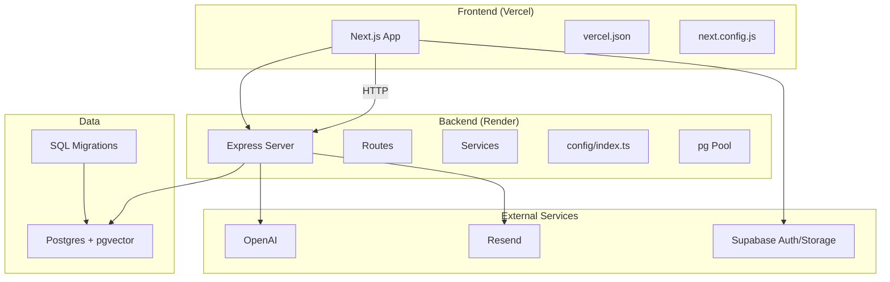
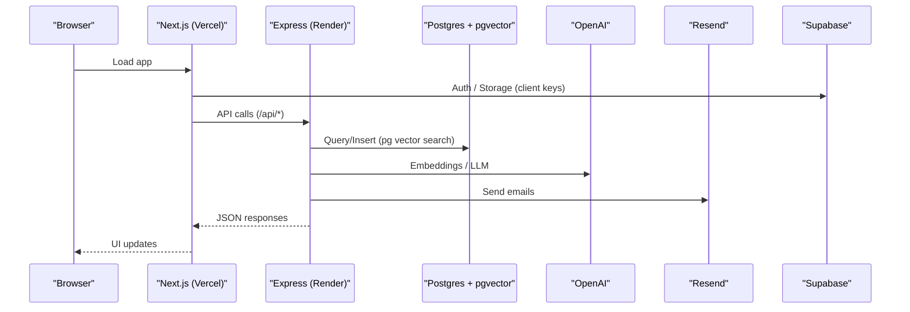
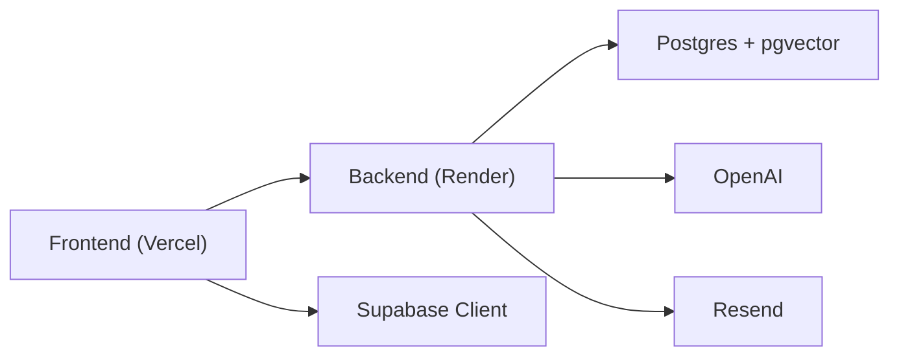

# Deployment Guide

<cite>
**Referenced Files in This Document**
- [DEPLOYMENT.md](file://DEPLOYMENT.md)
- [render.yaml](file://render.yaml)
- [vercel.json](file://frontend/vercel.json)
- [package.json (backend)](file://backend/package.json)
- [package.json (frontend)](file://frontend/package.json)
- [server.ts](file://backend/src/server.ts)
- [config/index.ts](file://backend/src/config/index.ts)
- [pool.ts](file://backend/src/db/pool.ts)
- [migrate.ts](file://backend/src/db/migrate.ts)
- [001_initial_schema.sql](file://supabase/migrations/001_initial_schema.sql)
- [002_messages.sql](file://supabase/migrations/002_messages.sql)
- [003_admin_fraud_flag.sql](file://supabase/migrations/003_admin_fraud_flag.sql)
- [next.config.js](file://frontend/next.config.js)
- [supabase.ts (frontend)](file://frontend/lib/supabase.ts)
</cite>

## Table of Contents
1. Introduction
2. Project Structure
3. Core Components
4. Architecture Overview
5. Detailed Component Analysis
6. Dependency Analysis
7. Performance Considerations
8. Troubleshooting Guide
9. Conclusion
10. Appendices

## Introduction
This guide provides production deployment procedures for the Lost & Found AI Matcher platform, covering:
- Frontend deployment to Vercel
- Backend deployment to Render
- Environment variable configuration
- Database setup with pgvector extension and migrations
- External service integrations (OpenAI, Supabase, Resend)
- CI/CD automation via Render Blueprint and Vercel
- Health checks, monitoring, logging, and performance tuning
- Scaling considerations, backups, disaster recovery
- Security hardening, SSL, and production monitoring

## Project Structure
The repository is organized into three main areas:
- backend: Express API server with TypeScript, database pool, routes, services, and middleware
- frontend: Next.js application with Supabase client integration
- supabase: SQL migrations that define schema, extensions, indexes, triggers, and RLS policies

**Diagram sources**
- [server.ts:1-52](file://backend/src/server.ts#L1-L52)
- [config/index.ts:1-49](file://backend/src/config/index.ts#L1-L49)
- [pool.ts:1-48](file://backend/src/db/pool.ts#L1-L48)
- [001_initial_schema.sql:1-370](file://supabase/migrations/001_initial_schema.sql#L1-L370)
- [vercel.json:1-11](file://frontend/vercel.json#L1-L11)
- [next.config.js:1-15](file://frontend/next.config.js#L1-L15)

**Section sources**
- [DEPLOYMENT.md:1-104](file://DEPLOYMENT.md#L1-L104)
- [render.yaml:1-54](file://render.yaml#L1-L54)
- [vercel.json:1-11](file://frontend/vercel.json#L1-L11)

## Core Components
- Backend server: Express app with security headers, CORS, rate limiting, logging, health endpoint, and route registration
- Configuration: Centralized environment-driven config for ports, URLs, Supabase, DB, OpenAI, email, JWT, and matching parameters
- Database pool: PostgreSQL connection pooling with SSL handling for non-local hosts
- Migrations: Idempotent migration runner over SQL files in supabase/migrations
- Frontend: Next.js app configured for Supabase storage images and environment variables

Key responsibilities:
- server.ts wires middleware, rate limiter, health check, and routes
- config/index.ts reads environment variables and exposes typed settings
- pool.ts manages pg connections and SSL behavior
- migrate.ts applies SQL migrations from supabase/migrations
- vercel.json defines build/install commands and env for Vercel
- next.config.js allows remote images from Supabase Storage

**Section sources**
- [server.ts:1-52](file://backend/src/server.ts#L1-L52)
- [config/index.ts:1-49](file://backend/src/config/index.ts#L1-L49)
- [pool.ts:1-48](file://backend/src/db/pool.ts#L1-L48)
- [migrate.ts:1-53](file://backend/src/db/migrate.ts#L1-L53)
- [vercel.json:1-11](file://frontend/vercel.json#L1-L11)
- [next.config.js:1-15](file://frontend/next.config.js#L1-L15)

## Architecture Overview
Production architecture integrates a Next.js frontend on Vercel with an Express backend on Render, backed by Supabase Postgres (with pgvector), OpenAI for embeddings/LLM, and Resend for emails.

**Diagram sources**
- [server.ts:1-52](file://backend/src/server.ts#L1-L52)
- [config/index.ts:1-49](file://backend/src/config/index.ts#L1-L49)
- [pool.ts:1-48](file://backend/src/db/pool.ts#L1-L48)
- [001_initial_schema.sql:1-370](file://supabase/migrations/001_initial_schema.sql#L1-L370)
- [supabase.ts (frontend):1-25](file://frontend/lib/supabase.ts#L1-L25)

## Detailed Component Analysis

### Backend Deployment (Render)
- Service type: web
- Root directory: backend
- Build command: install dependencies and compile TypeScript
- Start command: run compiled server
- Health check path: GET /api/health
- Environment variables: set via Render dashboard; blueprint marks secrets with sync: false

Environment variables required:
- NODE_ENV, PORT
- FRONTEND_URL, CORS_ORIGINS
- NEXT_PUBLIC_SUPABASE_URL, NEXT_PUBLIC_SUPABASE_ANON_KEY
- SUPABASE_SERVICE_ROLE_KEY (secret)
- DATABASE_URL (secret)
- OPENAI_API_KEY (secret)
- RESEND_API_KEY (secret)
- EMAIL_FROM
- JWT_SECRET (secret)
- NEXT_PUBLIC_API_URL, API_URL

Operational notes:
- The server enables helmet, CORS, JSON parsing, morgan logs, and rate limiting
- Health endpoint returns status ok with timestamp
- Rate limiter protects /api endpoints

**Section sources**
- [render.yaml:1-54](file://render.yaml#L1-L54)
- [package.json (backend):1-50](file://backend/package.json#L1-L50)
- [server.ts:1-52](file://backend/src/server.ts#L1-L52)
- [config/index.ts:1-49](file://backend/src/config/index.ts#L1-L49)

### Frontend Deployment (Vercel)
- Framework: Next.js
- Root directory: frontend
- Build command: next build
- Install command: npm install
- Environment variables: NEXT_PUBLIC_SUPABASE_URL, NEXT_PUBLIC_SUPABASE_ANON_KEY, NEXT_PUBLIC_API_URL

Runtime behavior:
- Uses Supabase client for auth/storage
- Allows loading images from Supabase Storage domains

**Section sources**
- [vercel.json:1-11](file://frontend/vercel.json#L1-L11)
- [package.json (frontend):1-32](file://frontend/package.json#L1-L32)
- [next.config.js:1-15](file://frontend/next.config.js#L1-L15)
- [supabase.ts (frontend):1-25](file://frontend/lib/supabase.ts#L1-L25)

### Database Setup and Migrations
- Extensions: uuid-ossp, vector (pgvector), pg_trgm
- Schema: users, lost_items, found_items, matches, verification_questions, verification_attempts, notifications, item_status_log, messages
- Indexes: ivfflat vector indexes for cosine similarity on description_embedding; additional indexes for queries
- Triggers: updated_at auto-update; user creation trigger
- Row Level Security: policies for users, items, matches, notifications, messages
- Admin flags: fraud_flag fields added to matches

Migration process:
- migrate.ts reads SQL files from supabase/migrations, applies them in order, and tracks applied migrations in _migrations table

**Section sources**
- [001_initial_schema.sql:1-370](file://supabase/migrations/001_initial_schema.sql#L1-L370)
- [002_messages.sql:1-53](file://supabase/migrations/002_messages.sql#L1-L53)
- [003_admin_fraud_flag.sql:1-13](file://supabase/migrations/003_admin_fraud_flag.sql#L1-L13)
- [migrate.ts:1-53](file://backend/src/db/migrate.ts#L1-L53)

### External Integrations
- OpenAI: Used for generating embeddings and LLM-based processing; key provided via OPENAI_API_KEY
- Resend: Email delivery; configured via RESEND_API_KEY and EMAIL_FROM
- Supabase: Auth and Storage used by frontend; service-role key used by backend for privileged operations

Integration points:
- Frontend uses Supabase client for auth and storage uploads
- Backend uses Supabase service role key and Postgres connection string
- Backend calls OpenAI and Resend for AI features and notifications

**Section sources**
- [config/index.ts:1-49](file://backend/src/config/index.ts#L1-L49)
- [supabase.ts (frontend):1-25](file://frontend/lib/supabase.ts#L1-L25)
- [DEPLOYMENT.md:27-98](file://DEPLOYMENT.md#L27-L98)

### CI/CD Pipeline and Automated Deployments
- Render Blueprint: render.yaml defines service configuration; deploy by linking repo and setting secrets in dashboard
- Vercel: Import repo, set root directory to frontend, configure env vars, and deploy; builds automatically on push

Rollback procedures:
- Render: Revert code changes and redeploy; use previous commit to restore service state
- Vercel: Use Vercel’s deployments history to rollback to a prior deployment

**Section sources**
- [render.yaml:1-54](file://render.yaml#L1-L54)
- [vercel.json:1-11](file://frontend/vercel.json#L1-L11)
- [DEPLOYMENT.md:59-98](file://DEPLOYMENT.md#L59-L98)

### Monitoring and Logging
- Health check: GET /api/health returns status ok with timestamp
- Logging: Morgan logs requests; production uses combined format
- Rate limiting: Protects API endpoints from abuse

Health check usage:
- Configure Render healthCheckPath to /api/health
- Monitor uptime and response times via platform dashboards

**Section sources**
- [server.ts:1-52](file://backend/src/server.ts#L1-L52)
- [DEPLOYMENT.md:93-98](file://DEPLOYMENT.md#L93-L98)

### Performance Optimization Techniques
- Vector search: ivfflat index on description_embedding for cosine similarity
- Connection pooling: pg.Pool with max connections, timeouts, and SSL for non-local hosts
- Request limits: JSON body size limit and rate limiter on /api
- Image optimization: Next.js remotePatterns allow Supabase image loading

Optimization recommendations:
- Tune ivfflat lists parameter based on dataset size
- Adjust pool.max and timeouts according to load
- Monitor query latency and adjust thresholds in matching config

**Section sources**
- [001_initial_schema.sql:239-259](file://supabase/migrations/001_initial_schema.sql#L239-L259)
- [pool.ts:1-48](file://backend/src/db/pool.ts#L1-L48)
- [server.ts:1-52](file://backend/src/server.ts#L1-L52)
- [next.config.js:1-15](file://frontend/next.config.js#L1-L15)
- [config/index.ts:33-47](file://backend/src/config/index.ts#L33-L47)

### Scaling Considerations
- Backend: Render free plan has resource constraints; consider upgrading plan or using horizontal scaling if supported
- Database: Use Supabase managed Postgres; monitor connection usage and scale compute as needed
- External APIs: Respect rate limits for OpenAI and Resend; implement retries and backoff

Scaling tips:
- Increase pool.max cautiously to avoid DB overload
- Cache frequent reads where appropriate
- Offload heavy tasks to background jobs if necessary

[No sources needed since this section provides general guidance]

### Backup Procedures and Disaster Recovery
- Backups: Rely on Supabase automated backups; ensure retention policy meets requirements
- Restore: Use Supabase restore to revert to a point-in-time snapshot
- Data export: Periodically export critical tables for offsite backup

Disaster recovery steps:
- Identify failure scope (frontend, backend, database)
- Restore database from snapshot if corruption detected
- Redeploy services after restoring data
- Validate health endpoints and core flows

[No sources needed since this section provides general guidance]

### Security Hardening and SSL
- Helmet: Adds security headers
- CORS: Restrict origins to trusted frontend domain(s)
- Secrets: Store sensitive values in Render/Vercel dashboards; never commit .env files
- SSL: HTTPS enforced by Vercel and Render; Postgres uses SSL for non-local connections

SSL configuration:
- Ensure FRONTEND_URL and CORS_ORIGINS match production domains
- Verify database URL uses secure connection settings

**Section sources**
- [server.ts:1-52](file://backend/src/server.ts#L1-L52)
- [pool.ts:1-48](file://backend/src/db/pool.ts#L1-L48)
- [DEPLOYMENT.md:99-104](file://DEPLOYMENT.md#L99-L104)

### Production Monitoring Setup
- Health endpoint: /api/health for uptime checks
- Logs: Review Render and Vercel logs for errors and request traces
- Metrics: Track response times, error rates, and external API usage

Monitoring best practices:
- Set up alerts for health check failures
- Correlate frontend errors with backend logs
- Monitor external service quotas and errors

**Section sources**
- [server.ts:1-52](file://backend/src/server.ts#L1-L52)
- [DEPLOYMENT.md:93-98](file://DEPLOYMENT.md#L93-L98)

## Dependency Analysis
High-level dependencies:
- Frontend depends on Vercel runtime and environment variables
- Backend depends on Express, Supabase, OpenAI, Resend, and Postgres
- Database schema depends on pgvector and trigram extensions

**Diagram sources**
- [server.ts:1-52](file://backend/src/server.ts#L1-L52)
- [config/index.ts:1-49](file://backend/src/config/index.ts#L1-L49)
- [pool.ts:1-48](file://backend/src/db/pool.ts#L1-L48)
- [001_initial_schema.sql:1-370](file://supabase/migrations/001_initial_schema.sql#L1-L370)

**Section sources**
- [package.json (backend):1-50](file://backend/package.json#L1-L50)
- [package.json (frontend):1-32](file://frontend/package.json#L1-L32)

## Performance Considerations
- Vector indexing: Ensure ivfflat index is built and tuned for workload characteristics
- Connection pooling: Balance pool size with database capacity
- Rate limiting: Prevent abuse while maintaining responsiveness
- Image handling: Optimize upload sizes and caching via Supabase Storage metadata

Tuning recommendations:
- Profile slow queries and add targeted indexes
- Adjust matching weights and thresholds based on accuracy needs
- Monitor external API latency and implement caching where feasible

[No sources needed since this section provides general guidance]

## Troubleshooting Guide
Common issues and resolutions:
- Migration failures: Verify DATABASE_URL and permissions; ensure extensions are enabled; re-run migrations idempotently
- CORS errors: Update FRONTEND_URL and CORS_ORIGINS to include deployed frontend domains
- Health check failing: Confirm /api/health responds with ok; check environment variables and service startup logs
- Email delivery issues: Validate RESEND_API_KEY and EMAIL_FROM; check Resend logs
- Supabase connectivity: Ensure anon/service-role keys are correct; verify storage bucket exists

Debugging steps:
- Inspect Render logs for startup and runtime errors
- Check Vercel build logs for frontend issues
- Validate environment variables in both platforms
- Test database connectivity and migration status

**Section sources**
- [DEPLOYMENT.md:35-98](file://DEPLOYMENT.md#L35-L98)
- [server.ts:1-52](file://backend/src/server.ts#L1-L52)
- [migrate.ts:1-53](file://backend/src/db/migrate.ts#L1-L53)

## Conclusion
This deployment guide outlines how to deploy the Lost & Found AI Matcher platform to production using Vercel for the frontend and Render for the backend. It covers environment configuration, database setup with pgvector, external integrations, CI/CD automation, monitoring, performance tuning, scaling, backups, disaster recovery, and security hardening. Follow the steps carefully, validate health endpoints post-deployment, and monitor logs to ensure stable operation.

[No sources needed since this section summarizes without analyzing specific files]

## Appendices

### Environment Variables Reference
- Backend (Render):
  - NODE_ENV, PORT
  - FRONTEND_URL, CORS_ORIGINS
  - NEXT_PUBLIC_SUPABASE_URL, NEXT_PUBLIC_SUPABASE_ANON_KEY
  - SUPABASE_SERVICE_ROLE_KEY (secret)
  - DATABASE_URL (secret)
  - OPENAI_API_KEY (secret)
  - RESEND_API_KEY (secret)
  - EMAIL_FROM
  - JWT_SECRET (secret)
  - NEXT_PUBLIC_API_URL, API_URL
- Frontend (Vercel):
  - NEXT_PUBLIC_SUPABASE_URL
  - NEXT_PUBLIC_SUPABASE_ANON_KEY
  - NEXT_PUBLIC_API_URL

**Section sources**
- [render.yaml:14-53](file://render.yaml#L14-L53)
- [vercel.json:6-10](file://frontend/vercel.json#L6-L10)
- [config/index.ts:6-47](file://backend/src/config/index.ts#L6-L47)

### Health Check Endpoint
- Method: GET
- Path: /api/health
- Response: { "status": "ok", "timestamp": "<ISO datetime>" }

**Section sources**
- [server.ts:32-34](file://backend/src/server.ts#L32-L34)

### Database Migrations
- Location: supabase/migrations/*.sql
- Runner: backend/src/db/migrate.ts
- Tracking: _migrations table records applied files

**Section sources**
- [migrate.ts:1-53](file://backend/src/db/migrate.ts#L1-L53)
- [001_initial_schema.sql:1-370](file://supabase/migrations/001_initial_schema.sql#L1-L370)
- [002_messages.sql:1-53](file://supabase/migrations/002_messages.sql#L1-L53)
- [003_admin_fraud_flag.sql:1-13](file://supabase/migrations/003_admin_fraud_flag.sql#L1-L13)