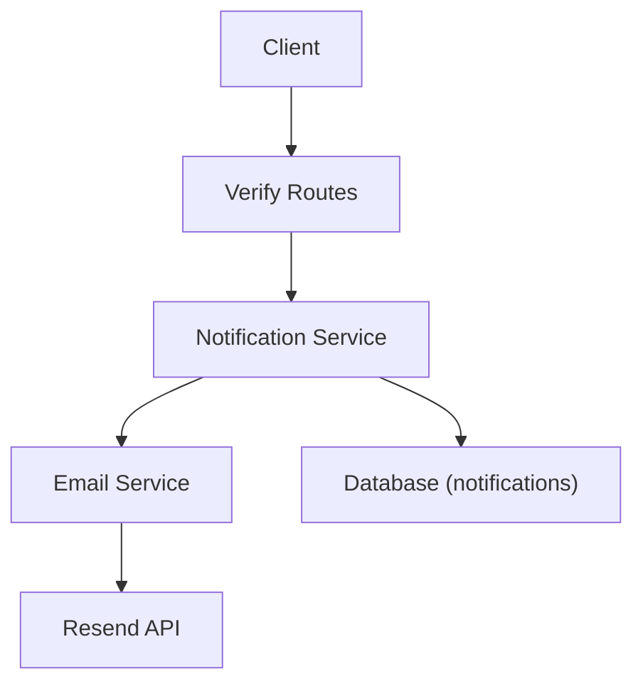
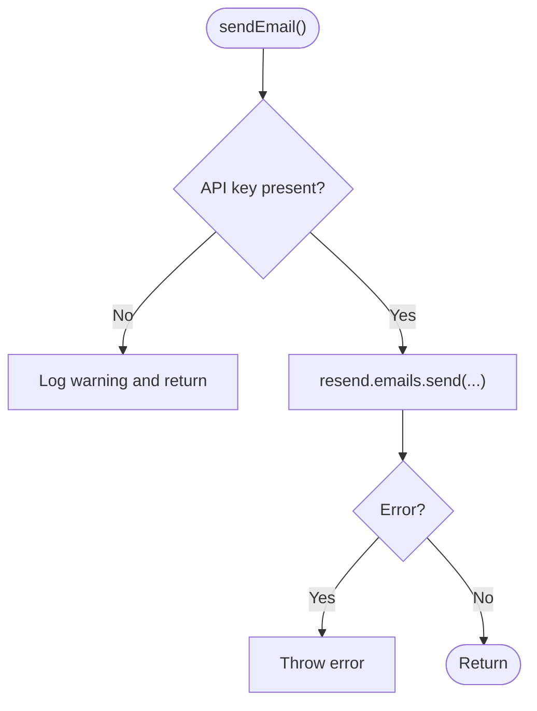
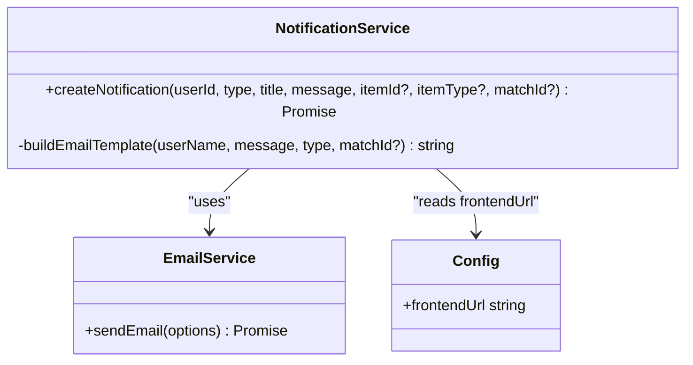
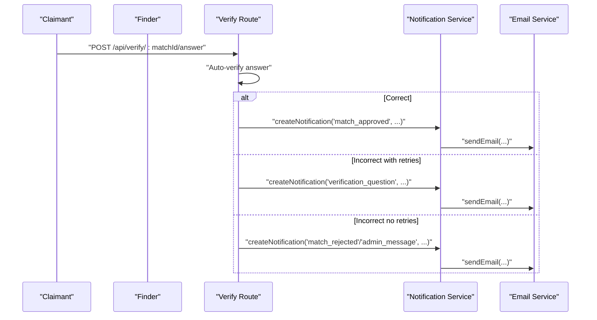
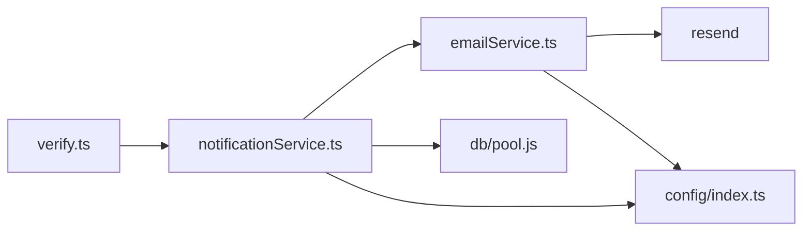

# Email Service Integration

<cite>
**Referenced Files in This Document**
- [emailService.ts](file://backend/src/services/emailService.ts)
- [notificationService.ts](file://backend/src/services/notificationService.ts)
- [config/index.ts](file://backend/src/config/index.ts)
- [verify.ts](file://backend/src/routes/verify.ts)
- [notifications.ts](file://backend/src/routes/notifications.ts)
- [errorHandler.ts](file://backend/src/middleware/errorHandler.ts)
- [001_initial_schema.sql](file://supabase/migrations/001_initial_schema.sql)
</cite>

## Table of Contents
1. [Introduction](#introduction)
2. [Project Structure](#project-structure)
3. [Core Components](#core-components)
4. [Architecture Overview](#architecture-overview)
5. [Detailed Component Analysis](#detailed-component-analysis)
6. [Dependency Analysis](#dependency-analysis)
7. [Performance Considerations](#performance-considerations)
8. [Troubleshooting Guide](#troubleshooting-guide)
9. [Conclusion](#conclusion)
10. [Appendices](#appendices)

## Introduction
This document explains how the application integrates email delivery using the Resend API. It covers configuration, template rendering, sending workflows for notifications and verification events, error handling, and operational considerations such as retries, tracking, and compliance. The implementation is designed to be resilient: if email delivery fails, in-app notifications still persist, and delivery status is tracked in the database.

## Project Structure
The email integration spans a small set of focused modules:
- Configuration for Resend credentials and sender identity
- A thin email service that calls Resend
- A notification service that builds templates, sends emails, and updates delivery status
- Routes that trigger notifications during verification flows
- Database schema that tracks notifications and whether an email was sent



**Diagram sources**
- [verify.ts:20-79](file://backend/src/routes/verify.ts#L20-L79)
- [notificationService.ts:19-62](file://backend/src/services/notificationService.ts#L19-L62)
- [emailService.ts:15-31](file://backend/src/services/emailService.ts#L15-L31)
- [001_initial_schema.sql:204-221](file://supabase/migrations/001_initial_schema.sql#L204-L221)

**Section sources**
- [config/index.ts:23-26](file://backend/src/config/index.ts#L23-L26)
- [emailService.ts:1-31](file://backend/src/services/emailService.ts#L1-L31)
- [notificationService.ts:1-101](file://backend/src/services/notificationService.ts#L1-L101)
- [verify.ts:20-79](file://backend/src/routes/verify.ts#L20-L79)
- [001_initial_schema.sql:204-221](file://supabase/migrations/001_initial_schema.sql#L204-L221)

## Core Components
- Email Service: Wraps Resend to send HTML emails with a configured sender address. It skips sending when the API key is missing and throws on provider errors.
- Notification Service: Creates in-app notifications, renders an HTML template, sends emails via the Email Service, and marks notifications as emailed upon success.
- Configuration: Provides Resend API key and default sender from environment variables.
- Verification Routes: Trigger notifications (and optional emails) at key points in the verification flow.
- Database Schema: Stores notifications with fields to track read state and whether an email was sent.

**Section sources**
- [emailService.ts:15-31](file://backend/src/services/emailService.ts#L15-L31)
- [notificationService.ts:19-62](file://backend/src/services/notificationService.ts#L19-L62)
- [config/index.ts:23-26](file://backend/src/config/index.ts#L23-L26)
- [verify.ts:171-238](file://backend/src/routes/verify.ts#L171-L238)
- [001_initial_schema.sql:204-221](file://supabase/migrations/001_initial_schema.sql#L204-L221)

## Architecture Overview
The end-to-end flow for verification-related notifications:
- A user interacts with verification endpoints.
- The route performs business logic and calls the notification service.
- The notification service persists an in-app notification, fetches the user’s email, renders an HTML template, and sends it via the email service.
- On success, the notification record is updated to indicate the email was sent.

```mermaid
sequenceDiagram
participant U as "User"
participant R as "Verify Route"
participant N as "Notification Service"
participant E as "Email Service"
participant D as "Database"
participant S as "Resend API"
U->>R : "Submit answer / request question"
R->>N : "createNotification(...)"
N->>D : "INSERT notification"
N->>D : "SELECT user email"
N->>E : "sendEmail({to, subject, html})"
E->>S : "emails.send(from,to,subject,html)"
S-->>E : "success or error"
alt success
E-->>N : "ok"
N->>D : "UPDATE notifications SET email_sent = true"
else error
E-->>N : "throws"
N->>N : "log error; keep in-app notification"
end
R-->>U : "Response"
```

**Diagram sources**
- [verify.ts:171-238](file://backend/src/routes/verify.ts#L171-L238)
- [notificationService.ts:19-62](file://backend/src/services/notificationService.ts#L19-L62)
- [emailService.ts:15-31](file://backend/src/services/emailService.ts#L15-L31)
- [001_initial_schema.sql:204-221](file://supabase/migrations/001_initial_schema.sql#L204-L221)

## Detailed Component Analysis

### Email Service
- Purpose: Provide a single entry point to send HTML emails via Resend.
- Behavior:
  - Skips sending if the Resend API key is not configured.
  - Sends with a configured sender address.
  - Throws on provider errors so callers can handle failures.



**Diagram sources**
- [emailService.ts:15-31](file://backend/src/services/emailService.ts#L15-L31)

**Section sources**
- [emailService.ts:15-31](file://backend/src/services/emailService.ts#L15-L31)

### Notification Service
- Purpose: Create in-app notifications and optionally send emails.
- Behavior:
  - Persists a notification record.
  - Fetches the recipient’s email and name.
  - Renders an HTML template with dynamic content.
  - Calls the email service; on success, marks the notification as emailed.
  - On failure, logs the error but does not remove the in-app notification.



**Diagram sources**
- [notificationService.ts:19-101](file://backend/src/services/notificationService.ts#L19-L101)
- [config/index.ts:6-10](file://backend/src/config/index.ts#L6-L10)

**Section sources**
- [notificationService.ts:19-62](file://backend/src/services/notificationService.ts#L19-L62)
- [notificationService.ts:67-101](file://backend/src/services/notificationService.ts#L67-L101)
- [config/index.ts:6-10](file://backend/src/config/index.ts#L6-L10)

### Verification Flow and Email Triggers
- Question retrieval: Ensures a pending question exists or generates one; no email here.
- Answer submission:
  - If correct: approves the match and notifies both parties (emails may be sent).
  - If incorrect:
    - If retries remain: generates a new question and notifies both parties.
    - If no retries remain: escalates to admin and notifies both parties.
- Finder override: Allows the finder to mark answers correct/incorrect, triggering appropriate notifications.



**Diagram sources**
- [verify.ts:171-238](file://backend/src/routes/verify.ts#L171-L238)
- [notificationService.ts:19-62](file://backend/src/services/notificationService.ts#L19-L62)
- [emailService.ts:15-31](file://backend/src/services/emailService.ts#L15-L31)

**Section sources**
- [verify.ts:171-238](file://backend/src/routes/verify.ts#L171-L238)
- [verify.ts:268-292](file://backend/src/routes/verify.ts#L268-L292)
- [verify.ts:345-397](file://backend/src/routes/verify.ts#L345-L397)

### Template Rendering and Dynamic Content
- Template engine: Simple HTML string interpolation within the notification service.
- Dynamic fields:
  - Recipient name
  - Message body
  - Accent color based on notification type
  - Action URL pointing to the app (match detail or notifications page)
- Extensibility: Add new notification types by updating the accent color and action URL logic.

**Section sources**
- [notificationService.ts:67-101](file://backend/src/services/notificationService.ts#L67-L101)
- [config/index.ts:6-10](file://backend/src/config/index.ts#L6-L10)

### Delivery Status Tracking
- In-app notifications are persisted first.
- After a successful email send, the notification record is updated to mark email_sent as true.
- Clients can list notifications and see read/unread status.

**Section sources**
- [notificationService.ts:28-56](file://backend/src/services/notificationService.ts#L28-L56)
- [notifications.ts:40-69](file://backend/src/routes/notifications.ts#L40-L69)
- [001_initial_schema.sql:204-221](file://supabase/migrations/001_initial_schema.sql#L204-L221)

## Dependency Analysis
- Routes depend on services for business logic and side effects.
- Notification service depends on:
  - Database pool for persistence
  - Email service for outbound mail
  - Config for URLs and settings
- Email service depends on:
  - Resend SDK
  - Config for credentials and sender



**Diagram sources**
- [verify.ts:1-12](file://backend/src/routes/verify.ts#L1-L12)
- [notificationService.ts:1-4](file://backend/src/services/notificationService.ts#L1-L4)
- [emailService.ts:1-4](file://backend/src/services/emailService.ts#L1-L4)
- [config/index.ts:1-26](file://backend/src/config/index.ts#L1-L26)

**Section sources**
- [verify.ts:1-12](file://backend/src/routes/verify.ts#L1-L12)
- [notificationService.ts:1-4](file://backend/src/services/notificationService.ts#L1-L4)
- [emailService.ts:1-4](file://backend/src/services/emailService.ts#L1-L4)
- [config/index.ts:1-26](file://backend/src/config/index.ts#L1-L26)

## Performance Considerations
- Asynchronous operations: All I/O is async; ensure non-blocking call chains.
- Minimal template rendering: String interpolation avoids heavy templating engines.
- Avoid redundant sends: The notification flow sends once per event; consider idempotency keys if you add retries.
- Database writes: Keep transaction boundaries minimal; only update email_sent after success.
- High-volume scenarios:
  - Batch notifications where possible.
  - Use a background job queue (e.g., BullMQ, Redis) to offload email sending.
  - Implement exponential backoff retries at the queue layer.
  - Monitor Resend rate limits and implement throttling.

[No sources needed since this section provides general guidance]

## Troubleshooting Guide
Common issues and resolutions:
- Missing Resend API key:
  - Symptom: Emails are skipped with a warning.
  - Resolution: Set RESEND_API_KEY in environment.
- Provider errors:
  - Symptom: Error thrown from email service.
  - Resolution: Inspect logs; verify recipient addresses and Resend account status.
- Email not marked as sent:
  - Symptom: email_sent remains false.
  - Resolution: Check for exceptions in the notification service around sendEmail; ensure the UPDATE runs after success.
- Notifications not visible:
  - Symptom: No notifications returned.
  - Resolution: Verify user_id scoping and read flags in the notifications routes.

Operational notes:
- Errors are handled centrally; custom AppError responses are standardized.
- Multer errors are mapped to user-friendly messages.

**Section sources**
- [emailService.ts:15-31](file://backend/src/services/emailService.ts#L15-L31)
- [notificationService.ts:42-60](file://backend/src/services/notificationService.ts#L42-L60)
- [notifications.ts:40-69](file://backend/src/routes/notifications.ts#L40-L69)
- [errorHandler.ts:16-47](file://backend/src/middleware/errorHandler.ts#L16-L47)

## Conclusion
The email integration uses a simple, robust pattern: create in-app notifications first, then attempt email delivery, and finally mark delivery status. This ensures resilience even when external providers fail. The current template system supports dynamic content and can be extended for multi-language support. For high-volume needs, introduce queuing, retries, and monitoring to improve throughput and reliability.

[No sources needed since this section summarizes without analyzing specific files]

## Appendices

### Configuration Reference
- Environment variables used by the email subsystem:
  - RESEND_API_KEY: Resend authentication token
  - EMAIL_FROM: Default sender address
  - FRONTEND_URL: Base URL used in email action links

**Section sources**
- [config/index.ts:23-26](file://backend/src/config/index.ts#L23-L26)
- [config/index.ts:6-10](file://backend/src/config/index.ts#L6-L10)

### Data Model Reference
- Notifications table includes fields for user association, type, content, entity links, read state, and email delivery flag.

**Section sources**
- [001_initial_schema.sql:204-221](file://supabase/migrations/001_initial_schema.sql#L204-L221)