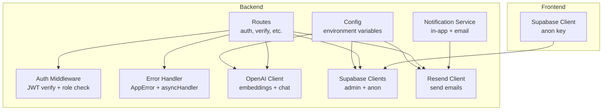
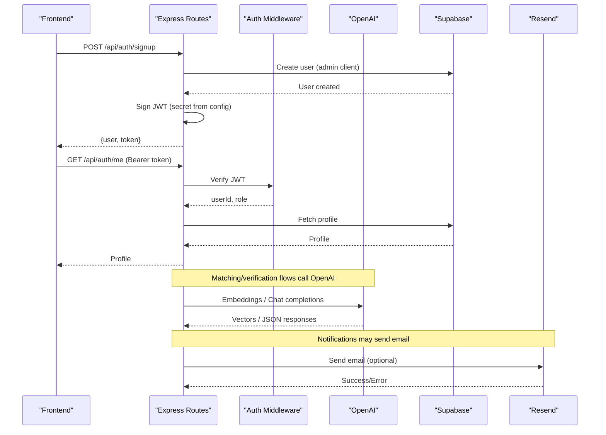
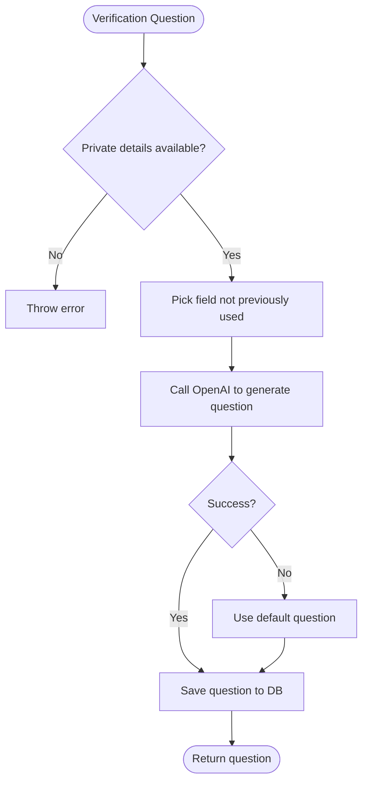
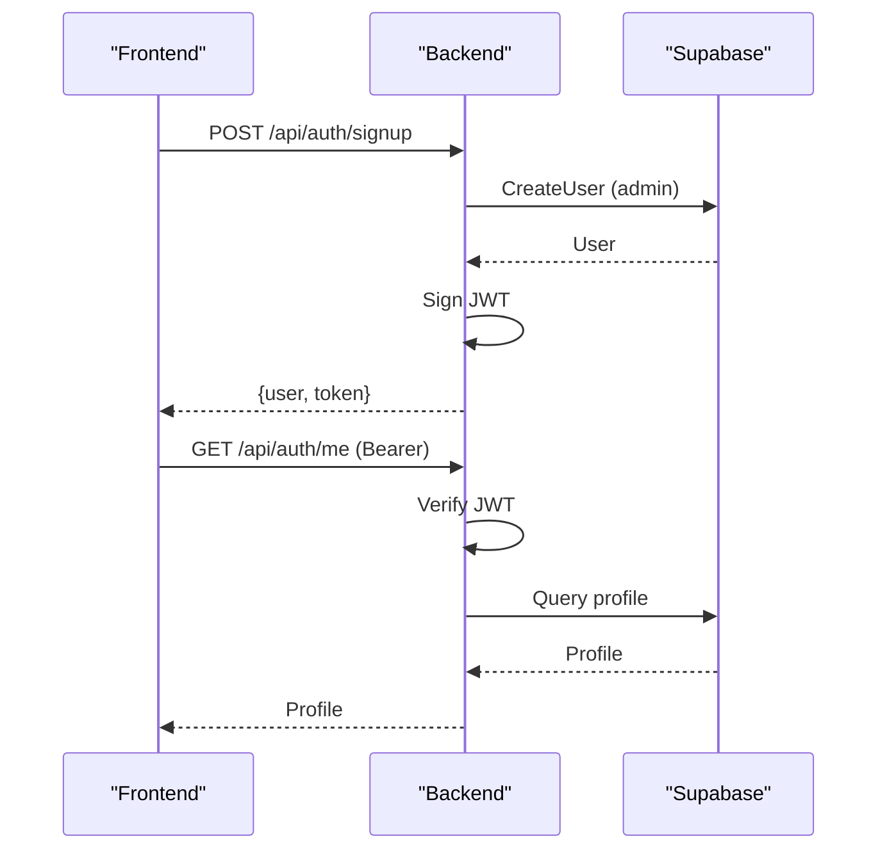
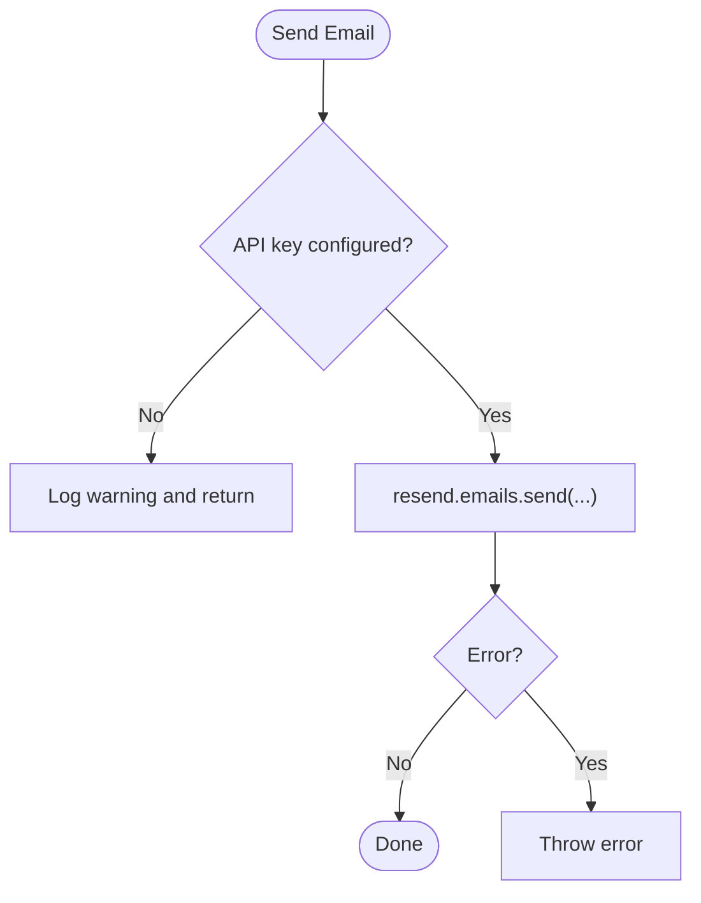
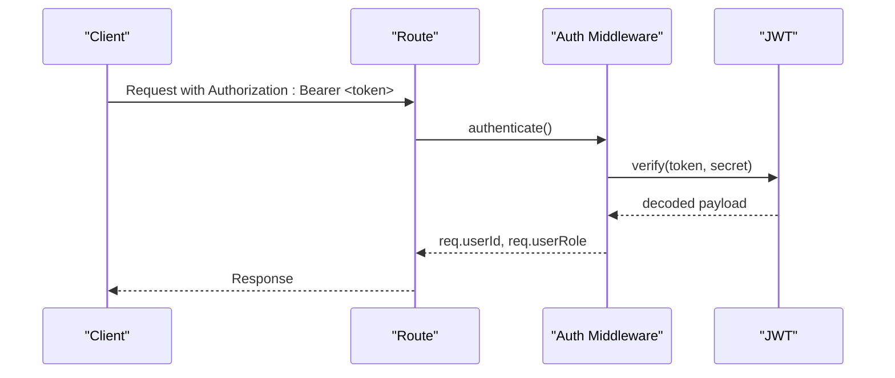
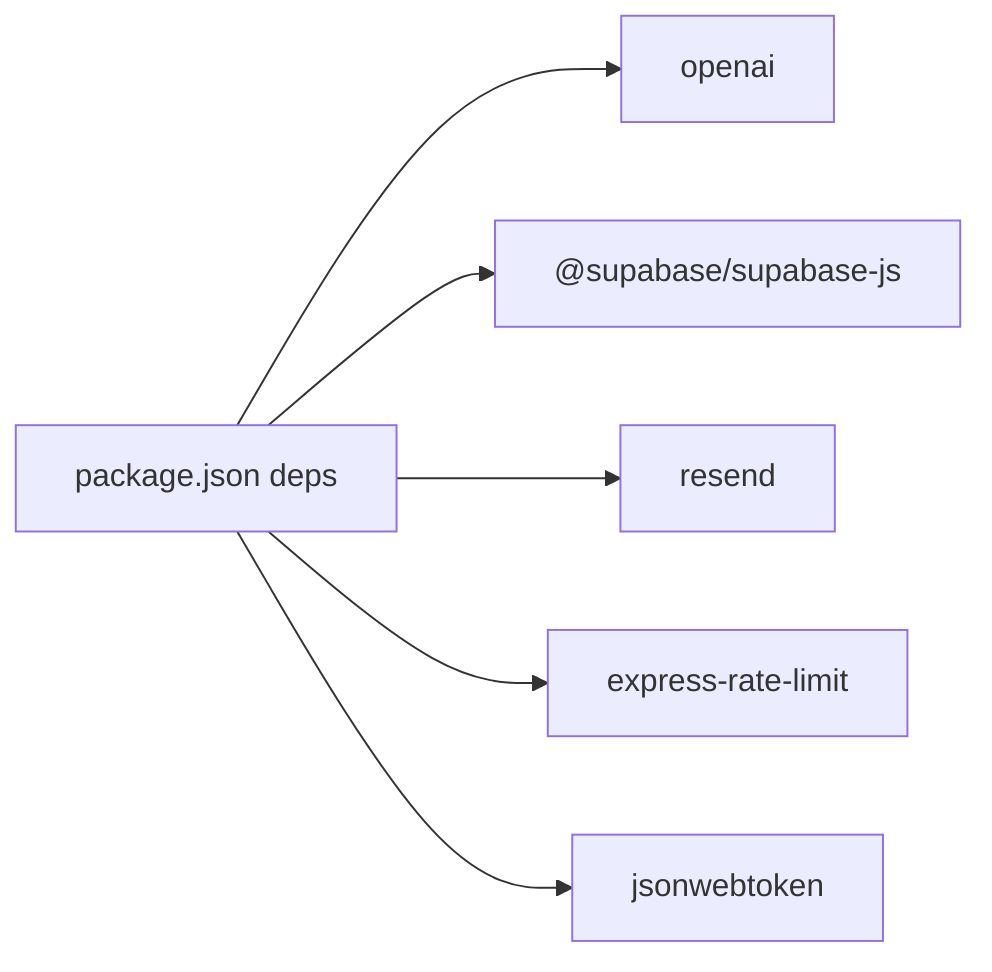

# External Service Integration

<cite>
**Referenced Files in This Document**
- [index.ts](file://backend/src/config/index.ts)
- [supabase.ts](file://backend/src/db/supabase.ts)
- [llmService.ts](file://backend/src/services/llmService.ts)
- [emailService.ts](file://backend/src/services/emailService.ts)
- [verificationService.ts](file://backend/src/services/verificationService.ts)
- [notificationService.ts](file://backend/src/services/notificationService.ts)
- [auth.ts](file://backend/src/middleware/auth.ts)
- [errorHandler.ts](file://backend/src/middleware/errorHandler.ts)
- [auth.ts](file://backend/src/routes/auth.ts)
- [verify.ts](file://backend/src/routes/verify.ts)
- [supabase.ts](file://frontend/lib/supabase.ts)
- [package.json](file://backend/package.json)
- [render.yaml](file://render.yaml)
</cite>

## Table of Contents
1. Introduction
2. Project Structure
3. Core Components
4. Architecture Overview
5. Detailed Component Analysis
6. Dependency Analysis
7. Performance Considerations
8. Troubleshooting Guide
9. Conclusion
10. Appendices

## Introduction
This document explains how the application integrates external services: OpenAI (LLM and embeddings), Supabase (authentication, storage, and database), and Resend (email). It covers configuration, authentication flows, token management, rate limiting, error handling, fallbacks, quotas/cost optimization, monitoring, outage handling, graceful degradation, troubleshooting, and testing strategies for external dependencies.

## Project Structure
The backend centralizes environment-driven configuration and service clients, while routes and services orchestrate calls to external providers. The frontend uses a client-only key for Supabase Storage and Auth.

**Diagram sources**
- [index.ts:6-31](file://backend/src/config/index.ts#L6-L31)
- [supabase.ts:1-21](file://backend/src/db/supabase.ts#L1-L21)
- [llmService.ts:1-120](file://backend/src/services/llmService.ts#L1-L120)
- [emailService.ts:1-32](file://backend/src/services/emailService.ts#L1-L32)
- [auth.ts:1-59](file://backend/src/middleware/auth.ts#L1-L59)
- [errorHandler.ts:1-56](file://backend/src/middleware/errorHandler.ts#L1-L56)
- [auth.ts:1-98](file://backend/src/routes/auth.ts#L1-L98)
- [supabase.ts:1-25](file://frontend/lib/supabase.ts#L1-L25)

**Section sources**
- [index.ts:6-31](file://backend/src/config/index.ts#L6-L31)
- [package.json:16-31](file://backend/package.json#L16-L31)

## Core Components
- Configuration: Centralized via environment variables for OpenAI, Supabase, Resend, JWT, and matching parameters.
- Authentication: Supabase Auth with server-side admin/anon clients; backend issues JWTs for API access; middleware verifies tokens and enforces roles.
- LLM Services: Embeddings generation, structured extraction, image similarity comparison, and verification question generation/answer checking.
- Email: Optional email delivery via Resend with safe no-op when keys are missing.
- Notifications: In-app notifications persisted to DB with optional email delivery.

**Section sources**
- [index.ts:6-31](file://backend/src/config/index.ts#L6-L31)
- [supabase.ts:1-21](file://backend/src/db/supabase.ts#L1-L21)
- [llmService.ts:1-120](file://backend/src/services/llmService.ts#L1-L120)
- [emailService.ts:1-32](file://backend/src/services/emailService.ts#L1-L32)
- [notificationService.ts:1-101](file://backend/src/services/notificationService.ts#L1-L101)
- [auth.ts:1-59](file://backend/src/middleware/auth.ts#L1-L59)
- [auth.ts:1-98](file://backend/src/routes/auth.ts#L1-L98)

## Architecture Overview
External integrations follow a consistent pattern:
- Config reads secrets from environment variables.
- Routes call services that encapsulate provider SDKs.
- Errors are normalized via a global handler.
- Fallbacks degrade gracefully (e.g., neutral scores or skipping email).

**Diagram sources**
- [auth.ts:16-41](file://backend/src/routes/auth.ts#L16-L41)
- [auth.ts:46-72](file://backend/src/routes/auth.ts#L46-L72)
- [auth.ts:78-97](file://backend/src/routes/auth.ts#L78-L97)
- [auth.ts:22-37](file://backend/src/middleware/auth.ts#L22-L37)
- [llmService.ts:9-17](file://backend/src/services/llmService.ts#L9-L17)
- [llmService.ts:47-79](file://backend/src/services/llmService.ts#L47-L79)
- [emailService.ts:15-31](file://backend/src/services/emailService.ts#L15-L31)

## Detailed Component Analysis

### OpenAI Integration
Responsibilities:
- Generate text embeddings for semantic search.
- Extract structured fields from descriptions.
- Compare images for visual similarity.
- Generate verification questions and evaluate answers.

Configuration:
- API key loaded from environment variable and passed to the OpenAI client.

Rate Limiting:
- No built-in retry/backoff in the current implementation. Apply request-level throttling at the route layer if needed.

Error Handling and Fallbacks:
- Image similarity returns a neutral score on failure to keep matching pipeline functional.
- Verification question generation logs a warning and falls back to a default question if the LLM call fails.
- Answer verification falls back to substring matching when LLM is unavailable.

Security:
- API key never logged; only used to initialize the client.

Quotas and Cost Optimization:
- Use smaller models and minimal tokens where possible.
- Cache embeddings and reuse results.
- Limit retries and cap max_tokens for short outputs.

Monitoring:
- Log failures and fallback usage to track reliability and cost.

Testing:
- Mock OpenAI client methods for unit tests.
- Validate JSON response parsing and bounds for similarity scores.

**Diagram sources**
- [verificationService.ts:15-79](file://backend/src/services/verificationService.ts#L15-L79)

**Section sources**
- [llmService.ts:1-120](file://backend/src/services/llmService.ts#L1-L120)
- [verificationService.ts:1-123](file://backend/src/services/verificationService.ts#L1-L123)

### Supabase Integration
Responsibilities:
- Admin client for server-side operations (creates users, bypasses RLS).
- Anon client for client-scoped operations respecting RLS.
- Frontend uploads photos to storage and retrieves public URLs.

Configuration:
- URL and keys loaded from environment variables.

Authentication Flow:
- Backend creates/signs JWTs after successful Supabase Auth signup/login.
- Middleware verifies JWTs and attaches user identity/role to requests.

Security:
- Use admin client only on the server.
- Enforce RBAC by reading role from the database for admin checks.

Quotas and Cost Optimization:
- Prefer anon client for read-heavy operations to leverage RLS and caching.
- Batch operations where possible.

Monitoring:
- Wrap calls with error handling and log errors consistently.

Testing:
- Use test Supabase project and seed data.
- Mock network calls for auth routes in integration tests.

**Diagram sources**
- [auth.ts:16-41](file://backend/src/routes/auth.ts#L16-L41)
- [auth.ts:46-72](file://backend/src/routes/auth.ts#L46-L72)
- [auth.ts:78-97](file://backend/src/routes/auth.ts#L78-L97)
- [supabase.ts:1-21](file://backend/src/db/supabase.ts#L1-L21)

**Section sources**
- [supabase.ts:1-21](file://backend/src/db/supabase.ts#L1-L21)
- [auth.ts:1-59](file://backend/src/middleware/auth.ts#L1-L59)
- [auth.ts:1-98](file://backend/src/routes/auth.ts#L1-L98)
- [supabase.ts:1-25](file://frontend/lib/supabase.ts#L1-L25)

### Resend Email Integration
Responsibilities:
- Send transactional emails for notifications.
- Gracefully skip sending when API key is missing.

Configuration:
- API key and sender address loaded from environment variables.

Error Handling:
- If API key is missing, log a warning and return without sending.
- On send errors, throw an error to allow callers to handle or ignore based on context.

Fallbacks:
- Notification flow persists in-app notification even if email fails.

Quotas and Cost Optimization:
- Avoid duplicate sends; mark notifications as emailed once sent.

Monitoring:
- Log failures with recipient and subject for observability.

Testing:
- Use Resend’s test mode or mock the client in tests.

**Diagram sources**
- [emailService.ts:15-31](file://backend/src/services/emailService.ts#L15-L31)

**Section sources**
- [emailService.ts:1-32](file://backend/src/services/emailService.ts#L1-L32)
- [notificationService.ts:19-62](file://backend/src/services/notificationService.ts#L19-L62)

### Authentication and Token Management
- Signup/Login: Backend uses Supabase Admin to create/authenticate users and then signs a JWT using a secret from configuration.
- Protected Routes: Middleware extracts Bearer token, verifies signature, and attaches userId/userRole to the request.
- Admin Enforcement: Role is validated against the database for admin-only endpoints.

Security Best Practices:
- Store JWT_SECRET securely in environment variables.
- Keep Supabase service role key server-side only.
- Use HTTPS in production.

Rate Limiting:
- Add route-level rate limiting for auth endpoints to prevent abuse.

Monitoring:
- Log failed verifications and invalid tokens.

Testing:
- Test valid/invalid tokens and role enforcement.

**Diagram sources**
- [auth.ts:22-37](file://backend/src/middleware/auth.ts#L22-L37)
- [auth.ts:43-58](file://backend/src/middleware/auth.ts#L43-L58)
- [auth.ts:78-97](file://backend/src/routes/auth.ts#L78-L97)

**Section sources**
- [auth.ts:1-59](file://backend/src/middleware/auth.ts#L1-L59)
- [auth.ts:1-98](file://backend/src/routes/auth.ts#L1-L98)
- [index.ts:28-31](file://backend/src/config/index.ts#L28-L31)

### Error Handling and Graceful Degradation
- Global error handler normalizes AppError instances and multer upload errors into consistent JSON responses.
- Services implement local fallbacks:
  - LLM image similarity returns a neutral score on failure.
  - Verification question generation falls back to a default question.
  - Answer verification falls back to substring matching.
  - Email sending is skipped when keys are missing; in-app notifications persist regardless.

Outage Handling:
- Treat external service failures as non-fatal where possible to maintain core functionality.
- Surface meaningful errors to clients when appropriate.

**Section sources**
- [errorHandler.ts:1-56](file://backend/src/middleware/errorHandler.ts#L1-L56)
- [llmService.ts:85-119](file://backend/src/services/llmService.ts#L85-L119)
- [verificationService.ts:40-79](file://backend/src/services/verificationService.ts#L40-L79)
- [verificationService.ts:85-123](file://backend/src/services/verificationService.ts#L85-L123)
- [emailService.ts:15-31](file://backend/src/services/emailService.ts#L15-L31)
- [notificationService.ts:19-62](file://backend/src/services/notificationService.ts#L19-L62)

### Rate Limiting
- The backend includes express-rate-limit in dependencies. Configure per-route limits for sensitive endpoints (e.g., auth, verification submission) to protect against abuse and reduce costs.

[No sources needed since this section provides general guidance]

### Quotas, Costs, and Monitoring
- OpenAI:
  - Prefer smaller models and constrained outputs to reduce tokens.
  - Cache embeddings and reuse them across matching runs.
  - Monitor token usage and set budget alerts in your OpenAI dashboard.
- Supabase:
  - Use anon client for client-side operations to leverage RLS and caching.
  - Monitor bandwidth and storage growth; set up alerts.
- Resend:
  - Track email volume and bounce rates; use test mode during development.

[No sources needed since this section provides general guidance]

### Circuit Breakers and Outage Handling
- Implement circuit breakers around external calls (OpenAI, Resend) to fail fast during outages and reduce load.
- Persist state locally (e.g., in-app notifications) so core features remain usable.
- Provide user-facing messages indicating degraded functionality.

[No sources needed since this section provides general guidance]

## Dependency Analysis

**Diagram sources**
- [package.json:16-31](file://backend/package.json#L16-L31)

**Section sources**
- [package.json:16-31](file://backend/package.json#L16-L31)

## Performance Considerations
- Embeddings: Compute once per item and store in the database; reuse for matching queries.
- Vector Search: Leverage pgvector cosine distance operators to run similarity calculations in-database.
- LLM Calls: Minimize prompt size and output length; batch where possible; cache repeated results.
- Email: Defer or queue emails for high-volume scenarios; avoid synchronous sends in hot paths.
- Storage: Set appropriate cache-control headers for uploaded assets.

[No sources needed since this section provides general guidance]

## Troubleshooting Guide
Common Issues and Fixes:
- Missing API Keys:
  - Symptoms: OpenAI calls fail; emails skipped; Supabase client errors.
  - Action: Ensure environment variables are set correctly in deployment and runtime.
- Invalid or Expired JWT:
  - Symptoms: 401 Unauthorized on protected routes.
  - Action: Regenerate tokens; verify secret matches between login and middleware.
- Supabase Auth Errors:
  - Symptoms: Signup/login failures.
  - Action: Check credentials, ensure email confirmation settings, and verify admin key permissions.
- Email Delivery Failures:
  - Symptoms: Emails not sent; errors thrown.
  - Action: Validate Resend API key and sender domain; check bounce/spam filters.
- Upload Errors:
  - Symptoms: File too large or unexpected field.
  - Action: Adjust file size limits and ensure correct field names.

Operational Checks:
- Confirm environment variables are present and non-empty.
- Review logs for specific error messages from external SDKs.
- Validate CORS and network policies if running behind proxies.

**Section sources**
- [errorHandler.ts:16-47](file://backend/src/middleware/errorHandler.ts#L16-L47)
- [emailService.ts:15-31](file://backend/src/services/emailService.ts#L15-L31)
- [auth.ts:22-37](file://backend/src/middleware/auth.ts#L22-L37)
- [auth.ts:16-41](file://backend/src/routes/auth.ts#L16-L41)
- [auth.ts:46-72](file://backend/src/routes/auth.ts#L46-L72)

## Conclusion
The application integrates OpenAI, Supabase, and Resend with clear separation of concerns, robust error handling, and graceful degradation. Configuration is centralized and environment-driven. Security is enforced via JWT and Supabase RLS. To improve resilience, add explicit rate limiting, circuit breakers, and comprehensive monitoring. Testing should mock external services to validate behavior under success and failure conditions.

## Appendices

### Environment Variables Reference
- OPENAI_API_KEY: OpenAI API key for embeddings and chat completions.
- SUPABASE_URL, SUPABASE_ANON_KEY, SUPABASE_SERVICE_ROLE_KEY: Supabase connection and keys.
- RESEND_API_KEY, EMAIL_FROM: Resend email sender configuration.
- JWT_SECRET: Secret used to sign and verify JWTs.
- DATABASE_URL: PostgreSQL connection string for pg vector operations.
- FRONTEND_URL: Base URL used in email templates and notifications.

Deployment Example:
- See Render environment variables for required keys.

**Section sources**
- [index.ts:6-31](file://backend/src/config/index.ts#L6-L31)
- [render.yaml:34-53](file://render.yaml#L34-L53)

### Testing Strategies for External Dependencies
- Unit Tests:
  - Mock OpenAI client methods to validate embedding generation, structured extraction, and image similarity logic.
  - Mock Resend client to assert email payloads and error paths.
  - Mock Supabase clients to test auth routes and profile retrieval.
- Integration Tests:
  - Use a test Supabase project and seed data.
  - Run end-to-end flows for signup/login, verification, and notifications.
- Load Tests:
  - Simulate bursts to verify rate limiting and graceful degradation.

[No sources needed since this section provides general guidance]