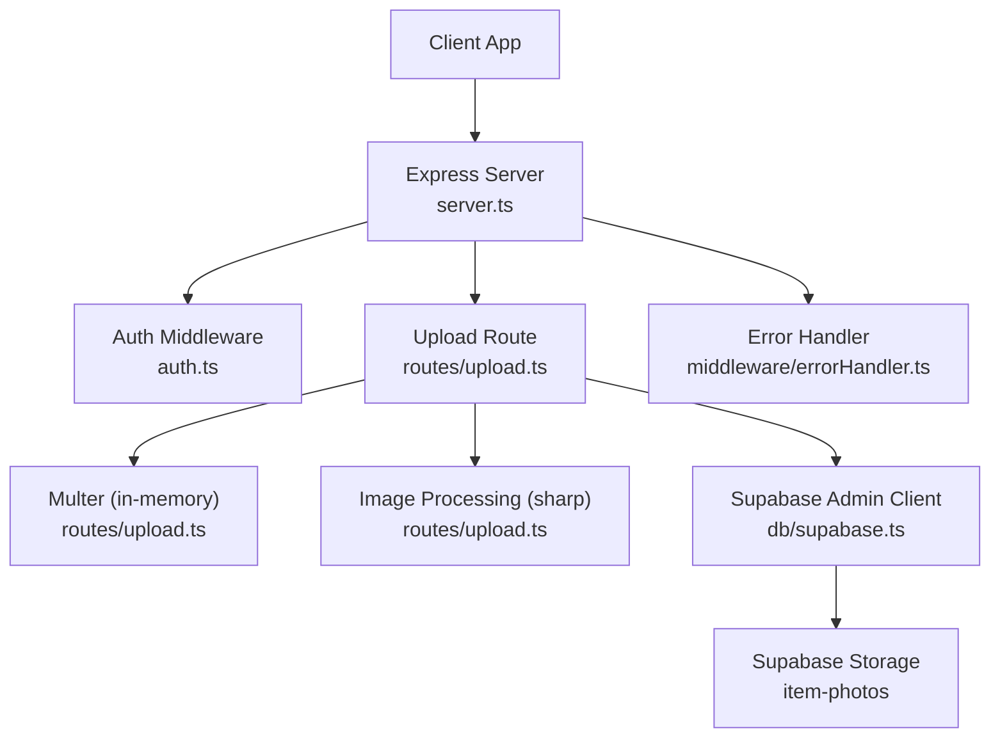
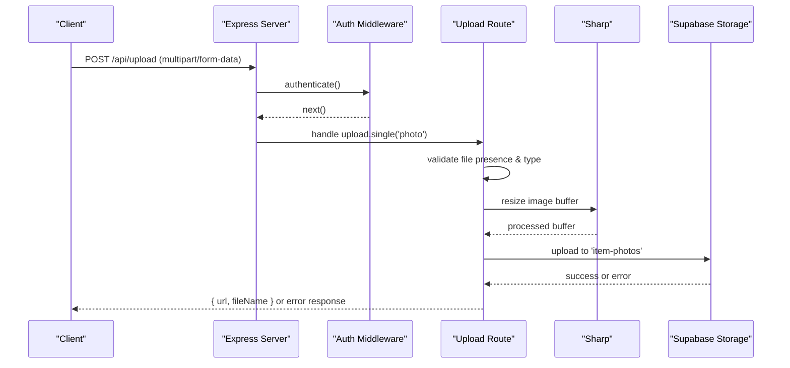
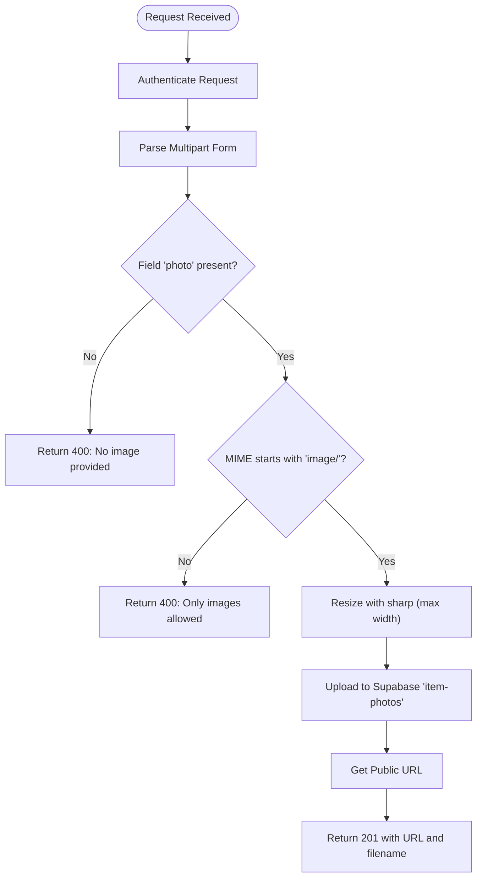
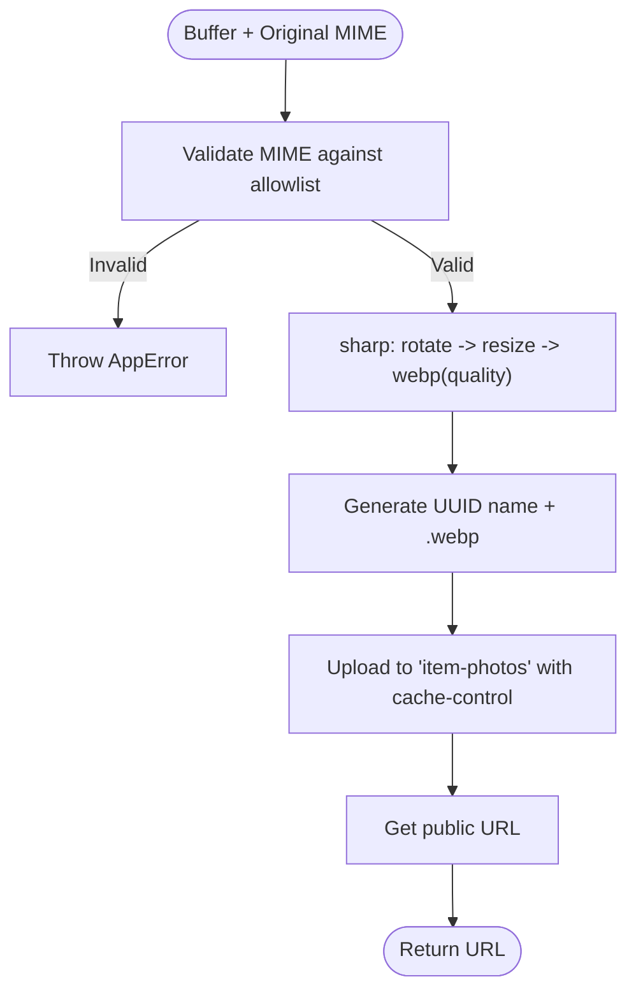
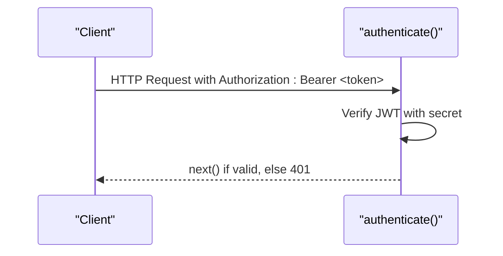
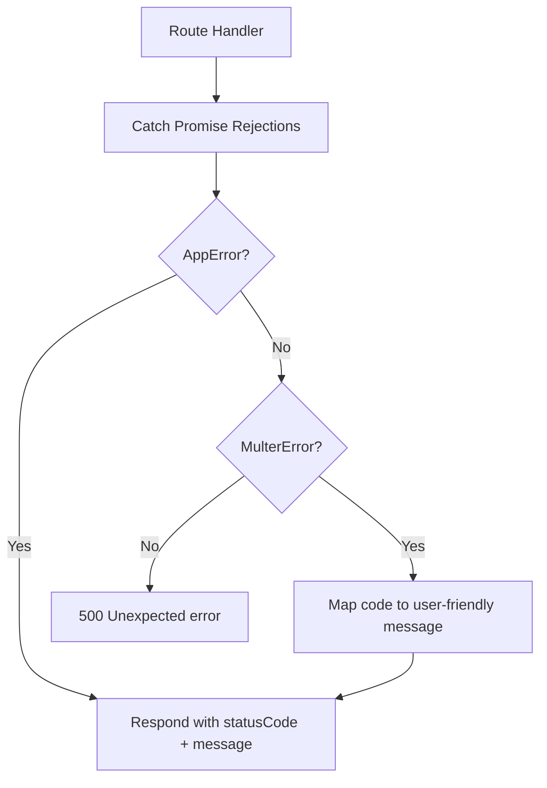
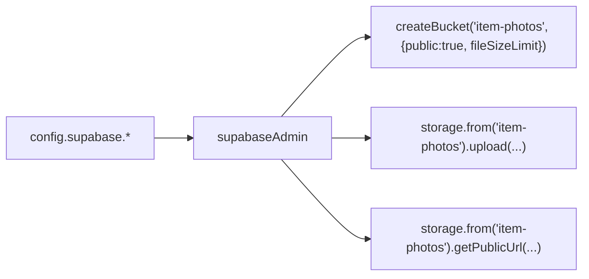
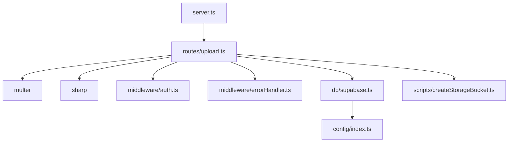
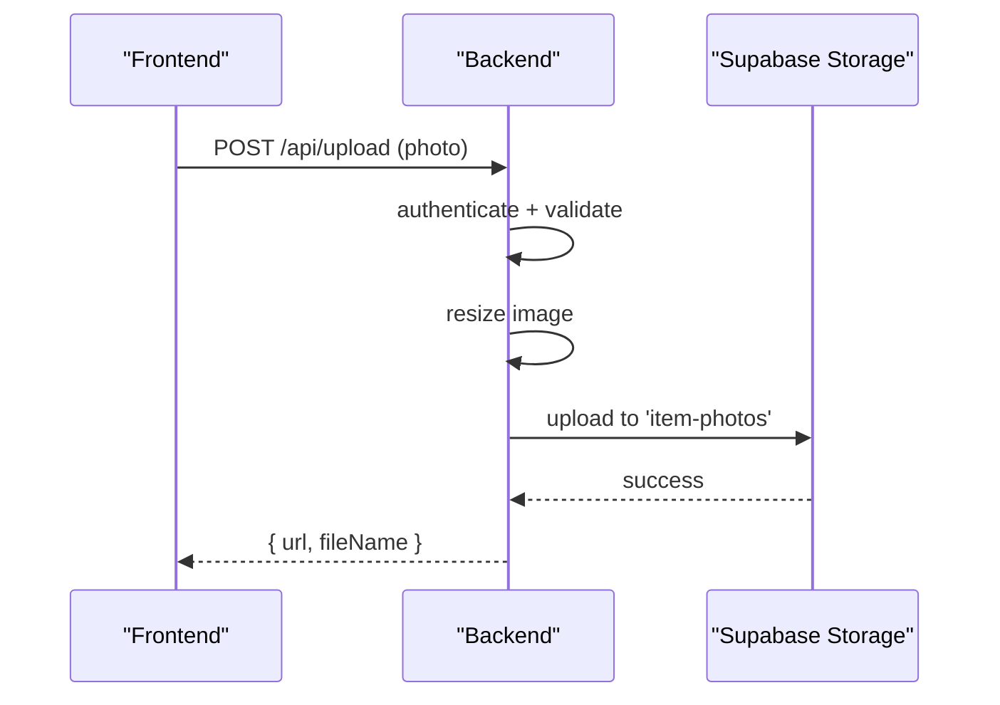

# File Upload & Storage

<cite>
**Referenced Files in This Document**
- [server.ts](file://backend/src/server.ts)
- [upload.ts](file://backend/src/routes/upload.ts)
- [uploadService.ts](file://backend/src/services/uploadService.ts)
- [auth.ts](file://backend/src/middleware/auth.ts)
- [errorHandler.ts](file://backend/src/middleware/errorHandler.ts)
- [supabase.ts](file://backend/src/db/supabase.ts)
- [createStorageBucket.ts](file://backend/src/scripts/createStorageBucket.ts)
- [index.ts](file://backend/src/config/index.ts)
- [001_initial_schema.sql](file://supabase/migrations/001_initial_schema.sql)
</cite>

## Table of Contents
1. Introduction
2. Project Structure
3. Core Components
4. Architecture Overview
5. Detailed Component Analysis
6. Dependency Analysis
7. Performance Considerations
8. Troubleshooting Guide
9. Conclusion

## Introduction
This document explains the file upload and storage system used by the application. It covers the end-to-end workflow from receiving an image to storing it in Supabase Storage, including validation, image processing, naming conventions, access control, and error handling. It also documents bucket configuration, public/private access settings, deletion workflows, quota considerations, and security best practices.

## Project Structure
The upload feature is implemented on the backend using Express routes, middleware for authentication and error handling, and a service layer that performs image processing and uploads to Supabase Storage. The server wires up routes and global middleware, while a script provisions the required storage bucket.

**Diagram sources**
- [server.ts:18-45](file://backend/src/server.ts#L18-L45)
- [upload.ts:15-67](file://backend/src/routes/upload.ts#L15-L67)
- [auth.ts:22-37](file://backend/src/middleware/auth.ts#L22-L37)
- [errorHandler.ts:16-47](file://backend/src/middleware/errorHandler.ts#L16-L47)
- [supabase.ts:8-11](file://backend/src/db/supabase.ts#L8-L11)

**Section sources**
- [server.ts:18-45](file://backend/src/server.ts#L18-L45)
- [upload.ts:15-67](file://backend/src/routes/upload.ts#L15-L67)
- [auth.ts:22-37](file://backend/src/middleware/auth.ts#L22-L37)
- [errorHandler.ts:16-47](file://backend/src/middleware/errorHandler.ts#L16-L47)
- [supabase.ts:8-11](file://backend/src/db/supabase.ts#L8-L11)

## Core Components
- Authentication: All upload endpoints require a valid JWT via the authenticate middleware.
- Validation and Limits: Multer enforces allowed MIME types and a maximum file size.
- Image Processing: sharp resizes images and optionally converts formats; one route keeps original extension, another normalizes to WebP with EXIF rotation and caching headers.
- Storage: Files are uploaded to a Supabase Storage bucket named item-photos using the admin client. Public URLs are returned to clients.
- Configuration: Supabase URL and keys are loaded from environment variables.
- Bucket Provisioning: A script creates or updates the bucket to be public with a size limit.

Key behaviors:
- Supported file types:
  - Route-level: any image MIME type accepted.
  - Service-level: JPEG, PNG, WebP, HEIC explicitly allowed.
- Size limits:
  - 5 MB enforced at both route and service levels.
- Image processing:
  - Resize to max width (800px in route; 1280px in service).
  - Optional conversion to WebP and quality tuning in the service.
  - EXIF auto-orientation in the service.
- Naming:
  - UUID-based filenames; optional subfolder organization in the service.
- Access:
  - Bucket is public; files are accessible via public URLs.

**Section sources**
- [upload.ts:15-67](file://backend/src/routes/upload.ts#L15-L67)
- [uploadService.ts:14-65](file://backend/src/services/uploadService.ts#L14-L65)
- [createStorageBucket.ts:3-27](file://backend/src/scripts/createStorageBucket.ts#L3-L27)
- [index.ts:11-15](file://backend/src/config/index.ts#L11-L15)

## Architecture Overview
The upload flow ensures authenticated requests, validates inputs, processes images safely, and persists them to Supabase Storage. Errors are normalized and returned consistently.

**Diagram sources**
- [server.ts:36-43](file://backend/src/server.ts#L36-L43)
- [upload.ts:32-67](file://backend/src/routes/upload.ts#L32-L67)
- [auth.ts:22-37](file://backend/src/middleware/auth.ts#L22-L37)
- [errorHandler.ts:16-47](file://backend/src/middleware/errorHandler.ts#L16-L47)

## Detailed Component Analysis

### Upload Route (POST /api/upload)
- Requires authentication via bearer token.
- Accepts a single multipart field named photo.
- Validates that a file is present and is an image.
- Resizes the image to a maximum width while preserving aspect ratio.
- Uploads the resized buffer to the item-photos bucket.
- Returns the public URL and filename.

**Diagram sources**
- [upload.ts:32-67](file://backend/src/routes/upload.ts#L32-L67)
- [auth.ts:22-37](file://backend/src/middleware/auth.ts#L22-L37)

**Section sources**
- [upload.ts:32-67](file://backend/src/routes/upload.ts#L32-L67)

### Upload Service (processAndUpload)
- Enforces a strict allowlist of MIME types and a 5 MB size limit.
- Processes images with sharp:
  - Auto-rotate based on EXIF orientation.
  - Resize to max width without enlarging.
  - Convert to WebP with quality setting.
- Stores files under items/ prefix with UUID names and immutable cache headers.
- Returns the public URL.

**Diagram sources**
- [uploadService.ts:14-65](file://backend/src/services/uploadService.ts#L14-L65)

**Section sources**
- [uploadService.ts:14-65](file://backend/src/services/uploadService.ts#L14-L65)

### Authentication and Authorization
- authenticate middleware verifies JWT from Authorization header and attaches user identity and role to the request.
- Upload routes are protected by this middleware.

**Diagram sources**
- [auth.ts:22-37](file://backend/src/middleware/auth.ts#L22-L37)

**Section sources**
- [auth.ts:22-37](file://backend/src/middleware/auth.ts#L22-L37)

### Error Handling
- Centralized error handler returns consistent JSON errors.
- Handles multer-specific errors such as file too large or unexpected fields.
- Wraps async route handlers to propagate errors uniformly.

**Diagram sources**
- [errorHandler.ts:16-55](file://backend/src/middleware/errorHandler.ts#L16-L55)

**Section sources**
- [errorHandler.ts:16-55](file://backend/src/middleware/errorHandler.ts#L16-L55)

### Supabase Storage Integration
- Admin client uses service role key for server-side operations.
- Bucket provisioning script creates or updates the item-photos bucket to be public with a 5 MB size limit.
- Database schema references photo_url fields for items and includes a note about creating the storage bucket.

**Diagram sources**
- [supabase.ts:8-11](file://backend/src/db/supabase.ts#L8-L11)
- [createStorageBucket.ts:3-27](file://backend/src/scripts/createStorageBucket.ts#L3-L27)
- [index.ts:11-15](file://backend/src/config/index.ts#L11-L15)
- [001_initial_schema.sql:367-369](file://supabase/migrations/001_initial_schema.sql#L367-L369)

**Section sources**
- [supabase.ts:8-11](file://backend/src/db/supabase.ts#L8-L11)
- [createStorageBucket.ts:3-27](file://backend/src/scripts/createStorageBucket.ts#L3-L27)
- [index.ts:11-15](file://backend/src/config/index.ts#L11-L15)
- [001_initial_schema.sql:367-369](file://supabase/migrations/001_initial_schema.sql#L367-L369)

## Dependency Analysis
- server.ts mounts routes and global middleware, including rate limiting and error handling.
- upload.ts depends on:
  - express Router
  - multer for multipart parsing
  - sharp for image processing
  - uuid for unique filenames
  - authenticate middleware for authorization
  - supabaseAdmin for storage operations
- uploadService.ts encapsulates reusable processing and upload logic with stricter MIME allowlisting and WebP normalization.
- errorHandler.ts provides centralized error mapping and async wrapper.
- config/index.ts supplies environment-driven configuration for Supabase and other services.

**Diagram sources**
- [server.ts:18-45](file://backend/src/server.ts#L18-L45)
- [upload.ts:1-67](file://backend/src/routes/upload.ts#L1-L67)
- [auth.ts:22-37](file://backend/src/middleware/auth.ts#L22-L37)
- [errorHandler.ts:16-55](file://backend/src/middleware/errorHandler.ts#L16-L55)
- [supabase.ts:8-11](file://backend/src/db/supabase.ts#L8-L11)
- [createStorageBucket.ts:3-27](file://backend/src/scripts/createStorageBucket.ts#L3-L27)
- [index.ts:11-15](file://backend/src/config/index.ts#L11-L15)

**Section sources**
- [server.ts:18-45](file://backend/src/server.ts#L18-L45)
- [upload.ts:1-67](file://backend/src/routes/upload.ts#L1-L67)
- [auth.ts:22-37](file://backend/src/middleware/auth.ts#L22-L37)
- [errorHandler.ts:16-55](file://backend/src/middleware/errorHandler.ts#L16-L55)
- [supabase.ts:8-11](file://backend/src/db/supabase.ts#L8-L11)
- [createStorageBucket.ts:3-27](file://backend/src/scripts/createStorageBucket.ts#L3-L27)
- [index.ts:11-15](file://backend/src/config/index.ts#L11-L15)

## Performance Considerations
- In-memory buffering: Both route and service use memory storage for uploads. This is suitable for small images but can increase memory usage for many concurrent uploads. Consider streaming to disk or object storage directly for high-throughput scenarios.
- Image resizing: Resizing before upload reduces bandwidth and storage costs. The service further normalizes to WebP with tuned quality for better compression.
- Caching: The service sets long-lived cache-control headers for immutable filenames to improve CDN/browser caching.
- Rate limiting: Global rate limiter protects endpoints from abuse.
- Concurrency: For large-scale uploads, consider background job queues to process images asynchronously and avoid blocking request threads.

[No sources needed since this section provides general guidance]

## Troubleshooting Guide
Common issues and resolutions:
- Missing or wrong field name: Ensure the multipart form contains a field named photo. Unexpected fields result in a specific error message.
- File too large: Maximum size is 5 MB. Clients should compress or resize images before uploading.
- Invalid file type: Only images are accepted at the route level; the service allows a specific set of MIME types.
- Authentication failures: Provide a valid JWT in the Authorization header with the correct format.
- Storage errors: If upload fails, check bucket existence and permissions, and ensure the service role key is configured correctly.

Error responses follow a consistent structure with status and message fields.

**Section sources**
- [errorHandler.ts:30-47](file://backend/src/middleware/errorHandler.ts#L30-L47)
- [upload.ts:20-27](file://backend/src/routes/upload.ts#L20-L27)
- [uploadService.ts:17-26](file://backend/src/services/uploadService.ts#L17-L26)
- [auth.ts:22-37](file://backend/src/middleware/auth.ts#L22-L37)

## Security Considerations
- Authentication: All upload endpoints require a valid JWT.
- Input validation: MIME type checks prevent non-image uploads; size limits protect resources.
- Safe processing: Images are processed in memory with sharp; no arbitrary code execution risk from filenames.
- Access control: The bucket is public; sensitive data should not be stored there. Use private buckets and signed URLs if access must be restricted.
- Secrets management: Supabase keys are loaded from environment variables; never hardcode secrets.
- Malware scanning: Not implemented in the current codebase. Consider adding virus scanning before storage for additional safety.

[No sources needed since this section provides general guidance]

## Endpoints and Workflows

### Upload Endpoint
- Method: POST
- Path: /api/upload
- Headers: Authorization: Bearer <JWT>
- Body: multipart/form-data with field photo
- Success Response: 201 with URL and filename
- Errors: 400 for validation issues; 401 for auth failures; 500 for server/storage errors

**Diagram sources**
- [server.ts:36-43](file://backend/src/server.ts#L36-L43)
- [upload.ts:32-67](file://backend/src/routes/upload.ts#L32-L67)

**Section sources**
- [upload.ts:32-67](file://backend/src/routes/upload.ts#L32-L67)

### Storage Organization and Naming
- Route: UUID filename with original extension; stored at bucket root.
- Service: UUID filename with .webp; stored under items/ prefix; immutable cache headers.

**Section sources**
- [upload.ts:40-46](file://backend/src/routes/upload.ts#L40-L46)
- [uploadService.ts:38-54](file://backend/src/services/uploadService.ts#L38-L54)

### Access Control and Bucket Settings
- Bucket name: item-photos
- Public: true (readable by anyone with the URL)
- Size limit: 5 MB
- Admin client used for uploads; anon client available for read-only operations respecting RLS where applicable.

**Section sources**
- [createStorageBucket.ts:3-27](file://backend/src/scripts/createStorageBucket.ts#L3-L27)
- [supabase.ts:8-20](file://backend/src/db/supabase.ts#L8-L20)

### Deletion and Cleanup
- No deletion endpoint is implemented in the analyzed code. To delete files, call the Supabase Storage delete method with the file path and appropriate credentials. Implement server-side authorization to restrict deletions to authorized users or admins.

[No sources needed since this section describes missing functionality]

### Quota Management
- Enforced at two layers:
  - Application-level: Multer limits to 5 MB per request.
  - Storage-level: Bucket size limit set to 5 MB in the provisioning script.
- Monitor storage usage in the Supabase dashboard and adjust limits as needed.

**Section sources**
- [upload.ts:15-19](file://backend/src/routes/upload.ts#L15-L19)
- [uploadService.ts:8-16](file://backend/src/services/uploadService.ts#L8-L16)
- [createStorageBucket.ts:4-7](file://backend/src/scripts/createStorageBucket.ts#L4-L7)

## Conclusion
The upload system combines robust authentication, input validation, efficient image processing, and reliable storage in Supabase. It supports common workflows for lost-and-found item photos with clear error handling and performance optimizations. For enhanced security and flexibility, consider adding malware scanning, private buckets with signed URLs, and asynchronous processing for large-scale deployments.