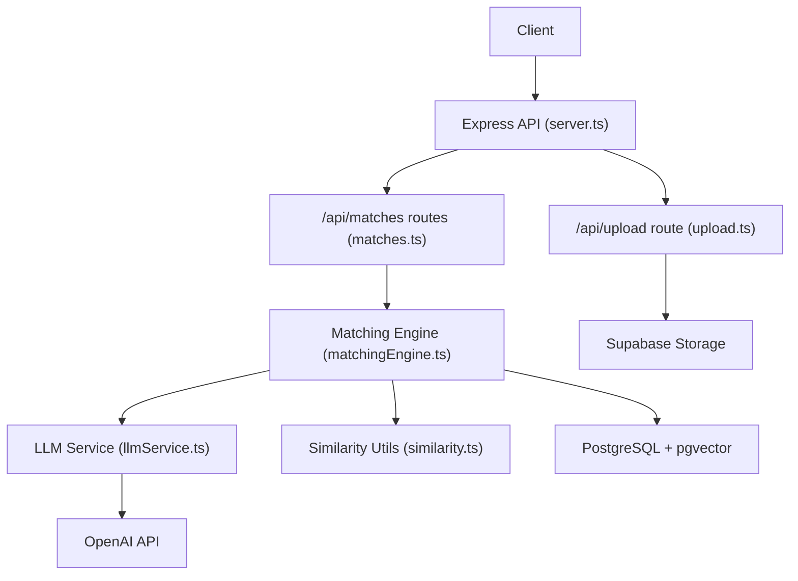
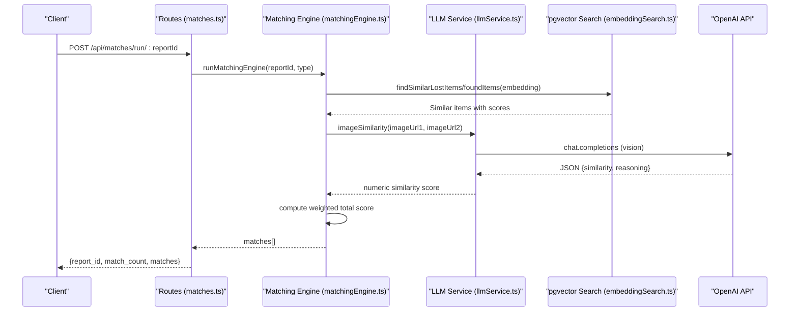
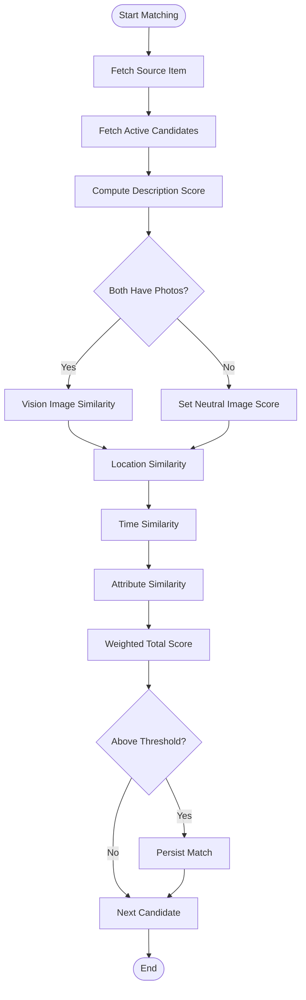
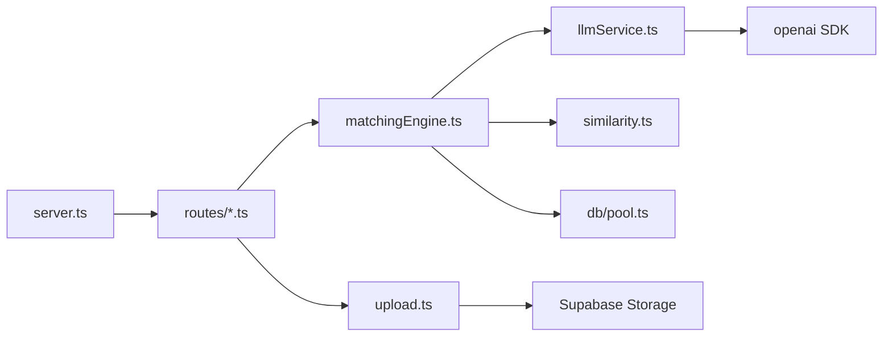

# OpenAI Integration

<cite>
**Referenced Files in This Document**
- [server.ts](file://backend/src/server.ts)
- [index.ts](file://backend/src/config/index.ts)
- [llmService.ts](file://backend/src/services/llmService.ts)
- [embeddingSearch.ts](file://backend/src/services/embeddingSearch.ts)
- [matchingEngine.ts](file://backend/src/services/matchingEngine.ts)
- [similarity.ts](file://backend/src/utils/similarity.ts)
- [errorHandler.ts](file://backend/src/middleware/errorHandler.ts)
- [matches.ts](file://backend/src/routes/matches.ts)
- [upload.ts](file://backend/src/routes/upload.ts)
- [package.json](file://backend/package.json)
- [render.yaml](file://render.yaml)
</cite>

## Table of Contents
1. [Introduction](#introduction)
2. [Project Structure](#project-structure)
3. [Core Components](#core-components)
4. [Architecture Overview](#architecture-overview)
5. [Detailed Component Analysis](#detailed-component-analysis)
6. [Dependency Analysis](#dependency-analysis)
7. [Performance Considerations](#performance-considerations)
8. [Troubleshooting Guide](#troubleshooting-guide)
9. [Conclusion](#conclusion)
10. [Appendices](#appendices)

## Introduction
This document explains how the backend integrates with OpenAI to power semantic similarity search, image similarity comparison, and structured data extraction from natural language descriptions. It covers configuration of API keys, model selection, rate limiting strategies, embedding generation, cosine similarity calculations, vector comparisons, image handling via vision models, structured field extraction, error handling patterns, retry considerations, cost optimization techniques, request/response formats, performance tuning, and troubleshooting.

## Project Structure
The OpenAI integration spans several modules:
- Configuration loads environment variables including the OpenAI API key.
- LLM service provides embeddings, text-to-vector similarity, structured extraction, and image similarity.
- Embedding search uses PostgreSQL pgvector for efficient cosine similarity queries.
- Matching engine orchestrates scoring across description, image, location, time, and attributes.
- Routes expose endpoints that trigger matching and handle uploads.
- Server configures global rate limiting and middleware.

**Diagram sources**
- [server.ts:18-45](file://backend/src/server.ts#L18-L45)
- [matches.ts:15-45](file://backend/src/routes/matches.ts#L15-L45)
- [upload.ts:32-67](file://backend/src/routes/upload.ts#L32-L67)
- [matchingEngine.ts:37-188](file://backend/src/services/matchingEngine.ts#L37-L188)
- [llmService.ts:9-119](file://backend/src/services/llmService.ts#L9-L119)
- [similarity.ts:4-82](file://backend/src/utils/similarity.ts#L4-L82)

**Section sources**
- [server.ts:18-45](file://backend/src/server.ts#L18-L45)
- [index.ts:6-48](file://backend/src/config/index.ts#L6-L48)

## Core Components
- OpenAI client initialization and API key loading from environment.
- Embedding generation using a text embedding model.
- Cosine similarity computation for vector comparison.
- Structured field extraction from free-text descriptions.
- Image similarity comparison using vision capabilities.
- Vector-based similarity search via pgvector operators.
- Weighted multi-factor matching engine combining description, image, location, time, and attributes.

**Section sources**
- [index.ts:19-21](file://backend/src/config/index.ts#L19-L21)
- [llmService.ts:9-119](file://backend/src/services/llmService.ts#L9-L119)
- [embeddingSearch.ts:30-100](file://backend/src/services/embeddingSearch.ts#L30-L100)
- [matchingEngine.ts:37-188](file://backend/src/services/matchingEngine.ts#L37-L188)
- [similarity.ts:4-82](file://backend/src/utils/similarity.ts#L4-L82)

## Architecture Overview
The system performs three primary OpenAI-driven tasks:
1. Text embeddings for semantic similarity search.
2. Vision-based image similarity comparison.
3. Structured field extraction from natural language.

**Diagram sources**
- [matches.ts:15-45](file://backend/src/routes/matches.ts#L15-L45)
- [matchingEngine.ts:37-188](file://backend/src/services/matchingEngine.ts#L37-L188)
- [embeddingSearch.ts:30-100](file://backend/src/services/embeddingSearch.ts#L30-L100)
- [llmService.ts:85-119](file://backend/src/services/llmService.ts#L85-L119)

## Detailed Component Analysis

### OpenAI Configuration and Models
- API key is loaded from environment and passed to the OpenAI client.
- Models used:
  - Text embeddings: text-embedding-3-small with fixed dimensions.
  - Structured extraction and image similarity: gpt-4o-mini.

Configuration highlights:
- Environment variable OPENAI_API_KEY is required.
- Matching weights and thresholds are centralized in configuration.

**Section sources**
- [index.ts:19-21](file://backend/src/config/index.ts#L19-L21)
- [index.ts:33-47](file://backend/src/config/index.ts#L33-L47)
- [llmService.ts:9-17](file://backend/src/services/llmService.ts#L9-L17)
- [llmService.ts:47-79](file://backend/src/services/llmService.ts#L47-L79)
- [llmService.ts:85-119](file://backend/src/services/llmService.ts#L85-L119)

### Embedding Generation and Semantic Similarity Search
- Embeddings are generated using a text embedding model with a fixed dimensionality.
- The backend stores vectors in PostgreSQL and uses pgvector’s native cosine distance operator for efficient similarity search.
- Queries filter by status, exclude the submitter’s own items, enforce minimum similarity thresholds, and limit results.

Key behaviors:
- Embedding generation returns a normalized vector suitable for cosine similarity.
- Vector search runs entirely in the database to minimize memory usage and latency.
- Results include computed similarity scores mapped to a 0–100 scale.

**Section sources**
- [llmService.ts:9-17](file://backend/src/services/llmService.ts#L9-L17)
- [embeddingSearch.ts:30-62](file://backend/src/services/embeddingSearch.ts#L30-L62)
- [embeddingSearch.ts:68-100](file://backend/src/services/embeddingSearch.ts#L68-L100)

### Cosine Similarity and Vector Comparison Algorithms
- Cosine similarity is implemented to compare two embedding vectors and return a 0–100 score.
- When embeddings are unavailable or parsing fails, the matching engine falls back to simple text overlap similarity.

Algorithm characteristics:
- Computes dot product and norms; maps [-1, 1] to [0, 100].
- Robust to zero-norm inputs by returning neutral scores.

**Section sources**
- [llmService.ts:23-41](file://backend/src/services/llmService.ts#L23-L41)
- [matchingEngine.ts:83-97](file://backend/src/services/matchingEngine.ts#L83-L97)
- [matchingEngine.ts:201-207](file://backend/src/services/matchingEngine.ts#L201-L207)

### Image Similarity Using Vision Capabilities
- Image similarity compares two images by sending their URLs to a vision-capable model.
- The model returns a JSON object containing a similarity score and brief reasoning.
- Fallback behavior: if comparison fails (e.g., invalid URLs), a neutral score is returned.

Handling details:
- Images must be accessible via public URLs.
- Scores are clamped to the 0–100 range.

**Section sources**
- [llmService.ts:85-119](file://backend/src/services/llmService.ts#L85-L119)
- [matchingEngine.ts:119-123](file://backend/src/services/matchingEngine.ts#L119-L123)

### Structured Field Extraction from Natural Language
- A system prompt instructs the model to extract category, brand, and color from item descriptions.
- Response format is enforced as JSON, ensuring consistent parsing.
- Defaults are applied when fields are missing.

Extraction outcomes:
- Category is constrained to a predefined set.
- Brand and color are optional and default to empty strings when absent.

**Section sources**
- [llmService.ts:47-79](file://backend/src/services/llmService.ts#L47-L79)

### Matching Engine: Multi-Factor Scoring
The matching engine computes a weighted total score from:
- Description similarity (embedding cosine similarity or fallback text overlap).
- Image similarity (vision model when both items have photos).
- Location similarity (Haversine-based proximity).
- Time similarity (time-window overlap).
- Attribute similarity (category, brand, color).

Scoring flow:
- Fetch source and candidate items.
- Compute per-factor scores.
- Apply configured weights and threshold filtering.
- Persist matches and send notifications for top matches.

**Diagram sources**
- [matchingEngine.ts:37-188](file://backend/src/services/matchingEngine.ts#L37-L188)

**Section sources**
- [matchingEngine.ts:37-188](file://backend/src/services/matchingEngine.ts#L37-L188)
- [similarity.ts:4-82](file://backend/src/utils/similarity.ts#L4-L82)

### Rate Limiting Strategy
- Global rate limiter is applied to all API routes under /api/.
- Limits are configured with a time window and maximum number of requests.
- This protects against abuse and manages load on downstream services like OpenAI.

**Section sources**
- [server.ts:25-30](file://backend/src/server.ts#L25-L30)

### Error Handling Patterns
- Centralized error handler distinguishes operational errors, multer upload errors, and unexpected errors.
- Consistent JSON error responses are returned with appropriate status codes.
- Async route handlers use an async wrapper to propagate errors to the central handler.

**Section sources**
- [errorHandler.ts:4-56](file://backend/src/middleware/errorHandler.ts#L4-L56)

### Request/Response Formats
- Matching endpoint:
  - POST /api/matches/run/:reportId?
    - Query param: type=lost|found
    - Response: report_id, match_count, matches[]
- Upload endpoint:
  - POST /api/upload
    - Multipart form field: photo
    - Response: url, fileName

These formats are defined by the route handlers and validated by middleware.

**Section sources**
- [matches.ts:15-45](file://backend/src/routes/matches.ts#L15-L45)
- [matches.ts:52-114](file://backend/src/routes/matches.ts#L52-L114)
- [upload.ts:32-67](file://backend/src/routes/upload.ts#L32-L67)

## Dependency Analysis
OpenAI integration depends on:
- Express server and middleware for routing and rate limiting.
- Database pool for querying items and persisting matches.
- pgvector for vector storage and cosine distance operations.
- Supabase storage for image uploads.
- OpenAI SDK for embeddings and vision calls.

**Diagram sources**
- [server.ts:18-45](file://backend/src/server.ts#L18-L45)
- [matchingEngine.ts:1-6](file://backend/src/services/matchingEngine.ts#L1-L6)
- [llmService.ts:1-4](file://backend/src/services/llmService.ts#L1-L4)
- [upload.ts:1-9](file://backend/src/routes/upload.ts#L1-L9)

**Section sources**
- [package.json:16-31](file://backend/package.json#L16-L31)
- [server.ts:18-45](file://backend/src/server.ts#L18-L45)

## Performance Considerations
- Use pgvector-native cosine distance for scalable similarity search instead of in-memory comparisons.
- Clamp image similarity to avoid excessive costs when images cannot be compared.
- Enforce minimum similarity thresholds to reduce unnecessary processing.
- Configure rate limits to protect against spikes and manage OpenAI quota usage.
- Prefer lightweight models (text-embedding-3-small, gpt-4o-mini) for cost efficiency.
- Avoid redundant embedding computations by caching or reusing vectors where possible.

[No sources needed since this section provides general guidance]

## Troubleshooting Guide
Common issues and resolutions:
- Missing or invalid OpenAI API key:
  - Ensure OPENAI_API_KEY is set in environment variables.
  - Verify configuration loads the key at startup.
- Image similarity failures:
  - Check that image URLs are publicly accessible.
  - If comparison fails, the system returns a neutral score; verify upstream storage permissions.
- Too many requests:
  - Review rate limiter settings and adjust windowMs/max as needed.
  - Monitor API usage and consider scaling or throttling client requests.
- Upload errors:
  - Ensure file size is within limits and correct field name is used.
  - Handle multer-specific errors consistently.

Operational checks:
- Health endpoint confirms server status.
- Logs and error responses provide context for failures.

**Section sources**
- [index.ts:19-21](file://backend/src/config/index.ts#L19-L21)
- [llmService.ts:85-119](file://backend/src/services/llmService.ts#L85-L119)
- [server.ts:25-34](file://backend/src/server.ts#L25-L34)
- [errorHandler.ts:30-46](file://backend/src/middleware/errorHandler.ts#L30-L46)

## Conclusion
The backend integrates OpenAI to deliver robust semantic search, vision-based image similarity, and structured extraction from natural language. By leveraging pgvector for efficient vector operations, applying configurable weights and thresholds, and implementing centralized error handling and rate limiting, the system balances accuracy, performance, and cost. Proper configuration of API keys, model selection, and environment variables ensures reliable operation across deployments.

[No sources needed since this section summarizes without analyzing specific files]

## Appendices

### Environment Variables and Deployment
- Required environment variables include the OpenAI API key and other service credentials.
- Deployment manifests define these variables for production environments.

**Section sources**
- [render.yaml:34-53](file://render.yaml#L34-L53)

### Dependencies
- OpenAI SDK version and related packages are declared in package dependencies.

**Section sources**
- [package.json:16-31](file://backend/package.json#L16-L31)