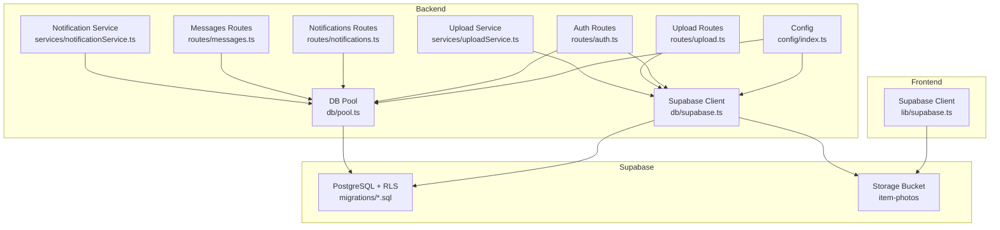
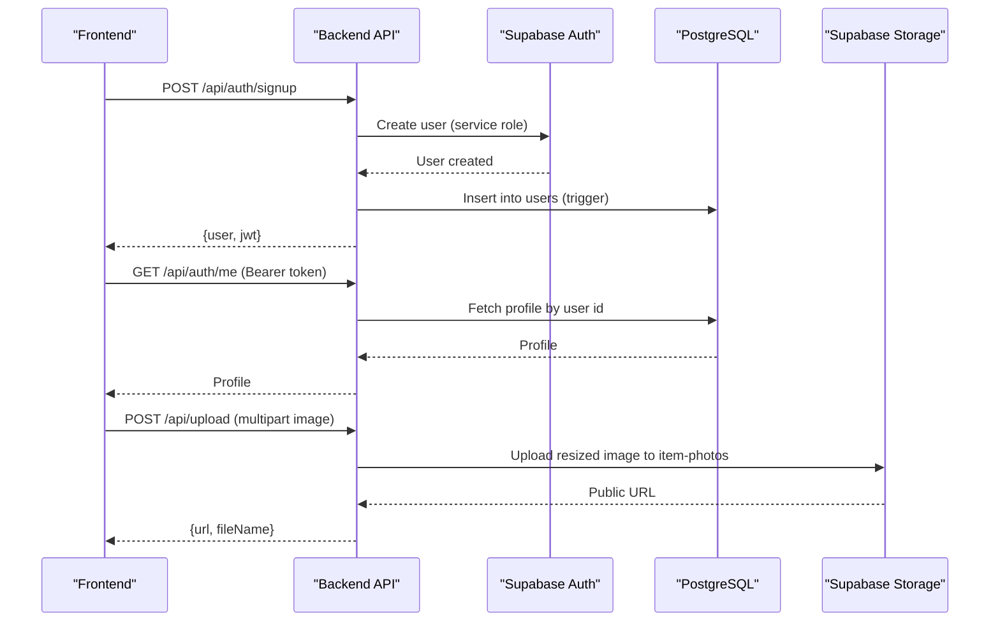
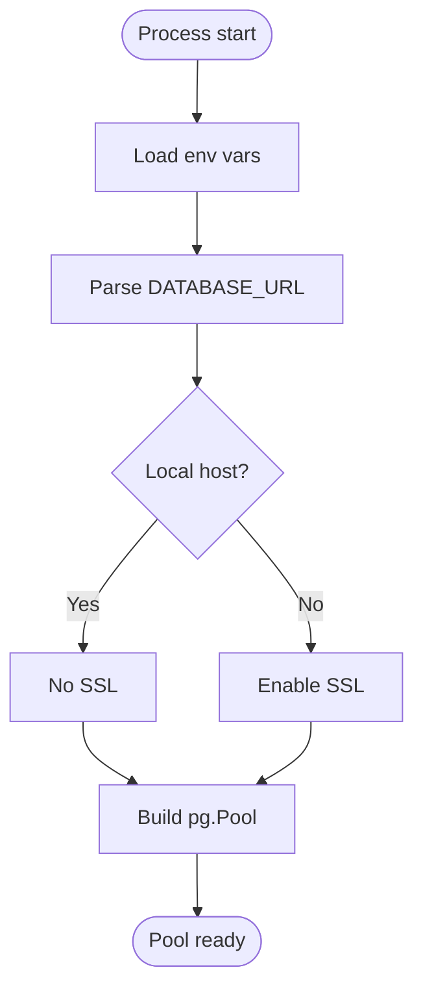
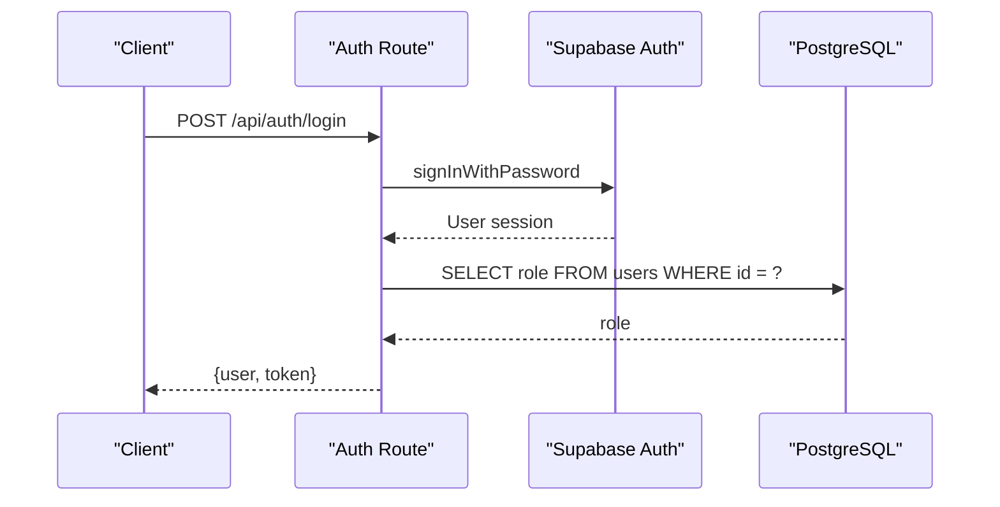
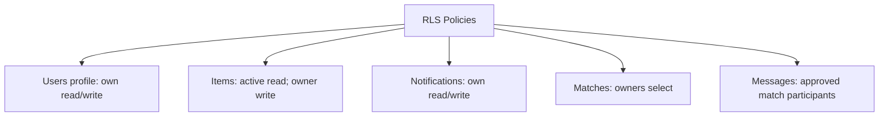
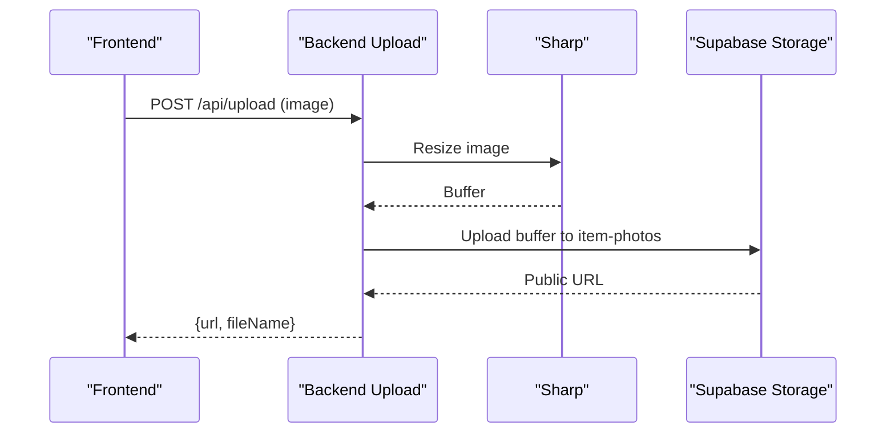
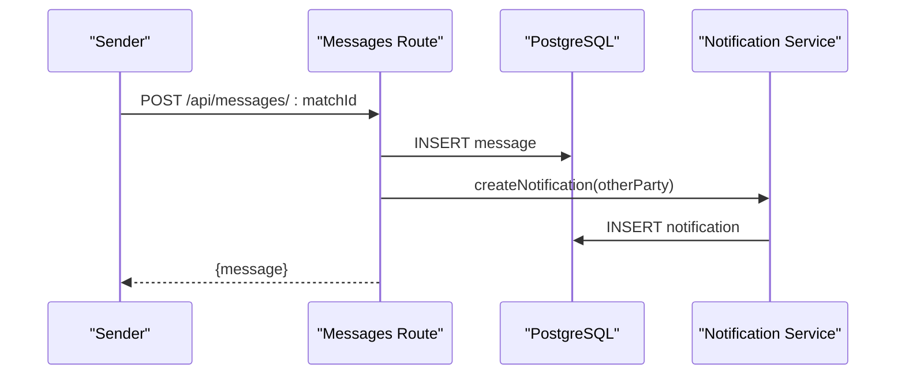
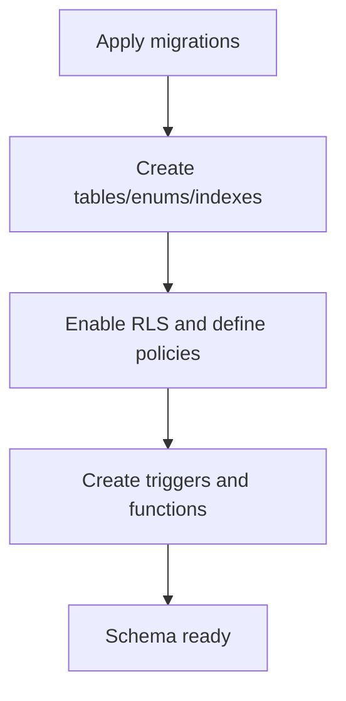
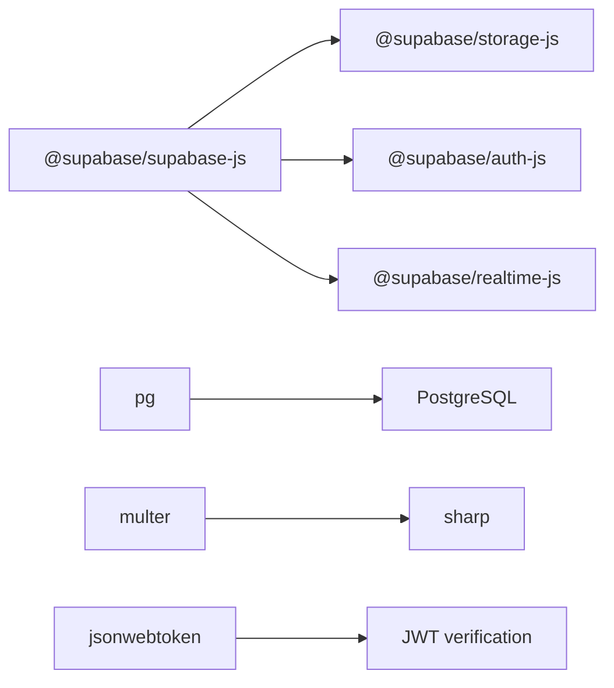

# Supabase Integration

<cite>
**Referenced Files in This Document**
- [supabase.ts](file://backend/src/db/supabase.ts)
- [index.ts](file://backend/src/config/index.ts)
- [pool.ts](file://backend/src/db/pool.ts)
- [auth.ts](file://backend/src/middleware/auth.ts)
- [auth.ts](file://backend/src/routes/auth.ts)
- [upload.ts](file://backend/src/routes/upload.ts)
- [uploadService.ts](file://backend/src/services/uploadService.ts)
- [createStorageBucket.ts](file://backend/src/scripts/createStorageBucket.ts)
- [supabase.ts](file://frontend/lib/supabase.ts)
- [001_initial_schema.sql](file://supabase/migrations/001_initial_schema.sql)
- [002_messages.sql](file://supabase/migrations/002_messages.sql)
- [003_admin_fraud_flag.sql](file://supabase/migrations/003_admin_fraud_flag.sql)
- [notifications.ts](file://backend/src/routes/notifications.ts)
- [messages.ts](file://backend/src/routes/messages.ts)
- [notificationService.ts](file://backend/src/services/notificationService.ts)
- [render.yaml](file://render.yaml)
</cite>

## Table of Contents
1. Introduction
2. Project Structure
3. Core Components
4. Architecture Overview
5. Detailed Component Analysis
6. Dependency Analysis
7. Performance Considerations
8. Troubleshooting Guide
9. Conclusion

## Introduction
This document explains how the application integrates with Supabase for database connections, authentication, storage, and real-time capabilities. It covers client configuration, environment setup, connection pooling, Row-Level Security (RLS), user authentication flows, role-based access control, file upload and storage management, notifications and messaging, migration management, schema evolution, backup strategies, security considerations, API key management, environment-specific configurations, and troubleshooting guidance.

## Project Structure
The integration spans backend services, frontend clients, and Supabase migrations:
- Backend Supabase client initialization and configuration
- Database pool for direct PostgreSQL queries
- Authentication routes and middleware
- Storage routes and utilities for image processing and uploads
- Notifications and messaging endpoints
- Frontend Supabase client and photo upload helper
- Migrations defining schema, RLS policies, indexes, and triggers

**Diagram sources**
- [index.ts:6-15](file://backend/src/config/index.ts#L6-L15)
- [supabase.ts:1-21](file://backend/src/db/supabase.ts#L1-L21)
- [pool.ts:1-48](file://backend/src/db/pool.ts#L1-L48)
- [auth.ts:1-98](file://backend/src/routes/auth.ts#L1-L98)
- [upload.ts:1-69](file://backend/src/routes/upload.ts#L1-L69)
- [uploadService.ts:1-66](file://backend/src/services/uploadService.ts#L1-L66)
- [notifications.ts:1-86](file://backend/src/routes/notifications.ts#L1-L86)
- [messages.ts:1-136](file://backend/src/routes/messages.ts#L1-L136)
- [notificationService.ts:1-101](file://backend/src/services/notificationService.ts#L1-L101)
- [supabase.ts:1-25](file://frontend/lib/supabase.ts#L1-L25)
- [001_initial_schema.sql:1-370](file://supabase/migrations/001_initial_schema.sql#L1-L370)
- [002_messages.sql:1-53](file://supabase/migrations/002_messages.sql#L1-L53)
- [003_admin_fraud_flag.sql:1-13](file://supabase/migrations/003_admin_fraud_flag.sql#L1-L13)

**Section sources**
- [index.ts:6-15](file://backend/src/config/index.ts#L6-L15)
- [supabase.ts:1-21](file://backend/src/db/supabase.ts#L1-L21)
- [pool.ts:1-48](file://backend/src/db/pool.ts#L1-L48)
- [001_initial_schema.sql:1-370](file://supabase/migrations/001_initial_schema.sql#L1-L370)

## Core Components
- Supabase client configuration:
  - Admin client using service role key to bypass RLS for server-side operations
  - Anon client respecting RLS for user-scoped operations
- Environment configuration:
  - Centralized config object loading Supabase URL and keys from environment variables
- Database pool:
  - Connection parsing, SSL handling, pool sizing, timeouts, and query helpers
- Authentication:
  - JWT issuance and verification; admin role enforcement via DB lookup
- Storage:
  - Image validation, resizing, conversion, and upload to a public bucket
  - Script to create or ensure the bucket exists and is public
- Notifications and messaging:
  - In-app notifications and email delivery
  - Message threads scoped to approved matches with RLS protections

**Section sources**
- [supabase.ts:1-21](file://backend/src/db/supabase.ts#L1-L21)
- [index.ts:6-15](file://backend/src/config/index.ts#L6-L15)
- [pool.ts:1-48](file://backend/src/db/pool.ts#L1-L48)
- [auth.ts:1-59](file://backend/src/middleware/auth.ts#L1-L59)
- [auth.ts:1-98](file://backend/src/routes/auth.ts#L1-L98)
- [upload.ts:1-69](file://backend/src/routes/upload.ts#L1-L69)
- [uploadService.ts:1-66](file://backend/src/services/uploadService.ts#L1-L66)
- [createStorageBucket.ts:1-34](file://backend/src/scripts/createStorageBucket.ts#L1-L34)
- [notifications.ts:1-86](file://backend/src/routes/notifications.ts#L1-L86)
- [messages.ts:1-136](file://backend/src/routes/messages.ts#L1-L136)
- [notificationService.ts:1-101](file://backend/src/services/notificationService.ts#L1-L101)

## Architecture Overview
The system uses two Supabase clients:
- Admin client for privileged server operations (e.g., creating users, uploading files)
- Anon client for user-scoped operations that respect RLS

Direct database access uses a pooled PostgreSQL connection configured from DATABASE_URL. Authentication issues JWTs signed with a secret and enforces roles by checking the users table. Storage is handled via a dedicated bucket with public URLs. Notifications are persisted and optionally emailed. Messaging is restricted to participants of approved matches.

**Diagram sources**
- [auth.ts:16-41](file://backend/src/routes/auth.ts#L16-L41)
- [auth.ts:46-72](file://backend/src/routes/auth.ts#L46-L72)
- [auth.ts:78-97](file://backend/src/routes/auth.ts#L78-L97)
- [upload.ts:32-67](file://backend/src/routes/upload.ts#L32-L67)
- [supabase.ts:1-21](file://backend/src/db/supabase.ts#L1-L21)

## Detailed Component Analysis

### Database Connections and Pooling
- Configuration:
  - Loads Supabase URL and keys from environment variables
  - Loads DATABASE_URL for direct PostgreSQL access
- Pool settings:
  - Parses connection URL, enables SSL for non-local hosts
  - Configures max pool size, idle timeout, and connection timeout
  - Exposes query and queryOne helpers for safe parameterized queries

**Diagram sources**
- [pool.ts:9-28](file://backend/src/db/pool.ts#L9-L28)
- [index.ts:6-15](file://backend/src/config/index.ts#L6-L15)

**Section sources**
- [index.ts:6-15](file://backend/src/config/index.ts#L6-L15)
- [pool.ts:1-48](file://backend/src/db/pool.ts#L1-L48)

### Supabase Client Configuration
- Admin client:
  - Uses service role key to bypass RLS for server-side tasks
- Anon client:
  - Respects RLS for user-scoped operations

**Section sources**
- [supabase.ts:1-21](file://backend/src/db/supabase.ts#L1-L21)

### Authentication and Role-Based Access Control
- Signup flow:
  - Creates Supabase Auth user with confirmed email and metadata
  - Issues a JWT containing user id, role, and email
- Login flow:
  - Authenticates via Supabase Auth
  - Reads role from users table
  - Issues JWT
- Middleware:
  - Verifies JWT and attaches userId and userRole to requests
  - Enforces admin role by querying users table

**Diagram sources**
- [auth.ts:46-72](file://backend/src/routes/auth.ts#L46-L72)
- [auth.ts:22-37](file://backend/src/middleware/auth.ts#L22-L37)
- [auth.ts:43-58](file://backend/src/middleware/auth.ts#L43-L58)

**Section sources**
- [auth.ts:16-41](file://backend/src/routes/auth.ts#L16-L41)
- [auth.ts:46-72](file://backend/src/routes/auth.ts#L46-L72)
- [auth.ts:78-97](file://backend/src/routes/auth.ts#L78-L97)
- [auth.ts:22-37](file://backend/src/middleware/auth.ts#L22-L37)
- [auth.ts:43-58](file://backend/src/middleware/auth.ts#L43-L58)

### Row-Level Security Policies
- Tables enabled for RLS:
  - users, lost_items, found_items, matches, notifications, verification_questions, verification_attempts
- Key policies:
  - Users can view/update own profile
  - Active items visible to all; owners can manage their items
  - Notifications scoped to user
  - Matches visible to item owners
  - Messages only accessible for approved matches between participants

**Diagram sources**
- [001_initial_schema.sql:322-365](file://supabase/migrations/001_initial_schema.sql#L322-L365)
- [002_messages.sql:25-52](file://supabase/migrations/002_messages.sql#L25-L52)

**Section sources**
- [001_initial_schema.sql:322-365](file://supabase/migrations/001_initial_schema.sql#L322-L365)
- [002_messages.sql:25-52](file://supabase/migrations/002_messages.sql#L25-L52)

### File Upload and Storage Management
- Backend upload route:
  - Requires authentication
  - Validates image MIME type and size
  - Resizes images with sharp and uploads to Supabase Storage bucket
  - Returns public URL
- Upload service utility:
  - Normalizes images to webp, resizes, sets cache headers, and uploads
- Bucket setup script:
  - Creates or ensures the bucket exists and is public
- Frontend upload helper:
  - Uploads directly to Supabase Storage and returns public URL

**Diagram sources**
- [upload.ts:32-67](file://backend/src/routes/upload.ts#L32-L67)
- [uploadService.ts:34-65](file://backend/src/services/uploadService.ts#L34-L65)
- [createStorageBucket.ts:3-27](file://backend/src/scripts/createStorageBucket.ts#L3-L27)
- [supabase.ts:11-24](file://frontend/lib/supabase.ts#L11-L24)

**Section sources**
- [upload.ts:1-69](file://backend/src/routes/upload.ts#L1-L69)
- [uploadService.ts:1-66](file://backend/src/services/uploadService.ts#L1-L66)
- [createStorageBucket.ts:1-34](file://backend/src/scripts/createStorageBucket.ts#L1-L34)
- [supabase.ts:11-24](file://frontend/lib/supabase.ts#L11-L24)

### Notifications and Real-Time Features
- Notifications:
  - Persisted to the notifications table
  - Optional email delivery via an email service
  - Endpoints to list, count, and mark as read
- Messaging:
  - Threads per match, restricted to approved matches
  - RLS ensures only participants can read/send messages
- Real-time subscriptions:
  - The project includes Supabase realtime dependencies in the frontend lockfile
  - The frontend client is initialized for potential real-time usage

**Diagram sources**
- [messages.ts:97-133](file://backend/src/routes/messages.ts#L97-L133)
- [notificationService.ts:19-62](file://backend/src/services/notificationService.ts#L19-L62)

**Section sources**
- [notifications.ts:1-86](file://backend/src/routes/notifications.ts#L1-L86)
- [messages.ts:1-136](file://backend/src/routes/messages.ts#L1-L136)
- [notificationService.ts:1-101](file://backend/src/services/notificationService.ts#L1-L101)

### Database Migration Management and Schema Evolution
- Migrations:
  - Initial schema defines tables, enums, indexes, functions, triggers, and RLS policies
  - Messages migration adds message threads and RLS for secure messaging
  - Admin fraud flag migration adds fields and index for flagged matches
- Triggers:
  - Auto-create users row on auth signup
  - Auto-update updated_at timestamps
- Indexes:
  - Optimized for lookups and vector similarity search

**Diagram sources**
- [001_initial_schema.sql:1-370](file://supabase/migrations/001_initial_schema.sql#L1-L370)
- [002_messages.sql:1-53](file://supabase/migrations/002_messages.sql#L1-L53)
- [003_admin_fraud_flag.sql:1-13](file://supabase/migrations/003_admin_fraud_flag.sql#L1-L13)

**Section sources**
- [001_initial_schema.sql:1-370](file://supabase/migrations/001_initial_schema.sql#L1-L370)
- [002_messages.sql:1-53](file://supabase/migrations/002_messages.sql#L1-L53)
- [003_admin_fraud_flag.sql:1-13](file://supabase/migrations/003_admin_fraud_flag.sql#L1-L13)

### Backup Strategies
- Use Supabase’s built-in backups and point-in-time recovery features available in your Supabase project dashboard.
- For critical data, schedule regular exports or logical backups using tools compatible with PostgreSQL.
- Ensure migration history is version-controlled and applied consistently across environments.

[No sources needed since this section provides general guidance]

### Security Considerations and API Key Management
- Secrets:
  - Store Supabase keys, DATABASE_URL, JWT_SECRET, and third-party API keys in environment variables
  - Do not commit secrets to source control
- Least privilege:
  - Use anon client for user-scoped operations to enforce RLS
  - Use service role client only for server-side tasks requiring elevated privileges
- Validation:
  - Validate and sanitize inputs at API boundaries
  - Restrict file types and sizes for uploads
- Transport:
  - Use HTTPS for all client-server communication
  - Enable SSL for database connections when not local

**Section sources**
- [index.ts:6-15](file://backend/src/config/index.ts#L6-L15)
- [pool.ts:9-28](file://backend/src/db/pool.ts#L9-L28)
- [upload.ts:15-27](file://backend/src/routes/upload.ts#L15-L27)
- [render.yaml:34-53](file://render.yaml#L34-L53)

## Dependency Analysis
Key runtime dependencies include:
- Supabase JS SDK components for auth, storage, and realtime
- PostgreSQL driver for direct DB access
- Multer and Sharp for file uploads and image processing
- JSON Web Tokens for backend API authentication

**Diagram sources**
- [backend/package-lock.json:1508-1565](file://backend/package-lock.json#L1508-L1565)
- [frontend/package-lock.json:514-557](file://frontend/package-lock.json#L514-L557)

**Section sources**
- [backend/package-lock.json:1508-1565](file://backend/package-lock.json#L1508-L1565)
- [frontend/package-lock.json:514-557](file://frontend/package-lock.json#L514-L557)

## Performance Considerations
- Database:
  - Use provided indexes for fast lookups and vector similarity search
  - Keep queries parameterized and selective
- Storage:
  - Resize and convert images before upload to reduce bandwidth and storage costs
  - Set appropriate cache-control headers for immutable assets
- Pooling:
  - Tune pool size and timeouts based on workload and hosting limits
- Real-time:
  - Subscribe only to necessary channels and limit payload sizes

[No sources needed since this section provides general guidance]

## Troubleshooting Guide
- Connection issues:
  - Verify DATABASE_URL format and credentials
  - Ensure SSL is enabled for non-local connections
  - Check network/firewall rules to Supabase pooler
- Permission errors:
  - Confirm RLS policies allow intended actions
  - Validate JWT presence and correctness in Authorization header
  - Ensure admin checks use DB role, not just JWT claims
- Upload failures:
  - Validate MIME type and file size limits
  - Ensure storage bucket exists and is public
  - Check error messages from Supabase Storage API
- Real-time connectivity:
  - Confirm Supabase realtime dependencies are installed
  - Verify client initialization with correct URL and anon key
  - Inspect browser console for WebSocket errors

**Section sources**
- [pool.ts:9-28](file://backend/src/db/pool.ts#L9-L28)
- [auth.ts:22-37](file://backend/src/middleware/auth.ts#L22-L37)
- [auth.ts:43-58](file://backend/src/middleware/auth.ts#L43-L58)
- [upload.ts:15-27](file://backend/src/routes/upload.ts#L15-L27)
- [createStorageBucket.ts:3-27](file://backend/src/scripts/createStorageBucket.ts#L3-L27)
- [002_messages.sql:25-52](file://supabase/migrations/002_messages.sql#L25-L52)

## Conclusion
The application integrates Supabase through dedicated admin and anon clients, a robust database pool, strict authentication and authorization flows, secure storage practices, and well-defined RLS policies. Migrations provide a clear schema evolution path, while notifications and messaging support user interactions. Follow the security and performance recommendations to maintain a reliable and scalable system.

[No sources needed since this section summarizes without analyzing specific files]