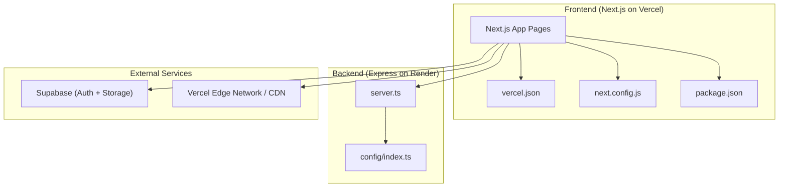
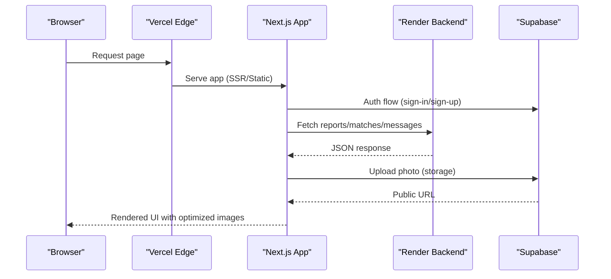
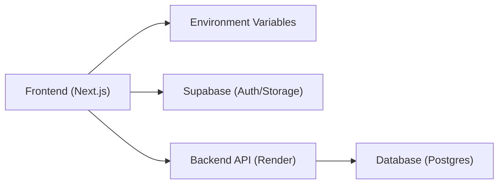

# Frontend Deployment (Vercel)

<cite>
**Referenced Files in This Document**
- [vercel.json](file://frontend/vercel.json)
- [next.config.js](file://frontend/next.config.js)
- [package.json](file://frontend/package.json)
- [DEPLOYMENT.md](file://DEPLOYMENT.md)
- [api.ts](file://frontend/lib/api.ts)
- [supabase.ts](file://frontend/lib/supabase.ts)
- [server.ts](file://backend/src/server.ts)
- [config/index.ts](file://backend/src/config/index.ts)
</cite>

## Table of Contents
1. Introduction
2. Project Structure
3. Core Components
4. Architecture Overview
5. Detailed Component Analysis
6. Dependency Analysis
7. Performance Considerations
8. Troubleshooting Guide
9. Conclusion
10. Appendices

## Introduction
This document provides a comprehensive deployment guide for the Next.js frontend on Vercel, including configuration via vercel.json, environment variables, build optimization, custom domains and SSL, CDN behavior, Next.js-specific optimizations (image optimization, static generation), API route handling, development workflow with Vercel CLI, preview deployments, production releases, performance monitoring, caching strategies, and security considerations such as environment variable management and CORS configuration.

## Project Structure
The frontend is a Next.js application located under the frontend directory. It uses Supabase for authentication and storage, and communicates with a backend API hosted on Render. The repository includes:
- A Vercel configuration file that defines framework detection, build commands, and environment variables.
- A Next.js configuration that enables image optimization for remote images from Supabase Storage.
- Package scripts for development, building, and linting.
- Documentation describing end-to-end deployment steps and environment setup.

**Diagram sources**
- [vercel.json:1-11](file://frontend/vercel.json#L1-L11)
- [next.config.js:1-15](file://frontend/next.config.js#L1-L15)
- [package.json:1-32](file://frontend/package.json#L1-L32)
- [server.ts:1-52](file://backend/src/server.ts#L1-L52)
- [config/index.ts:1-49](file://backend/src/config/index.ts#L1-L49)

**Section sources**
- [vercel.json:1-11](file://frontend/vercel.json#L1-L11)
- [next.config.js:1-15](file://frontend/next.config.js#L1-L15)
- [package.json:1-32](file://frontend/package.json#L1-L32)
- [DEPLOYMENT.md:1-104](file://DEPLOYMENT.md#L1-L104)

## Core Components
- Vercel Configuration: Defines framework, build/install commands, and environment variables for Supabase and API endpoints.
- Next.js Image Optimization: Allows loading images from Supabase Storage via remotePatterns.
- Environment Variables: Public keys and URLs are provided to the frontend at build time.
- API Client: Centralized client for calling backend APIs with token handling and error mapping.
- Supabase Client: Initializes Supabase client and uploads photos to storage with cache control.

Key responsibilities:
- Build-time configuration ensures correct framework detection and environment injection.
- Runtime configuration drives API calls and Supabase interactions.
- Image optimization reduces bandwidth and improves load times by leveraging Vercel’s edge network and Supabase CDN.

**Section sources**
- [vercel.json:1-11](file://frontend/vercel.json#L1-L11)
- [next.config.js:1-15](file://frontend/next.config.js#L1-L15)
- [api.ts:1-423](file://frontend/lib/api.ts#L1-L423)
- [supabase.ts:1-25](file://frontend/lib/supabase.ts#L1-L25)

## Architecture Overview
The frontend runs on Vercel and serves static assets and server-rendered pages through Vercel’s global edge network. It authenticates users via Supabase and stores user-uploaded images in Supabase Storage. All business logic and data operations are handled by the backend API on Render.

**Diagram sources**
- [vercel.json:1-11](file://frontend/vercel.json#L1-L11)
- [api.ts:1-423](file://frontend/lib/api.ts#L1-L423)
- [supabase.ts:1-25](file://frontend/lib/supabase.ts#L1-L25)
- [server.ts:1-52](file://backend/src/server.ts#L1-L52)

## Detailed Component Analysis

### Vercel Configuration (vercel.json)
- Framework detection: nextjs
- Install command: npm install
- Build command: next build
- Environment variables: NEXT_PUBLIC_SUPABASE_URL, NEXT_PUBLIC_SUPABASE_ANON_KEY, NEXT_PUBLIC_API_URL

Notes:
- These env values are baked into the build output for public variables. For production, replace placeholder values with your actual project credentials and backend URL.
- Keep secrets out of this file; use Vercel Dashboard environment variables instead for sensitive values.

**Section sources**
- [vercel.json:1-11](file://frontend/vercel.json#L1-L11)

### Next.js Configuration (next.config.js)
- Remote image patterns allow serving images from Supabase Storage paths.
- This enables Next.js Image Optimization for images hosted on *.supabase.co under /storage/v1/object/public/**.

Impact:
- Reduces payload size and improves performance via automatic resizing, modern formats, and CDN delivery.
- Ensures only allowed domains are loaded, improving security posture.

**Section sources**
- [next.config.js:1-15](file://frontend/next.config.js#L1-L15)

### Environment Variables and API Integration
- Public API base URL is read from process.env.NEXT_PUBLIC_API_URL and used to call backend routes.
- Supabase client is initialized using NEXT_PUBLIC_SUPABASE_URL and NEXT_PUBLIC_SUPABASE_ANON_KEY.
- Photo upload returns a public URL which can be displayed via Next.js Image Optimization.

Security note:
- Only expose non-sensitive variables publicly. Sensitive keys should be stored in backend-only environments.

**Section sources**
- [api.ts:1-423](file://frontend/lib/api.ts#L1-L423)
- [supabase.ts:1-25](file://frontend/lib/supabase.ts#L1-L25)

### Build Process and Scripts
- Development: next dev
- Production build: next build
- Linting: next lint

These scripts are defined in package.json and executed by Vercel during deployment.

**Section sources**
- [package.json:1-32](file://frontend/package.json#L1-L32)

### API Route Handling and CORS
- The frontend calls backend endpoints via a centralized client that attaches Authorization headers when available.
- The backend enforces CORS based on FRONTEND_URL configured in its environment. Ensure your Vercel domain is included in CORS settings on the backend.

Operational tip:
- After deploying the frontend, update backend CORS to include your Vercel domain(s).

**Section sources**
- [api.ts:1-423](file://frontend/lib/api.ts#L1-L423)
- [server.ts:1-52](file://backend/src/server.ts#L1-L52)
- [config/index.ts:1-49](file://backend/src/config/index.ts#L1-L49)

### Custom Domains, SSL, and CDN
- Vercel automatically provisions SSL certificates for custom domains and serves content via its global CDN.
- Configure custom domains in the Vercel dashboard for your project. SSL is managed by Vercel without additional configuration.
- Images served from Supabase are also delivered via Supabase’s CDN; Next.js optimizes these images at the edge.

Best practice:
- Use environment variables per environment (development, preview, production) to manage different domains and API endpoints.

[No sources needed since this section provides general guidance]

### Next.js Optimizations
- Image Optimization: Enabled for Supabase Storage via remotePatterns.
- Static Generation: Next.js will statically generate pages where possible; ensure data fetching methods align with static vs dynamic rendering needs.
- API Routes: The frontend delegates API calls to the backend; no serverless functions are required unless you add them later.

Performance tips:
- Prefer static generation for pages that do not require user-specific data.
- Use Next.js Image component for all images to benefit from automatic optimization.

**Section sources**
- [next.config.js:1-15](file://frontend/next.config.js#L1-L15)

### Development Workflow with Vercel CLI
- Local development: run the Next.js dev server locally and configure local environment variables in .env.local.
- Preview deployments: use Vercel CLI to deploy branches or PRs for review before merging.
- Production releases: push to main branch to trigger production builds and deployments.

Environment alignment:
- Ensure local env matches Vercel environment variables for consistent behavior.

[No sources needed since this section provides general guidance]

### Caching Strategies
- Supabase Storage uploads set cache-control headers to improve browser caching of images.
- Vercel’s CDN caches static assets and SSR responses according to Next.js defaults and headers.
- Backend rate limiting protects against abuse and stabilizes performance under load.

**Section sources**
- [supabase.ts:1-25](file://frontend/lib/supabase.ts#L1-L25)
- [server.ts:1-52](file://backend/src/server.ts#L1-L52)

### Security Considerations
- Environment variables: Do not commit secrets to version control. Use Vercel Dashboard to set environment variables per environment.
- CORS: Configure backend CORS to allow your Vercel domain(s). Update after changing domains or adding preview branches.
- Authentication: Use Supabase Auth securely; store tokens in memory or secure storage and attach them to API requests.

**Section sources**
- [DEPLOYMENT.md:1-104](file://DEPLOYMENT.md#L1-L104)
- [server.ts:1-52](file://backend/src/server.ts#L1-L52)
- [config/index.ts:1-49](file://backend/src/config/index.ts#L1-L49)

## Dependency Analysis
The frontend depends on:
- Next.js runtime and build toolchain
- Supabase client for authentication and storage
- Backend API endpoints for business logic and data persistence

**Diagram sources**
- [vercel.json:1-11](file://frontend/vercel.json#L1-L11)
- [api.ts:1-423](file://frontend/lib/api.ts#L1-L423)
- [supabase.ts:1-25](file://frontend/lib/supabase.ts#L1-L25)
- [server.ts:1-52](file://backend/src/server.ts#L1-L52)

**Section sources**
- [vercel.json:1-11](file://frontend/vercel.json#L1-L11)
- [api.ts:1-423](file://frontend/lib/api.ts#L1-L423)
- [supabase.ts:1-25](file://frontend/lib/supabase.ts#L1-L25)
- [server.ts:1-52](file://backend/src/server.ts#L1-L52)

## Performance Considerations
- Enable Next.js Image Optimization for all images to reduce bandwidth and improve load times.
- Use static generation for pages that do not require real-time data.
- Leverage Vercel’s global CDN for fast asset delivery.
- Configure appropriate cache-control headers for long-lived assets like images.
- Monitor backend rate limiting and adjust thresholds if necessary.

[No sources needed since this section provides general guidance]

## Troubleshooting Guide
Common issues and resolutions:
- Build fails due to missing environment variables: Ensure NEXT_PUBLIC_SUPABASE_URL, NEXT_PUBLIC_SUPABASE_ANON_KEY, and NEXT_PUBLIC_API_URL are set in Vercel.
- CORS errors: Verify backend CORS allows your Vercel domain(s). Update backend environment accordingly.
- Image loading failures: Confirm Next.js remotePatterns include Supabase Storage host and path.
- API connectivity: Check NEXT_PUBLIC_API_URL points to the correct backend endpoint and that the backend health endpoint responds.

Verification steps:
- Confirm backend health endpoint returns success.
- Test sign-up/login flow and verify API calls succeed in the browser network tab.
- Validate image uploads return public URLs and display correctly.

**Section sources**
- [DEPLOYMENT.md:1-104](file://DEPLOYMENT.md#L1-L104)
- [server.ts:1-52](file://backend/src/server.ts#L1-L52)
- [next.config.js:1-15](file://frontend/next.config.js#L1-L15)
- [api.ts:1-423](file://frontend/lib/api.ts#L1-L423)

## Conclusion
Deploying the Next.js frontend on Vercel involves configuring vercel.json for framework detection and environment variables, optimizing images via Next.js configuration, and ensuring proper CORS and API integration with the backend. Vercel simplifies custom domains and SSL provisioning while providing a global CDN for fast delivery. Follow the outlined steps for environment setup, build optimization, and troubleshooting to achieve a reliable and performant production deployment.

[No sources needed since this section summarizes without analyzing specific files]

## Appendices

### Environment Variables Reference
- NEXT_PUBLIC_SUPABASE_URL: Supabase project URL
- NEXT_PUBLIC_SUPABASE_ANON_KEY: Supabase anonymous key
- NEXT_PUBLIC_API_URL: Backend API base URL

Set these in Vercel Dashboard for each environment (development, preview, production).

**Section sources**
- [vercel.json:1-11](file://frontend/vercel.json#L1-L11)
- [DEPLOYMENT.md:1-104](file://DEPLOYMENT.md#L1-L104)

### Deployment Checklist
- Import repository into Vercel and set Root Directory to frontend
- Set environment variables in Vercel Dashboard
- Deploy and verify frontend loads
- Update backend CORS to include Vercel domain(s)
- Verify backend health endpoint and end-to-end flows

**Section sources**
- [DEPLOYMENT.md:1-104](file://DEPLOYMENT.md#L1-L104)