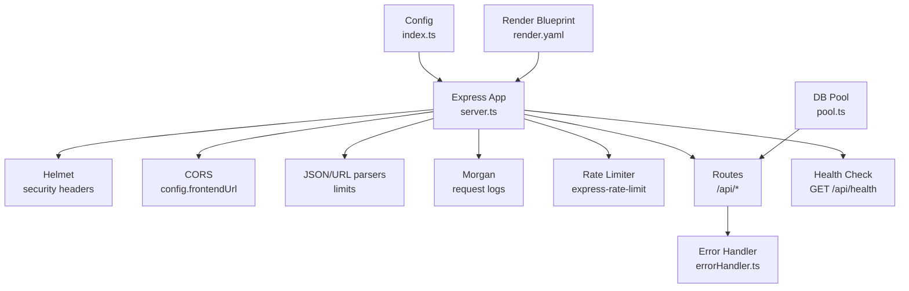
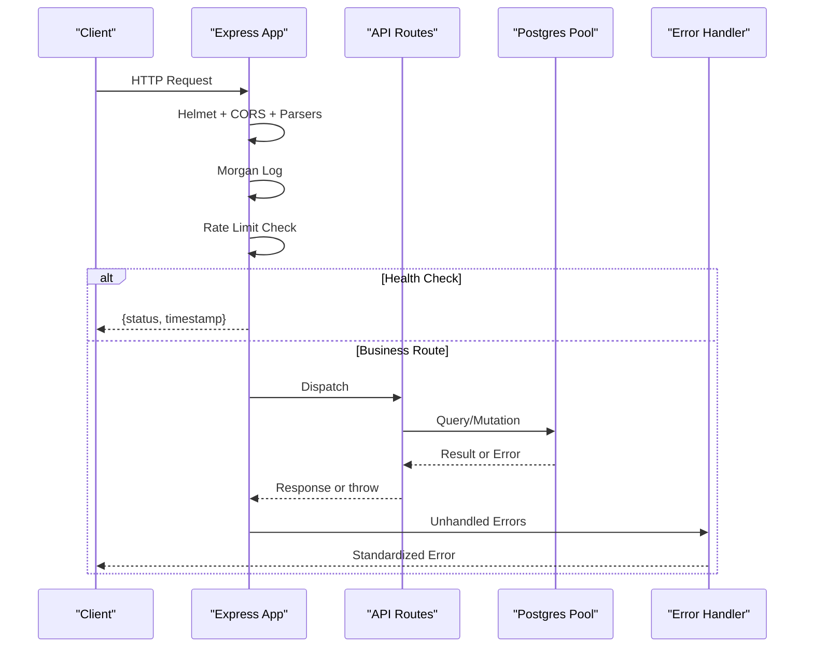
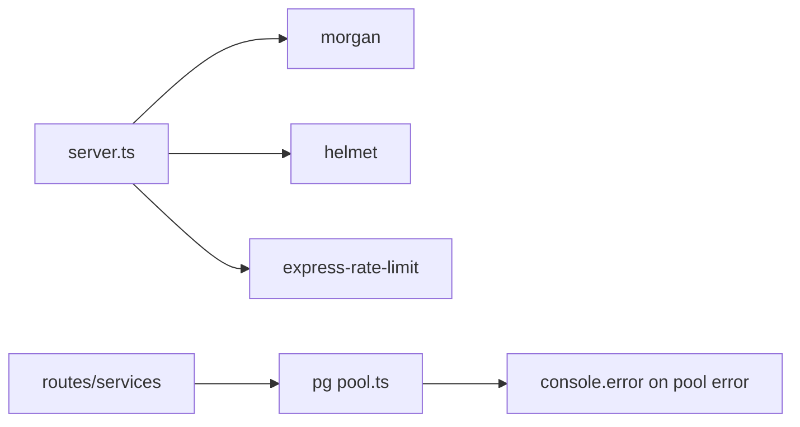

# Monitoring & Logging

<cite>
**Referenced Files in This Document**
- [server.ts](file://backend/src/server.ts)
- [errorHandler.ts](file://backend/src/middleware/errorHandler.ts)
- [index.ts](file://backend/src/config/index.ts)
- [pool.ts](file://backend/src/db/pool.ts)
- [package.json](file://backend/package.json)
- [render.yaml](file://render.yaml)
- [DEPLOYMENT.md](file://DEPLOYMENT.md)
- [pre-submission-health-check.md](file://pre-submission-health-check.md)
</cite>

## Table of Contents
1. Introduction
2. Project Structure
3. Core Components
4. Architecture Overview
5. Detailed Component Analysis
6. Dependency Analysis
7. Performance Considerations
8. Troubleshooting Guide
9. Conclusion
10. Appendices

## Introduction
This document describes the monitoring and logging posture for the deployed application, focusing on:
- Health checks and service readiness
- Request logging and error handling
- Rate limiting and security headers
- Database connection monitoring
- Deployment health verification
- Recommended enhancements for structured logging, metrics collection, alerting, tracing, profiling, log retention, dashboards, KPIs, and incident response

The backend is an Express API with Morgan request logging, Helmet security headers, express-rate-limit rate limiting, a simple /api/health endpoint, and a centralized error handler. The deployment uses Render with a configured health check path.

## Project Structure
Key monitoring-related elements are concentrated in the backend server bootstrap, middleware, configuration, database pool, and deployment manifest.

**Diagram sources**
- [server.ts:1-52](file://backend/src/server.ts#L1-L52)
- [index.ts:1-49](file://backend/src/config/index.ts#L1-L49)
- [pool.ts:1-48](file://backend/src/db/pool.ts#L1-L48)
- [render.yaml:1-54](file://render.yaml#L1-L54)

**Section sources**
- [server.ts:1-52](file://backend/src/server.ts#L1-L52)
- [index.ts:1-49](file://backend/src/config/index.ts#L1-L49)
- [pool.ts:1-48](file://backend/src/db/pool.ts#L1-L48)
- [render.yaml:1-54](file://render.yaml#L1-L54)

## Core Components
- Health check endpoint: GET /api/health returns a JSON status and timestamp for liveness/readiness probes.
- Request logging: Morgan is enabled; format switches between dev and combined based on environment.
- Error handling: Centralized error handler normalizes errors, handles multer upload errors, and logs unhandled exceptions.
- Rate limiting: Global limiter under /api to protect against abuse.
- Security headers: Helmet applied early in the pipeline.
- Configuration: Environment-driven settings (port, frontend URL, JWT secret, matching thresholds).
- Database pool: Configured with SSL behavior for non-local hosts, timeouts, and idle settings; emits pool-level errors.

Operational implications:
- Health checks can be used by Render and external monitors.
- Morgan logs provide request context; consider structured JSON for aggregation.
- Error responses are standardized; ensure production log sinks capture console.error output.
- Rate limiting protects endpoints; tune window and max as needed.
- DB pool errors surface via console.error; monitor platform logs.

**Section sources**
- [server.ts:18-46](file://backend/src/server.ts#L18-L46)
- [errorHandler.ts:1-56](file://backend/src/middleware/errorHandler.ts#L1-L56)
- [index.ts:6-48](file://backend/src/config/index.ts#L6-L48)
- [pool.ts:9-32](file://backend/src/db/pool.ts#L9-L32)

## Architecture Overview
The runtime flow for requests includes security, parsing, logging, rate limiting, routing, and error handling. Health checks bypass business logic.

**Diagram sources**
- [server.ts:18-46](file://backend/src/server.ts#L18-L46)
- [pool.ts:28-32](file://backend/src/db/pool.ts#L28-L32)
- [errorHandler.ts:16-47](file://backend/src/middleware/errorHandler.ts#L16-L47)

## Detailed Component Analysis

### Health Check Endpoint
- Purpose: Liveness/readiness probe for orchestrators and monitoring systems.
- Behavior: Returns a JSON object with status and timestamp.
- Deployment integration: Render blueprint sets healthCheckPath to /api/health.

Recommendations:
- Add readiness checks (e.g., DB connectivity) before reporting healthy.
- Include version/build metadata for traceability.

**Section sources**
- [server.ts:32-34](file://backend/src/server.ts#L32-L34)
- [render.yaml:13](file://render.yaml#L13)

### Request Logging
- Current: Morgan middleware logs each request; format adapts to environment.
- Output: Console-based logs suitable for platform log aggregators.

Enhancements:
- Switch to structured JSON logs for machine parsing.
- Correlate requests with IDs across services.
- Redact sensitive fields from logs.

**Section sources**
- [server.ts:21-24](file://backend/src/server.ts#L21-L24)
- [package.json:25](file://backend/package.json#L25)

### Error Handling Strategy
- Custom AppError class standardizes error responses with status codes.
- Multer-specific errors are handled with user-friendly messages.
- Unhandled errors are logged and return a generic 500 response.
- asyncHandler wraps route handlers to catch promise rejections.

Enhancements:
- Attach correlation IDs to errors.
- Emit telemetry events for error rates and categories.
- Avoid leaking stack traces in production responses.

**Section sources**
- [errorHandler.ts:4-14](file://backend/src/middleware/errorHandler.ts#L4-L14)
- [errorHandler.ts:16-47](file://backend/src/middleware/errorHandler.ts#L16-L47)
- [errorHandler.ts:49-56](file://backend/src/middleware/errorHandler.ts#L49-L56)

### Rate Limiting
- Global limiter under /api with a 15-minute window and a per-IP cap.
- Protects against brute-force and resource exhaustion.

Tuning guidance:
- Adjust windowMs and max based on expected traffic patterns.
- Consider per-route limits for heavy endpoints.
- Monitor 429 responses to detect misconfiguration or attacks.

**Section sources**
- [server.ts:25-30](file://backend/src/server.ts#L25-L30)

### Security Headers
- Helmet applied at startup to set secure HTTP headers.

Best practices:
- Review default policy and tailor to your needs.
- Ensure CSP aligns with frontend assets and third-party integrations.

**Section sources**
- [server.ts:19](file://backend/src/server.ts#L19)

### Database Pool Monitoring
- Pool created with SSL for non-local connections, timeouts, and idle settings.
- Emits pool-level errors to console.

Monitoring tips:
- Track pool error frequency and duration.
- Watch for connection timeouts and adjust timeouts if necessary.
- Consider exposing pool stats via a metrics endpoint.

**Section sources**
- [pool.ts:9-26](file://backend/src/db/pool.ts#L9-L26)
- [pool.ts:28-32](file://backend/src/db/pool.ts#L28-L32)

### Configuration and Environment
- Centralized config loads environment variables for port, frontend URL, Supabase keys, database URL, OpenAI key, email sender, and JWT settings.
- Matching thresholds and parameters are configurable.

Operational notes:
- Ensure all secrets are set in the deployment platform’s secret store.
- Validate required env vars at startup and fail fast if missing.

**Section sources**
- [index.ts:1-48](file://backend/src/config/index.ts#L1-L48)

### Deployment Health Verification
- Render blueprint defines build/start commands and health check path.
- Post-deploy checklist includes verifying /api/health.

Verification steps:
- Confirm health endpoint returns success after deploy.
- Validate environment variables are correctly set.

**Section sources**
- [render.yaml:11-13](file://render.yaml#L11-L13)
- [DEPLOYMENT.md:93-98](file://DEPLOYMENT.md#L93-L98)

## Dependency Analysis
External dependencies relevant to monitoring and logging:
- morgan: request logging
- helmet: security headers
- express-rate-limit: rate limiting
- pg: database pool with error events
- dotenv: environment loading

**Diagram sources**
- [server.ts:1-6](file://backend/src/server.ts#L1-L6)
- [pool.ts:28-32](file://backend/src/db/pool.ts#L28-L32)

**Section sources**
- [package.json:16-31](file://backend/package.json#L16-L31)
- [server.ts:1-6](file://backend/src/server.ts#L1-L6)
- [pool.ts:28-32](file://backend/src/db/pool.ts#L28-L32)

## Performance Considerations
- Rate limiting helps maintain stability under load; tune thresholds based on observed traffic.
- Morgan logs add minimal overhead; switch to structured JSON only if your aggregator supports it efficiently.
- Database pool timeouts and idle settings should match expected concurrency and network conditions.
- Avoid heavy synchronous operations in request paths; use async handlers consistently.

[No sources needed since this section provides general guidance]

## Troubleshooting Guide
Common issues and how to investigate:

- Health endpoint not responding:
  - Verify Render healthCheckPath matches /api/health.
  - Confirm environment variables and that the process started successfully.

- Excessive 429 responses:
  - Review rate limit window and max values; adjust if legitimate traffic exceeds limits.

- Frequent 5xx errors:
  - Inspect error handler logs and standardized error payloads.
  - Check database pool errors and connection timeouts.

- Upload failures:
  - Multer errors are handled; verify file size limits and field names.

- CORS errors:
  - Ensure FRONTEND_URL and CORS_ORIGINS include the deployed frontend domain.

- Database connectivity:
  - Pool emits errors; validate DATABASE_URL, SSL settings, and network access.

- Local vs. production differences:
  - Morgan format differs by environment; confirm logs are being captured by your platform.

**Section sources**
- [server.ts:21-30](file://backend/src/server.ts#L21-L30)
- [errorHandler.ts:30-47](file://backend/src/middleware/errorHandler.ts#L30-L47)
- [pool.ts:28-32](file://backend/src/db/pool.ts#L28-L32)
- [DEPLOYMENT.md:93-98](file://DEPLOYMENT.md#L93-L98)
- [pre-submission-health-check.md:140-144](file://pre-submission-health-check.md#L140-L144)

## Conclusion
The application currently provides essential operational foundations: a health check endpoint, request logging via Morgan, centralized error handling, rate limiting, and security headers. Deployment integrates with Render using a health check path. To strengthen observability, adopt structured logging, metrics collection, distributed tracing, alerting rules, and comprehensive dashboards aligned with KPIs and compliance requirements.

[No sources needed since this section summarizes without analyzing specific files]

## Appendices

### A. Health Checks and Readiness
- Liveness: GET /api/health returns status and timestamp.
- Readiness (recommended): Add checks for database connectivity and critical dependencies before reporting healthy.

**Section sources**
- [server.ts:32-34](file://backend/src/server.ts#L32-L34)
- [render.yaml:13](file://render.yaml#L13)

### B. Structured Logging Plan
- Replace plain text logs with JSON objects including: timestamp, level, message, requestId, method, path, statusCode, latencyMs, userId (if available), and error details when applicable.
- Use a logger library to centralize formatting and transport to your log aggregator.

[No sources needed since this section proposes future work]

### C. Metrics and Dashboards
- Request metrics: count, latency percentiles, error rates by route and status code.
- Resource metrics: CPU, memory, GC pauses, event loop lag.
- Business metrics: active users, reports created, matches generated, verification outcomes.
- Dashboard views: real-time traffic, error spikes, slow endpoints, DB pool utilization.

[No sources needed since this section proposes future work]

### D. Alerting Rules and Notifications
- Suggested alerts:
  - High error rate (> threshold over time window)
  - Latency p95/p99 exceeding targets
  - Health check failures
  - Database pool errors or connection timeouts
  - Rate limit saturation (429 spikes)
- Notification channels: email, messaging platforms, or on-call tools.

[No sources needed since this section proposes future work]

### E. Incident Response Procedures
- Triage: identify scope (service, route, dependency).
- Containment: enable stricter rate limits, feature flags, or rollbacks.
- Resolution: fix root cause, validate with tests and health checks.
- Postmortem: document timeline, impact, and preventive measures.

[No sources needed since this section proposes future work]

### F. Request Tracing and Profiling
- Tracing: propagate correlation IDs through requests; integrate with a tracing backend to visualize call chains.
- Profiling: use sampling profilers to identify hotspots; profile under realistic load.

[No sources needed since this section proposes future work]

### G. Log Retention and Compliance
- Define retention periods per log type (access, error, audit).
- Implement log rotation and archival policies.
- Ensure PII redaction and encryption at rest/in transit.
- Align with regulatory requirements for data protection.

[No sources needed since this section proposes future work]

### H. Production Verification Checklist
- Confirm /api/health responds successfully post-deploy.
- Validate environment variables and secrets are set.
- Verify logs are flowing to your aggregator.
- Test error scenarios and confirm standardized responses.

**Section sources**
- [DEPLOYMENT.md:93-98](file://DEPLOYMENT.md#L93-L98)
- [pre-submission-health-check.md:140-144](file://pre-submission-health-check.md#L140-L144)