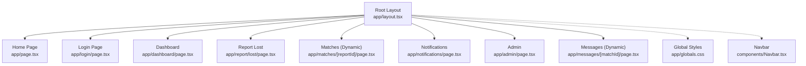
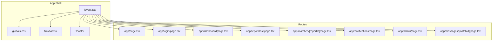
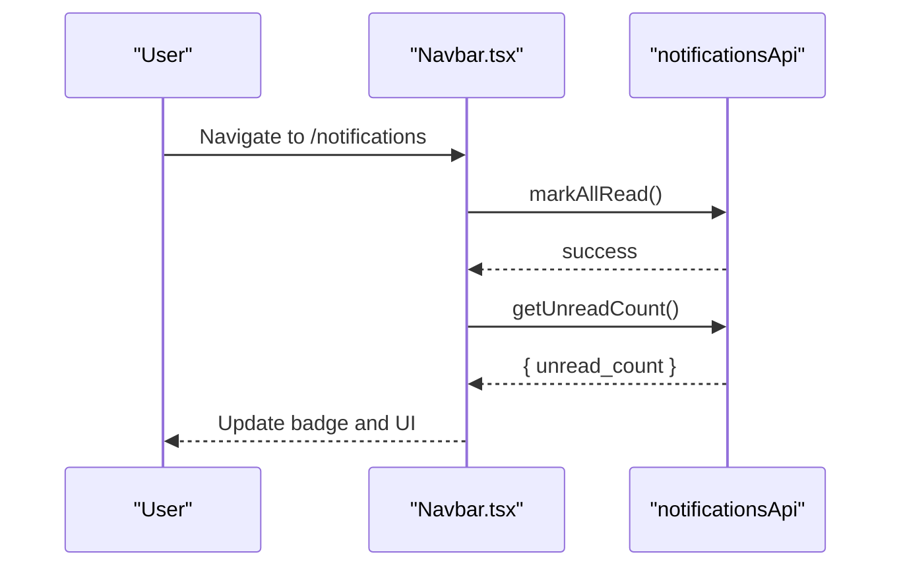
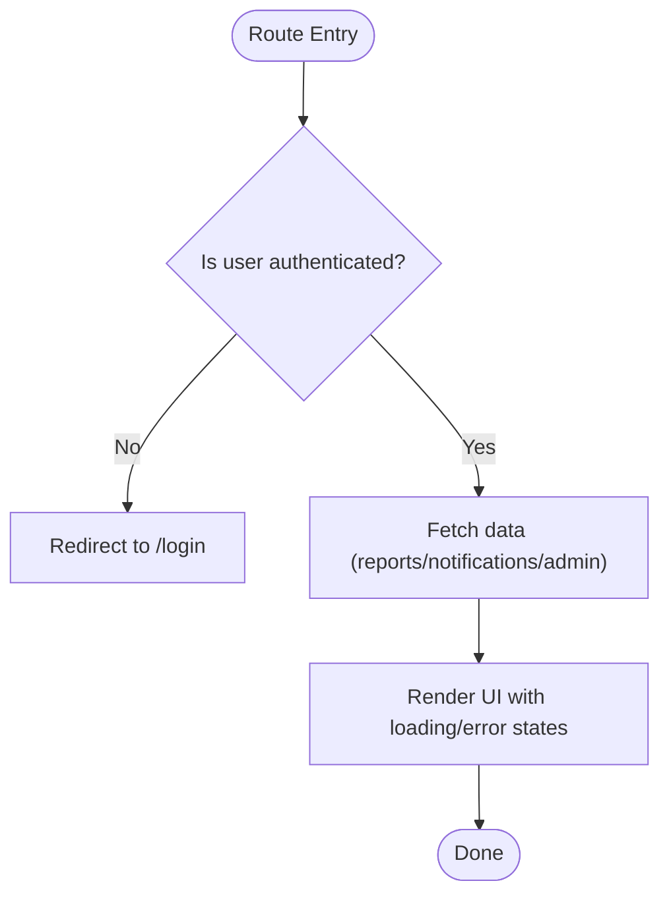
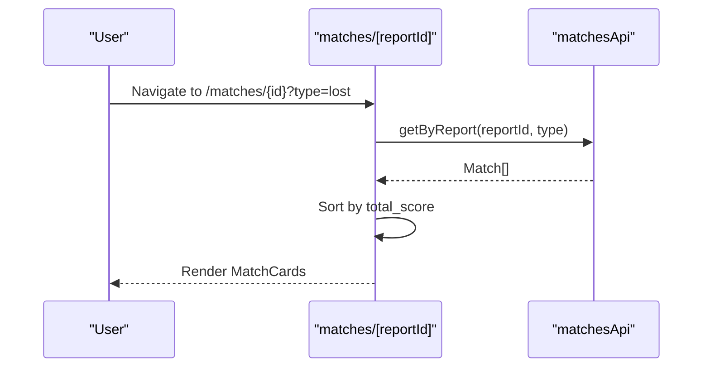
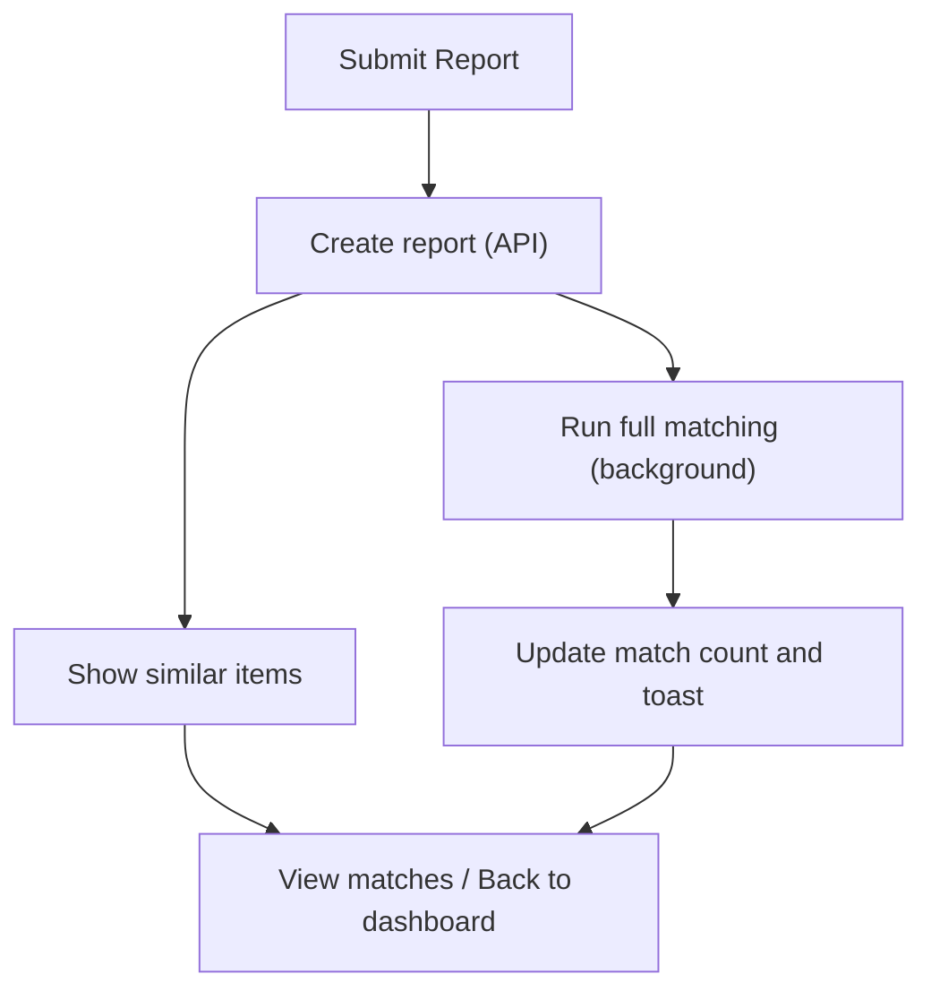
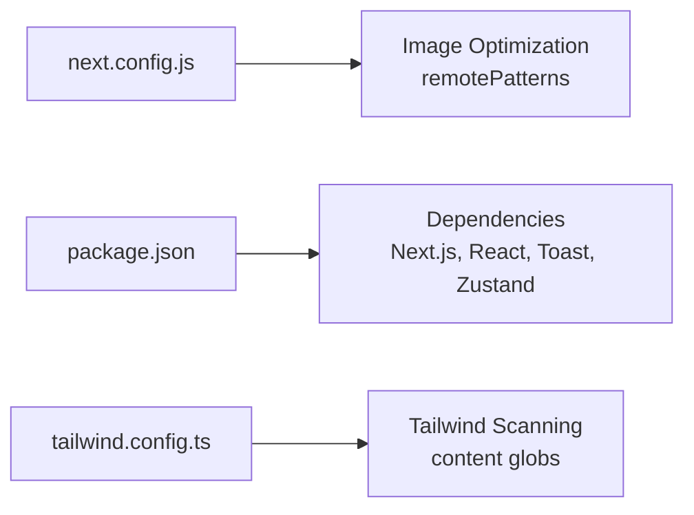
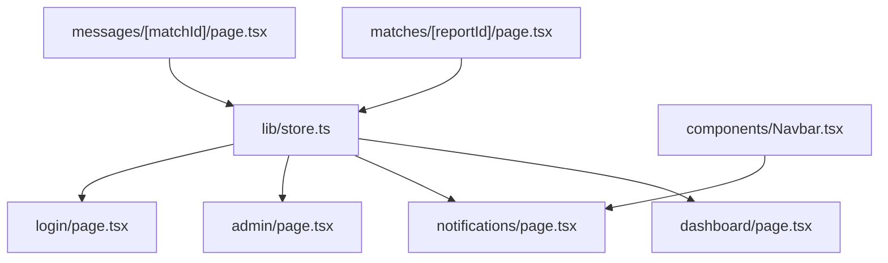

# Application Structure & Routing

<cite>
**Referenced Files in This Document**
- [next.config.js](file://frontend/next.config.js)
- [layout.tsx](file://frontend/app/layout.tsx)
- [page.tsx](file://frontend/app/page.tsx)
- [Navbar.tsx](file://frontend/components/Navbar.tsx)
- [globals.css](file://frontend/app/globals.css)
- [login/page.tsx](file://frontend/app/login/page.tsx)
- [dashboard/page.tsx](file://frontend/app/dashboard/page.tsx)
- [report/lost/page.tsx](file://frontend/app/report/lost/page.tsx)
- [matches/[reportId]/page.tsx](file://frontend/app/matches/[reportId]/page.tsx)
- [notifications/page.tsx](file://frontend/app/notifications/page.tsx)
- [admin/page.tsx](file://frontend/app/admin/page.tsx)
- [messages/[matchId]/page.tsx](file://frontend/app/messages/[matchId]/page.tsx)
- [store.ts](file://frontend/lib/store.ts)
- [package.json](file://frontend/package.json)
- [tailwind.config.ts](file://frontend/tailwind.config.ts)
</cite>

## Table of Contents
1. Introduction
2. Project Structure
3. Core Components
4. Architecture Overview
5. Detailed Component Analysis
6. Dependency Analysis
7. Performance Considerations
8. Troubleshooting Guide
9. Conclusion

## Introduction
This document explains the Next.js 14 App Router structure and routing system for the Lost & Found AI Matcher frontend. It covers the root layout with global styling, Navbar integration, and toast notifications; page-based routing for public and authenticated routes; dynamic segments; metadata configuration; project configuration including image optimization; and performance strategies such as code splitting and static generation patterns used across pages.

## Project Structure
The application uses the Next.js App Router under the app directory:
- Root layout defines global HTML, metadata, global styles, Navbar, and Toaster.
- Public pages include the home page and report forms.
- Authenticated areas include dashboard, notifications, admin, and message threads.
- Dynamic routes use folder parameters for matches and messages.

**Diagram sources**
- [layout.tsx:1-28](file://frontend/app/layout.tsx#L1-L28)
- [page.tsx:1-65](file://frontend/app/page.tsx#L1-L65)
- [login/page.tsx:1-266](file://frontend/app/login/page.tsx#L1-L266)
- [dashboard/page.tsx:1-243](file://frontend/app/dashboard/page.tsx#L1-L243)
- [report/lost/page.tsx:1-117](file://frontend/app/report/lost/page.tsx#L1-L117)
- [matches/[reportId]/page.tsx:1-94](file://frontend/app/matches/[reportId]/page.tsx#L1-L94)
- [notifications/page.tsx:1-190](file://frontend/app/notifications/page.tsx#L1-L190)
- [admin/page.tsx:1-363](file://frontend/app/admin/page.tsx#L1-L363)
- [messages/[matchId]/page.tsx:1-111](file://frontend/app/messages/[matchId]/page.tsx#L1-L111)
- [globals.css:1-61](file://frontend/app/globals.css#L1-L61)
- [Navbar.tsx:1-258](file://frontend/components/Navbar.tsx#L1-L258)

**Section sources**
- [layout.tsx:1-28](file://frontend/app/layout.tsx#L1-L28)
- [globals.css:1-61](file://frontend/app/globals.css#L1-L61)
- [Navbar.tsx:1-258](file://frontend/components/Navbar.tsx#L1-L258)

## Core Components
- Root layout: Declares metadata (title, description), imports global CSS, renders Navbar, a responsive main container, and a Toaster for notifications.
- Global styles: Tailwind directives and reusable component classes (buttons, inputs, cards, badges).
- Navbar: Client-side navigation with auth-aware links, unread notification badge, user menu, and mobile menu.
- Store: Zustand store for authentication state and token persistence in localStorage.

Key responsibilities:
- Metadata and global shell are centralized in the root layout to ensure consistent UI and SEO across all pages.
- Navbar encapsulates navigation logic and integrates with the auth store and notifications API.
- Global CSS provides consistent design tokens and utility classes.

**Section sources**
- [layout.tsx:1-28](file://frontend/app/layout.tsx#L1-L28)
- [globals.css:1-61](file://frontend/app/globals.css#L1-L61)
- [Navbar.tsx:1-258](file://frontend/components/Navbar.tsx#L1-L258)
- [store.ts:1-39](file://frontend/lib/store.ts#L1-L39)

## Architecture Overview
The App Router composes layouts and pages into a tree. The root layout wraps every route with shared chrome (Navbar, Toaster, global styles). Pages implement client components where interactivity is required. Authentication state drives conditional rendering and redirects.

**Diagram sources**
- [layout.tsx:1-28](file://frontend/app/layout.tsx#L1-L28)
- [page.tsx:1-65](file://frontend/app/page.tsx#L1-L65)
- [login/page.tsx:1-266](file://frontend/app/login/page.tsx#L1-L266)
- [dashboard/page.tsx:1-243](file://frontend/app/dashboard/page.tsx#L1-L243)
- [report/lost/page.tsx:1-117](file://frontend/app/report/lost/page.tsx#L1-L117)
- [matches/[reportId]/page.tsx:1-94](file://frontend/app/matches/[reportId]/page.tsx#L1-L94)
- [notifications/page.tsx:1-190](file://frontend/app/notifications/page.tsx#L1-L190)
- [admin/page.tsx:1-363](file://frontend/app/admin/page.tsx#L1-L363)
- [messages/[matchId]/page.tsx:1-111](file://frontend/app/messages/[matchId]/page.tsx#L1-L111)
- [globals.css:1-61](file://frontend/app/globals.css#L1-L61)
- [Navbar.tsx:1-258](file://frontend/components/Navbar.tsx#L1-L258)

## Detailed Component Analysis

### Root Layout and Metadata
- Declares site title and description via metadata export.
- Imports global CSS and renders Navbar and Toaster.
- Wraps children in a responsive main container.

Best practices:
- Keep layout minimal to reduce per-route overhead.
- Use global CSS for theme variables and shared utilities.

**Section sources**
- [layout.tsx:1-28](file://frontend/app/layout.tsx#L1-L28)
- [globals.css:1-61](file://frontend/app/globals.css#L1-L61)

### Navbar Integration and Notifications
- Renders navigation links based on authentication state.
- Shows an unread badge by polling the notifications API and marks all read when navigating to the notifications page.
- Provides a user menu with quick actions and logout.

**Diagram sources**
- [Navbar.tsx:24-46](file://frontend/components/Navbar.tsx#L24-L46)
- [Navbar.tsx:85-147](file://frontend/components/Navbar.tsx#L85-L147)

**Section sources**
- [Navbar.tsx:1-258](file://frontend/components/Navbar.tsx#L1-L258)

### Public Pages
- Home page presents CTAs to report lost or found items and highlights features.
- Login page supports login/signup with validation, error handling, and redirection to dashboard.

Navigation patterns:
- Uses next/link for declarative navigation.
- Uses next/navigation router for programmatic redirects after successful auth.

**Section sources**
- [page.tsx:1-65](file://frontend/app/page.tsx#L1-L65)
- [login/page.tsx:1-266](file://frontend/app/login/page.tsx#L1-L266)

### Authenticated Routes
- Dashboard: Fetches user reports, shows tabs for lost/found, and navigates to match results.
- Notifications: Lists notifications, marks individual/all as read, and displays unread counts.
- Admin: Role-gated area that fetches stats and manages matches and fraud flags.

Authentication flow:
- Pages check auth state from the store and redirect to login if not authenticated.
- After login, users are redirected to dashboard.

**Diagram sources**
- [dashboard/page.tsx:43-64](file://frontend/app/dashboard/page.tsx#L43-L64)
- [notifications/page.tsx:51-71](file://frontend/app/notifications/page.tsx#L51-L71)
- [admin/page.tsx:41-69](file://frontend/app/admin/page.tsx#L41-L69)
- [store.ts:14-38](file://frontend/lib/store.ts#L14-L38)

**Section sources**
- [dashboard/page.tsx:1-243](file://frontend/app/dashboard/page.tsx#L1-L243)
- [notifications/page.tsx:1-190](file://frontend/app/notifications/page.tsx#L1-L190)
- [admin/page.tsx:1-363](file://frontend/app/admin/page.tsx#L1-L363)
- [store.ts:1-39](file://frontend/lib/store.ts#L1-L39)

### Dynamic Routing Patterns
- Matches page uses a dynamic segment for reportId and query params for type to display sorted matches.
- Messages page uses a dynamic segment for matchId to show a chat thread with periodic refresh.

**Diagram sources**
- [matches/[reportId]/page.tsx:21-43](file://frontend/app/matches/[reportId]/page.tsx#L21-L43)

**Section sources**
- [matches/[reportId]/page.tsx:1-94](file://frontend/app/matches/[reportId]/page.tsx#L1-L94)
- [messages/[matchId]/page.tsx:1-111](file://frontend/app/messages/[matchId]/page.tsx#L1-L111)

### Report Flow and Background Matching
- Report lost form submits data, triggers immediate similar-item search, and starts background full matching.
- On completion, it updates UI and optionally navigates to match results.

**Diagram sources**
- [report/lost/page.tsx:30-63](file://frontend/app/report/lost/page.tsx#L30-L63)
- [report/lost/page.tsx:72-113](file://frontend/app/report/lost/page.tsx#L72-L113)

**Section sources**
- [report/lost/page.tsx:1-117](file://frontend/app/report/lost/page.tsx#L1-L117)

### Configuration and Build Optimizations
- next.config.js configures allowed remote image domains for Supabase storage to enable optimized images.
- package.json lists dependencies including Next.js 14, React 18, react-hot-toast, and zustand.
- tailwind.config.ts extends color palettes and specifies content paths for Tailwind scanning.

**Diagram sources**
- [next.config.js:1-15](file://frontend/next.config.js#L1-L15)
- [package.json:1-32](file://frontend/package.json#L1-L32)
- [tailwind.config.ts:1-41](file://frontend/tailwind.config.ts#L1-L41)

**Section sources**
- [next.config.js:1-15](file://frontend/next.config.js#L1-L15)
- [package.json:1-32](file://frontend/package.json#L1-L32)
- [tailwind.config.ts:1-41](file://frontend/tailwind.config.ts#L1-L41)

## Dependency Analysis
- Pages depend on the auth store for user state and token management.
- Navbar depends on notifications API to compute unread counts and auto-mark reads.
- Dynamic pages depend on their respective APIs to fetch data and render results.

**Diagram sources**
- [store.ts:1-39](file://frontend/lib/store.ts#L1-L39)
- [dashboard/page.tsx:1-243](file://frontend/app/dashboard/page.tsx#L1-L243)
- [notifications/page.tsx:1-190](file://frontend/app/notifications/page.tsx#L1-L190)
- [admin/page.tsx:1-363](file://frontend/app/admin/page.tsx#L1-L363)
- [login/page.tsx:1-266](file://frontend/app/login/page.tsx#L1-L266)
- [Navbar.tsx:1-258](file://frontend/components/Navbar.tsx#L1-L258)
- [matches/[reportId]/page.tsx:1-94](file://frontend/app/matches/[reportId]/page.tsx#L1-L94)
- [messages/[matchId]/page.tsx:1-111](file://frontend/app/messages/[matchId]/page.tsx#L1-L111)

**Section sources**
- [store.ts:1-39](file://frontend/lib/store.ts#L1-L39)
- [Navbar.tsx:1-258](file://frontend/components/Navbar.tsx#L1-L258)

## Performance Considerations
- Code splitting: Each page is automatically split by Next.js; client-only components are marked with 'use client' to isolate interactivity.
- Image optimization: Remote images from Supabase are whitelisted via next.config.js to leverage Next.js image optimization.
- Static vs dynamic: Pages fetch data at runtime; consider using static generation or ISR for pages with infrequently changing data to improve load times.
- Network efficiency: Polling intervals are used sparingly (e.g., notifications and messages); debounce or throttle where appropriate.
- Styling: Tailwind scans only relevant files to minimize CSS size.

[No sources needed since this section provides general guidance]

## Troubleshooting Guide
Common issues and resolutions:
- Unauthenticated access: Authenticated pages redirect to login when no user is present. Ensure the store initializes correctly and token persists in localStorage.
- Notification badge not updating: Verify the interval and API calls in Navbar; ensure CORS and endpoints are reachable.
- Images not loading: Confirm remotePatterns in next.config.js includes the correct domain and path pattern for Supabase storage.
- Form errors: Validate fields before submission; ensure error states are displayed and network errors are caught and shown via toast.

**Section sources**
- [dashboard/page.tsx:43-49](file://frontend/app/dashboard/page.tsx#L43-L49)
- [notifications/page.tsx:51-71](file://frontend/app/notifications/page.tsx#L51-L71)
- [login/page.tsx:65-103](file://frontend/app/login/page.tsx#L65-L103)
- [next.config.js:1-15](file://frontend/next.config.js#L1-L15)
- [store.ts:14-38](file://frontend/lib/store.ts#L14-L38)

## Conclusion
The application leverages Next.js 14’s App Router to provide a clean, scalable structure with a shared root layout, modular pages, and robust client-side interactions. Authentication-driven routing, dynamic segments, and centralized global styles streamline development. With configured image optimization and Tailwind scanning, the app balances performance and maintainability. Following the patterns outlined here will help you add new pages, implement navigation flows, and configure layouts efficiently.

[No sources needed since this section summarizes without analyzing specific files]