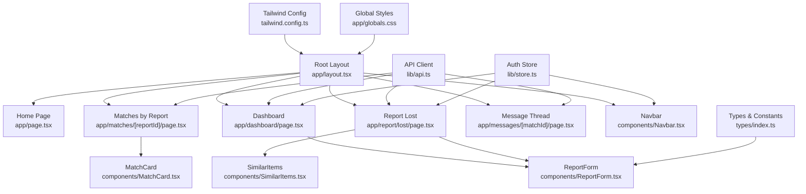
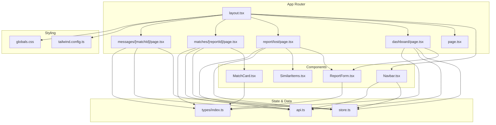
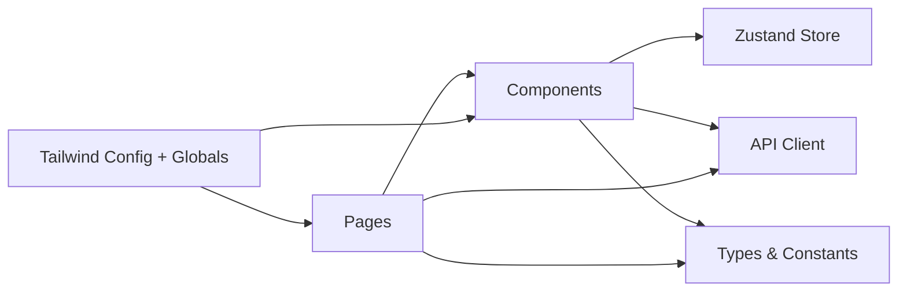
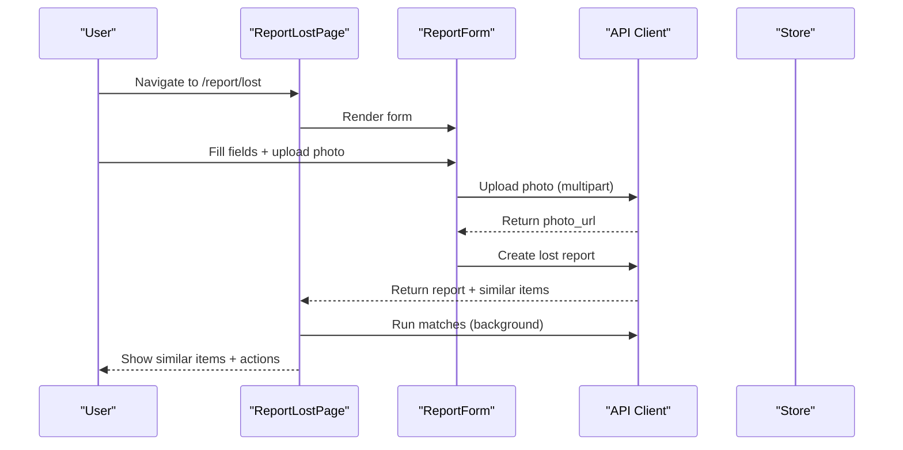
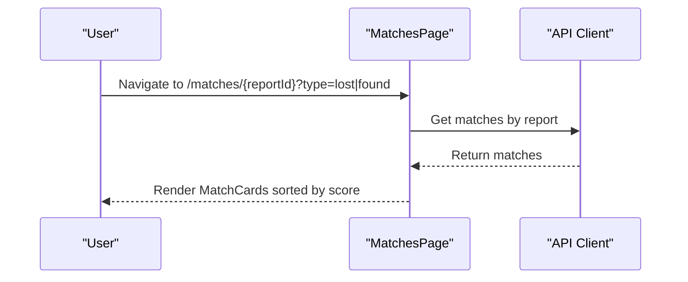
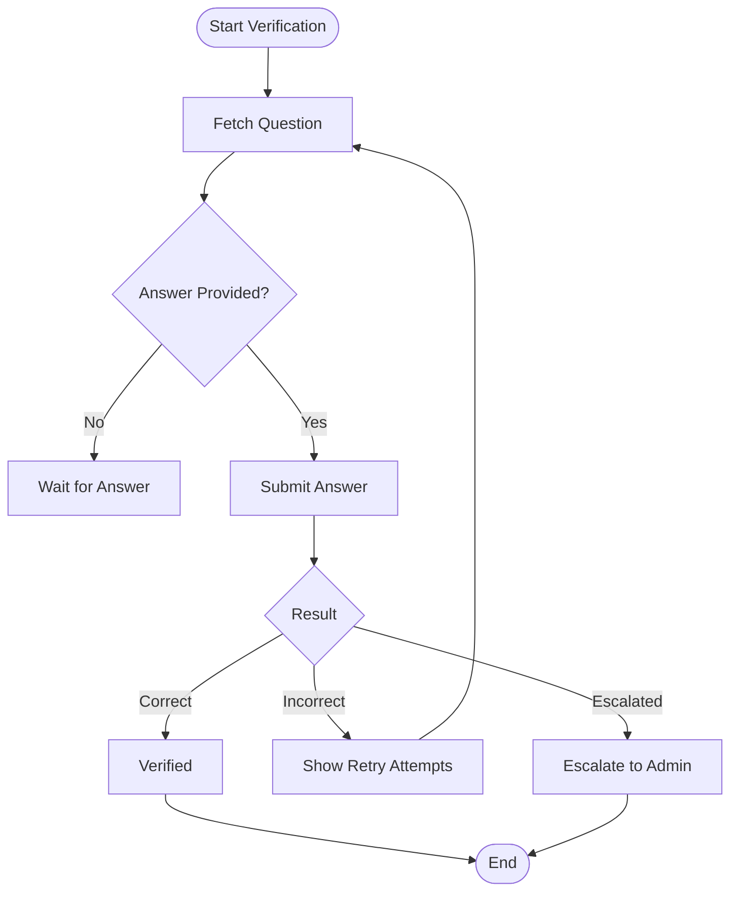
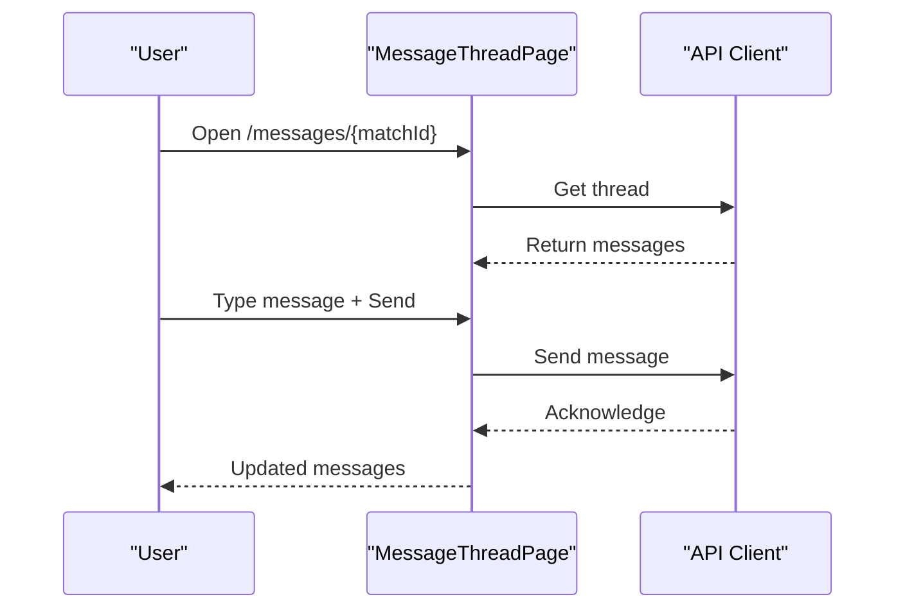

# Frontend Application

<cite>
**Referenced Files in This Document**
- [layout.tsx](file://frontend/app/layout.tsx)
- [page.tsx](file://frontend/app/page.tsx)
- [dashboard/page.tsx](file://frontend/app/dashboard/page.tsx)
- [report/lost/page.tsx](file://frontend/app/report/lost/page.tsx)
- [matches/[reportId]/page.tsx](file://frontend/app/matches/[reportId]/page.tsx)
- [messages/[matchId]/page.tsx](file://frontend/app/messages/[matchId]/page.tsx)
- [Navbar.tsx](file://frontend/components/Navbar.tsx)
- [ReportForm.tsx](file://frontend/components/ReportForm.tsx)
- [MatchCard.tsx](file://frontend/components/MatchCard.tsx)
- [SimilarItems.tsx](file://frontend/components/SimilarItems.tsx)
- [store.ts](file://frontend/lib/store.ts)
- [api.ts](file://frontend/lib/api.ts)
- [index.ts](file://frontend/types/index.ts)
- [tailwind.config.ts](file://frontend/tailwind.config.ts)
- [globals.css](file://frontend/app/globals.css)
</cite>

## Table of Contents
1. Introduction
2. Project Structure
3. Core Components
4. Architecture Overview
5. Detailed Component Analysis
6. Dependency Analysis
7. Performance Considerations
8. Troubleshooting Guide
9. Conclusion
10. Appendices

## Introduction
This document provides comprehensive documentation for the Next.js 14 frontend application built with the App Router, TypeScript, Tailwind CSS, and Zustand for state management. It explains routing, page components, reusable UI components (Navbar, ReportForm, MatchCard), styling approach, responsive design patterns, and user flows for reporting items, viewing matches, verification workflows, and messaging. It also covers component props, events, customization options, performance optimization techniques, accessibility considerations, and cross-browser compatibility guidance.

## Project Structure
The application follows a feature-oriented layout under the Next.js App Router:
- app/: Route segments and pages
  - Root layout and global styles
  - Dashboard for listing user reports
  - Report forms for lost/found items
  - Matches view per report
  - Message threads per match
- components/: Reusable UI components
- lib/: API clients and Zustand store
- types/: Shared TypeScript interfaces and constants
- Styling via Tailwind CSS with custom theme tokens and shared component classes

**Diagram sources**
- [layout.tsx:11-27](file://frontend/app/layout.tsx#L11-L27)
- [page.tsx:4-45](file://frontend/app/page.tsx#L4-L45)
- [dashboard/page.tsx:35-117](file://frontend/app/dashboard/page.tsx#L35-L117)
- [report/lost/page.tsx:22-116](file://frontend/app/report/lost/page.tsx#L22-L116)
- [matches/[reportId]/page.tsx:12-93](file://frontend/app/matches/[reportId]/page.tsx#L12-L93)
- [messages/[matchId]/page.tsx:10-110](file://frontend/app/messages/[matchId]/page.tsx#L10-L110)
- [Navbar.tsx:17-209](file://frontend/components/Navbar.tsx#L17-L209)
- [ReportForm.tsx:171-639](file://frontend/components/ReportForm.tsx#L171-L639)
- [MatchCard.tsx:17-332](file://frontend/components/MatchCard.tsx#L17-L332)
- [SimilarItems.tsx:19-79](file://frontend/components/SimilarItems.tsx#L19-L79)
- [api.ts:18-52](file://frontend/lib/api.ts#L18-L52)
- [store.ts:14-38](file://frontend/lib/store.ts#L14-L38)
- [index.ts:3-12](file://frontend/types/index.ts#L3-L12)
- [tailwind.config.ts:3-38](file://frontend/tailwind.config.ts#L3-L38)
- [globals.css:16-60](file://frontend/app/globals.css#L16-L60)

**Section sources**
- [layout.tsx:11-27](file://frontend/app/layout.tsx#L11-L27)
- [page.tsx:4-45](file://frontend/app/page.tsx#L4-L45)
- [dashboard/page.tsx:35-117](file://frontend/app/dashboard/page.tsx#L35-L117)
- [report/lost/page.tsx:22-116](file://frontend/app/report/lost/page.tsx#L22-L116)
- [matches/[reportId]/page.tsx:12-93](file://frontend/app/matches/[reportId]/page.tsx#L12-L93)
- [messages/[matchId]/page.tsx:10-110](file://frontend/app/messages/[matchId]/page.tsx#L10-L110)
- [Navbar.tsx:17-209](file://frontend/components/Navbar.tsx#L17-L209)
- [ReportForm.tsx:171-639](file://frontend/components/ReportForm.tsx#L171-L639)
- [MatchCard.tsx:17-332](file://frontend/components/MatchCard.tsx#L17-L332)
- [SimilarItems.tsx:19-79](file://frontend/components/SimilarItems.tsx#L19-L79)
- [api.ts:18-52](file://frontend/lib/api.ts#L18-L52)
- [store.ts:14-38](file://frontend/lib/store.ts#L14-L38)
- [index.ts:3-12](file://frontend/types/index.ts#L3-L12)
- [tailwind.config.ts:3-38](file://frontend/tailwind.config.ts#L3-L38)
- [globals.css:16-60](file://frontend/app/globals.css#L16-L60)

## Core Components
- Navbar: Global navigation with authenticated/unauthenticated states, unread notification badge polling, mobile menu, and role-based admin link.
- ReportForm: Multi-language form for lost/found item reporting with validation, photo upload preview, and success state.
- MatchCard: Displays match details, score breakdown, verification flow, and actions based on user role (claimant/finder/admin).
- SimilarItems: Shows instant similar items returned after report submission.
- Pages: Home, Dashboard, Report Lost, Matches, Messages provide end-to-end flows.

Key responsibilities:
- Routing and page orchestration live in app/* pages.
- Business logic interactions with backend are encapsulated in lib/api.ts.
- Auth state is centralized in lib/store.ts using Zustand.
- UI consistency via Tailwind theme and shared classes in globals.css.

**Section sources**
- [Navbar.tsx:17-209](file://frontend/components/Navbar.tsx#L17-L209)
- [ReportForm.tsx:171-639](file://frontend/components/ReportForm.tsx#L171-L639)
- [MatchCard.tsx:17-332](file://frontend/components/MatchCard.tsx#L17-L332)
- [SimilarItems.tsx:19-79](file://frontend/components/SimilarItems.tsx#L19-L79)
- [dashboard/page.tsx:35-117](file://frontend/app/dashboard/page.tsx#L35-L117)
- [report/lost/page.tsx:22-116](file://frontend/app/report/lost/page.tsx#L22-L116)
- [matches/[reportId]/page.tsx:12-93](file://frontend/app/matches/[reportId]/page.tsx#L12-L93)
- [messages/[matchId]/page.tsx:10-110](file://frontend/app/messages/[matchId]/page.tsx#L10-L110)
- [api.ts:18-52](file://frontend/lib/api.ts#L18-L52)
- [store.ts:14-38](file://frontend/lib/store.ts#L14-L38)

## Architecture Overview
The frontend uses Next.js App Router for file-based routing, React Server/Client components where appropriate, and client-side state via Zustand. API calls are centralized in a typed client that handles authentication headers and error mapping. UI is styled with Tailwind CSS and shared component primitives defined in global styles.

**Diagram sources**
- [layout.tsx:11-27](file://frontend/app/layout.tsx#L11-L27)
- [page.tsx:4-45](file://frontend/app/page.tsx#L4-L45)
- [dashboard/page.tsx:35-117](file://frontend/app/dashboard/page.tsx#L35-L117)
- [report/lost/page.tsx:22-116](file://frontend/app/report/lost/page.tsx#L22-L116)
- [matches/[reportId]/page.tsx:12-93](file://frontend/app/matches/[reportId]/page.tsx#L12-L93)
- [messages/[matchId]/page.tsx:10-110](file://frontend/app/messages/[matchId]/page.tsx#L10-L110)
- [Navbar.tsx:17-209](file://frontend/components/Navbar.tsx#L17-L209)
- [ReportForm.tsx:171-639](file://frontend/components/ReportForm.tsx#L171-L639)
- [MatchCard.tsx:17-332](file://frontend/components/MatchCard.tsx#L17-L332)
- [SimilarItems.tsx:19-79](file://frontend/components/SimilarItems.tsx#L19-L79)
- [store.ts:14-38](file://frontend/lib/store.ts#L14-L38)
- [api.ts:18-52](file://frontend/lib/api.ts#L18-L52)
- [index.ts:3-12](file://frontend/types/index.ts#L3-L12)
- [tailwind.config.ts:3-38](file://frontend/tailwind.config.ts#L3-L38)
- [globals.css:16-60](file://frontend/app/globals.css#L16-L60)

## Detailed Component Analysis

### Root Layout and Global Shell
- Provides metadata, global body class, and wraps all pages with Navbar and Toaster.
- Uses Tailwind utility classes for spacing and background.

**Section sources**
- [layout.tsx:11-27](file://frontend/app/layout.tsx#L11-L27)
- [globals.css:16-60](file://frontend/app/globals.css#L16-L60)

### Home Page
- Hero section with CTAs to report lost or found items.
- Feature cards highlighting AI matching, verification, and notifications.

**Section sources**
- [page.tsx:4-45](file://frontend/app/page.tsx#L4-L45)

### Dashboard
- Lists user’s lost and found items with tabs.
- Fetches data via API, shows skeletons while loading, empty states when no items.
- Navigates to matches per item.

**Section sources**
- [dashboard/page.tsx:35-117](file://frontend/app/dashboard/page.tsx#L35-L117)

### Report Form
- Props: type ('lost' | 'found'), onSubmit callback.
- Features:
  - Multi-language support (en, ta, si) with dynamic labels and hints.
  - Validation for required fields, description length, photo constraints.
  - Photo upload with preview and size/type checks.
  - Conditional sections: identifying info for lost; private verification details for found.
  - Success state with reset capability.
- Events: submit triggers API call and optional photo upload; blur triggers field validation.

**Section sources**
- [ReportForm.tsx:26-29](file://frontend/components/ReportForm.tsx#L26-L29)
- [ReportForm.tsx:171-639](file://frontend/components/ReportForm.tsx#L171-L639)

### Match Card
- Props: match object, userRole ('claimant' | 'finder' | 'admin'), callbacks onClaim/onVerified.
- Behavior:
  - Displays thumbnail, chips, description, location, time, and score breakdown bars.
  - Verification workflow: fetch question, submit answer, handle correct/incorrect/escalated results.
  - Role-specific actions: claimant starts verification; finder judges pending answers; admin can escalate.
  - Verified state unlocks message thread link.
- Events: start verification, submit answer, judge answer.

**Section sources**
- [MatchCard.tsx:10-15](file://frontend/components/MatchCard.tsx#L10-L15)
- [MatchCard.tsx:17-332](file://frontend/components/MatchCard.tsx#L17-L332)

### Similar Items
- Props: items array, label ('lost' | 'found').
- Renders list of similar items with photo, details, and similarity score badges.

**Section sources**
- [SimilarItems.tsx:14-17](file://frontend/components/SimilarItems.tsx#L14-L17)
- [SimilarItems.tsx:19-79](file://frontend/components/SimilarItems.tsx#L19-L79)

### Matches Page
- Loads matches for a given report, sorts by total score, and renders MatchCard instances.
- Handles loading and empty states.

**Section sources**
- [matches/[reportId]/page.tsx:12-93](file://frontend/app/matches/[reportId]/page.tsx#L12-L93)

### Message Thread Page
- Polls messages every 5 seconds, auto-scrolls to bottom on new messages.
- Sends messages and updates the list.

**Section sources**
- [messages/[matchId]/page.tsx:10-110](file://frontend/app/messages/[matchId]/page.tsx#L10-L110)

### Navbar
- Displays nav links conditionally based on auth state and role.
- Polls unread notification count and marks as read when visiting notifications.
- Mobile-friendly menu with accessible toggle button.

**Section sources**
- [Navbar.tsx:17-209](file://frontend/components/Navbar.tsx#L17-L209)

### State Management (Zustand)
- Auth store manages user, token, and loading state.
- Persists token to localStorage and clears on logout.

**Section sources**
- [store.ts:14-38](file://frontend/lib/store.ts#L14-L38)

### API Client
- Centralized fetch wrapper with automatic Authorization header resolution from store/localStorage.
- Typed endpoints for auth, reports, matches, verification, notifications, messages, and admin operations.
- Upload helper for multipart requests.

**Section sources**
- [api.ts:18-52](file://frontend/lib/api.ts#L18-L52)
- [api.ts:66-78](file://frontend/lib/api.ts#L66-L78)
- [api.ts:143-161](file://frontend/lib/api.ts#L143-L161)
- [api.ts:210-218](file://frontend/lib/api.ts#L210-L218)
- [api.ts:241-256](file://frontend/lib/api.ts#L241-L256)
- [api.ts:277-291](file://frontend/lib/api.ts#L277-L291)
- [api.ts:305-314](file://frontend/lib/api.ts#L305-L314)
- [api.ts:378-423](file://frontend/lib/api.ts#L378-L423)

### Types and Constants
- Defines core entities (User, LostItem, FoundItem, Match), statuses, and enums.
- Exposes shared constants for categories, colors, and brands used in forms.

**Section sources**
- [index.ts:3-12](file://frontend/types/index.ts#L3-L12)
- [index.ts:14-48](file://frontend/types/index.ts#L14-L48)
- [index.ts:52-82](file://frontend/types/index.ts#L52-L82)
- [index.ts:156-196](file://frontend/types/index.ts#L156-L196)

### Styling Approach
- Tailwind configuration extends theme with primary/success/warning color palettes.
- Global component classes define consistent buttons, inputs, cards, and badges.

**Section sources**
- [tailwind.config.ts:3-38](file://frontend/tailwind.config.ts#L3-L38)
- [globals.css:16-60](file://frontend/app/globals.css#L16-L60)

## Dependency Analysis
- Pages depend on components for rendering and lib/api.ts for data fetching.
- Components consume Zustand store for auth context and API client for side effects.
- Types ensure consistent contracts between pages, components, and API responses.
- Styling is globally applied via Tailwind and custom classes.

**Diagram sources**
- [dashboard/page.tsx:35-117](file://frontend/app/dashboard/page.tsx#L35-L117)
- [report/lost/page.tsx:22-116](file://frontend/app/report/lost/page.tsx#L22-L116)
- [matches/[reportId]/page.tsx:12-93](file://frontend/app/matches/[reportId]/page.tsx#L12-L93)
- [messages/[matchId]/page.tsx:10-110](file://frontend/app/messages/[matchId]/page.tsx#L10-L110)
- [ReportForm.tsx:171-639](file://frontend/components/ReportForm.tsx#L171-L639)
- [MatchCard.tsx:17-332](file://frontend/components/MatchCard.tsx#L17-L332)
- [store.ts:14-38](file://frontend/lib/store.ts#L14-L38)
- [api.ts:18-52](file://frontend/lib/api.ts#L18-L52)
- [index.ts:3-12](file://frontend/types/index.ts#L3-L12)
- [tailwind.config.ts:3-38](file://frontend/tailwind.config.ts#L3-L38)
- [globals.css:16-60](file://frontend/app/globals.css#L16-L60)

**Section sources**
- [dashboard/page.tsx:35-117](file://frontend/app/dashboard/page.tsx#L35-L117)
- [report/lost/page.tsx:22-116](file://frontend/app/report/lost/page.tsx#L22-L116)
- [matches/[reportId]/page.tsx:12-93](file://frontend/app/matches/[reportId]/page.tsx#L12-L93)
- [messages/[matchId]/page.tsx:10-110](file://frontend/app/messages/[matchId]/page.tsx#L10-L110)
- [ReportForm.tsx:171-639](file://frontend/components/ReportForm.tsx#L171-L639)
- [MatchCard.tsx:17-332](file://frontend/components/MatchCard.tsx#L17-L332)
- [store.ts:14-38](file://frontend/lib/store.ts#L14-L38)
- [api.ts:18-52](file://frontend/lib/api.ts#L18-L52)
- [index.ts:3-12](file://frontend/types/index.ts#L3-L12)
- [tailwind.config.ts:3-38](file://frontend/tailwind.config.ts#L3-L38)
- [globals.css:16-60](file://frontend/app/globals.css#L16-L60)

## Performance Considerations
- Client-only components: Use 'use client' directive only where interactivity is needed (forms, dashboards, matches, messages).
- Minimize re-renders: Memoize derived values (e.g., sorted matches) and avoid unnecessary state updates.
- Polling strategy: Notification count polling at intervals; message thread polling every 5 seconds—consider debouncing or WebSocket for scalability.
- Image handling: Validate file size and type before upload; use previews via URL.createObjectURL and clear URLs to prevent memory leaks.
- Error boundaries: Wrap critical routes with error handling to prevent UI crashes.
- Bundle size: Keep third-party dependencies minimal; leverage tree-shaking with Tailwind content paths.
- Accessibility: Ensure keyboard navigation, focus states, and ARIA attributes for interactive elements.

[No sources needed since this section provides general guidance]

## Troubleshooting Guide
Common issues and resolutions:
- Authentication errors: Ensure token is present in localStorage and Authorization header is set by apiFetch.
- Form validation failures: Check required fields and minimum description length; verify photo constraints.
- Verification flow errors: Handle incorrect/escalated results; retry attempts may be limited; show feedback via toast.
- Network errors: Catch API errors and display user-friendly messages; fallback to empty states gracefully.
- Notification badge not updating: Confirm polling interval and mark-all-read behavior on route change.

**Section sources**
- [api.ts:18-52](file://frontend/lib/api.ts#L18-L52)
- [ReportForm.tsx:201-245](file://frontend/components/ReportForm.tsx#L201-L245)
- [MatchCard.tsx:55-136](file://frontend/components/MatchCard.tsx#L55-L136)
- [Navbar.tsx:24-46](file://frontend/components/Navbar.tsx#L24-L46)

## Conclusion
The frontend application leverages Next.js App Router for scalable routing, Zustand for lightweight state management, and Tailwind CSS for consistent, responsive UI. The modular component architecture enables reuse across pages, while the centralized API client ensures maintainable data interactions. The verification workflow and messaging features provide robust user experiences for lost-and-found scenarios. Following the recommended performance and accessibility practices will further improve reliability and usability across devices and browsers.

[No sources needed since this section summarizes without analyzing specific files]

## Appendices

### User Interface Flows

#### Reporting an Item

**Diagram sources**
- [report/lost/page.tsx:22-116](file://frontend/app/report/lost/page.tsx#L22-L116)
- [ReportForm.tsx:171-639](file://frontend/components/ReportForm.tsx#L171-L639)
- [api.ts:143-161](file://frontend/lib/api.ts#L143-L161)

#### Viewing Matches

**Diagram sources**
- [matches/[reportId]/page.tsx:12-93](file://frontend/app/matches/[reportId]/page.tsx#L12-L93)
- [api.ts:210-218](file://frontend/lib/api.ts#L210-L218)

#### Verification Workflow

**Diagram sources**
- [MatchCard.tsx:55-136](file://frontend/components/MatchCard.tsx#L55-L136)
- [api.ts:241-256](file://frontend/lib/api.ts#L241-L256)

#### Messaging Flow

**Diagram sources**
- [messages/[matchId]/page.tsx:10-110](file://frontend/app/messages/[matchId]/page.tsx#L10-L110)
- [api.ts:305-314](file://frontend/lib/api.ts#L305-L314)

### Component Props and Customization Options
- ReportForm
  - Props: type ('lost' | 'found'), onSubmit(data) async callback
  - Customization: Language selection (en/ta/si), optional brand/color/category dropdowns, private details for found items
- MatchCard
  - Props: match, userRole ('claimant' | 'finder' | 'admin'), onClaim?, onVerified?
  - Customization: Score thresholds for colors, visibility of verification modal, role-based actions
- SimilarItems
  - Props: items[], label ('lost' | 'found')
  - Customization: Badge thresholds for similarity scores

**Section sources**
- [ReportForm.tsx:26-29](file://frontend/components/ReportForm.tsx#L26-L29)
- [MatchCard.tsx:10-15](file://frontend/components/MatchCard.tsx#L10-L15)
- [SimilarItems.tsx:14-17](file://frontend/components/SimilarItems.tsx#L14-L17)

### Responsive Design Patterns
- Grid layouts adapt from single column to multi-column based on breakpoints.
- Navigation collapses into a mobile menu with accessible toggle.
- Cards and forms scale padding and font sizes for readability on small screens.

**Section sources**
- [dashboard/page.tsx:110-115](file://frontend/app/dashboard/page.tsx#L110-L115)
- [Navbar.tsx:156-206](file://frontend/components/Navbar.tsx#L156-L206)
- [ReportForm.tsx:382-639](file://frontend/components/ReportForm.tsx#L382-L639)

### Accessibility Compliance
- Keyboard navigation supported for all interactive elements.
- Focus states defined via Tailwind utilities.
- Descriptive alt text for images and aria-labels for icon-only buttons.

**Section sources**
- [globals.css:16-60](file://frontend/app/globals.css#L16-L60)
- [Navbar.tsx:156-163](file://frontend/components/Navbar.tsx#L156-L163)
- [ReportForm.tsx:417-449](file://frontend/components/ReportForm.tsx#L417-L449)

### Cross-Browser Compatibility
- Uses standard web APIs (fetch, FormData, localStorage) with broad browser support.
- Tailwind CSS compiles to widely compatible CSS.
- Avoid experimental features; rely on stable DOM APIs and polyfills if necessary.

[No sources needed since this section provides general guidance]