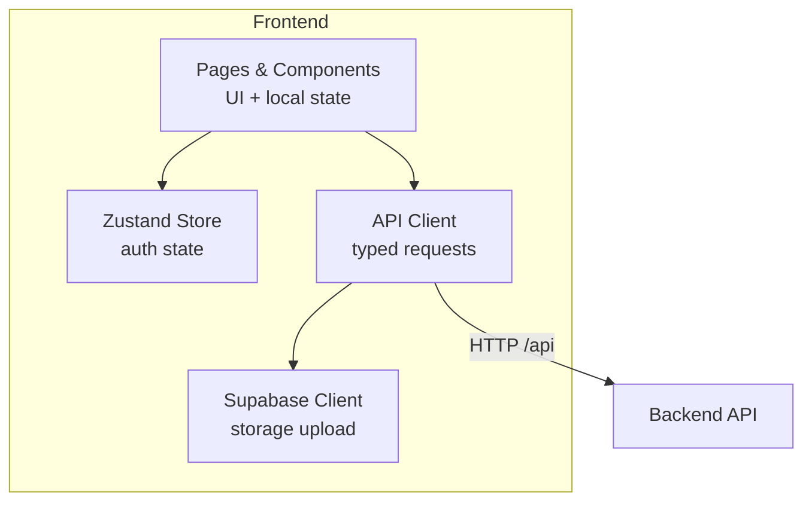
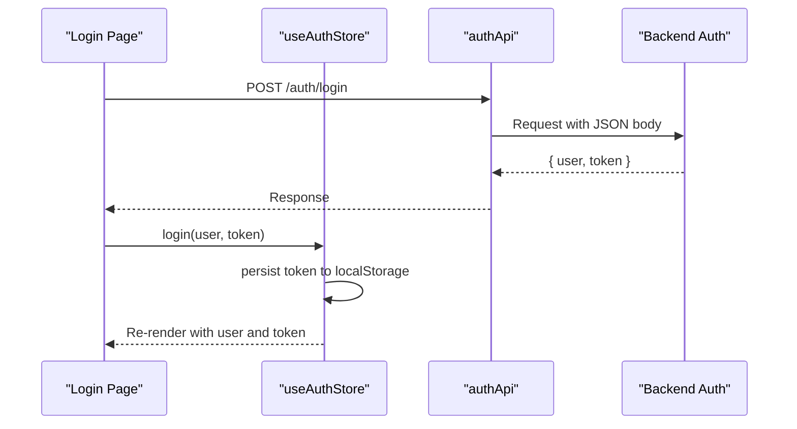
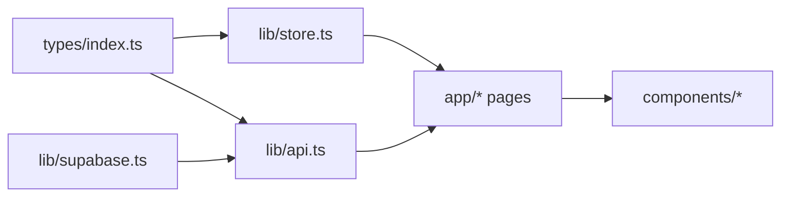

# State Management with Zustand

<cite>
**Referenced Files in This Document**
- [store.ts](file://frontend/lib/store.ts)
- [api.ts](file://frontend/lib/api.ts)
- [index.ts](file://frontend/types/index.ts)
- [supabase.ts](file://frontend/lib/supabase.ts)
- [page.tsx (login)](file://frontend/app/login/page.tsx)
- [page.tsx (dashboard)](file://frontend/app/dashboard/page.tsx)
- [page.tsx (notifications)](file://frontend/app/notifications/page.tsx)
- [page.tsx (matches)](file://frontend/app/matches/[reportId]/page.tsx)
- [MatchCard.tsx](file://frontend/components/MatchCard.tsx)
</cite>

## Table of Contents
1. Introduction
2. Project Structure
3. Core Components
4. Architecture Overview
5. Detailed Component Analysis
6. Dependency Analysis
7. Performance Considerations
8. Troubleshooting Guide
9. Conclusion
10. Appendices

## Introduction
This document explains the frontend state management system built with Zustand, focusing on authentication state, API client behavior, TypeScript data models, and how UI components subscribe to and dispatch actions. It also covers caching strategies, optimistic updates, error recovery patterns, and performance considerations such as selective subscriptions and state normalization.

## Project Structure
The frontend organizes state and networking into focused modules:
- Store: Centralized Zustand store for authentication state and token persistence.
- API Client: Typed HTTP client with automatic bearer token handling, upload support, and unified error handling.
- Types: Shared TypeScript definitions for domain entities and API responses.
- Supabase Client: Storage helper for photo uploads.
- Pages and Components: Use the store and API client to fetch data, update local UI state, and trigger side effects.

**Diagram sources**
- [store.ts:1-39](file://frontend/lib/store.ts#L1-L39)
- [api.ts:1-52](file://frontend/lib/api.ts#L1-L52)
- [supabase.ts:1-25](file://frontend/lib/supabase.ts#L1-L25)

**Section sources**
- [store.ts:1-39](file://frontend/lib/store.ts#L1-L39)
- [api.ts:1-52](file://frontend/lib/api.ts#L1-L52)
- [supabase.ts:1-25](file://frontend/lib/supabase.ts#L1-L25)

## Core Components
- Authentication Store (Zustand): Holds user, token, loading flag, and provides setters and login/logout actions. Persists token to localStorage and clears it on logout.
- API Client: Provides typed endpoints for auth, reports, matches, verification, notifications, messages, and admin features. Automatically attaches Authorization headers using a stored or passed token. Uploads use FormData and separate error handling.
- Type Definitions: Strongly typed models for User, Items, Matches, Notifications, Messages, and various request/response shapes used across the app.
- Supabase Integration: Uploads photos to storage and returns public URLs consumed by report creation flows.

Key responsibilities:
- Store manages only authentication-related global state; other data is typically held locally within pages or normalized per feature.
- API client centralizes network concerns: base URL, header resolution, JSON parsing, and error throwing.
- Types ensure consistency between backend contracts and frontend usage.

**Section sources**
- [store.ts:4-38](file://frontend/lib/store.ts#L4-L38)
- [api.ts:1-52](file://frontend/lib/api.ts#L1-L52)
- [index.ts:1-197](file://frontend/types/index.ts#L1-L197)
- [supabase.ts:11-24](file://frontend/lib/supabase.ts#L11-L24)

## Architecture Overview
The application follows a unidirectional data flow:
- UI triggers actions (e.g., login, submit report).
- Actions call API client methods that perform HTTP requests.
- Responses update either the Zustand store (for auth) or local component state (for feature data).
- UI re-renders based on store subscriptions or local state changes.

**Diagram sources**
- [page.tsx (login):65-103](file://frontend/app/login/page.tsx#L65-L103)
- [api.ts:66-78](file://frontend/lib/api.ts#L66-L78)
- [store.ts:14-38](file://frontend/lib/store.ts#L14-L38)

## Detailed Component Analysis

### Authentication Store
- State: user, token, isLoading.
- Actions: setUser, setToken, login, logout.
- Persistence: Token is read from localStorage on initialization and updated via setToken/login/logout.
- Selective subscription: Components can subscribe to specific fields (e.g., user) to minimize re-renders.

Typical usage pattern:
- Subscribe to user/token in protected routes.
- Dispatch login after successful auth API call.
- Clear state on logout.

**Section sources**
- [store.ts:4-38](file://frontend/lib/store.ts#L4-L38)
- [page.tsx (login):65-103](file://frontend/app/login/page.tsx#L65-L103)

### API Client
- Base URL: Configurable via environment variable, defaults to localhost.
- Headers: Content-Type set to JSON; Authorization header resolved from provided token or localStorage.
- Error handling: Non-ok responses throw errors with message or status. Uploads handle their own error path.
- Endpoints: Organized by domain (auth, reports, matches, verify, notifications, messages, admin).

Request/response handling:
- All JSON endpoints return typed promises.
- Upload endpoint uses FormData and returns structured results.

Authentication tokens:
- Automatically attached if present in options or localStorage.
- Ensures consistent authorization across all requests.

**Section sources**
- [api.ts:1-52](file://frontend/lib/api.ts#L1-L52)
- [api.ts:54-78](file://frontend/lib/api.ts#L54-L78)
- [api.ts:143-161](file://frontend/lib/api.ts#L143-L161)
- [api.ts:210-218](file://frontend/lib/api.ts#L210-L218)
- [api.ts:241-256](file://frontend/lib/api.ts#L241-L256)
- [api.ts:277-291](file://frontend/lib/api.ts#L277-L291)
- [api.ts:305-314](file://frontend/lib/api.ts#L305-L314)
- [api.ts:378-423](file://frontend/lib/api.ts#L378-L423)

### TypeScript Data Models
Core types include:
- User, LostItem, FoundItem, Match, Message, Notification, and related enums/constants.
- API-specific response/request interfaces aligned with backend contracts.

Normalization:
- Dashboard normalizes ReportResponse arrays into a simpler shape for rendering.
- Match lists are sorted by total score for display.

**Section sources**
- [index.ts:3-125](file://frontend/types/index.ts#L3-L125)
- [index.ts:128-152](file://frontend/types/index.ts#L128-L152)
- [index.ts:156-197](file://frontend/types/index.ts#L156-L197)
- [page.tsx (dashboard):145-159](file://frontend/app/dashboard/page.tsx#L145-L159)
- [page.tsx (matches):21-38](file://frontend/app/matches/[reportId]/page.tsx#L21-L38)

### Supabase Photo Upload
- Uploads images to a storage bucket and returns a public URL.
- Used by report submission flows to attach item photos.

**Section sources**
- [supabase.ts:11-24](file://frontend/lib/supabase.ts#L11-L24)

### Login Flow
- Validates form inputs.
- Calls authApi.signup or authApi.login.
- On success, calls useAuthStore.login to persist user and token.
- Redirects to dashboard.

Error handling:
- Catches API errors and displays toast notifications.

**Section sources**
- [page.tsx (login):65-103](file://frontend/app/login/page.tsx#L65-L103)
- [api.ts:66-78](file://frontend/lib/api.ts#L66-L78)
- [store.ts:14-38](file://frontend/lib/store.ts#L14-L38)

### Dashboard Reports
- Fetches user’s lost and found reports via reportsApi.getByUser.
- Normalizes data for UI and handles errors with toast.
- Uses local state for tab selection and loading indicators.

Optimistic updates:
- Not applied here; data is fetched fresh on mount.

**Section sources**
- [page.tsx (dashboard):35-64](file://frontend/app/dashboard/page.tsx#L35-L64)
- [api.ts:143-161](file://frontend/lib/api.ts#L143-L161)

### Notifications
- Fetches notifications and unread count.
- Supports marking individual or all notifications as read with optimistic UI updates.
- Updates local state immediately to reflect read status while awaiting server confirmation.

Optimistic updates:
- Immediately mark notification(s) as read in local state before API completes.
- Rollback not implemented; errors are shown via toast.

**Section sources**
- [page.tsx (notifications):59-96](file://frontend/app/notifications/page.tsx#L59-L96)
- [api.ts:277-291](file://frontend/lib/api.ts#L277-L291)

### Matches and Verification
- Loads matches for a report and sorts by score.
- Verification workflow:
  - Get question, submit answer, judge answer (if applicable).
  - Handles correct, incorrect, escalated outcomes.
  - Optimistically updates verified state when correct.

Error handling:
- Displays toast messages for failures at each step.

**Section sources**
- [page.tsx (matches):21-38](file://frontend/app/matches/[reportId]/page.tsx#L21-L38)
- [MatchCard.tsx:55-136](file://frontend/components/MatchCard.tsx#L55-L136)
- [api.ts:241-256](file://frontend/lib/api.ts#L241-L256)

## Dependency Analysis
- Store depends on types for User.
- API client defines typed responses and endpoints used by pages and components.
- Pages depend on both store and API client; they manage local UI state and orchestrate side effects.
- Supabase client is used indirectly via API upload helpers or directly in forms.

**Diagram sources**
- [index.ts:1-197](file://frontend/types/index.ts#L1-L197)
- [store.ts:1-39](file://frontend/lib/store.ts#L1-L39)
- [api.ts:1-52](file://frontend/lib/api.ts#L1-L52)
- [supabase.ts:1-25](file://frontend/lib/supabase.ts#L1-L25)

**Section sources**
- [index.ts:1-197](file://frontend/types/index.ts#L1-L197)
- [store.ts:1-39](file://frontend/lib/store.ts#L1-L39)
- [api.ts:1-52](file://frontend/lib/api.ts#L1-L52)
- [supabase.ts:1-25](file://frontend/lib/supabase.ts#L1-L25)

## Performance Considerations
- Selective subscriptions:
  - Use selectors to subscribe to minimal store slices (e.g., user only) to avoid unnecessary re-renders.
- Local state vs global state:
  - Feature-specific data (reports, matches, notifications) is kept in component state to reduce store complexity and improve granularity.
- State normalization:
  - Normalize API payloads to UI-friendly structures (e.g., dashboard normalization) to simplify rendering and sorting.
- Efficient list rendering:
  - Sort and memoize derived data where appropriate to minimize recalculations.
- Network efficiency:
  - Centralized API client reduces duplication and ensures consistent caching headers if extended later.
- Image handling:
  - Use lazy loading and placeholders for images to improve perceived performance.

[No sources needed since this section provides general guidance]

## Troubleshooting Guide
Common issues and resolutions:
- Authentication failures:
  - Ensure Authorization header is correctly set; check localStorage for token presence.
  - Validate email/password and handle non-ok responses with clear error messages.
- Upload errors:
  - Verify file type and size constraints; handle storage errors and surface user-friendly messages.
- Network errors:
  - Catch and display API errors via toast; consider retry logic for transient failures.
- State inconsistencies:
  - For optimistic updates, validate server responses and revert local changes on failure if necessary.

**Section sources**
- [api.ts:18-52](file://frontend/lib/api.ts#L18-L52)
- [page.tsx (login):65-103](file://frontend/app/login/page.tsx#L65-L103)
- [page.tsx (notifications):73-96](file://frontend/app/notifications/page.tsx#L73-L96)

## Conclusion
The Zustand-based state management system cleanly separates authentication state from feature-specific UI state, while a robust API client centralizes networking concerns. TypeScript types enforce contract correctness, and pages implement practical patterns like optimistic updates and error handling. The architecture supports scalability through selective subscriptions, normalized state, and modular API endpoints.

[No sources needed since this section summarizes without analyzing specific files]

## Appendices

### Examples: Subscribing to State Changes
- In protected pages, subscribe to user and isLoading from the auth store to guard navigation and render authenticated content.
- Example reference:
  - [page.tsx (dashboard):35-49](file://frontend/app/dashboard/page.tsx#L35-L49)
  - [page.tsx (notifications):44-57](file://frontend/app/notifications/page.tsx#L44-L57)

**Section sources**
- [page.tsx (dashboard):35-49](file://frontend/app/dashboard/page.tsx#L35-L49)
- [page.tsx (notifications):44-57](file://frontend/app/notifications/page.tsx#L44-L57)

### Examples: Dispatching Actions
- After successful login/signup, dispatch login with user and token to persist state.
- Example reference:
  - [page.tsx (login):65-103](file://frontend/app/login/page.tsx#L65-L103)
  - [store.ts:14-38](file://frontend/lib/store.ts#L14-L38)

**Section sources**
- [page.tsx (login):65-103](file://frontend/app/login/page.tsx#L65-L103)
- [store.ts:14-38](file://frontend/lib/store.ts#L14-L38)

### Examples: Handling Asynchronous Operations
- Fetch reports, matches, and notifications with try/catch blocks and toast feedback.
- Example references:
  - [page.tsx (dashboard):51-64](file://frontend/app/dashboard/page.tsx#L51-L64)
  - [page.tsx (matches):21-38](file://frontend/app/matches/[reportId]/page.tsx#L21-L38)
  - [page.tsx (notifications):59-71](file://frontend/app/notifications/page.tsx#L59-L71)

**Section sources**
- [page.tsx (dashboard):51-64](file://frontend/app/dashboard/page.tsx#L51-L64)
- [page.tsx (matches):21-38](file://frontend/app/matches/[reportId]/page.tsx#L21-L38)
- [page.tsx (notifications):59-71](file://frontend/app/notifications/page.tsx#L59-L71)

### Caching Strategies
- Current implementation performs direct API calls without explicit caching.
- Recommendations:
  - Introduce in-memory caches keyed by resource IDs and query params.
  - Implement stale-while-revalidate patterns for frequently accessed resources (e.g., notifications).
  - Consider React Query or SWR for declarative caching and background refetching.

[No sources needed since this section provides general guidance]

### Optimistic Updates
- Notifications page demonstrates optimistic updates by marking items as read before server confirmation.
- Recommendations:
  - Apply similar patterns for match status changes or report submissions.
  - Implement rollback on error to maintain consistency.

**Section sources**
- [page.tsx (notifications):73-96](file://frontend/app/notifications/page.tsx#L73-L96)

### Error Recovery Patterns
- Centralized error throwing in API client ensures consistent error shapes.
- UI layers catch errors and show user-friendly messages.
- Recommendations:
  - Add retry mechanisms for transient network errors.
  - Provide offline fallbacks or queued operations where applicable.

**Section sources**
- [api.ts:18-52](file://frontend/lib/api.ts#L18-L52)
- [page.tsx (login):97-103](file://frontend/app/login/page.tsx#L97-L103)
- [page.tsx (dashboard):58-64](file://frontend/app/dashboard/page.tsx#L58-L64)