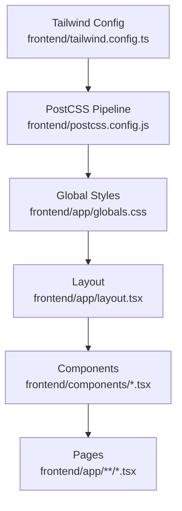
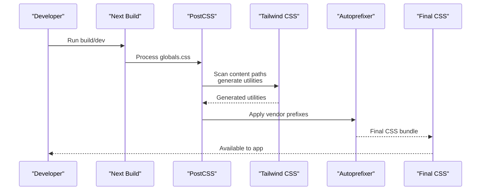
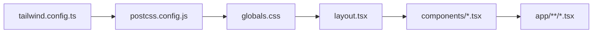

# Styling & Theming System

<cite>
**Referenced Files in This Document**
- [tailwind.config.ts](file://frontend/tailwind.config.ts)
- [postcss.config.js](file://frontend/postcss.config.js)
- [globals.css](file://frontend/app/globals.css)
- [layout.tsx](file://frontend/app/layout.tsx)
- [package.json](file://frontend/package.json)
- [Navbar.tsx](file://frontend/components/Navbar.tsx)
- [ReportForm.tsx](file://frontend/components/ReportForm.tsx)
- [MatchCard.tsx](file://frontend/components/MatchCard.tsx)
- [SimilarItems.tsx](file://frontend/components/SimilarItems.tsx)
- [page.tsx](file://frontend/app/page.tsx)
- [dashboard/page.tsx](file://frontend/app/dashboard/page.tsx)
</cite>

## Table of Contents
1. [Introduction](#introduction)
2. [Project Structure](#project-structure)
3. [Core Components](#core-components)
4. [Architecture Overview](#architecture-overview)
5. [Detailed Component Analysis](#detailed-component-analysis)
6. [Dependency Analysis](#dependency-analysis)
7. [Performance Considerations](#performance-considerations)
8. [Troubleshooting Guide](#troubleshooting-guide)
9. [Conclusion](#conclusion)

## Introduction
This document explains the styling and theming system used across the frontend, built on Tailwind CSS with PostCSS processing and custom component styles. It covers global styles configuration, theme customization via tailwind.config.ts, responsive design patterns, utility class usage, component-specific styling approaches, color schemes, typography, spacing, breakpoints, dark mode considerations, accessibility, and performance optimization techniques for stylesheets.

## Project Structure
The styling system is centered around a few key files:
- Global CSS entry that imports Tailwind layers and defines reusable component classes
- Tailwind configuration that extends colors and scanning paths
- PostCSS configuration that enables Tailwind and Autoprefixer
- Layout file that applies base body styles and includes global CSS
- Components that compose Tailwind utilities and shared component classes to build UI consistently

**Diagram sources**
- [tailwind.config.ts:1-41](file://frontend/tailwind.config.ts#L1-L41)
- [postcss.config.js:1-7](file://frontend/postcss.config.js#L1-L7)
- [globals.css:1-61](file://frontend/app/globals.css#L1-L61)
- [layout.tsx:1-28](file://frontend/app/layout.tsx#L1-L28)

**Section sources**
- [tailwind.config.ts:1-41](file://frontend/tailwind.config.ts#L1-L41)
- [postcss.config.js:1-7](file://frontend/postcss.config.js#L1-L7)
- [globals.css:1-61](file://frontend/app/globals.css#L1-L61)
- [layout.tsx:1-28](file://frontend/app/layout.tsx#L1-L28)

## Core Components
- Theme extension: Custom color palettes are defined under primary, success, and warning scales. These are available as Tailwind utilities (e.g., bg-primary-600, text-success-600).
- Global layer: The base, components, and utilities layers are imported from Tailwind. CSS variables define foreground/background colors and apply a system font stack.
- Reusable component classes: Shared UI primitives such as buttons, inputs, cards, and badges are defined in the components layer using @apply to combine utilities into semantic classes.

Key implementation references:
- Color palette extension and scan paths: [tailwind.config.ts:3-38](file://frontend/tailwind.config.ts#L3-L38)
- Global CSS layers and variables: [globals.css:1-14](file://frontend/app/globals.css#L1-L14)
- Reusable classes (buttons, inputs, cards, badges): [globals.css:16-60](file://frontend/app/globals.css#L16-L60)

Usage examples across components:
- Buttons: btn-primary, btn-secondary, btn-danger
- Inputs: input-field
- Cards: card
- Badges: badge, badge-success, badge-warning, badge-info

These classes are composed throughout the UI to maintain consistency and reduce duplication.

**Section sources**
- [tailwind.config.ts:3-38](file://frontend/tailwind.config.ts#L3-L38)
- [globals.css:1-60](file://frontend/app/globals.css#L1-L60)
- [Navbar.tsx:54-153](file://frontend/components/Navbar.tsx#L54-L153)
- [ReportForm.tsx:382-637](file://frontend/components/ReportForm.tsx#L382-L637)
- [MatchCard.tsx:141-330](file://frontend/components/MatchCard.tsx#L141-L330)
- [SimilarItems.tsx:22-77](file://frontend/components/SimilarItems.tsx#L22-L77)
- [page.tsx:4-45](file://frontend/app/page.tsx#L4-L45)
- [dashboard/page.tsx:76-117](file://frontend/app/dashboard/page.tsx#L76-L117)

## Architecture Overview
The styling pipeline processes source files through PostCSS, which runs Tailwind and Autoprefixer. Tailwind scans configured content paths to generate only the utilities used, then injects them into the final CSS bundle. Global CSS provides base resets, variables, and reusable component classes. The layout applies these globally, and components compose utilities and shared classes to render consistent UI.

**Diagram sources**
- [postcss.config.js:1-7](file://frontend/postcss.config.js#L1-L7)
- [tailwind.config.ts:3-8](file://frontend/tailwind.config.ts#L3-L8)
- [globals.css:1-3](file://frontend/app/globals.css#L1-L3)

**Section sources**
- [postcss.config.js:1-7](file://frontend/postcss.config.js#L1-L7)
- [tailwind.config.ts:3-8](file://frontend/tailwind.config.ts#L3-L8)
- [globals.css:1-3](file://frontend/app/globals.css#L1-L3)

## Detailed Component Analysis

### Global Styles and Theme Configuration
- Base and layers: Tailwind’s base, components, and utilities layers are included at the top of globals.css.
- Variables: CSS custom properties set default foreground and background colors; applied to body for consistent defaults.
- Typography: A system font stack ensures native rendering across platforms.
- Theme extensions: Primary, success, and warning color scales extend Tailwind’s default palette, enabling brand-consistent utilities.

References:
- Layer imports and variables: [globals.css:1-14](file://frontend/app/globals.css#L1-L14)
- Theme color extensions: [tailwind.config.ts:9-35](file://frontend/tailwind.config.ts#L9-L35)

**Section sources**
- [globals.css:1-14](file://frontend/app/globals.css#L1-L14)
- [tailwind.config.ts:9-35](file://frontend/tailwind.config.ts#L9-L35)

### Reusable Component Classes
- Buttons:
  - .btn-primary: Solid primary button with hover and focus states, disabled state, and transitions.
  - .btn-secondary: Outlined secondary button with hover and focus states, disabled state, and transitions.
  - .btn-danger: Red destructive action button with hover and focus states, disabled state, and transitions.
- Inputs:
  - .input-field: Full-width input with border, focus ring, placeholder styling, and transition.
- Cards:
  - .card: White card with rounded corners, subtle shadow, border, and padding.
- Badges:
  - .badge: Base inline-flex badge with small padding and rounded full shape.
  - .badge-success, .badge-warning, .badge-info: Semantic variants using extended color palette.

References:
- Button and input classes: [globals.css:16-39](file://frontend/app/globals.css#L16-L39)
- Card and badge classes: [globals.css:41-60](file://frontend/app/globals.css#L41-L60)

Usage examples:
- Navbar uses .btn-primary for login actions and .badge for notification counts.
- ReportForm composes .input-field, .card, and .btn-primary for form controls and submission.
- MatchCard uses .card, .badge variants, and .btn-primary/.btn-secondary/.btn-danger for actions.

**Section sources**
- [globals.css:16-60](file://frontend/app/globals.css#L16-L60)
- [Navbar.tsx:54-153](file://frontend/components/Navbar.tsx#L54-L153)
- [ReportForm.tsx:382-637](file://frontend/components/ReportForm.tsx#L382-L637)
- [MatchCard.tsx:141-330](file://frontend/components/MatchCard.tsx#L141-L330)

### Responsive Design Patterns
- Breakpoints:
  - sm: Used for small screens (e.g., mobile-first adjustments like hidden elements and grid changes).
  - md: Used for medium screens (e.g., showing desktop navigation).
  - lg: Used for large screens (e.g., wider containers and more columns).
- Common patterns observed:
  - Conditional visibility: Hidden on small screens, visible on larger ones (e.g., desktop nav links).
  - Grid layouts: Single column on mobile, multi-column on md/lg (e.g., dashboard cards).
  - Spacing and sizing: Adjusted padding/margins and widths based on breakpoint.

Examples:
- Navbar hides desktop navigation below md and shows mobile menu toggle.
- Dashboard page switches from single-column to multi-column grids at md and lg.
- ReportForm adjusts spacing and font sizes across sm breakpoints.

References:
- Navbar responsive behavior: [Navbar.tsx:54-163](file://frontend/components/Navbar.tsx#L54-L163)
- Dashboard grid responsiveness: [dashboard/page.tsx:101-115](file://frontend/app/dashboard/page.tsx#L101-L115)
- ReportForm responsive spacing: [ReportForm.tsx:382-414](file://frontend/components/ReportForm.tsx#L382-L414)

**Section sources**
- [Navbar.tsx:54-163](file://frontend/components/Navbar.tsx#L54-L163)
- [dashboard/page.tsx:101-115](file://frontend/app/dashboard/page.tsx#L101-L115)
- [ReportForm.tsx:382-414](file://frontend/components/ReportForm.tsx#L382-L414)

### Utility Class Usage and Consistency
- Spacing: Consistent use of Tailwind spacing utilities for margins and paddings (e.g., space-y, gap, px, py).
- Colors: Brand colors via extended palette (primary-*, success-*, warning-*), plus neutral grays for structure.
- Typography: Font sizes and weights follow Tailwind defaults; headings and body text sized responsively.
- Borders and shadows: Subtle borders and shadows for depth; rounded corners for modern look.
- States: Hover, focus, and disabled states consistently applied via utilities or component classes.

References:
- Utility composition in components: [MatchCard.tsx:141-330](file://frontend/components/MatchCard.tsx#L141-L330), [ReportForm.tsx:382-637](file://frontend/components/ReportForm.tsx#L382-L637), [SimilarItems.tsx:22-77](file://frontend/components/SimilarItems.tsx#L22-L77)

**Section sources**
- [MatchCard.tsx:141-330](file://frontend/components/MatchCard.tsx#L141-L330)
- [ReportForm.tsx:382-637](file://frontend/components/ReportForm.tsx#L382-L637)
- [SimilarItems.tsx:22-77](file://frontend/components/SimilarItems.tsx#L22-L77)

### Color Schemes and Semantic Variants
- Primary scale: 50–900 shades for consistent branding across backgrounds, text, and borders.
- Success and warning scales: Used for status indicators and feedback messages.
- Neutral palette: Grays for structure, borders, and muted text.
- Semantic badges: Badge variants map to success, warning, and info contexts.

References:
- Extended color definitions: [tailwind.config.ts:11-34](file://frontend/tailwind.config.ts#L11-L34)
- Badge variants usage: [globals.css:45-59](file://frontend/app/globals.css#L45-L59)

**Section sources**
- [tailwind.config.ts:11-34](file://frontend/tailwind.config.ts#L11-L34)
- [globals.css:45-59](file://frontend/app/globals.css#L45-L59)

### Typography Scale
- Font family: System font stack for optimal rendering across platforms.
- Headings and body: Tailwind’s default type scale used with responsive sizing utilities.
- Emphasis: Bold and semibold used for hierarchy; muted colors for secondary information.

References:
- Body font application: [globals.css:10-14](file://frontend/app/globals.css#L10-L14)
- Heading and text usage in pages/components: [page.tsx:8-14](file://frontend/app/page.tsx#L8-L14), [dashboard/page.tsx:76-83](file://frontend/app/dashboard/page.tsx#L76-L83)

**Section sources**
- [globals.css:10-14](file://frontend/app/globals.css#L10-L14)
- [page.tsx:8-14](file://frontend/app/page.tsx#L8-L14)
- [dashboard/page.tsx:76-83](file://frontend/app/dashboard/page.tsx#L76-L83)

### Spacing System
- Vertical rhythm: space-y utilities create consistent vertical spacing between sections.
- Horizontal gaps: gap utilities align items in flex/grid layouts.
- Padding and margins: px, py, mx, my used to control whitespace around components.

References:
- Form spacing: [ReportForm.tsx:382-414](file://frontend/components/ReportForm.tsx#L382-L414)
- Dashboard grid spacing: [dashboard/page.tsx:101-115](file://frontend/app/dashboard/page.tsx#L101-L115)

**Section sources**
- [ReportForm.tsx:382-414](file://frontend/components/ReportForm.tsx#L382-L414)
- [dashboard/page.tsx:101-115](file://frontend/app/dashboard/page.tsx#L101-L115)

### Breakpoint Configuration
- Default Tailwind breakpoints are used (sm, md, lg).
- Content scanning paths ensure all relevant TSX files are analyzed for utility generation.

References:
- Content scanning: [tailwind.config.ts:3-8](file://frontend/tailwind.config.ts#L3-L8)

**Section sources**
- [tailwind.config.ts:3-8](file://frontend/tailwind.config.ts#L3-L8)

### Creating Custom Components with Consistent Styling
- Use shared component classes (.btn-primary, .input-field, .card, .badge) to ensure visual consistency.
- Compose Tailwind utilities for layout, spacing, and responsive behavior within components.
- Keep component logic separate from styling concerns by relying on semantic classes and utilities.

Examples:
- Navbar composes .btn-primary and .badge for user actions and notifications.
- ReportForm composes .input-field, .card, and .btn-primary for form UX.
- MatchCard uses .card and badge variants to display match details and statuses.

References:
- Navbar usage: [Navbar.tsx:54-153](file://frontend/components/Navbar.tsx#L54-L153)
- ReportForm usage: [ReportForm.tsx:382-637](file://frontend/components/ReportForm.tsx#L382-L637)
- MatchCard usage: [MatchCard.tsx:141-330](file://frontend/components/MatchCard.tsx#L141-L330)

**Section sources**
- [Navbar.tsx:54-153](file://frontend/components/Navbar.tsx#L54-L153)
- [ReportForm.tsx:382-637](file://frontend/components/ReportForm.tsx#L382-L637)
- [MatchCard.tsx:141-330](file://frontend/components/MatchCard.tsx#L141-L330)

### Dark Mode Support
- Current setup does not include explicit dark mode configuration in tailwind.config.ts.
- Global CSS defines light-mode variables for foreground and background; dark mode could be implemented by adding a dark variant strategy and toggling variables or classes.
- Recommendation: Enable dark mode in Tailwind config and add a root-level class toggle to switch themes while keeping component classes consistent.

References:
- Theme config: [tailwind.config.ts:3-38](file://frontend/tailwind.config.ts#L3-L38)
- Global variables: [globals.css:5-14](file://frontend/app/globals.css#L5-L14)

**Section sources**
- [tailwind.config.ts:3-38](file://frontend/tailwind.config.ts#L3-L38)
- [globals.css:5-14](file://frontend/app/globals.css#L5-L14)

### Accessibility Considerations
- Focus states: Component classes include focus rings for keyboard navigation.
- Labels and aria attributes: Inputs and interactive elements should have descriptive labels and appropriate aria attributes where needed.
- Color contrast: Ensure sufficient contrast for text and interactive elements; consider semantic colors for meaning but verify readability.
- Reduced motion: Respect prefers-reduced-motion if animations are added.

References:
- Focus states in component classes: [globals.css:16-39](file://frontend/app/globals.css#L16-L39)
- Interactive elements in components: [Navbar.tsx:54-163](file://frontend/components/Navbar.tsx#L54-L163), [ReportForm.tsx:382-637](file://frontend/components/ReportForm.tsx#L382-L637)

**Section sources**
- [globals.css:16-39](file://frontend/app/globals.css#L16-L39)
- [Navbar.tsx:54-163](file://frontend/components/Navbar.tsx#L54-L163)
- [ReportForm.tsx:382-637](file://frontend/components/ReportForm.tsx#L382-L637)

### Performance Optimization Techniques
- Tree-shaking via Tailwind content scanning: Only used utilities are generated, reducing bundle size.
- PostCSS pipeline: Autoprefixer adds necessary vendor prefixes without manual maintenance.
- Minimal custom CSS: Rely on utilities and shared component classes to avoid redundant styles.
- Efficient selectors: Avoid deep nesting; prefer flat utility composition for faster parsing.

References:
- Content scanning paths: [tailwind.config.ts:3-8](file://frontend/tailwind.config.ts#L3-L8)
- PostCSS plugins: [postcss.config.js:1-7](file://frontend/postcss.config.js#L1-L7)
- Global CSS layer imports: [globals.css:1-3](file://frontend/app/globals.css#L1-L3)

**Section sources**
- [tailwind.config.ts:3-8](file://frontend/tailwind.config.ts#L3-L8)
- [postcss.config.js:1-7](file://frontend/postcss.config.js#L1-L7)
- [globals.css:1-3](file://frontend/app/globals.css#L1-L3)

## Dependency Analysis
The styling dependencies flow from configuration to runtime:
- Tailwind config defines content paths and theme extensions.
- PostCSS config wires Tailwind and Autoprefixer.
- Global CSS imports Tailwind layers and defines reusable classes.
- Layout includes global CSS and applies base styles.
- Components consume utilities and shared classes to render UI.

**Diagram sources**
- [tailwind.config.ts:3-8](file://frontend/tailwind.config.ts#L3-L8)
- [postcss.config.js:1-7](file://frontend/postcss.config.js#L1-L7)
- [globals.css:1-3](file://frontend/app/globals.css#L1-L3)
- [layout.tsx:1-28](file://frontend/app/layout.tsx#L1-L28)

**Section sources**
- [tailwind.config.ts:3-8](file://frontend/tailwind.config.ts#L3-L8)
- [postcss.config.js:1-7](file://frontend/postcss.config.js#L1-L7)
- [globals.css:1-3](file://frontend/app/globals.css#L1-L3)
- [layout.tsx:1-28](file://frontend/app/layout.tsx#L1-L28)

## Performance Considerations
- Bundle size: Tailwind’s content scanning ensures only used utilities are included. Keep content paths accurate to avoid missing styles or bloated bundles.
- CSS architecture: Prefer utilities and shared component classes over ad-hoc styles to minimize redundancy.
- Runtime performance: Avoid heavy custom CSS; rely on Tailwind’s optimized output.
- Build-time efficiency: PostCSS pipeline is lightweight; ensure plugins are up-to-date.

[No sources needed since this section provides general guidance]

## Troubleshooting Guide
- Missing styles: Verify content paths in tailwind.config.ts include all directories where utilities are used.
- Unexpected overrides: Check order of @layer directives in globals.css; utilities should come last to override base/component styles appropriately.
- Focus and accessibility issues: Ensure interactive elements have focus states and accessible labels; review component classes for proper focus rings.
- Dark mode not working: Confirm dark mode strategy in tailwind.config.ts and that root-level class toggles are applied correctly.

References:
- Content scanning: [tailwind.config.ts:3-8](file://frontend/tailwind.config.ts#L3-L8)
- Layer order: [globals.css:1-3](file://frontend/app/globals.css#L1-L3)
- Focus states: [globals.css:16-39](file://frontend/app/globals.css#L16-L39)

**Section sources**
- [tailwind.config.ts:3-8](file://frontend/tailwind.config.ts#L3-L8)
- [globals.css:1-39](file://frontend/app/globals.css#L1-L39)

## Conclusion
The styling system leverages Tailwind CSS with a focused configuration, PostCSS processing, and a small set of reusable component classes to deliver a consistent, responsive, and maintainable UI. By extending the theme with brand colors, defining shared component primitives, and composing utilities throughout components, the project achieves scalability and performance. Future enhancements can include explicit dark mode support and further accessibility refinements while maintaining the current efficient architecture.

[No sources needed since this section summarizes without analyzing specific files]