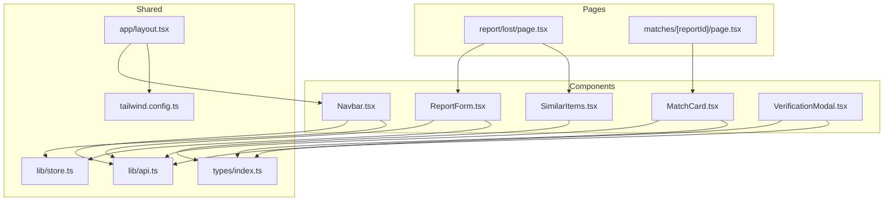
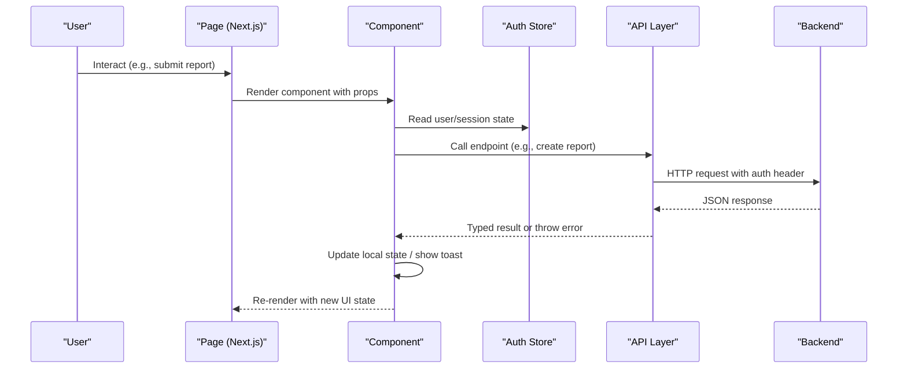
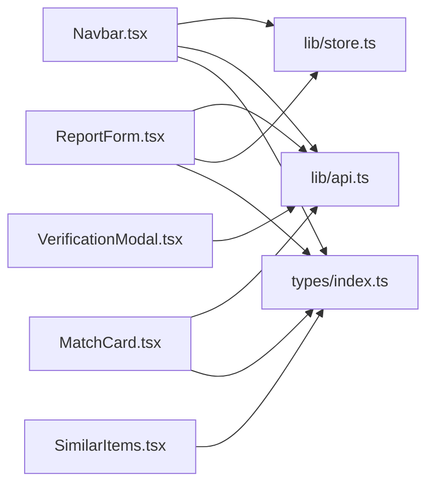

# UI Components Library

<cite>
**Referenced Files in This Document**
- [Navbar.tsx](file://frontend/components/Navbar.tsx)
- [ReportForm.tsx](file://frontend/components/ReportForm.tsx)
- [MatchCard.tsx](file://frontend/components/MatchCard.tsx)
- [SimilarItems.tsx](file://frontend/components/SimilarItems.tsx)
- [VerificationModal.tsx](file://frontend/components/VerificationModal.tsx)
- [index.ts (types)](file://frontend/types/index.ts)
- [store.ts](file://frontend/lib/store.ts)
- [api.ts](file://frontend/lib/api.ts)
- [tailwind.config.ts](file://frontend/tailwind.config.ts)
- [layout.tsx](file://frontend/app/layout.tsx)
- [page.tsx (report lost)](file://frontend/app/report/lost/page.tsx)
- [page.tsx (matches)](file://frontend/app/matches/[reportId]/page.tsx)
</cite>

## Table of Contents
1. Introduction
2. Project Structure
3. Core Components
4. Architecture Overview
5. Detailed Component Analysis
6. Dependency Analysis
7. Performance Considerations
8. Troubleshooting Guide
9. Conclusion
10. Appendices

## Introduction
This document provides comprehensive documentation for the reusable UI component library used in the Lost & Found AI Matcher application. It covers five core components: Navbar, ReportForm, MatchCard, SimilarItems, and VerificationModal. For each component, we detail props, events, state management, styling with Tailwind CSS, accessibility, lifecycle behavior, performance considerations, and testing strategies. We also explain composition patterns and event handling strategies across the components.

## Project Structure
The UI components live under frontend/components and are consumed by Next.js pages under frontend/app. Shared types and APIs are centralized in frontend/types and frontend/lib. The root layout integrates the Navbar globally and renders a Toaster for notifications.

**Diagram sources**
- [layout.tsx:11-24](file://frontend/app/layout.tsx#L11-L24)
- [page.tsx (report lost):22-63](file://frontend/app/report/lost/page.tsx#L22-L63)
- [page.tsx (matches):12-38](file://frontend/app/matches/[reportId]/page.tsx#L12-L38)
- [Navbar.tsx:17-209](file://frontend/components/Navbar.tsx#L17-L209)
- [ReportForm.tsx:171-639](file://frontend/components/ReportForm.tsx#L171-L639)
- [MatchCard.tsx:17-331](file://frontend/components/MatchCard.tsx#L17-L331)
- [SimilarItems.tsx:19-79](file://frontend/components/SimilarItems.tsx#L19-L79)
- [VerificationModal.tsx:22-176](file://frontend/components/VerificationModal.tsx#L22-L176)

**Section sources**
- [layout.tsx:11-24](file://frontend/app/layout.tsx#L11-L24)
- [tailwind.config.ts:3-38](file://frontend/tailwind.config.ts#L3-L38)

## Core Components
- Navbar: Global navigation with responsive menu, user menu, unread notification badge, and role-based links.
- ReportForm: Multilingual form for reporting lost or found items with validation, photo upload, and success state.
- MatchCard: Displays match details, score breakdown, and verification workflow for claimants/finders/admins.
- SimilarItems: Lists similar items returned from matching with scores and metadata.
- VerificationModal: Standalone modal to answer ownership verification questions with loading/success/error states.

**Section sources**
- [Navbar.tsx:17-209](file://frontend/components/Navbar.tsx#L17-L209)
- [ReportForm.tsx:26-29](file://frontend/components/ReportForm.tsx#L26-L29)
- [MatchCard.tsx:10-15](file://frontend/components/MatchCard.tsx#L10-L15)
- [SimilarItems.tsx:14-17](file://frontend/components/SimilarItems.tsx#L14-L17)
- [VerificationModal.tsx:8-13](file://frontend/components/VerificationModal.tsx#L8-L13)

## Architecture Overview
The components follow a clear separation of concerns:
- Presentation: Each component focuses on rendering and local state.
- State: Local component state manages UI interactions; global auth state is provided via Zustand store.
- Data: API layer abstracts HTTP calls and error handling; components consume typed responses.
- Styling: Tailwind utility classes provide consistent design tokens and responsive layouts.

**Diagram sources**
- [api.ts:18-35](file://frontend/lib/api.ts#L18-L35)
- [store.ts:14-38](file://frontend/lib/store.ts#L14-L38)
- [ReportForm.tsx:299-351](file://frontend/components/ReportForm.tsx#L299-L351)
- [MatchCard.tsx:55-101](file://frontend/components/MatchCard.tsx#L55-L101)

## Detailed Component Analysis

### Navbar
Responsibilities:
- Display navigation links based on authentication and role.
- Show unread notification count and mark all as read when navigating to notifications.
- Provide mobile-responsive menu with hamburger toggle.
- Manage user dropdown actions including logout.

Props: None (self-contained).

Events and behaviors:
- Reads user from global auth store and updates unread badge periodically.
- On pathname change to notifications, marks all notifications as read and resets badge.
- Handles logout by clearing auth state and closing menus.

State management:
- Local state for mobile menu visibility, user menu visibility, and unread count.
- Uses useEffect to fetch unread count and set interval polling.

Styling and responsiveness:
- Sticky top navigation with responsive breakpoints (hidden md:flex for desktop).
- Mobile menu rendered conditionally with accessible button labels.

Accessibility:
- aria-label on toggle button.
- Semantic nav element and link elements for navigation.

Lifecycle:
- Fetches unread count on mount and on pathname/user changes.
- Cleans up interval on unmount.

Performance:
- Interval polling throttles network requests.
- Conditional rendering reduces DOM size for mobile/desktop.

Testing strategy:
- Unit test event handlers for logout and menu toggles.
- Mock API calls for unread count and mark-all-read.
- Snapshot tests for rendered structure at different breakpoints.

Usage example path:
- Integrated globally in root layout.

**Section sources**
- [Navbar.tsx:17-209](file://frontend/components/Navbar.tsx#L17-L209)
- [layout.tsx:11-24](file://frontend/app/layout.tsx#L11-L24)
- [api.ts:277-291](file://frontend/lib/api.ts#L277-L291)

### ReportForm
Responsibilities:
- Collect item details for lost/found reports with multilingual support.
- Validate fields and display contextual errors.
- Upload photos and handle file constraints.
- Submit data via API and show success state.

Props:
- type: 'lost' | 'found'
- onSubmit: async callback receiving normalized form data

Events:
- Field blur triggers per-field validation.
- Photo input validates type and size.
- Submit triggers full validation and submission flow.

State management:
- Local state for all fields, errors, touched flags, loading, and success.
- Language selection synced with user preference.

Validation:
- Required fields: category, description (min length), location, dateTime.
- Found-only private field pair validation (key/value must be both present or empty).
- Photo validation: image type and size limit.

Error handling:
- Displays inline errors after touch.
- Shows toast on submission failure.

Styling and responsiveness:
- Responsive grid for category/brand/colour row.
- Consistent input styles and error states using Tailwind utilities.

Accessibility:
- Labels associated with inputs.
- Descriptive placeholders and hints.
- Disabled states during submission.

Lifecycle:
- Syncs language on user preference changes.
- Resets form on success and allows re-reporting.

Performance:
- useMemo for validation function to avoid recreation.
- Debounced or minimal re-renders via controlled inputs.

Testing strategy:
- Unit tests for validation rules and error messages.
- Integration tests for submission flow with mocked API.
- Snapshot tests for multilingual render variants.

Usage example path:
- Consumed by report pages to create lost/found reports.

**Section sources**
- [ReportForm.tsx:26-29](file://frontend/components/ReportForm.tsx#L26-L29)
- [ReportForm.tsx:201-245](file://frontend/components/ReportForm.tsx#L201-L245)
- [ReportForm.tsx:252-280](file://frontend/components/ReportForm.tsx#L252-L280)
- [ReportForm.tsx:299-351](file://frontend/components/ReportForm.tsx#L299-L351)
- [api.ts:143-161](file://frontend/lib/api.ts#L143-L161)

### MatchCard
Responsibilities:
- Display match details including thumbnail, attributes, and score breakdown.
- Facilitate verification workflow for claimants and finder/admin review.
- Handle verification question fetching, answer submission, and judge actions.

Props:
- match: Match object with scores and joined fields
- userRole: 'claimant' | 'finder' | 'admin'
- onClaim?: optional callback triggered before starting verification
- onVerified?: optional callback to refresh matches after verification

Events:
- Start verification fetches question and opens modal-like overlay.
- Submit answer sends to backend and updates state based on result.
- Judge answer allows finder/admin to override system verdict.

State management:
- Local state for verification modal visibility, question, answer, submitting flag, verified status, pending attempt id, result message, retries remaining.

Error handling:
- Toast notifications for failures and escalations.
- Graceful fallbacks for missing images and null scores.

Styling and responsiveness:
- Score bars and color-coded badges based on thresholds.
- Responsive layout for mobile and desktop.

Accessibility:
- Alt text for images.
- Clear labels and disabled states during submission.

Lifecycle:
- Initializes verified state from match status.
- Updates UI based on backend responses and user role.

Performance:
- Minimal re-renders by updating specific fields.
- Avoids unnecessary API calls by guarding with state checks.

Testing strategy:
- Unit tests for score coloring logic and time formatting.
- Mock verifyApi endpoints to test verification flows.
- Role-based rendering tests for claimant/finder/admin views.

Usage example path:
- Rendered in matches page for each match entry.

**Section sources**
- [MatchCard.tsx:10-15](file://frontend/components/MatchCard.tsx#L10-L15)
- [MatchCard.tsx:17-331](file://frontend/components/MatchCard.tsx#L17-L331)
- [api.ts:241-256](file://frontend/lib/api.ts#L241-L256)

### SimilarItems
Responsibilities:
- Display list of similar items with thumbnails, descriptions, locations, and similarity scores.

Props:
- items: Array of similar items with metadata and scores
- label: 'lost' | 'found' to determine heading text

Events: None (pure presentation).

State management: None (stateless).

Styling and responsiveness:
- Grid layout with consistent card styling.
- Color-coded score badges based on thresholds.

Accessibility:
- Alt text for images and descriptive headings.

Lifecycle: None (stateless).

Performance:
- Efficient mapping over items array.

Testing strategy:
- Unit tests for rendering conditions and score badge colors.
- Snapshot tests for various item configurations.

Usage example path:
- Used in report pages to show instant similar results.

**Section sources**
- [SimilarItems.tsx:3-17](file://frontend/components/SimilarItems.tsx#L3-L17)
- [SimilarItems.tsx:19-79](file://frontend/components/SimilarItems.tsx#L19-L79)

### VerificationModal
Responsibilities:
- Present a modal to answer ownership verification questions.
- Manage loading, ready, submitting, success, and error states.
- Submit answers and notify parent via callbacks.

Props:
- matchId: Identifier for the match being verified
- isOpen: Boolean to control modal visibility
- onClose: Callback to close modal and reset state
- onSubmitted: Callback invoked on successful submission

Events:
- Form submission triggers answer submission and state transitions.
- Close action resets answer and invokes onClose.

State management:
- Local state for answer text and modal state machine (loading/ready/submitting/success/error).

Error handling:
- Catches API errors and displays error state within modal.
- Toast notifications for submission failures.

Styling and responsiveness:
- Centered modal with backdrop and accessible close button.
- Consistent input and button styles.

Accessibility:
- aria-label on close button.
- Focus management considerations for modal usage.

Lifecycle:
- Fetches question when opened; cleans up on close.
- Resets state on open/close cycles.

Performance:
- Minimal re-renders driven by state transitions.

Testing strategy:
- Unit tests for state transitions and form validation.
- Mock verifyApi to test success/error paths.
- Snapshot tests for modal states.

Usage example path:
- Can be integrated into match workflows or standalone verification flows.

**Section sources**
- [VerificationModal.tsx:8-13](file://frontend/components/VerificationModal.tsx#L8-L13)
- [VerificationModal.tsx:22-176](file://frontend/components/VerificationModal.tsx#L22-L176)
- [api.ts:241-256](file://frontend/lib/api.ts#L241-L256)

## Dependency Analysis
Components depend on shared types and API layer for data operations. Auth state is centralized in a Zustand store and consumed by components that need user context.

**Diagram sources**
- [Navbar.tsx:5-6](file://frontend/components/Navbar.tsx#L5-L6)
- [ReportForm.tsx:4-6](file://frontend/components/ReportForm.tsx#L4-L6)
- [MatchCard.tsx:5-6](file://frontend/components/MatchCard.tsx#L5-L6)
- [VerificationModal.tsx:4](file://frontend/components/VerificationModal.tsx#L4)
- [SimilarItems.tsx:3-12](file://frontend/components/SimilarItems.tsx#L3-L12)
- [types/index.ts:1-197](file://frontend/types/index.ts#L1-L197)
- [store.ts:1-39](file://frontend/lib/store.ts#L1-L39)
- [api.ts:1-423](file://frontend/lib/api.ts#L1-L423)

**Section sources**
- [types/index.ts:1-197](file://frontend/types/index.ts#L1-L197)
- [store.ts:1-39](file://frontend/lib/store.ts#L1-L39)
- [api.ts:1-423](file://frontend/lib/api.ts#L1-L423)

## Performance Considerations
- Use memoization where appropriate (e.g., validation functions) to prevent unnecessary recalculations.
- Throttle polling intervals for background tasks like unread counts.
- Prefer conditional rendering to minimize DOM overhead on different screen sizes.
- Avoid heavy computations in render loops; move to hooks or utilities.
- Leverage React’s reconciliation by keeping component state localized and minimal.

[No sources needed since this section provides general guidance]

## Troubleshooting Guide
Common issues and resolutions:
- API errors: Ensure environment variables are set correctly and tokens are valid. Check error messages thrown by apiFetch.
- Validation errors: Verify required fields and constraints; ensure touched state is updated on blur.
- Modal not closing: Confirm onClose is called and state is reset properly.
- Notification badge not updating: Check interval cleanup and API availability.

**Section sources**
- [api.ts:18-35](file://frontend/lib/api.ts#L18-L35)
- [ReportForm.tsx:201-245](file://frontend/components/ReportForm.tsx#L201-L245)
- [VerificationModal.tsx:26-51](file://frontend/components/VerificationModal.tsx#L26-L51)
- [Navbar.tsx:24-46](file://frontend/components/Navbar.tsx#L24-L46)

## Conclusion
The UI component library provides a robust, accessible, and responsive set of reusable components for the Lost & Found AI Matcher. Each component encapsulates its own state and behavior while integrating seamlessly with shared types, API layer, and global auth store. The design emphasizes clarity, maintainability, and scalability, enabling efficient development and testing practices.

[No sources needed since this section summarizes without analyzing specific files]

## Appendices

### Component Composition Patterns
- Pages compose components to build feature screens (e.g., report pages use ReportForm and SimilarItems).
- Components accept callbacks to communicate upward (e.g., onVerified, onSubmitted).
- Shared types enforce consistency across components and pages.

**Section sources**
- [page.tsx (report lost):22-63](file://frontend/app/report/lost/page.tsx#L22-L63)
- [page.tsx (matches):12-38](file://frontend/app/matches/[reportId]/page.tsx#L12-L38)

### Styling Approaches with Tailwind CSS
- Custom color tokens defined in tailwind config for primary, success, warning.
- Utility-first classes for layout, spacing, typography, and interactive states.
- Responsive design achieved through breakpoint-specific classes.

**Section sources**
- [tailwind.config.ts:3-38](file://frontend/tailwind.config.ts#L3-L38)

### Accessibility Features
- Semantic HTML elements (nav, form, button, link).
- Accessible labels and aria attributes where necessary.
- Keyboard-friendly interactions and focus management in modals.

**Section sources**
- [Navbar.tsx:157-163](file://frontend/components/Navbar.tsx#L157-L163)
- [VerificationModal.tsx:86-92](file://frontend/components/VerificationModal.tsx#L86-L92)

### Testing Strategies
- Unit tests for pure functions and component logic.
- Integration tests for API interactions using mocks.
- Visual regression tests for UI consistency across breakpoints.

[No sources needed since this section provides general guidance]