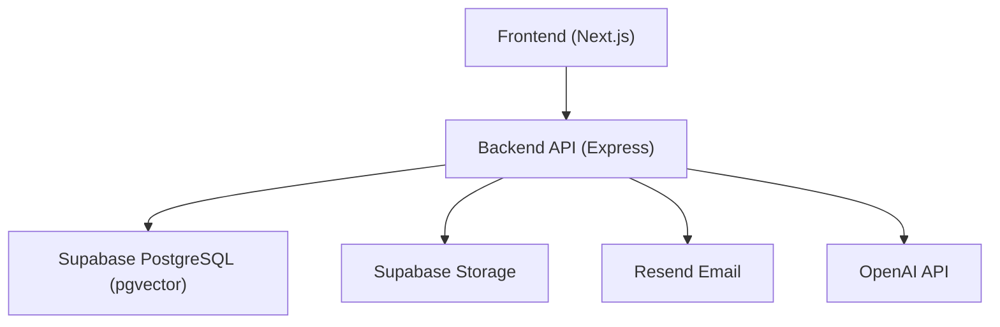

# Getting Started

<cite>
**Referenced Files in This Document**
- [README.md](file://README.md)
- [package.json](file://package.json)
- [backend/package.json](file://backend/package.json)
- [frontend/package.json](file://frontend/package.json)
- [backend/src/config/index.ts](file://backend/src/config/index.ts)
- [backend/src/server.ts](file://backend/src/server.ts)
- [backend/src/db/migrate.ts](file://backend/src/db/migrate.ts)
- [supabase/migrations/001_initial_schema.sql](file://supabase/migrations/001_initial_schema.sql)
- [render.yaml](file://render.yaml)
- [DEPLOYMENT.md](file://DEPLOYMENT.md)
- [frontend/.env.local](file://frontend/.env.local)
- [frontend/lib/supabase.ts](file://frontend/lib/supabase.ts)
</cite>

## Table of Contents
1. Introduction
2. Project Structure
3. Prerequisites
4. Local Setup
5. Environment Configuration
6. Database Migrations
7. Start Development Servers
8. Quick Validation
9. Deployment
10. Troubleshooting Guide
11. Conclusion

## Introduction
This guide helps you set up and run the Lost & Found AI Matcher locally, then deploy it to production. The system matches lost and found items using AI-driven similarity scoring and a verification workflow that protects private details until ownership is confirmed.

## Project Structure
The repository contains:
- Frontend (Next.js 14): user interface for reporting items, viewing matches, messaging, and admin tasks.
- Backend (Express + TypeScript): REST API, matching engine, verification, notifications, and Supabase integrations.
- Supabase migrations: schema with pgvector support for embeddings and indexes.
- Deployment configs: Render blueprint for backend and Vercel configuration for frontend.

**Diagram sources**
- [backend/src/server.ts:1-52](file://backend/src/server.ts#L1-L52)
- [backend/src/config/index.ts:1-49](file://backend/src/config/index.ts#L1-L49)
- [supabase/migrations/001_initial_schema.sql:1-370](file://supabase/migrations/001_initial_schema.sql#L1-L370)

**Section sources**
- [README.md:22-46](file://README.md#L22-L46)
- [backend/src/server.ts:1-52](file://backend/src/server.ts#L1-L52)

## Prerequisites
Ensure you have the following before starting:
- Node.js 18+
- A Supabase project with PostgreSQL enabled and the pgvector extension available
- An OpenAI API key
- A Resend account and API key (for sending emails)

**Section sources**
- [README.md:130-138](file://README.md#L130-L138)

## Local Setup
Follow these steps to get the application running on your machine:

1. Clone the repository and navigate into the project root.
2. Install dependencies for both frontend and backend:
   - Run npm run install:all from the project root.
3. Configure environment variables (see next section).
4. Apply database migrations (see next section).
5. Start development servers:
   - Backend: npm run dev:backend (listens on http://localhost:4000)
   - Frontend: npm run dev:frontend (listens on http://localhost:3000)

Notes:
- The top-level package.json defines scripts to manage both packages.
- The backend uses tsx watch during development to auto-reload on changes.

**Section sources**
- [package.json:6-17](file://package.json#L6-L17)
- [backend/package.json:5-15](file://backend/package.json#L5-L15)
- [frontend/package.json:5-10](file://frontend/package.json#L5-L10)

## Environment Configuration
You need to configure environment variables for both backend and frontend.

Backend (.env at backend root or as configured by the app):
- PORT (default 4000)
- NODE_ENV
- FRONTEND_URL (CORS origin for the frontend)
- NEXT_PUBLIC_SUPABASE_URL
- NEXT_PUBLIC_SUPABASE_ANON_KEY
- SUPABASE_SERVICE_ROLE_KEY (secret)
- DATABASE_URL (Postgres connection string; secret)
- OPENAI_API_KEY (secret)
- RESEND_API_KEY (secret)
- EMAIL_FROM
- JWT_SECRET (secret)

Frontend (.env.local in frontend directory):
- NEXT_PUBLIC_SUPABASE_URL
- NEXT_PUBLIC_SUPABASE_ANON_KEY
- NEXT_PUBLIC_API_URL (e.g., http://localhost:4000/api)

Important:
- Do not commit secrets. Use .env files and platform dashboards for deployment.
- The backend reads its config from an .env file path resolved relative to the backend source.

**Section sources**
- [backend/src/config/index.ts:1-49](file://backend/src/config/index.ts#L1-L49)
- [frontend/.env.local:1-4](file://frontend/.env.local#L1-L4)
- [DEPLOYMENT.md:63-73](file://DEPLOYMENT.md#L63-L73)

## Database Migrations
Migrations are stored under supabase/migrations and applied via the backend migration script.

Steps:
1. Ensure your Supabase project has the vector extension enabled.
2. From the project root, run npm run db:migrate.
3. The migration script will:
   - Connect to the database using DATABASE_URL
   - Create a tracking table (_migrations) if missing
   - Apply each SQL file once
   - Record applied migrations

What gets created:
- Tables for users, lost_items, found_items, matches, verification_questions, verification_attempts, notifications, item_status_log
- Enums, functions, triggers, and Row Level Security policies
- Vector indexes for fast embedding similarity search

**Section sources**
- [backend/src/db/migrate.ts:1-53](file://backend/src/db/migrate.ts#L1-L53)
- [supabase/migrations/001_initial_schema.sql:1-370](file://supabase/migrations/001_initial_schema.sql#L1-L370)

## Start Development Servers
Run two terminals:

Terminal 1 — Backend:
- Command: npm run dev:backend
- Exposes: http://localhost:4000
- Health check endpoint: GET /api/health

Terminal 2 — Frontend:
- Command: npm run dev:frontend
- Exposes: http://localhost:3000

CORS:
- The backend allows requests from FRONTEND_URL. Ensure this matches your frontend URL during local development.

**Section sources**
- [package.json:8-9](file://package.json#L8-L9)
- [backend/src/server.ts:18-49](file://backend/src/server.ts#L18-L49)

## Quick Validation
After starting both servers:

1. Check backend health:
   - Visit http://localhost:4000/api/health
   - Expect a JSON response indicating status ok
2. Verify frontend connectivity:
   - Open http://localhost:3000
   - Confirm pages load and can call the backend API
3. Test Supabase integration:
   - Sign up or log in from the frontend
   - Confirm user creation and data access work as expected
4. Optional: Upload a photo to confirm storage works

If any step fails, review environment variables and network settings.

**Section sources**
- [backend/src/server.ts:32-34](file://backend/src/server.ts#L32-L34)
- [frontend/lib/supabase.ts:1-25](file://frontend/lib/supabase.ts#L1-L25)

## Deployment
Production deployment targets:
- Backend: Render
- Frontend: Vercel

Render (backend):
- Use render.yaml to define the service, build command, start command, and health check.
- Set required environment variables in the Render dashboard (secrets marked sync: false).
- After deploying the frontend, update FRONTEND_URL and CORS_ORIGINS to allow your Vercel domain.

Vercel (frontend):
- Import the repository and set Root Directory to frontend.
- Add environment variables for Supabase and the backend API URL.
- Build and deploy; then update backend CORS to include your production frontend URL.

Post-deploy checks:
- GET https://<your-backend>/api/health should return ok
- Create a test user from the deployed frontend and verify API calls succeed
- Confirm email delivery via Resend logs

Security reminders:
- Never commit secrets
- Store sensitive keys in Render/Vercel dashboards
- Keep DATABASE_URL, SUPABASE_SERVICE_ROLE_KEY, OPENAI_API_KEY, RESEND_API_KEY, and JWT_SECRET secure

**Section sources**
- [render.yaml:1-54](file://render.yaml#L1-L54)
- [DEPLOYMENT.md:59-103](file://DEPLOYMENT.md#L59-L103)

## Troubleshooting Guide
Common setup issues and resolutions:

Database connection problems:
- Symptom: Migration fails with connection timeout or terminated errors.
- Checks:
  - Ensure DATABASE_URL points to the correct Supabase pooler and includes the right password.
  - Confirm pgvector extension is enabled in your Supabase project.
  - Verify firewall/network rules allow outbound connections to Supabase.
- If local migrations fail but migrations are already applied, proceed to deploy and validate via /api/health.

CORS errors between frontend and backend:
- Symptom: Browser blocks API calls from localhost:3000 to localhost:4000.
- Fix: Set FRONTEND_URL to http://localhost:3000 in backend environment. For production, set FRONTEND_URL and CORS_ORIGINS to your Vercel domain(s).

Supabase client configuration:
- Symptom: Frontend cannot connect to Supabase.
- Fix: Ensure NEXT_PUBLIC_SUPABASE_URL and NEXT_PUBLIC_SUPABASE_ANON_KEY are set in frontend/.env.local.

OpenAI or Resend failures:
- Symptom: Matching or email features fail.
- Fix: Verify OPENAI_API_KEY and RESEND_API_KEY are correctly set in backend environment.

Health and routing:
- Confirm backend exposes /api/health and routes mount under /api/*
- Ensure port 4000 is free and not blocked by local firewalls.

**Section sources**
- [backend/src/config/index.ts:1-49](file://backend/src/config/index.ts#L1-L49)
- [backend/src/server.ts:18-49](file://backend/src/server.ts#L18-L49)
- [DEPLOYMENT.md:45-57](file://DEPLOYMENT.md#L45-L57)

## Conclusion
You now have everything needed to set up, run, and deploy the Lost & Found AI Matcher. Start locally to iterate quickly, validate with the quick checks, and then deploy to Render and Vercel with proper environment variables. Use the troubleshooting guide to resolve common issues and ensure a smooth experience.