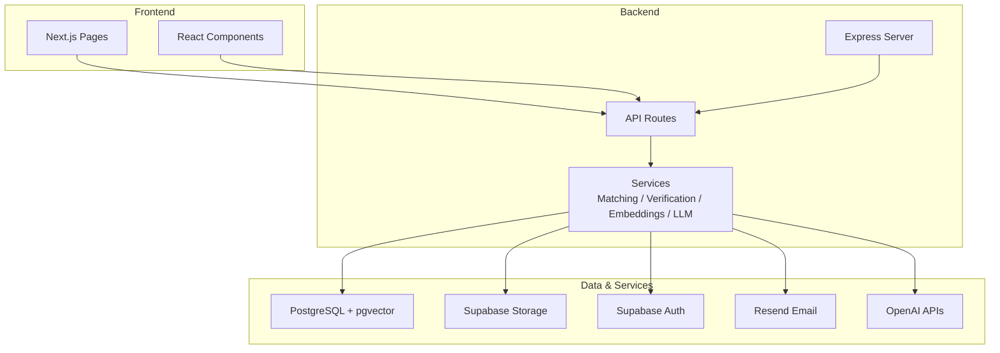
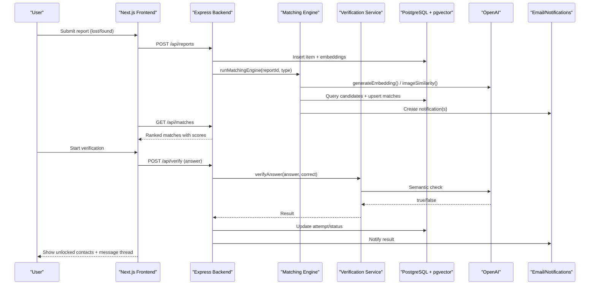
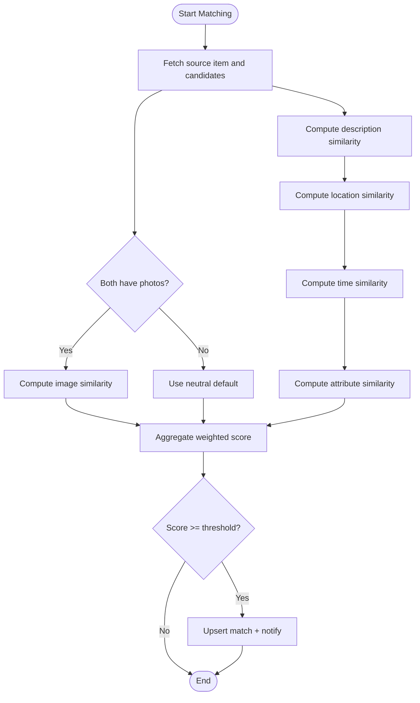
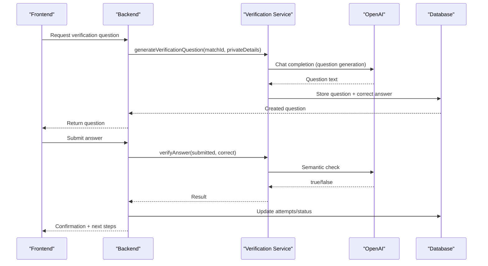
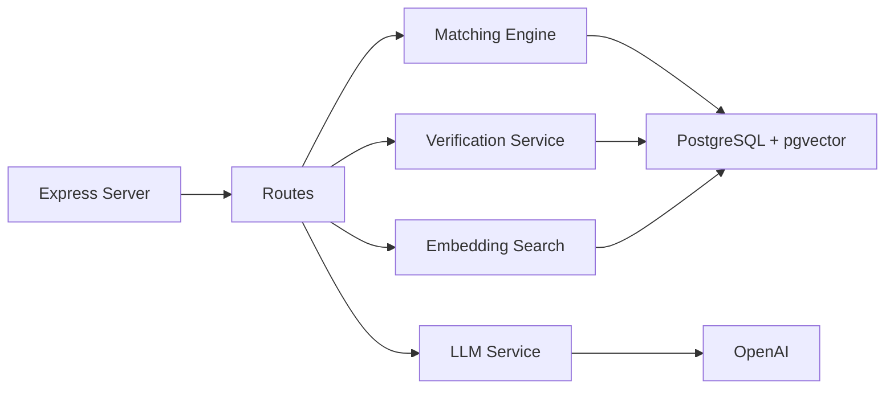

# Project Overview

<cite>
**Referenced Files in This Document**
- [README.md](file://README.md)
- [server.ts](file://backend/src/server.ts)
- [matchingEngine.ts](file://backend/src/services/matchingEngine.ts)
- [llmService.ts](file://backend/src/services/llmService.ts)
- [embeddingSearch.ts](file://backend/src/services/embeddingSearch.ts)
- [verificationService.ts](file://backend/src/services/verificationService.ts)
- [001_initial_schema.sql](file://supabase/migrations/001_initial_schema.sql)
- [index.ts](file://backend/src/config/index.ts)
- [page.tsx](file://frontend/app/page.tsx)
- [lost page.tsx](file://frontend/app/report/lost/page.tsx)
- [package.json (backend)](file://backend/package.json)
- [package.json (frontend)](file://frontend/package.json)
</cite>

## Table of Contents
1. Introduction
2. Project Structure
3. Core Components
4. Architecture Overview
5. Detailed Component Analysis
6. Dependency Analysis
7. Performance Considerations
8. Troubleshooting Guide
9. Conclusion

## Introduction
Lost & Found AI Matcher is a privacy-first, AI-powered lost-and-found platform designed for university campuses. It solves the fragmentation problem where lost items are reported across WhatsApp groups, noticeboards, and Facebook pages with no trustworthy way to prove ownership. The platform centralizes reporting, uses AI to match lost and found items, verifies claimants through category-specific questions, and only then connects owners and finders.

The four-step workflow:
- Report: File a lost or found item with photos, location, time, and structured details.
- Match: Compute a weighted similarity score across description, image, location, time, and attributes.
- Verify: Generate verification questions from private details; OpenAI judges answers automatically.
- Connect: Unlock contact information and open messaging after successful verification or admin approval.

Technology stack overview:
- Frontend: Next.js 14 App Router, React 18, TypeScript, Tailwind CSS.
- Backend: Express.js with TypeScript; OpenAI for embeddings, vision comparison, and LLM grading.
- Database: Supabase PostgreSQL with pgvector for 1,536-dimension description embeddings.
- Storage: Supabase Storage for item photos.
- Notifications: Email via Resend and in-app notifications.
- Deployment: Vercel (frontend) + Render (backend).

Privacy design principles:
- Private fields are hidden until verification succeeds.
- Verification questions are derived from finder-provided private details that only the true owner would know.
- Sensitive data such as full IDs or passwords are never used as verification questions.

**Section sources**
- [README.md:7-18](file://README.md#L7-L18)
- [README.md:22-46](file://README.md#L22-L46)
- [README.md:50-71](file://README.md#L50-L71)
- [README.md:75-115](file://README.md#L75-L115)

## Project Structure
The repository is organized into frontend, backend, and database layers:
- Frontend (Next.js): User-facing pages for reporting, matches, messages, notifications, and admin dashboard.
- Backend (Express): REST API routes for auth, reports, matching, verification, notifications, uploads, and messages.
- Database (Supabase/PostgreSQL): Schema with tables for users, lost/found items, matches, verification questions/attempts, notifications, and status logs, plus indexes and row-level security policies.

**Diagram sources**
- [server.ts:18-43](file://backend/src/server.ts#L18-L43)
- [001_initial_schema.sql:54-236](file://supabase/migrations/001_initial_schema.sql#L54-L236)

**Section sources**
- [server.ts:18-43](file://backend/src/server.ts#L18-L43)
- [001_initial_schema.sql:54-236](file://supabase/migrations/001_initial_schema.sql#L54-L236)

## Core Components
- Matching Engine: Computes a weighted score using description embeddings, image similarity, location proximity, time proximity, and attribute matching. Results are persisted and notifications sent.
- LLM Services: Generates text embeddings, compares images, extracts structured fields, and performs semantic answer verification.
- Embedding Search: Uses pgvector cosine similarity to quickly surface similar items directly in the database.
- Verification Service: Generates natural-language questions from private details and evaluates answers with OpenAI, supporting retries and escalation.
- Database Schema: Defines entities, statuses, relationships, indexes, and RLS policies to enforce privacy and access control.
- Configuration: Centralized settings for ports, URLs, environment variables, and matching parameters.

Key implementation references:
- Weighted scoring formula and thresholds are defined in configuration and applied in the matching engine.
- Privacy-sensitive fields are stored separately and withheld until verification passes.

**Section sources**
- [matchingEngine.ts:37-188](file://backend/src/services/matchingEngine.ts#L37-L188)
- [llmService.ts:9-119](file://backend/src/services/llmService.ts#L9-L119)
- [embeddingSearch.ts:30-100](file://backend/src/services/embeddingSearch.ts#L30-L100)
- [verificationService.ts:15-123](file://backend/src/services/verificationService.ts#L15-L123)
- [001_initial_schema.sql:69-236](file://supabase/migrations/001_initial_schema.sql#L69-L236)
- [index.ts:33-47](file://backend/src/config/index.ts#L33-L47)

## Architecture Overview
High-level flow from user action to verified connection:

**Diagram sources**
- [server.ts:36-43](file://backend/src/server.ts#L36-L43)
- [matchingEngine.ts:37-188](file://backend/src/services/matchingEngine.ts#L37-L188)
- [llmService.ts:9-119](file://backend/src/services/llmService.ts#L9-L119)
- [verificationService.ts:15-123](file://backend/src/services/verificationService.ts#L15-L123)
- [001_initial_schema.sql:145-236](file://supabase/migrations/001_initial_schema.sql#L145-L236)

## Detailed Component Analysis

### Matching Engine
- Purpose: Score candidate pairs across multiple dimensions and persist top matches above a threshold.
- Inputs: Source report ID and type (lost/found).
- Process:
  - Fetch source item and active candidates from the opposite table, excluding same user.
  - Compute per-factor scores:
    - Description similarity via embeddings cosine similarity (with fallback to simple text overlap).
    - Image similarity via OpenAI vision when both have photos.
    - Location proximity using Haversine-based decay within configured radius.
    - Time proximity based on temporal window.
    - Attribute similarity on category, brand, colour.
  - Aggregate weighted total score and filter by minimum threshold.
  - Upsert matches and send notifications to relevant users.
- Outputs: Sorted list of matches with breakdown scores.

**Diagram sources**
- [matchingEngine.ts:37-188](file://backend/src/services/matchingEngine.ts#L37-L188)
- [llmService.ts:23-41](file://backend/src/services/llmService.ts#L23-L41)
- [llmService.ts:85-119](file://backend/src/services/llmService.ts#L85-L119)
- [index.ts:33-47](file://backend/src/config/index.ts#L33-L47)

**Section sources**
- [matchingEngine.ts:37-188](file://backend/src/services/matchingEngine.ts#L37-L188)
- [index.ts:33-47](file://backend/src/config/index.ts#L33-L47)

### LLM Services
- Embeddings: Generate 1,536-dim vectors for descriptions to enable semantic search.
- Cosine Similarity: Convert embedding similarity to a 0–100 score.
- Structured Extraction: Parse free-text descriptions into category, brand, and colour using JSON output.
- Image Comparison: Compare two images via vision model to estimate visual similarity.

These services underpin both fast embedding search and deeper matching evaluation.

**Section sources**
- [llmService.ts:9-119](file://backend/src/services/llmService.ts#L9-L119)

### Embedding Search
- Purpose: Quickly surface similar items using native pgvector cosine distance in SQL.
- Behavior: Filters active items, excludes submitter, applies minimum similarity threshold, and returns ranked results.

This enables immediate feedback during reporting while the full matching runs asynchronously.

**Section sources**
- [embeddingSearch.ts:30-100](file://backend/src/services/embeddingSearch.ts#L30-L100)

### Verification Service
- Question Generation: Picks a private detail field and asks OpenAI to produce a natural question that only the true owner can answer. Stores the question and correct answer.
- Answer Evaluation: First tries exact match; if not, uses OpenAI for semantic comparison. Supports retries and escalation to admin review.

**Diagram sources**
- [verificationService.ts:15-123](file://backend/src/services/verificationService.ts#L15-L123)

**Section sources**
- [verificationService.ts:15-123](file://backend/src/services/verificationService.ts#L15-L123)

### Database Schema and Privacy Controls
- Entities: Users, lost_items, found_items, matches, verification_questions, verification_attempts, notifications, item_status_log.
- Statuses: Item lifecycle (active → matched → verified → returned/closed), match states (pending/approved/rejected/disputed), verification states (pending/question_sent/answered/correct/incorrect/escalated/approved).
- Privacy: Row-level security policies restrict visibility; private fields are withheld until verification succeeds.
- Indexes: Optimized for vector similarity and frequent queries.

**Section sources**
- [001_initial_schema.sql:14-236](file://supabase/migrations/001_initial_schema.sql#L14-L236)

### Frontend Reporting Flow
- Users submit lost/found reports via forms.
- On submission, the frontend triggers an asynchronous full match scan and displays any instant similar items found via embeddings.
- Users can navigate to matches and proceed to verification once a match appears.

**Section sources**
- [lost page.tsx:30-63](file://frontend/app/report/lost/page.tsx#L30-L63)
- [page.tsx:1-45](file://frontend/app/page.tsx#L1-L45)

## Dependency Analysis
Core runtime dependencies and their roles:
- Express server wires middleware, rate limiting, logging, and route mounting.
- Services depend on OpenAI for embeddings, vision, and LLM tasks.
- Database interactions use pg with pgvector for vector operations.
- Frontend depends on Next.js, React, Supabase client, and UI libraries.

**Diagram sources**
- [server.ts:18-43](file://backend/src/server.ts#L18-L43)
- [matchingEngine.ts:37-188](file://backend/src/services/matchingEngine.ts#L37-L188)
- [verificationService.ts:15-123](file://backend/src/services/verificationService.ts#L15-L123)
- [llmService.ts:9-119](file://backend/src/services/llmService.ts#L9-L119)
- [embeddingSearch.ts:30-100](file://backend/src/services/embeddingSearch.ts#L30-L100)

**Section sources**
- [package.json (backend):16-32](file://backend/package.json#L16-L32)
- [package.json (frontend):11-19](file://frontend/package.json#L11-L19)

## Performance Considerations
- Vector search leverages pgvector’s native cosine distance operator to keep heavy computation in the database.
- Matching thresholds prevent low-quality matches from cluttering results.
- Image similarity is computed only when both items have photos to reduce unnecessary API calls.
- Rate limiting protects endpoints against abuse.
- Asynchronous full matching allows responsive user experience while background processing completes.

[No sources needed since this section provides general guidance]

## Troubleshooting Guide
Common issues and checks:
- Health endpoint: Confirm backend is running via the health check route.
- Environment variables: Ensure Supabase URL/keys, OpenAI key, and email keys are set.
- Database migrations: Verify schema and extensions are applied; confirm indexes exist for vector similarity.
- Matching failures: Check that embeddings exist and that candidates are active and owned by different users.
- Verification errors: Validate that private details are present and OpenAI responses are parsed correctly; fallbacks exist for robustness.

Operational references:
- Health endpoint definition and route mounting.
- Configuration object for matching thresholds and service credentials.
- Schema definitions for tables and policies.

**Section sources**
- [server.ts:32-34](file://backend/src/server.ts#L32-L34)
- [index.ts:6-47](file://backend/src/config/index.ts#L6-L47)
- [001_initial_schema.sql:6-9](file://supabase/migrations/001_initial_schema.sql#L6-L9)
- [001_initial_schema.sql:241-258](file://supabase/migrations/001_initial_schema.sql#L241-L258)

## Conclusion
Lost & Found AI Matcher centralizes campus lost-and-found reporting and introduces a transparent, privacy-preserving matching and verification process. By combining AI-driven similarity scoring with strict privacy controls and clear workflows, it reduces fragmentation and increases the likelihood that items return to their rightful owners. The modular architecture—separating frontend, backend services, and database—supports maintainability and future enhancements such as additional verification strategies or expanded integrations.

[No sources needed since this section summarizes without analyzing specific files]