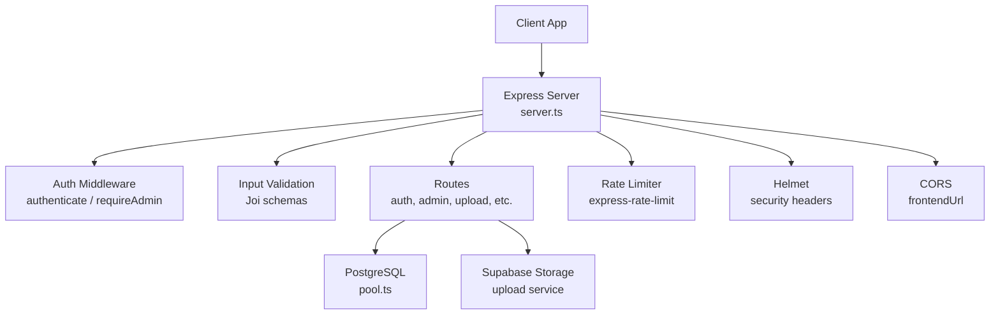
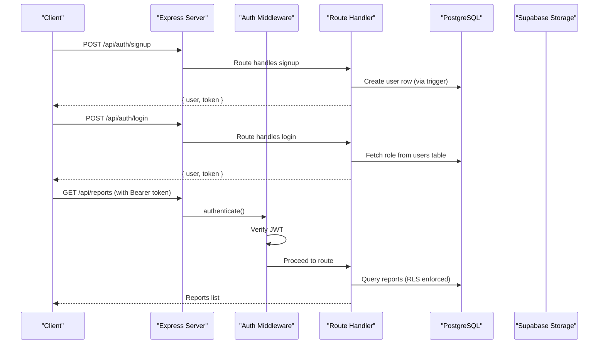
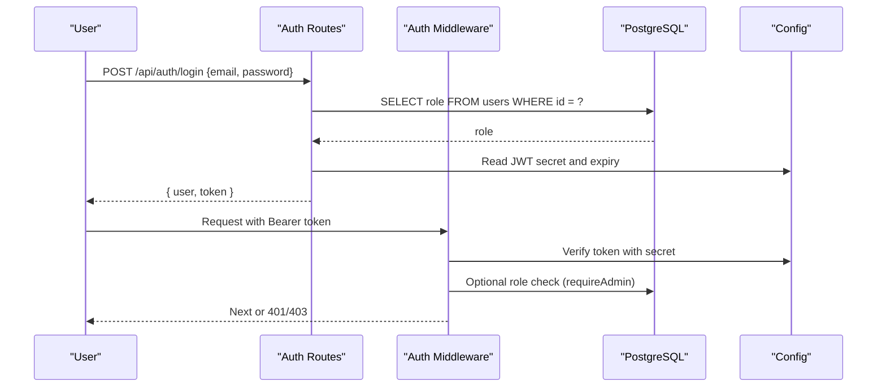
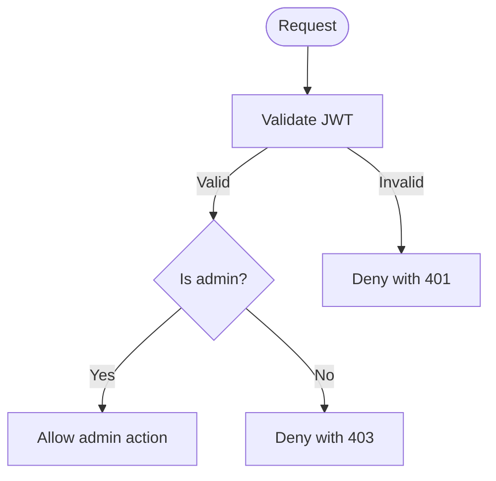
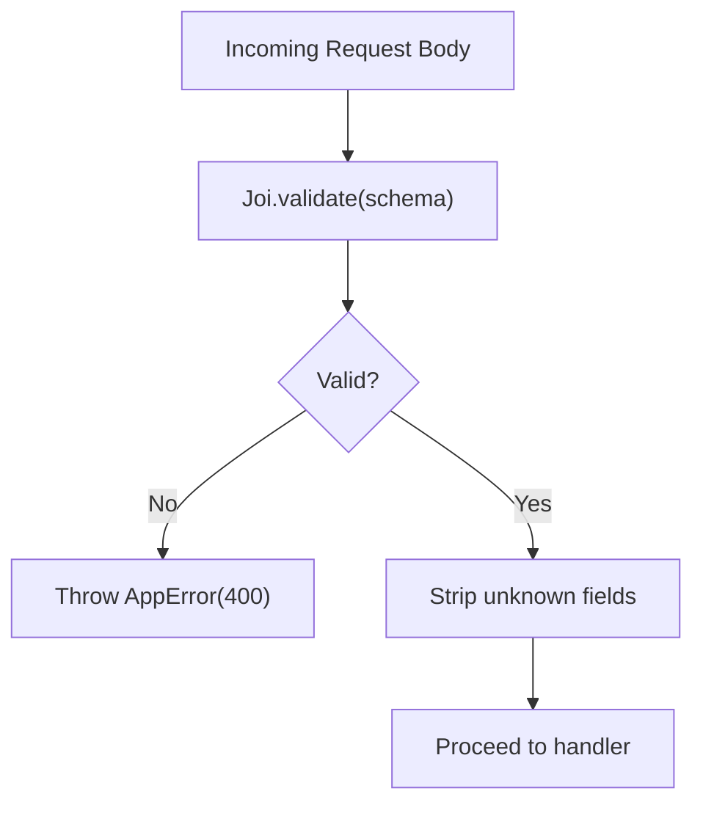
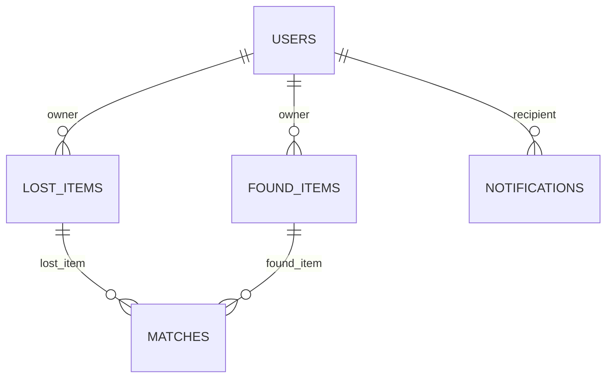
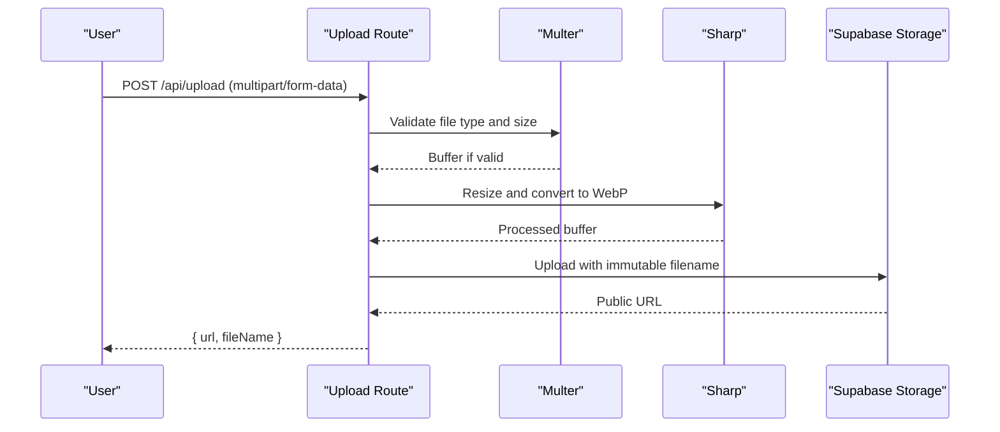
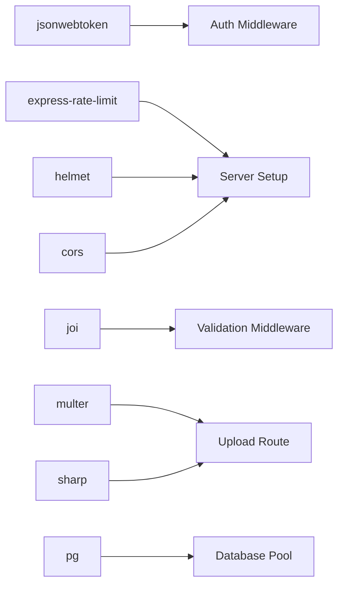

# Security & Authentication

<cite>
**Referenced Files in This Document**
- [server.ts](file://backend/src/server.ts)
- [auth.ts](file://backend/src/middleware/auth.ts)
- [auth_routes.ts](file://backend/src/routes/auth.ts)
- [validate.ts](file://backend/src/middleware/validate.ts)
- [errorHandler.ts](file://backend/src/middleware/errorHandler.ts)
- [config_index.ts](file://backend/src/config/index.ts)
- [pool.ts](file://backend/src/db/pool.ts)
- [upload_routes.ts](file://backend/src/routes/upload.ts)
- [upload_service.ts](file://backend/src/services/uploadService.ts)
- [admin_routes.ts](file://backend/src/routes/admin.ts)
- [initial_schema.sql](file://supabase/migrations/001_initial_schema.sql)
</cite>

## Table of Contents
1. Introduction
2. Project Structure
3. Core Components
4. Architecture Overview
5. Detailed Component Analysis
6. Dependency Analysis
7. Performance Considerations
8. Troubleshooting Guide
9. Conclusion
10. Appendices

## Introduction
This document provides comprehensive security documentation for the Lost & Found AI Matcher platform. It covers:
- JWT-based authentication flow (registration, login, token management, session handling)
- Role-based access control (RBAC) for user and admin roles with permissions
- Input validation and sanitization to prevent injection and XSS
- PostgreSQL Row-Level Security (RLS) policies for data isolation
- File upload security measures
- Rate limiting implementation
- Error handling best practices
- Privacy protections for sensitive fields (identifying_info, private_details)
- Security audit guidelines, vulnerability assessment procedures, and incident response protocols

## Project Structure
The backend is an Express application that integrates:
- JWT middleware for authentication and authorization
- Joi-based input validation
- Multer + Sharp for secure image processing and upload to Supabase Storage
- PostgreSQL via pg pool with parameterized queries
- Helmet for HTTP security headers
- CORS restricted to configured frontend URL
- Global rate limiter on API routes
- Centralized error handler

**Diagram sources**
- [server.ts:1-52](file://backend/src/server.ts#L1-L52)
- [auth.ts:1-59](file://backend/src/middleware/auth.ts#L1-L59)
- [validate.ts:1-61](file://backend/src/middleware/validate.ts#L1-L61)
- [pool.ts:1-48](file://backend/src/db/pool.ts#L1-L48)
- [upload_routes.ts:1-69](file://backend/src/routes/upload.ts#L1-L69)
- [upload_service.ts:1-66](file://backend/src/services/uploadService.ts#L1-L66)

**Section sources**
- [server.ts:1-52](file://backend/src/server.ts#L1-L52)

## Core Components
- Authentication and Authorization: JWT verification and role checks
- Input Validation: Joi schemas for all request bodies
- Database Access: Parameterized queries via pg pool
- File Uploads: Secure image processing and storage
- Security Headers and Limits: Helmet, CORS, rate limiting
- Error Handling: Centralized error responses and safe logging

**Section sources**
- [auth.ts:1-59](file://backend/src/middleware/auth.ts#L1-L59)
- [validate.ts:1-61](file://backend/src/middleware/validate.ts#L1-L61)
- [pool.ts:1-48](file://backend/src/db/pool.ts#L1-L48)
- [upload_routes.ts:1-69](file://backend/src/routes/upload.ts#L1-L69)
- [errorHandler.ts:1-56](file://backend/src/middleware/errorHandler.ts#L1-L56)
- [server.ts:1-52](file://backend/src/server.ts#L1-L52)

## Architecture Overview
The platform uses a layered architecture:
- Presentation layer: Express routes
- Middleware layer: Authentication, validation, error handling, rate limiting
- Service layer: Business logic (e.g., notifications, matching)
- Data layer: PostgreSQL and Supabase Storage

**Diagram sources**
- [auth_routes.ts:16-83](file://backend/src/routes/auth.ts#L16-L83)
- [auth.ts:22-58](file://backend/src/middleware/auth.ts#L22-L58)
- [initial_schema.sql:319-365](file://supabase/migrations/001_initial_schema.sql#L319-L365)

## Detailed Component Analysis

### JWT-Based Authentication Flow
- Registration: Creates a Supabase Auth user, mirrors into local auth schema, issues a backend JWT with sub, role, email, and expiration.
- Login: Authenticates via Supabase, fetches role from users table, issues JWT with role claim.
- Token Management: JWT verified against configured secret; tokens include sub, role, email; expiration set by configuration.
- Session Handling: Stateless sessions using Bearer tokens in Authorization header; no server-side sessions stored.

**Diagram sources**
- [auth_routes.ts:57-83](file://backend/src/routes/auth.ts#L57-L83)
- [auth.ts:22-58](file://backend/src/middleware/auth.ts#L22-L58)
- [config_index.ts:28-31](file://backend/src/config/index.ts#L28-L31)

**Section sources**
- [auth_routes.ts:16-83](file://backend/src/routes/auth.ts#L16-L83)
- [auth.ts:22-58](file://backend/src/middleware/auth.ts#L22-L58)
- [config_index.ts:28-31](file://backend/src/config/index.ts#L28-L31)

### Role-Based Access Control (RBAC)
- Roles: user and admin defined in users table with CHECK constraint.
- Authorization:
  - authenticate middleware validates JWT and attaches userId and userRole.
  - requireAdmin middleware verifies current user’s role against database before allowing admin operations.
- Admin endpoints are protected by both authenticate and requireAdmin.

**Diagram sources**
- [auth.ts:43-58](file://backend/src/middleware/auth.ts#L43-L58)
- [admin_routes.ts:1-12](file://backend/src/routes/admin.ts#L1-L12)
- [initial_schema.sql:54-64](file://supabase/migrations/001_initial_schema.sql#L54-L64)

**Section sources**
- [auth.ts:43-58](file://backend/src/middleware/auth.ts#L43-L58)
- [admin_routes.ts:1-12](file://backend/src/routes/admin.ts#L1-L12)
- [initial_schema.sql:54-64](file://supabase/migrations/001_initial_schema.sql#L54-L64)

### Input Validation and Sanitization
- All request bodies validated with Joi schemas:
  - lostReportSchema and foundReportSchema enforce required fields, types, ranges, and optional fields.
  - verificationAnswerSchema and verificationJudgeSchema validate verification inputs.
- stripUnknown removes unknown fields to reduce attack surface.
- No raw HTML rendering in backend; images processed and stored securely.

**Diagram sources**
- [validate.ts:8-23](file://backend/src/middleware/validate.ts#L8-L23)
- [validate.ts:27-61](file://backend/src/middleware/validate.ts#L27-L61)

**Section sources**
- [validate.ts:8-23](file://backend/src/middleware/validate.ts#L8-L23)
- [validate.ts:27-61](file://backend/src/middleware/validate.ts#L27-L61)

### PostgreSQL Row-Level Security (RLS) Policies
- RLS enabled on key tables: users, lost_items, found_items, matches, notifications, verification_questions, verification_attempts.
- Policies:
  - Users can view/update own profile.
  - Active items visible to anyone; owners can manage their own items.
  - Notifications scoped to user_id.
  - Matches visible only to item owners.
- These policies ensure data isolation at the database level regardless of application-layer checks.

**Diagram sources**
- [initial_schema.sql:54-64](file://supabase/migrations/001_initial_schema.sql#L54-L64)
- [initial_schema.sql:319-365](file://supabase/migrations/001_initial_schema.sql#L319-L365)

**Section sources**
- [initial_schema.sql:319-365](file://supabase/migrations/001_initial_schema.sql#L319-L365)

### File Upload Security Measures
- Authentication required for uploads.
- Multer memory storage with size limit (5 MB).
- Strict file type filtering:
  - Route-level filter accepts image/* MIME types.
  - Service-level filter restricts to specific image formats.
- Image processing with Sharp:
  - Resize to max width without enlargement.
  - Normalize to WebP with quality settings.
  - Auto-orient based on EXIF.
- Upload to Supabase Storage bucket with immutable filenames and cache-control headers.
- Errors handled via centralized error handler with user-friendly messages.

**Diagram sources**
- [upload_routes.ts:15-67](file://backend/src/routes/upload.ts#L15-L67)
- [upload_service.ts:14-65](file://backend/src/services/uploadService.ts#L14-L65)

**Section sources**
- [upload_routes.ts:15-67](file://backend/src/routes/upload.ts#L15-L67)
- [upload_service.ts:14-65](file://backend/src/services/uploadService.ts#L14-L65)

### Rate Limiting Implementation
- Global rate limiter applied to /api/:
  - Window: 15 minutes
  - Max requests: 100 per window
  - Returns standardized error message when exceeded
- Helps mitigate brute-force and abuse on public endpoints.

**Section sources**
- [server.ts:25-30](file://backend/src/server.ts#L25-L30)

### Error Handling Best Practices
- Centralized error handler:
  - AppError instances return structured JSON with status code and message.
  - Multer errors mapped to user-friendly messages.
  - Unhandled errors log details server-side and return generic client message.
- asyncHandler wraps route handlers to catch async errors consistently.

**Section sources**
- [errorHandler.ts:4-56](file://backend/src/middleware/errorHandler.ts#L4-L56)

### Privacy Protections for Sensitive Fields
- identifying_info (lost_items): Marked as private; only shown after verification per design intent.
- private_details (found_items): JSONB field withheld from public view; used to generate verification questions.
- RLS policies do not expose these fields to unauthorized viewers; application should also avoid returning them in responses unless authorized.

**Section sources**
- [initial_schema.sql:94-96](file://supabase/migrations/001_initial_schema.sql#L94-L96)
- [initial_schema.sql:132-134](file://supabase/migrations/001_initial_schema.sql#L132-L134)

## Dependency Analysis
Key dependencies and their security roles:
- jsonwebtoken: Verifies and signs JWTs with configured secret and expiration.
- express-rate-limit: Enforces request limits to protect APIs.
- helmet: Sets secure HTTP headers (e.g., HSTS, X-Frame-Options).
- cors: Restricts cross-origin requests to configured frontend URL.
- joi: Validates and sanitizes input payloads.
- multer + sharp: Securely handle and optimize image uploads.
- pg: Parameterized queries to prevent SQL injection.

**Diagram sources**
- [server.ts:1-52](file://backend/src/server.ts#L1-L52)
- [auth.ts:1-59](file://backend/src/middleware/auth.ts#L1-L59)
- [validate.ts:1-61](file://backend/src/middleware/validate.ts#L1-L61)
- [upload_routes.ts:1-69](file://backend/src/routes/upload.ts#L1-L69)
- [pool.ts:1-48](file://backend/src/db/pool.ts#L1-L48)

**Section sources**
- [server.ts:1-52](file://backend/src/server.ts#L1-L52)

## Performance Considerations
- Use parameterized queries exclusively to avoid SQL injection and improve plan caching.
- Keep JWT payload minimal (sub, role, email) to reduce token size and processing overhead.
- Optimize image uploads with resizing and format normalization to reduce storage and bandwidth.
- Leverage RLS to offload access control to the database, reducing application complexity.
- Monitor rate limiter thresholds and adjust based on traffic patterns.

[No sources needed since this section provides general guidance]

## Troubleshooting Guide
Common issues and resolutions:
- Invalid or expired token: Ensure correct Authorization header format and token validity; verify JWT secret configuration.
- Validation failures: Check request body against Joi schemas; ensure required fields and types match.
- Upload errors: Confirm file type and size; ensure Supabase Storage bucket exists and credentials are correct.
- Database connection errors: Validate DATABASE_URL and SSL settings; check pool configuration.
- Rate limit errors: Reduce request frequency or adjust rate limiter settings if necessary.

**Section sources**
- [errorHandler.ts:16-56](file://backend/src/middleware/errorHandler.ts#L16-L56)
- [pool.ts:9-28](file://backend/src/db/pool.ts#L9-L28)
- [server.ts:25-30](file://backend/src/server.ts#L25-L30)

## Conclusion
The Lost & Found AI Matcher implements a robust security posture:
- JWT-based stateless authentication with role checks
- Strong input validation and sanitization
- Database-enforced data isolation via RLS
- Secure file upload pipeline with strict type and size controls
- Centralized error handling and global rate limiting
- Privacy protections for sensitive fields

Adhering to the recommended audit and incident response practices will further strengthen the platform’s resilience against threats.

[No sources needed since this section summarizes without analyzing specific files]

## Appendices

### Security Audit Guidelines
- Review JWT configuration:
  - Ensure strong secret rotation policy.
  - Validate token expiration and audience restrictions if applicable.
- Inspect RBAC enforcement:
  - Confirm requireAdmin middleware is applied to all admin routes.
  - Verify database role constraints and triggers.
- Validate input handling:
  - Ensure all endpoints use Joi schemas.
  - Avoid direct string concatenation in SQL; rely on parameterized queries.
- Assess RLS policies:
  - Test access scenarios for each role and entity.
  - Confirm sensitive fields are not exposed unintentionally.
- Evaluate upload security:
  - Confirm file type whitelisting and size limits.
  - Verify image processing pipeline prevents malicious payloads.
- Check rate limiting:
  - Tune thresholds based on observed usage.
  - Monitor logs for repeated violations.

[No sources needed since this section provides general guidance]

### Vulnerability Assessment Procedures
- Static analysis:
  - Run linters and TypeScript checks to catch unsafe patterns.
- Dynamic testing:
  - Perform authenticated and unauthenticated endpoint scans.
  - Test for injection, XSS, and path traversal vectors.
- Dependency review:
  - Regularly update packages and monitor advisories.
- Penetration testing:
  - Focus on auth flows, admin endpoints, and upload handlers.

[No sources needed since this section provides general guidance]

### Incident Response Protocols
- Detection:
  - Monitor error logs and rate limiter hits for anomalies.
- Containment:
  - Temporarily disable affected endpoints or tighten rate limits.
- Eradication:
  - Rotate secrets (JWT, database credentials) if compromised.
  - Patch vulnerabilities and re-validate configurations.
- Recovery:
  - Restore services with hardened settings.
  - Notify affected users if personal data exposure occurred.
- Post-incident:
  - Conduct root cause analysis and update security controls.

[No sources needed since this section provides general guidance]