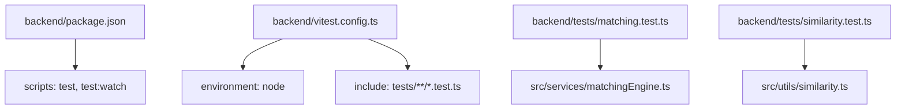
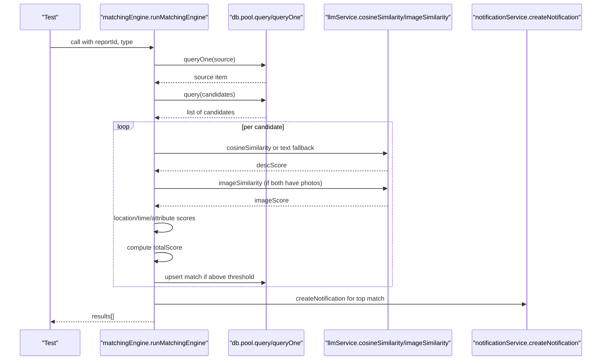
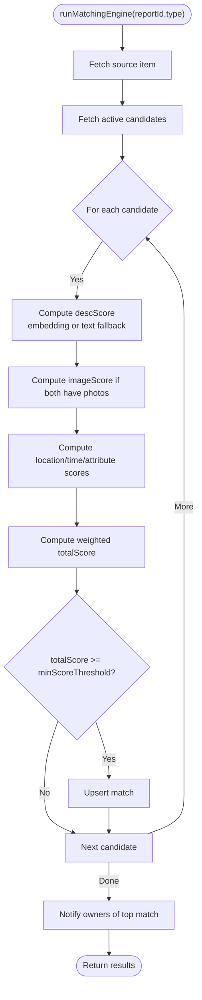
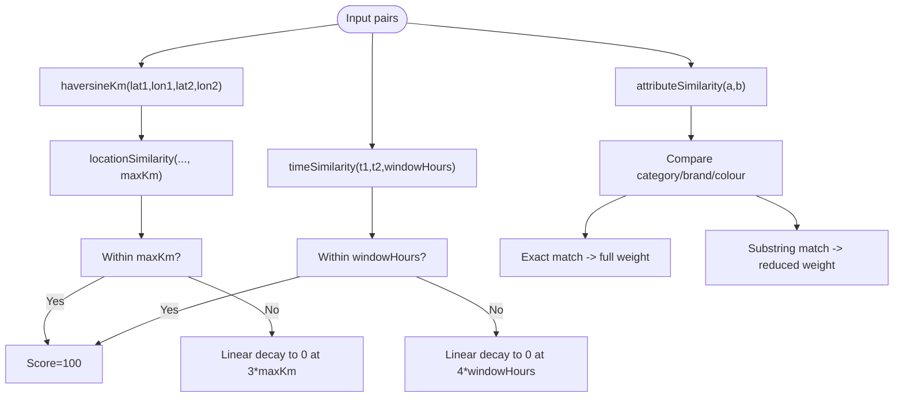
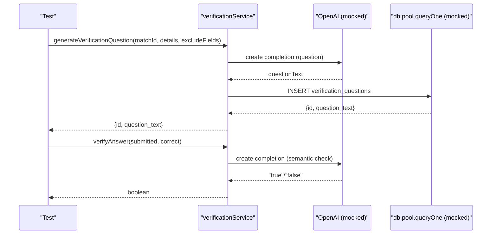
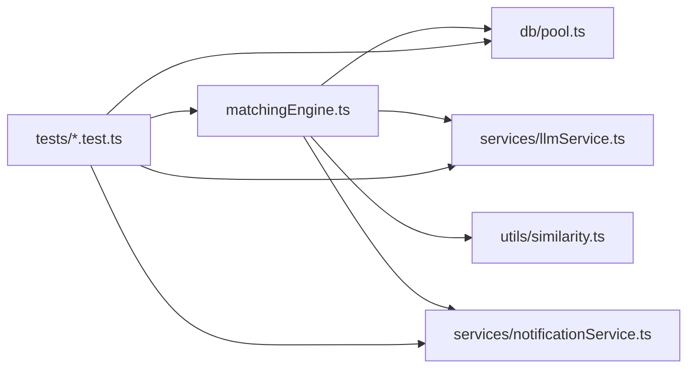

# Testing Strategy

<cite>
**Referenced Files in This Document**
- [matching.test.ts](file://backend/tests/matching.test.ts)
- [similarity.test.ts](file://backend/tests/similarity.test.ts)
- [vitest.config.ts](file://backend/vitest.config.ts)
- [package.json](file://backend/package.json)
- [matchingEngine.ts](file://backend/src/services/matchingEngine.ts)
- [similarity.ts](file://backend/src/utils/similarity.ts)
- [llmService.ts](file://backend/src/services/llmService.ts)
- [pool.ts](file://backend/src/db/pool.ts)
- [index.ts](file://backend/src/config/index.ts)
- [verificationService.ts](file://backend/src/services/verificationService.ts)
- [notificationService.ts](file://backend/src/services/notificationService.ts)
</cite>

## Table of Contents
1. [Introduction](#introduction)
2. [Project Structure](#project-structure)
3. [Core Components](#core-components)
4. [Architecture Overview](#architecture-overview)
5. [Detailed Component Analysis](#detailed-component-analysis)
6. [Dependency Analysis](#dependency-analysis)
7. [Performance Considerations](#performance-considerations)
8. [Troubleshooting Guide](#troubleshooting-guide)
9. [Conclusion](#conclusion)
10. [Appendices](#appendices)

## Introduction
This document defines the testing strategy for the Lost & Found AI Matcher backend, focusing on unit and integration tests using Vitest. It explains how to organize tests, mock external services (OpenAI and Supabase), manage test data, and validate the matching algorithm, similarity calculations, and verification workflows. It also provides guidelines for writing effective tests, coverage targets, CI setup, and best practices for AI-dependent features.

## Project Structure
The backend uses Vitest with a Node environment and centralized configuration. Tests are colocated under backend/tests and target TypeScript files via include patterns. The package scripts expose test execution commands.

**Diagram sources**
- [package.json:5-14](file://backend/package.json#L5-L14)
- [vitest.config.ts:3-8](file://backend/vitest.config.ts#L3-L8)
- [matching.test.ts:1-34](file://backend/tests/matching.test.ts#L1-L34)
- [similarity.test.ts:1-7](file://backend/tests/similarity.test.ts#L1-L7)

**Section sources**
- [package.json:5-14](file://backend/package.json#L5-L14)
- [vitest.config.ts:3-8](file://backend/vitest.config.ts#L3-L8)

## Core Components
- Matching engine: orchestrates scoring across description embeddings, images, location, time, and attributes; persists matches; triggers notifications.
- Similarity utilities: deterministic functions for distance-based location similarity, time-window similarity, and attribute overlap.
- LLM service: OpenAI-powered embedding generation, cosine similarity, image comparison, and structured extraction.
- Verification service: generates verification questions and verifies answers with semantic matching fallbacks.
- Notification service: creates in-app notifications and emails.
- Database pool: typed query helpers over PostgreSQL.

Testing priorities:
- Unit tests for pure logic (similarity functions).
- Integration-style tests for the matching engine by mocking DB and LLM calls.
- Isolation of side effects (notifications, emails, DB writes) during tests.

**Section sources**
- [matchingEngine.ts:37-188](file://backend/src/services/matchingEngine.ts#L37-L188)
- [similarity.ts:4-82](file://backend/src/utils/similarity.ts#L4-L82)
- [llmService.ts:9-119](file://backend/src/services/llmService.ts#L9-L119)
- [verificationService.ts:15-122](file://backend/src/services/verificationService.ts#L15-L122)
- [notificationService.ts:19-62](file://backend/src/services/notificationService.ts#L19-L62)
- [pool.ts:34-48](file://backend/src/db/pool.ts#L34-L48)

## Architecture Overview
The matching pipeline fetches a source item and candidate items, computes multi-factor scores, persists top matches above a threshold, and notifies users. Tests isolate this flow by mocking database queries and LLM calls.

**Diagram sources**
- [matchingEngine.ts:37-188](file://backend/src/services/matchingEngine.ts#L37-L188)
- [llmService.ts:23-119](file://backend/src/services/llmService.ts#L23-L119)
- [notificationService.ts:19-62](file://backend/src/services/notificationService.ts#L19-L62)
- [pool.ts:34-48](file://backend/src/db/pool.ts#L34-L48)

## Detailed Component Analysis

### Matching Engine Tests
Strategy:
- Mock config.matching weights and thresholds to control scoring behavior.
- Mock db.pool.query and db.pool.queryOne to return deterministic source and candidate sets.
- Mock llmService.cosineSimilarity and llmService.imageSimilarity to control semantic and visual scores.
- Assert score ranges and match persistence paths.

Key scenarios covered:
- Nearly identical items produce high total scores.
- Completely different items produce low total scores.
- Same category but different location/time yield medium scores.
- Fallback to simple text similarity when embeddings are missing.

**Diagram sources**
- [matchingEngine.ts:37-188](file://backend/src/services/matchingEngine.ts#L37-L188)

**Section sources**
- [matching.test.ts:1-199](file://backend/tests/matching.test.ts#L1-L199)
- [matchingEngine.ts:37-188](file://backend/src/services/matchingEngine.ts#L37-L188)

### Similarity Utilities Tests
Strategy:
- Pure function tests with known inputs and expected outputs.
- Boundary conditions for null coordinates and timestamps.
- Edge cases for attribute comparisons including case-insensitivity, whitespace handling, and partial substring matches.

Coverage highlights:
- haversineKm accuracy across short, medium, and long distances.
- locationSimilarity thresholds and decay behavior.
- timeSimilarity windowing and decay.
- attributeSimilarity exact, partial, and missing-field behaviors.

**Diagram sources**
- [similarity.ts:4-82](file://backend/src/utils/similarity.ts#L4-L82)

**Section sources**
- [similarity.test.ts:1-162](file://backend/tests/similarity.test.ts#L1-L162)
- [similarity.ts:4-82](file://backend/src/utils/similarity.ts#L4-L82)

### LLM Service and External Dependencies
Strategy:
- Mock OpenAI client methods to avoid network calls and ensure deterministic outputs.
- For image similarity, mock response parsing to simulate success and failure paths.
- For embedding generation and structured extraction, mock responses to control vector values and parsed fields.

Integration notes:
- In tests, replace real OpenAI calls with vi.mocked implementations to control cosineSimilarity and imageSimilarity outcomes.
- Ensure error paths return neutral scores or fallback behavior as implemented.

**Section sources**
- [llmService.ts:9-119](file://backend/src/services/llmService.ts#L9-L119)
- [matching.test.ts:25-41](file://backend/tests/matching.test.ts#L25-L41)

### Verification Workflow Tests
Strategy:
- Mock db.pool.queryOne to assert insertion of verification questions.
- Mock OpenAI chat completions to control question generation and answer verification.
- Validate fallback behaviors when LLM calls fail.

Scenarios:
- Generate a unique question per field, avoiding previously used fields.
- Verify exact and semantic answer matching.
- Handle empty private details gracefully.

**Diagram sources**
- [verificationService.ts:15-122](file://backend/src/services/verificationService.ts#L15-L122)

**Section sources**
- [verificationService.ts:15-122](file://backend/src/services/verificationService.ts#L15-L122)

### Notification and Side Effects
Strategy:
- Mock notificationService.createNotification to prevent email dispatch and DB writes during tests.
- Assert that notifications are created only when matches exceed thresholds and there is a top match.

**Section sources**
- [notificationService.ts:19-62](file://backend/src/services/notificationService.ts#L19-L62)
- [matchingEngine.ts:174-186](file://backend/src/services/matchingEngine.ts#L174-L186)

## Dependency Analysis
External dependencies and their test-time treatment:
- OpenAI: mocked via vi.mock to control embeddings, image similarity, and chat completions.
- PostgreSQL (via pg): mocked via db.pool.query/queryOne to provide deterministic datasets.
- Notifications and email: mocked to avoid sending real messages.

**Diagram sources**
- [matchingEngine.ts:1-6](file://backend/src/services/matchingEngine.ts#L1-L6)
- [pool.ts:34-48](file://backend/src/db/pool.ts#L34-L48)
- [llmService.ts:1-4](file://backend/src/services/llmService.ts#L1-L4)
- [similarity.ts:1-3](file://backend/src/utils/similarity.ts#L1-L3)
- [notificationService.ts:1-3](file://backend/src/services/notificationService.ts#L1-L3)

**Section sources**
- [matchingEngine.ts:1-6](file://backend/src/services/matchingEngine.ts#L1-L6)
- [pool.ts:34-48](file://backend/src/db/pool.ts#L34-L48)
- [llmService.ts:1-4](file://backend/src/services/llmService.ts#L1-L4)
- [similarity.ts:1-3](file://backend/src/utils/similarity.ts#L1-L3)
- [notificationService.ts:1-3](file://backend/src/services/notificationService.ts#L1-L3)

## Performance Considerations
- Prefer deterministic mocks for LLM calls to keep tests fast and stable.
- Use minimal candidate sets in tests to reduce iteration overhead.
- Avoid heavy image processing in tests; rely on mocked imageSimilarity.
- For load/performance validation outside unit tests, use existing seed/load scripts to populate realistic datasets and measure matching throughput.

[No sources needed since this section provides general guidance]

## Troubleshooting Guide
Common issues and resolutions:
- Missing environment variables: ensure DATABASE_URL, OPENAI_API_KEY, and other required keys are set for integration runs.
- Flaky LLM mocks: pin vi.mocked return values to specific sequences to avoid nondeterminism.
- Unexpected DB interactions: verify that tests clear mocks and reset queryOne/query implementations between cases.
- Notification spam: confirm that createNotification is mocked in tests to prevent real emails.

**Section sources**
- [index.ts:6-48](file://backend/src/config/index.ts#L6-L48)
- [matching.test.ts:61-66](file://backend/tests/matching.test.ts#L61-L66)
- [notificationService.ts:42-61](file://backend/src/services/notificationService.ts#L42-L61)

## Conclusion
The current test suite focuses on core matching logic and deterministic similarity functions, using Vitest with robust mocking for external services. To strengthen reliability and confidence:
- Expand verification workflow tests.
- Add edge-case tests for malformed embeddings and invalid image URLs.
- Introduce integration tests against an isolated test database where appropriate.
- Enforce coverage thresholds and integrate automated testing into CI.

[No sources needed since this section summarizes without analyzing specific files]

## Appendices

### Test Organization and Execution
- Place tests under backend/tests with .test.ts suffix.
- Run all tests: npm run test.
- Watch mode: npm run test:watch.

**Section sources**
- [package.json:5-14](file://backend/package.json#L5-L14)
- [vitest.config.ts:3-8](file://backend/vitest.config.ts#L3-L8)

### Mocking Strategies
- Config: vi.mock('../src/config/index.js') to override matching weights and thresholds.
- Database: vi.mock('../src/db/pool.js') to stub query/queryOne.
- LLM: vi.mock('../src/services/llmService.js') to stub cosineSimilarity and imageSimilarity.
- Notifications: vi.mock('../src/services/notificationService.js') to stub createNotification.

**Section sources**
- [matching.test.ts:3-41](file://backend/tests/matching.test.ts#L3-L41)

### Test Data Management
- Use helper factories (e.g., makeItem) to build consistent records with overrides.
- Seed datasets for integration tests can be reused from existing seed scripts when running against a test database.

**Section sources**
- [matching.test.ts:43-66](file://backend/tests/matching.test.ts#L43-L66)

### Coverage Requirements
- Aim for high coverage on:
  - similarity.ts (all functions and branches).
  - matchingEngine.ts scoring paths and fallbacks.
  - verificationService.ts question generation and answer verification.
- Configure Vitest coverage in vitest.config.ts to enforce thresholds in CI.

[No sources needed since this section provides general guidance]

### Continuous Integration Setup
- Add a CI job that installs dependencies, runs npm run test, and enforces coverage thresholds.
- Cache node_modules to speed up builds.
- Provide required environment variables for integration tests (e.g., DATABASE_URL, OPENAI_API_KEY) via secrets.

[No sources needed since this section provides general guidance]

### Example Test Cases
- Matching engine:
  - High similarity yields total_score > 80.
  - Low similarity yields total_score < 40.
  - Medium similarity for same category with distant location/time.
  - Fallback to text similarity when embeddings are absent.
- Similarity utilities:
  - haversineKm boundary checks for zero, short, medium, long distances.
  - locationSimilarity returns 100 within radius, decays to 0 beyond 3x radius, neutral for null coords.
  - timeSimilarity returns 100 within window, decays to 0 beyond 4x window, accepts Date objects.
  - attributeSimilarity exact, partial, case-insensitive, whitespace-tolerant, undefined-as-empty behaviors.
- Verification:
  - Question generation inserts into DB and avoids excluded fields.
  - Answer verification handles exact match, semantic match, and fallback.

**Section sources**
- [matching.test.ts:68-199](file://backend/tests/matching.test.ts#L68-L199)
- [similarity.test.ts:9-162](file://backend/tests/similarity.test.ts#L9-L162)
- [verificationService.ts:15-122](file://backend/src/services/verificationService.ts#L15-L122)

### Best Practices for AI-Dependent Features
- Always mock LLM calls in unit tests to ensure determinism and speed.
- Include negative tests for API failures and parse errors.
- Validate fallback logic (e.g., text similarity when embeddings are missing).
- Keep prompts and response parsing stable; add tests for schema changes.

[No sources needed since this section provides general guidance]